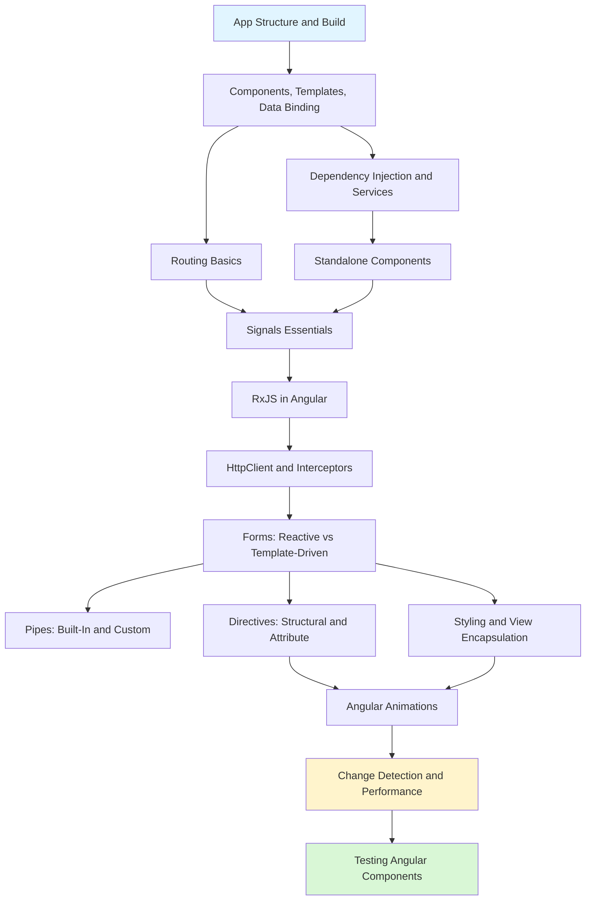

# Angular

> [!summary] Scope
> Modern Angular with standalone components, signals, RxJS, routing, forms, directives, pipes, HttpClient, change detection, testing, animations, styling, security, internationalization, Material/CDK, PWA, zoneless CD, error handling, view transitions, Angular Elements, dynamic components, and production architecture.

## Learning Path

## Topic Map

### Foundations (4 files)

#### [[Angular/01_Foundations/01_Angular_App_Structure_and_Build]]
- Angular CLI commands: ng new, serve, build, generate, add, update
- Project entrypoint flow: angular.json → main.ts → bootstrapApplication → root component
- `angular.json` schema: outputPath, budgets, fileReplacements, optimization, AOT
- Environment files and `isDevMode()`

#### [[Angular/01_Foundations/02_Components_Templates_and_Data_Binding]]
- `@Component` decorator: selector, template/styles, imports, standalone, changeDetection, encapsulation
- All 8 lifecycle hooks in order with mermaid sequence diagram
- `@Input` (classic + signal-based), `@Output`, `model()` two-way binding
- Template bindings: interpolation, property, event, class, style, two-way (`[()]`)
- `@ViewChild`/`@ContentChild` (decorator + signal-based), host bindings/listeners
- `@defer` (on viewport, interaction, idle, immediate), `ng-container`, `ng-template`, `ngTemplateOutlet`

#### [[Angular/01_Foundations/03_DI_Services_and_Providers]]
- Injector tree hierarchy diagram: Platform → Root → Route → Component
- `@Injectable({ providedIn: 'root' })`, `inject()` vs constructor injection
- 4 provider forms: `useClass`, `useValue`, `useExisting`, `useFactory` — comparison table
- `InjectionToken`, resolution modifiers (`optional`, `self`, `skipSelf`, `host`), multi-providers
- `inject()` in guards, interceptors, pipes; `environmentInjector`, `runInInjectionContext`, `createInjector`
- `provideAppInitializer` for app startup initialization

#### [[Angular/01_Foundations/04_Routing_Basics]]
- Route configuration: path, component, loadComponent, children, redirectTo, guards, resolve, title
- `RouterOutlet`, `RouterLink`, `RouterLinkActive`
- Route parameters: `ActivatedRoute.paramMap`, `withComponentInputBinding()`, snapshot
- Route guards: `CanActivate`, `CanDeactivate`, `CanMatch`, `CanActivateChild` — with guard evaluation flow
- Resolvers, lazy loading, nested routes, preloading strategies, 404 wildcard routes
- Navigation: `Router.navigate()`, `navigateByUrl()`, query params, state

### Core (12 files)

#### [[Angular/02_Core/01_Standalone_Components]]
- `bootstrapApplication` with `provideRouter`, `provideHttpClient`, `provideAnimations`
- Standalone components, directives, and pipes — `imports` array
- Standalone vs NgModule comparison table (12 rows)
- Migration from NgModules: `ng generate @angular/core:standalone`, lazy loading conversion

#### [[Angular/02_Core/02_Signals_Essentials]]
- `WritableSignal` vs `Signal`, `set()` vs `update()`, `computed()` lazy memoization
- `effect()` with cleanup and DestroyRef
- Signal inputs: `input()`, `input.required()`, `output()`, `model()` — classic vs signal comparison table
- Signal queries: `viewChild()`, `contentChild()`, `viewChildren()`
- RxJS interop: `toSignal()`, `toObservable()` — dependency graph diagram
- Signal-based change detection (no zone.js needed)

#### [[Angular/02_Core/03_RxJS_in_Angular]]
- Subject types: Subject, BehaviorSubject, ReplaySubject — decision tree
- Creation: `of`, `from`, `fromEvent`, `interval`, `timer`, `forkJoin`, `combineLatest`, `merge`
- Operators: `map`, `filter`, `debounceTime`, `distinctUntilChanged`, `take`, `takeUntil`, `tap`
- Higher-order mapping: `switchMap` (cancel), `concatMap` (queue), `mergeMap` (parallel), `exhaustMap` (ignore) — decision tree
- Error handling: `catchError`, `retry`, `retryWhen`
- `async` pipe, hot vs cold, `shareReplay`, signals interop

#### [[Angular/02_Core/04_HttpClient_and_Interceptors]]
- `provideHttpClient(withFetch(), withInterceptors([]))` — full HTTP API (GET, POST, PUT, PATCH, DELETE)
- Request configuration: HttpParams, HttpHeaders, HttpContext
- Functional interceptors (`HttpInterceptorFn`) — auth, logging, retry, cache
- Error handling with typed errors, upload progress events
- Testing with `HttpTestingController`

#### [[Angular/02_Core/05_Forms_Template_vs_Reactive]]
- Reactive vs Template-driven comparison table (10 rows) with decision tree
- FormGroup, FormControl, FormBuilder, FormArray — dynamic fields
- Built-in, custom, async, and cross-field validators
- `valueChanges`, `statusChanges`, `setValue` vs `patchValue`, `reset`
- `ControlValueAccessor` for custom form controls, `updateOn` blur/submit
- Typed forms (Angular 14+), `NonNullableFormBuilder`

#### [[Angular/02_Core/06_Pipes_BuiltIn_and_Custom]]
- All built-in pipes reference table with parameters (date, currency, number, percent, async, slice, keyvalue, i18n)
- Custom pipes with `PipeTransform`, pipe arguments, pure vs impure comparison
- Pipe composition, dependency injection in pipes

#### [[Angular/02_Core/07_Directives_Structural_and_Attribute]]
- Attribute directives: `@Directive`, `@HostBinding`, `@HostListener`, `@Input` for configuration
- Built-in: `ngClass`, `ngStyle` with examples
- Structural directives: `*ngIf` with then/else, `*ngFor` with local variables, `*ngSwitch`
- Custom structural directive using `TemplateRef` + `ViewContainerRef`, `trackBy` performance

#### [[Angular/02_Core/08_Styling_and_View_Encapsulation]]
- View Encapsulation: Emulated, ShadowDom, None — with DOM rendering diagram
- `:host`, `:host-context`, `::ng-deep` (deprecated)
- Global styles in `angular.json`, SCSS with Angular
- Tailwind CSS setup with Vite, dynamic classes with `ngClass`
- Styling approaches comparison table (Tailwind vs SCSS vs Shadow DOM vs CSS Modules)

#### [[Angular/02_Core/09_Angular_Animations]]
- `provideAnimations()`, `trigger`, `state`, `style`, `transition`, `animate`
- Wildcard (`*`) and void states, `:enter` / `:leave` transitions
- Keyframes with multi-step animations, animation callbacks
- Timing syntax (duration, delay, easing)

#### [[Angular/02_Core/10_Angular_Security]]
- XSS attack vectors and Angular's built-in sanitization
- `DomSanitizer` bypass methods with `bypassSecurityTrust*`
- Trusted Types API and Angular support
- CSP header configuration for Angular apps
- CSRF/XSRF protection with HttpClient

#### [[Angular/02_Core/11_Internationalization]]
- i18n template attribute: `i18n`, `i18n-*`, `@@custom-id`
- ICU expressions for plurals and select/gender
- `$localize` tagged template for TypeScript translations
- `LOCALE_ID`, `registerLocaleData`, locale-aware pipes
- Build-time extraction with `ng extract-i18n` and `--localize`

#### [[Angular/02_Core/12_Angular_Material_and_CDK]]
- Material component families: form controls, navigation, data display, overlays
- Custom theming with `define-palette` and `define-light-theme`/`define-dark-theme`
- CDK utilities: Overlay, A11y, Clipboard, DragDrop, Layout, Virtual Scroll
- Component harnesses for testing Material components

#### [[Angular/02_Core/13_Error_Handling]]
- Custom `ErrorHandler` class for global exception handling
- HTTP error interception with typed `ApiError` responses
- Error logging service with batching and server-side logging
- User-facing error display: critical (error page), warning (snackbar), info (inline)
- Error boundary pattern and safe template navigation

#### [[Angular/02_Core/14_Router_View_Transitions]]
- `withViewTransitions()` setup with Angular Router
- Browser View Transition API: page snapshot → morph animation
- CSS customisation: `::view-transition-old()` / `::view-transition-new()`
- Named view transitions with `view-transition-name` for shared elements
- `prefers-reduced-motion` handling and browser fallbacks

### Advanced (10 files)

#### [[Angular/03_Advanced/01_Change_Detection_and_Performance]]
- Zone.js and default change detection: full tree traversal
- `ChangeDetectionStrategy.OnPush` — what triggers it, automatic with signals
- `ChangeDetectorRef`: `markForCheck`, `detectChanges`, `detach`, `reattach`
- `NgZone.runOutsideAngular()` for performance-critical operations
- Signal-based CD (no zone.js) with dependency graph diagram
- `@defer` for render optimization, Angular DevTools profiling

#### [[Angular/03_Advanced/02_Testing_Angular_Components]]
- `TestBed.configureTestingModule`, `compileComponents` for standalone and NgModule-based code
- `ComponentFixture`: `detectChanges`, `nativeElement`, `debugElement`, `autoDetectChanges`
- `fakeAsync` + `tick` for async testing, `whenStable()`
- HTTP testing with `HttpTestingController`, `expectOne`, `flush`, `verify`
- Component harnesses (`@angular/cdk/testing`), route testing with `RouterTestingHarness`

#### [[Angular/03_Advanced/03_State_Management_NgRx_and_SignalStore]]
- NgRx: actions, reducers, selectors, effects — full Redux pattern
- SignalStore: `withState`, `withMethods`, `withComputed`, `withHooks`
- State management decision tree: signals vs SignalStore vs NgRx
- Comparison table (4 patterns) with pros/cons, entity support

#### [[Angular/03_Advanced/04_SSR_Hydration_and_Prerendering]]
- CSR vs SSR vs prerendering comparison with Mermaid rendering diagrams
- `@angular/ssr` setup, `provideClientHydration`, server bootstrap
- Hydration process and mismatch debugging with `afterNextRender`
- `TransferState` for passing server data to client without duplicate API calls

#### [[Angular/03_Advanced/05_Image_Optimization_and_Performance]]
- `NgOptimizedImage` with `ngSrc`, `priority`, `fill`, lazy loading, CDN integration
- Bundle analysis with `source-map-explorer`, `angular.json` budgets
- Core Web Vitals (LCP, FID, CLS) with Angular optimization strategies
- `@defer` strategies: immediate, idle, timer, interaction + prefetch

#### [[Angular/03_Advanced/06_Angular_CLI_and_Configuration]]
- `angular.json` deep dive: build options, configurations, file replacements, budgets
- Custom build targets, Docker deployment, Vercel, GitHub Pages
- SPA fallback nginx config, --base-href for subpath deployment
- ESLint (`@angular-eslint`) and Prettier integration; Nx monorepo features

#### [[Angular/03_Advanced/07_Migration_Module_to_Standalone]]
- Migration workflow with `ng generate @angular/core:standalone`
- Before/after examples: components, routing, bootstrap, lazy loading
- Handling lazy module providers, shared NgModules, circular imports

#### [[Angular/03_Advanced/08_Progressive_Web_Apps]]
- `@angular/pwa` setup with `ng add @angular/pwa` schematic
- `ngsw-config.json`: asset groups (prefetch/lazy), data groups (performance/freshness)
- `SwUpdate` version management and notification
- `beforeinstallprompt` for custom install buttons
- Push notifications with `SwPush`
- Testing PWA features with Chrome DevTools

#### [[Angular/03_Advanced/09_Zoneless_and_New_Control_Flow]]
- Built-in control flow: `@if`/`@else`, `@for`/`@empty`, `@switch`/`@case`/`@default`
- `@let` template variables (Angular 18+)
- `provideZonelessChangeDetection()` setup and migration from Zone.js
- How zoneless CD works: signal-driven scheduling vs full tree traversal
- `afterRender` and `afterNextRender` lifecycle hooks with phases

#### [[Angular/03_Advanced/10_Angular_Elements_and_Dynamic_Components]]
- Dynamic components with `ViewContainerRef.createComponent()` and child injectors
- Portal pattern via CDK `ComponentPortal` and `DomPortalOutlet`
- `@angular/elements`: `createCustomElement()` for native web components
- Angular component as Custom Element: `@Input` → attributes, `@Output` → CustomEvents
- Embedding Angular elements in plain HTML, React, and other frameworks
- Production build configuration for single-bundle element output

---

## Recommended Paths

| Path | Files | Target |
|------|-------|--------|
| **Quick Start** | F01, F02, F03, F04 | First Angular app in hours |
| **Production Angular** | C01-C08 | Full feature development |
| **Advanced Angular** | C09-C14, A01-A10 | Performance, testing, security, PWA, zoneless, elements, error handling |

## Cross-Links

- [[TypeScript/00_MOC/00_TypeScript_MOC]] for TypeScript fundamentals
- [[React/00_MOC/00_React_MOC]] for framework comparison
- [[CICD/Docker/00_MOC/00_Docker_MOC]] for containerization

---

## References

- [Angular Documentation](https://angular.dev/)
- [Angular CLI Reference](https://angular.dev/cli)
- [Angular Material](https://material.angular.io/)
- [RxJS Documentation](https://rxjs.dev/)
