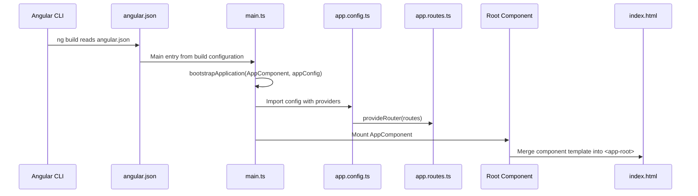
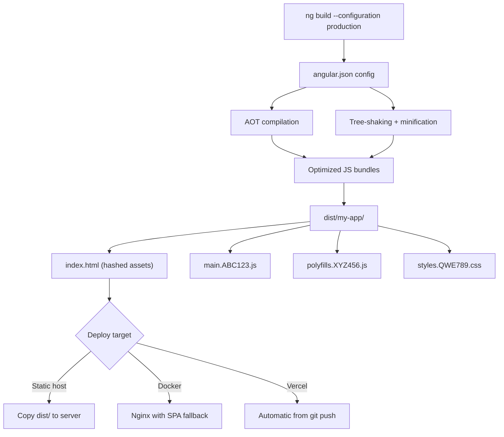

# Angular App Structure and Build

> [!summary] Goal
> Understand the Angular project structure, Angular CLI commands, and build configuration — from `ng new` through production deployment.

## Table of Contents

1. [Why Project Structure Matters](#why-project-structure-matters)
2. [Angular CLI Commands](#angular-cli-commands)
3. [Project Entrypoint Flow](#project-entrypoint-flow)
4. [angular.json Build Configuration](#angular-json-build-configuration)
5. [Environment Files](#environment-files)
6. [Code Scaffolding Reference](#code-scaffolding-reference)
7. [Pitfalls](#pitfalls)

---

## Why Project Structure Matters

Every Angular project follows a standard structure generated by the CLI. Understanding it tells you where to put code, how configuration works, and how the app boots.

```
my-app/
├── angular.json               # Build configuration
├── tsconfig.json              # Base TypeScript config
├── tsconfig.app.json          # App-specific TS overrides
├── tsconfig.spec.json         # Test-specific TS overrides
├── package.json
├── public/                    # Static assets (favicon.ico, etc.)
├── src/
│   ├── index.html             # Main HTML page
│   ├── main.ts                # Bootstrap entry point
│   ├── styles.scss            # Global styles
│   ├── app/
│   │   ├── app.component.ts   # Root component
│   │   ├── app.config.ts      # App providers (standalone)
│   │   └── app.routes.ts      # Route definitions
│   └── environments/
│       ├── environment.ts          # Dev defaults
│       └── environment.development.ts  # Dev overrides
```

---

## Angular CLI Commands

```bash
# Create a new project
ng new my-app --standalone --style scss --routing

# Development server
ng serve                          # http://localhost:4200
ng serve --port 4300 --open       # Custom port + open browser
ng serve --configuration production  # Serve with prod config

# Build
ng build                          # Output in dist/
ng build --configuration production   # Prod build with optimizations
ng build --source-map             # With source maps for debugging

# Generate code (schematics)
ng generate component users/list     # Creates users/list.component.ts
ng generate interface models/user    # Creates models/user.ts
ng generate service core/auth        # Creates core/auth.service.ts
ng generate pipe shared/truncate     # Creates shared/truncate.pipe.ts
ng generate directive core/highlight # Creates core/highlight.directive.ts
ng generate guard core/auth          # Creates core/auth.guard.ts
ng generate interceptor core/logging # Creates core/logging.interceptor.ts

# Add dependencies
ng add @angular/material         # Add Angular Material
ng add @ngrx/store               # Add NgRx store
ng add @angular/pwa              # Add PWA support

# Update Angular version
ng update @angular/core @angular/cli

# Test
ng test                          # Unit tests (Karma + Jasmine)
ng e2e                           # E2E tests (Protractor/Playwright)

# Lint
ng lint                          # Lint project code

# Extract i18n
ng extract-i18n                  # Extract translatable strings
```

---

## Project Entrypoint Flow



---

## Build Output and Deployment Flow



---

## `angular.json` Build Configuration

```json
{
  "$schema": "./node_modules/@angular/cli/lib/config/schema.json",
  "version": 1,
  "projects": {
    "my-app": {
      "projectType": "application",
      "root": "",
      "sourceRoot": "src",
      "prefix": "app",
      "architect": {
        "build": {
          "builder": "@angular-devkit/build-angular:application",
          "options": {
            "outputPath": "dist/my-app",
            "index": "src/index.html",
            "browser": "src/main.ts",
            "polyfills": ["zone.js"],
            "assets": ["public"],
            "styles": ["src/styles.scss"],
            "scripts": []
          },
          "configurations": {
            "production": {
              "budgets": [
                { "type": "initial", "maximumWarning": "500kb", "maximumError": "1mb" },
                { "type": "anyComponentStyle", "maximumWarning": "2kb", "maximumError": "4kb" }
              ],
              "outputHashing": "all",
              "fileReplacements": [
                { "replace": "src/environments/environment.ts",
                  "with": "src/environments/environment.prod.ts" }
              ],
              "optimization": true,
              "aot": true,
              "sourceMap": false
            },
            "development": {
              "optimization": false,
              "extractLicenses": false,
              "sourceMap": true
            }
          }
        },
        "serve": {
          "builder": "@angular-devkit/build-angular:dev-server",
          "configurations": {
            "production": { "buildTarget": "my-app:build:production" },
            "development": { "buildTarget": "my-app:build:development" }
          },
          "defaultConfiguration": "development"
        },
        "test": {
          "builder": "@angular-devkit/build-angular:karma"
        }
      }
    }
  }
}
```

### Key configuration options

| Option | Purpose | Example |
|--------|---------|---------|
| `outputPath` | Build output directory | `dist/my-app` |
| `budgets` | Size warnings and errors | `"initial": 500kb` |
| `fileReplacements` | Swap files per environment | `environment.ts` → `environment.prod.ts` |
| `outputHashing` | Cache-busting filename hashes | `all` for production |
| `optimization` | Minify + bundle + tree-shake | `true` for production |
| `aot` | Ahead-of-Time compilation | `true` for production |
| `sourceMap` | Source maps for debugging | `false` for production |
| `polyfills` | Browser polyfills | `zone.js` for change detection |

---

## Environment Files

```typescript
// src/environments/environment.ts (development defaults)
export const environment = {
  production: false,
  apiUrl: 'http://localhost:3000/api',
  debug: true,
};

// src/environments/environment.prod.ts (production replacements)
export const environment = {
  production: true,
  apiUrl: 'https://api.example.com',
  debug: false,
};
```

```typescript
// Usage in a service
import { environment } from '../environments/environment';

@Injectable({ providedIn: 'root' })
export class ApiService {
  private apiUrl = environment.apiUrl;
  // ...
}
```

### Modern approach: `isDevMode`

```typescript
import { isDevMode } from '@angular/core';

if (isDevMode()) {
  console.log('Running in development mode');
}
```

---

## Code Scaffolding Reference

| Schematic | Command | Creates |
|-----------|---------|---------|
| Component | `ng g c path/name` | `.component.ts`, `.html`, `.scss`, `.spec.ts` |
| Service | `ng g s path/name` | `.service.ts`, `.spec.ts` |
| Pipe | `ng g p path/name` | `.pipe.ts`, `.spec.ts` |
| Directive | `ng g d path/name` | `.directive.ts`, `.spec.ts` |
| Guard | `ng g g path/name` | `.guard.ts`, `.spec.ts` |
| Interceptor | `ng g interceptor path/name` | `.interceptor.ts` |
| Module | `ng g m path/name` | `.module.ts` |
| Class | `ng g cl path/name` | `.class.ts` |
| Interface | `ng g i path/name` | `.interface.ts` |
| Enum | `ng g e path/name` | `.enum.ts` |

### Common flags

```bash
# Components
ng g c users/list --standalone         # Standalone (default in v17+)
ng g c users/list --skip-tests         # No spec file
ng g c users/list --inline-template    # Template in .ts file (no .html)
ng g c users/list --inline-style       # Styles in .ts file
ng g c users/list --flat               # No folder
ng g c users/list --change-detection=onpush  # OnPush strategy
```

---

## Pitfalls

### `ng build` without `--configuration production`

Development build skips optimizations. The output is larger and includes source maps.

**Fix**: Always use `ng build --configuration production` for CI/CD pipelines.

### Budget warnings ignored

```bash
Warning: bundle initial exceeded maximum budget. Budget 500 kB was not met by 200 kB.
```

**Fix**: Investigate large dependencies or increase the budget in `angular.json` if the size is justified.

### `environment.ts` not replaced in production

If `fileReplacements` is missing or misconfigured, the development API URL is used in production.

**Fix**: Verify `angular.json` has the correct `fileReplacements` for production configuration.

---

> [!question]- Interview Questions
>
> **Q: What happens when `ng serve` runs?**
> A: Angular CLI reads `angular.json`, starts a dev server, compiles the app in development mode with AOT off, watches for file changes, and hot-reloads the browser.
>
> **Q: What is the difference between AOT and JIT compilation?**
> A: AOT (Ahead-of-Time) compiles templates during build — smaller bundles, faster startup, errors caught at build time. JIT compiles at runtime in the browser — used by `ng serve` for faster rebuilds during development.
>
> **Q: What are the build budgets in `angular.json`?**
> A: Budgets set size thresholds for bundles. If a bundle exceeds the warning/error threshold, the build warns or fails. Common budgets: `initial` (main bundle), `anyComponentStyle`, `anyScript`.

---

## Cross-Links

- [[Angular/02_Core/01_Standalone_Components]] for bootstrap pattern
- [[Angular/02_Core/06_Angular_CLI_and_Configuration]] for build customization
- [[Angular/01_Foundations/02_Components_Templates_and_Data_Binding]] for component structure
