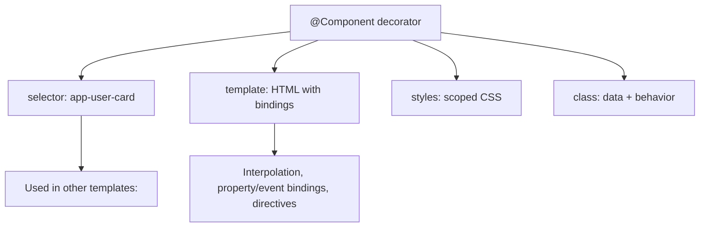
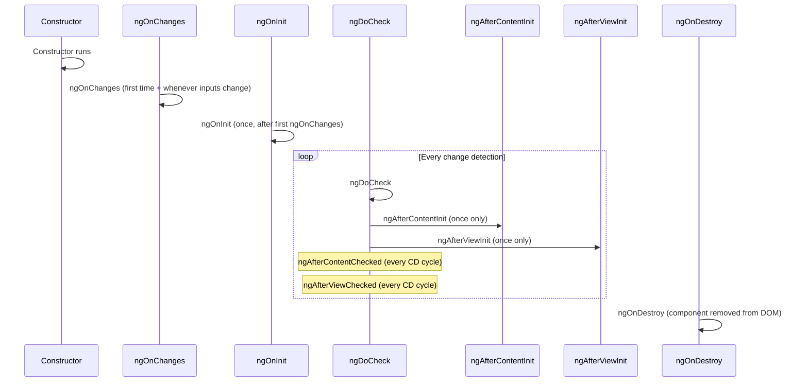
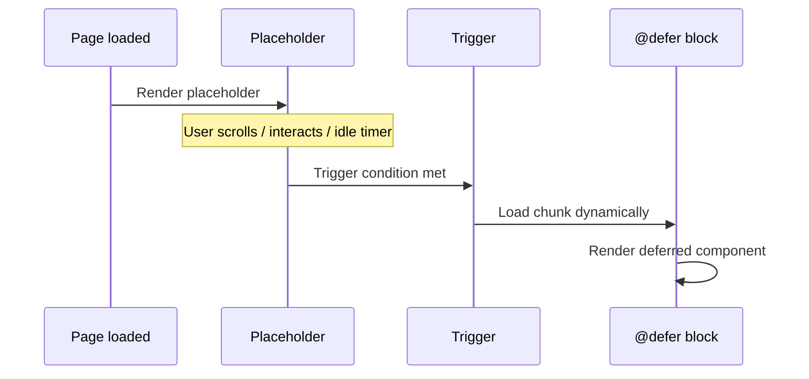

# Components, Templates, and Data Binding

> [!summary] Goal
> Build Angular components with templates, bindings, lifecycle hooks, and modern signal-based APIs. Understand how Angular renders components and manages their lifecycle.

## Table of Contents

1. [Why Components Matter](#why-components-matter)
2. [Component Structure](#component-structure)
3. [`@Input` and `@Output`](#input-and-output)
4. [Template Bindings](#template-bindings)
5. [Component Lifecycle Hooks](#component-lifecycle-hooks)
6. [`@ViewChild` and `@ContentChild`](#viewchild-and-contentchild)
7. [Host Bindings and Listeners](#host-bindings-and-listeners)
8. [`@defer` Deferrable Views](#defer-deferrable-views)
9. [`ng-container`, `ng-template`, `ngTemplateOutlet`](#ng-container-ng-template-ngtemplateoutlet)
10. [Pitfalls](#pitfalls)

---

## Why Components Matter

Components are the building blocks of an Angular application. Each component controls a piece of the screen — a view composed of a template, styles, and behavior.



---

## Component Structure

```typescript
import { Component, Input, OnInit, OnDestroy, signal } from '@angular/core';
import { CommonModule } from '@angular/common';
import { User } from './user.model';

@Component({
  selector: 'app-user-card',       // How other components reference this
  standalone: true,                // No NgModule needed
  imports: [CommonModule],         // Dependencies
  template: `
    <div class="card" [class.active]="isActive()">
      <h3>{{ user().name }}</h3>
      <p>{{ user().email }}</p>
      <button (click)="onEdit()">Edit</button>
    </div>
  `,
  styles: [`
    .card { border: 1px solid #ccc; padding: 1rem; }
    .active { border-color: blue; }
  `],
  changeDetection: ChangeDetectionStrategy.OnPush,
})
export class UserCardComponent implements OnInit, OnDestroy {
  @Input({ required: true }) user!: User;
  @Output() edit = new EventEmitter<number>();

  isActive = signal(false);

  ngOnInit() { console.log('Component initialized'); }
  ngOnDestroy() { console.log('Component destroyed'); }

  onEdit() { this.edit.emit(this.user().id); }
}
```

### Component metadata properties

| Property | Purpose |
|----------|---------|
| `selector` | CSS selector for using the component |
| `template` / `templateUrl` | Inline or external HTML template |
| `styles` / `styleUrls` | Inline or external CSS/SCSS |
| `standalone` | Whether it belongs to an NgModule |
| `imports` | Other standalone components/pipes used |
| `encapsulation` | ViewEncapsulation strategy |
| `changeDetection` | ChangeDetectionStrategy |
| `providers` | Component-level DI providers |
| `host` | Host element properties and listeners |

---

## `@Input` and `@Output`

### Classic decorators

```typescript
@Component({ selector: 'app-counter', ... })
export class CounterComponent {
  // Required input (must be set by parent)
  @Input({ required: true }) initialValue!: number;

  // Optional input with default transformation
  @Input({ alias: 'step-size', transform: (v: string) => parseInt(v, 10) })
  stepSize: number = 1;

  // Emits events to parent
  @Output() countChanged = new EventEmitter<number>();

  increment() {
    this.countChanged.emit(this.initialValue + this.stepSize);
  }
}
```

```html
<!-- Parent usage -->
<app-counter
  [initialValue]="5"
  [step-size]="'2'"
  (countChanged)="onCountChanged($event)"
/>
```

### Signal-based inputs and outputs (Angular 17+)

```typescript
@Component({ ... })
export class CounterComponent {
  // Signal input — automatically tracked
  initialValue = input.required<number>();
  stepSize = input(1, { transform: (v: string) => parseInt(v, 10) });

  // Signal output
  countChanged = output<number>();

  increment() {
    this.countChanged.emit(this.initialValue() + this.stepSize());
  }
}
```

| Feature | Classic `@Input()` | Signal `input()` |
|---------|-------------------|-------------------|
| Required | `@Input({ required: true })` | `input.required<T>()` |
| Default | Property initializer | `input(defaultValue)` |
| Transform | `transform: fn` | `{ transform: fn }` |
| alias | `@Input('alias')` | `input('', { alias: 'alias' })` |
| Change detection | Triggers OnPush check | Triggers OnPush check |
| Reads in template | `{{ prop }}` | `{{ prop() }}` |

### `model()` — two-way signal binding (Angular 17+)

```typescript
@Component({ ... })
export class CounterComponent {
  count = model(0);
  // Creates both a signal input AND an output
  // Parent can use: [(count)]="parentCount"
}

// Parent:
// <app-counter [(count)]="pageSize" />
```

---

## Template Bindings

```html
<!-- Interpolation: component to template -->
<h1>{{ title }}</h1>
<p>{{ user.name }} ({{ user.age }})</p>
<p>{{ getDisplayName() }}</p>

<!-- Property binding: component property to DOM property -->

<button [disabled]="isSaving">Save</button>

<!-- Attribute binding: to HTML attributes -->
<div [attr.aria-label]="labelText">...</div>
<div [attr.data-id]="itemId">...</div>

<!-- Class binding -->
<div [class.active]="isActive">...</div>
<div [class]="'row ' + colClass">...</div>
<div [class]="{ active: isActive, disabled: !isActive }">...</div>

<!-- Style binding -->
<p [style.color]="textColor">...</p>
<p [style.font-size.px]="fontSize">...</p>
<div [style]="{ color: textColor, 'font-size': fontSize + 'px' }">...</div>

<!-- Event binding -->
<button (click)="handleClick($event)">Click</button>
<input (keyup.enter)="submit()" />
<div (mousemove)="updatePosition($event)">...</div>

<!-- Two-way binding -->
<input [(ngModel)]="name" />
<app-counter [(count)]="parentCount" />

<!-- Template reference variable -->
<input #emailInput (blur)="onBlur(emailInput.value)" />
<form #myForm="ngForm" (ngSubmit)="onSubmit()">...</form>
```

---

## Component Lifecycle Hooks

Angular calls lifecycle hook methods in a specific order:



```typescript
@Component({ ... })
export class LifecycleDemoComponent implements
  OnChanges, OnInit, DoCheck,
  AfterContentInit, AfterContentChecked,
  AfterViewInit, AfterViewChecked,
  OnDestroy {

  @Input() value!: string;

  // 1. Called whenever @Input properties change
  ngOnChanges(changes: SimpleChanges) {
    console.log('ngOnChanges', changes);
    // changes.value.currentValue, changes.value.previousValue
  }

  // 2. Called once, after the first ngOnChanges
  ngOnInit() {
    console.log('ngOnInit — init logic, fetch data');
  }

  // 3. Called on every change detection cycle
  ngDoCheck() {
    console.log('ngDoCheck — custom change detection');
  }

  // 4. Called once after content projection is done
  ngAfterContentInit() {
    console.log('ngAfterContentInit — first ng-content available');
  }

  // 5. Called every CD cycle after content check
  ngAfterContentChecked() {
    console.log('ngAfterContentChecked');
  }

  // 6. Called once after component's view is initialized
  ngAfterViewInit() {
    console.log('ngAfterViewInit — ViewChildren available');
  }

  // 7. Called every CD cycle after view check
  ngAfterViewChecked() {
    console.log('ngAfterViewChecked');
  }

  // 8. Called just before component is destroyed
  ngOnDestroy() {
    console.log('ngOnDestroy — cleanup subscriptions, timers');
  }
}
```

| Hook | Purpose | Called |
|------|---------|--------|
| `ngOnChanges` | React to `@Input` changes | Before `ngOnInit` + every time inputs change |
| `ngOnInit` | One-time initialization | Once, after first `ngOnChanges` |
| `ngDoCheck` | Custom change detection | Every change detection cycle |
| `ngAfterContentInit` | Content projection ready | Once, after first `ngDoCheck` |
| `ngAfterContentChecked` | Content checked | Every CD cycle after `ngDoCheck` |
| `ngAfterViewInit` | View children ready | Once, after first `ngAfterContentChecked` |
| `ngAfterViewChecked` | View checked | Every CD cycle after `ngAfterContentChecked` |
| `ngOnDestroy` | Cleanup | Just before component is removed |

---

## `@ViewChild` and `@ContentChild`

### Classic decorator queries

```typescript
@Component({
  template: `
    <input #searchInput />
    <app-child></app-child>
    <ng-content></ng-content>
  `,
})
export class ParentComponent implements AfterViewInit, AfterContentInit {
  // Query a template reference variable
  @ViewChild('searchInput') searchInput!: ElementRef<HTMLInputElement>;

  // Query the first child component
  @ViewChild(ChildComponent) child!: ChildComponent;

  // Query all children of a type
  @ViewChildren(ChildComponent) children!: QueryList<ChildComponent>;

  // Query projected content
  @ContentChild(ProjectedComponent) projected!: ProjectedComponent;

  ngAfterViewInit() {
    this.searchInput.nativeElement.focus();
    // ViewChild is available now
  }

  ngAfterContentInit() {
    // ContentChild is available now
  }
}
```

### Signal-based queries (Angular 17+)

```typescript
@Component({ ... })
export class ParentComponent {
  searchInput = viewChild.required<ElementRef<HTMLInputElement>>('searchInput');
  child = viewChild(ChildComponent);
  children = viewChildren(ChildComponent);
  projected = contentChild(ProjectedComponent);

  ngAfterViewInit() {
    this.searchInput().nativeElement.focus();
  }
}
```

### `static` option

```typescript
// static: false — available after ngAfterViewInit (default for most)
@ViewChild('dynamic', { static: false }) dynamic!: ElementRef;

// static: true — available in ngOnInit (for static elements not conditional)
@ViewChild('staticElement', { static: true }) staticEl!: ElementRef;
```

---

## Host Bindings and Listeners

```typescript
@Component({
  selector: '[appHighlight]',
  standalone: true,
})
export class HighlightDirective {
  // @HostBinding binds a property on the host element
  @HostBinding('class.highlighted') isHighlighted = false;

  // @HostListener listens to events on the host element
  @HostListener('mouseenter') onMouseEnter() {
    this.isHighlighted = true;
  }

  @HostListener('mouseleave') onMouseLeave() {
    this.isHighlighted = false;
  }
}

// Equivalent using component host property:
@Component({
  selector: 'app-button',
  host: {
    '[class.active]': 'isActive',
    '(click)': 'onClick()',
    'role': 'button',
  },
})
export class ButtonComponent {
  isActive = false;
  onClick() { this.isActive = !this.isActive; }
}
```

---

## `@defer` Deferrable Views (Angular 17+)

`@defer` lazily loads heavy components only when needed — reducing initial bundle size.

```typescript
@Component({ template: `
  <div>Always loaded content</div>

  @defer {
    <app-heavy-component />         <!-- Loaded lazily -->
  } @loading {
    <div>Loading heavy component...</div>
  } @placeholder {
    <div>This space reserved for heavy component</div>
  } @error {
    <div>Failed to load component</div>
  }

  <!-- With trigger condition -->
  @defer (on viewport) {
    <app-image-gallery />
  } @placeholder {
    <div class="placeholder" style="height: 400px;">Scroll to see gallery</div>
  }

  @defer (on interaction) {
    <app-comments (close)="showComments.set(false)" />
  } @placeholder {
    <button (click)="showComments.set(true)">Show Comments</button>
  }

  @defer (on idle; prefetch on viewport) {
    <app-live-chat />
  }
`})
export class MyPageComponent {}
```



| Trigger | Behavior |
|---------|----------|
| `on viewport` | Loads when element enters viewport |
| `on interaction` | Loads on click/tap |
| `on idle` | Loads when browser is idle |
| `on immediate` | Loads immediately after parent render |
| `on timer(500ms)` | Loads after a delay |
| `prefetch` | Downloads the chunk earlier than rendering |

---

## `ng-container`, `ng-template`, `ngTemplateOutlet`

```html
<!-- ng-container: groups elements without adding extra DOM -->
<ng-container *ngIf="isLoggedIn">
  <app-header />
  <app-content />
</ng-container>

<!-- ng-template: defines a template fragment not rendered by default -->
<ng-template #loading>
  <div class="spinner">Loading...</div>
</ng-template>

<!-- ngTemplateOutlet: renders a template with context -->
<ng-container *ngTemplateOutlet="loading"></ng-container>

<ng-template #itemTemplate let-item let-index="i">
  <div class="item">{{ i }}: {{ item.name }}</div>
</ng-template>

<ng-container *ngFor="let item of items; let i = index">
  <ng-container *ngTemplateOutlet="itemTemplate; context: { $implicit: item, i: i }">
  </ng-container>
</ng-container>
```

---

## Pitfalls

### `ngOnInit` vs constructor

Don't put initialization logic in the constructor — the component isn't fully set up yet. Inputs and child components aren't available.

**Fix**: Use `ngOnInit` for initialization, `ngAfterViewInit` for child component access.

### `ngOnDestroy` not cleaning up

Not unsubscribing from observables, clearing timers, or removing event listeners causes memory leaks.

**Fix**: Use `DestroyRef` + `takeUntilDestroyed`, or clean up in `ngOnDestroy`.

### Template reference variable before view init

```typescript
@ViewChild('myInput') input!: ElementRef;
ngOnInit() { this.input.nativeElement.focus(); }  // Error — not available yet
```

**Fix**: Access in `ngAfterViewInit` instead.

### Signal `input()` requires calling as function in templates

```html
<!-- ❌ Wrong — won't detect changes -->
<p>{{ user }}</p>
<!-- ✅ Correct — call signal -->
<p>{{ user() }}</p>
```

---

> [!question]- Interview Questions
>
> **Q: What is the order of lifecycle hooks?**
> A: Constructor → ngOnChanges → ngOnInit → ngDoCheck → ngAfterContentInit → ngAfterContentChecked → ngAfterViewInit → ngAfterViewChecked → ngOnDestroy.
>
> **Q: What is the difference between `@Input()` and `input()`?**
> A: `@Input()` is the classic decorator — mutable property, read with `{{ prop }}`. `input()` is signal-based — creates a read-only signal, must be called with `{{ prop() }}` in templates. `input()` provides better type inference and integration with OnPush change detection.
>
> **Q: What does `@defer` do?**
> A: It lazily loads a component's JavaScript chunk when a trigger condition is met (viewport, interaction, idle, timer). Works with a placeholder, loading, and error state block.

---

## Cross-Links

- [[Angular/02_Core/02_Signals_Essentials]] for signal inputs and outputs
- [[Angular/01_Foundations/03_DI_Services_and_Providers]] for injecting services into components
- [[Angular/01_Foundations/04_Routing_Basics]] for routing components
- [[Angular/03_Advanced/01_Change_Detection_and_Performance]] for OnPush strategy
