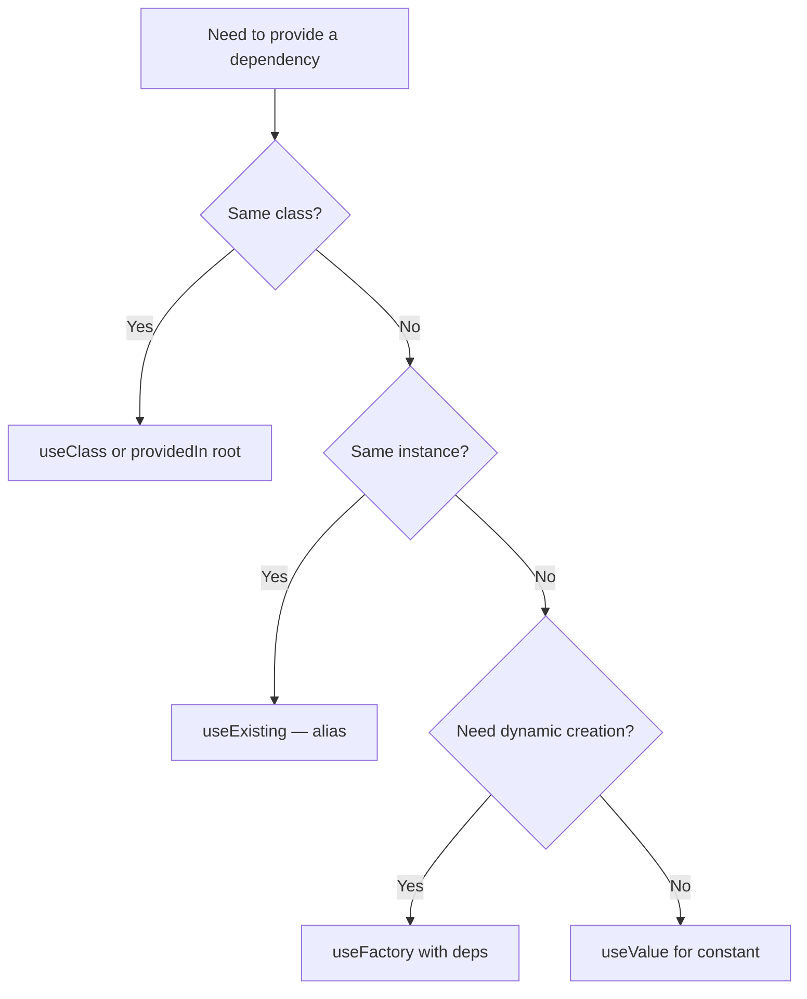

# Dependency Injection, Services, and Providers

> [!summary] Goal
> Understand Angular's dependency injection system: the injector tree, provider forms, the `inject()` function, resolution modifiers, and how to scope services correctly.

## Table of Contents

1. [Why DI Matters](#why-di-matters)
2. [The Injector Tree](#the-injector-tree)
3. [Creating Injectable Services](#creating-injectable-services)
4. [`inject()` Function](#inject-function)
5. [Provider Forms](#provider-forms)
6. [`InjectionToken`](#injectiontoken)
7. [Resolution Modifiers](#resolution-modifiers)
8. [Multi-Providers](#multi-providers)
9. [Pitfalls](#pitfalls)

---

## Why DI Matters

Angular's dependency injection system provides instances based on **tokens**. The injector tree determines scope and lifetime. This enables:

- **Singleton services** shared across the app
- **Scoped services** limited to a route or component subtree
- **Mocking** for testing without changing the service class

---

## The Injector Tree

Angular has a hierarchy of injectors:

```mermaid
flowchart TD
    P[PlatformInjector] --> R[RootInjector<br>providedIn: 'root']
    R --> M[RouteInjector<br>Route providers]
    R --> C1[ComponentInjector A<br>providers: []]
    R --> C2[ComponentInjector B<br>providers: []]
    M --> C3[ComponentInjector C]
    C1 --> C4[Child Component<br>Inherits from C1]
```

| Injector level | `providedIn` / provider location | Lifetime |
|---------------|----------------------------------|----------|
| **Platform** | `providedIn: 'platform'` | Application singleton (rare) |
| **Root** | `providedIn: 'root'` | App-wide singleton (most common) |
| **Route** | `Route.providers` | Shared within the route tree |
| **Component** | `@Component({ providers: [] })` | One instance per component instance |

```typescript
// Root injector — one instance shared app-wide
@Injectable({ providedIn: 'root' })
export class ApiService { }

// Route injector — shared within a route and its children
const routes: Routes = [{
  path: 'users',
  providers: [UsersService],    // One instance for all /users routes
  children: [...],
}];

// Component injector — new instance per component usage
@Component({
  selector: 'app-user-card',
  providers: [UserCardService], // Each <app-user-card> gets its own
})
export class UserCardComponent { }
```

---

## Creating Injectable Services

```typescript
// Tree-shakeable singleton (recommended)
@Injectable({ providedIn: 'root' })
export class LoggerService {
  log(message: string) {
    console.log(`[LOG]: ${message}`);
  }
}
```

The `providedIn: 'root'` pattern is **tree-shakeable**: if the service is never imported, it's excluded from the bundle.

### Service with dependencies

```typescript
@Injectable({ providedIn: 'root' })
export class UserService {
  private http = inject(HttpClient);
  private logger = inject(LoggerService);

  getUser(id: number): Observable<User> {
    this.logger.log(`Fetching user ${id}`);
    return this.http.get<User>(`/api/users/${id}`);
  }
}
```

---

## `inject()` Function

The `inject()` function is the modern way to get dependencies — no constructor injection needed:

```typescript
@Injectable({ providedIn: 'root' })
export class AnalyticsService {
  // Injected as a field initializer — no constructor needed
  private http = inject(HttpClient);
  private router = inject(Router);
  private destroyRef = inject(DestroyRef);

  trackPageView() { /* ... */ }
}
```

```typescript
// In components
@Component({ ... })
export class ProductComponent {
  private route = inject(ActivatedRoute);
  private productService = inject(ProductService);
  product$ = this.route.paramMap.pipe(
    switchMap(params => this.productService.get(+params.get('id')!)),
  );
}
```

### Constructor injection (traditional)

```typescript
@Injectable({ providedIn: 'root' })
export class OldStyleService {
  constructor(
    private http: HttpClient,
    private logger: LoggerService,
  ) { }
}
```

### `inject()` vs constructor injection

| Aspect | Constructor injection | `inject()` function |
|--------|----------------------|---------------------|
| **Syntax** | Parameter in constructor | Call anywhere during initialization |
| **Component fields** | Requires constructor body | Direct field initializer |
| **Inheritance** | `super()` passing | No super() needed |
| **Optional deps** | `@Optional()` decorator | `inject(TOKEN, { optional: true })` |
| **Testing** | Easy (constructor params) | Requires TestBed.overrideProvider |
| **Tree-shakeable** | Yes (with providedIn) | Same |
| **Guards/Interceptors** | Not possible (function-based) | ✅ Only option |
| **Pipes** | ✅ Works | ✅ Works |
| **Before constructor body** | ❌ Not available | ✅ Available as field init |
| **Readability** | Parameters visible in signature | Hidden in field initializers |

### Deep `inject()` patterns

#### In guards (function-based)

```typescript
export const authGuard: CanActivateFn = () => {
  const auth = inject(AuthService);
  const router = inject(Router);
  return auth.isLoggedIn() ? true : router.parseUrl('/login');
};
```

#### In interceptors

```typescript
export const authInterceptor: HttpInterceptorFn = (req, next) => {
  const auth = inject(AuthService);    // Injected per-request
  const router = inject(Router);
  return next(req).pipe(
    catchError((err) => {
      if (err.status === 401) router.navigate(['/login']);
      return throwError(() => err);
    }),
  );
};
```

#### In pipes

```typescript
@Pipe({ name: 'countryName', standalone: true })
export class CountryNamePipe implements PipeTransform {
  // inject() works in pipe constructors too
  private countries = inject(COUNTRY_MAP);

  transform(code: string): string {
    return this.countries[code] ?? code;
  }
}
```

#### In environment providers (app.config.ts)

```typescript
export const appConfig: ApplicationConfig = {
  providers: [
    provideHttpClient(),
    {
      provide: APP_INITIALIZER,
      useFactory: () => {
        const config = inject(ConfigService);
        return () => config.load();
      },
      multi: true,
    },
  ],
};
```

### `inject()` with injection flags

```typescript
// Optional — returns null instead of throwing
const logger = inject(LoggerService, { optional: true });

// Self — only checks the current injector
const local = inject(LocalService, { self: true });

// SkipSelf — skips the current injector
const parent = inject(ParentService, { skipSelf: true });

// Host — stops at the host component
const hostDep = inject(HostDep, { host: true });
```

### `environmentInjector`

Created for each `NgModule` or `ApplicationConfig`. Useful for lazy-loaded modules:

```typescript
import { createEnvironmentInjector, EnvironmentInjector } from '@angular/core';

// Inside a component or service
const childInjector = createEnvironmentInjector(
  [SpecialService],
  inject(EnvironmentInjector),  // Parent injector
);

// Now SpecialService is available via childInjector
const special = childInjector.get(SpecialService);
```

### `runInInjectionContext`

Run arbitrary code with injection capabilities (for non-angular classes):

```typescript
import { runInInjectionContext, Injector } from '@angular/core';

class LegacyApiClient {
  private injector = inject(Injector);

  fetch() {
    runInInjectionContext(this.injector, () => {
      const http = inject(HttpClient);
      // HttpClient is now injectable here
    });
  }
}
```

### `createInjector`

Low-level API for creating standalone injectors:

```typescript
import { createInjector } from '@angular/core';
import { HttpClient } from '@angular/common/http';

// Create an injector with providers, parent can be another injector
const childInjector = createInjector({
  providers: [SpecialLogger],
  parent: inject(Injector),
});
```

---

## Provider Forms

```typescript
const providers = [
  // 1. useClass — provide one class when another is requested
  { provide: LoggerService, useClass: ProductionLoggerService },

  // 2. useValue — provide a literal value
  { provide: API_URL, useValue: 'https://api.example.com' },

  // 3. useExisting — alias (same instance)
  { provide: OldLoggerService, useExisting: LoggerService },

  // 4. useFactory — dynamic creation
  { provide: ConfigService,
    useFactory: () => {
      const isDev = inject(IsDevMode);
      return isDev ? new DevConfig() : new ProdConfig();
    },
  },
];
```



| Form | Use case |
|------|----------|
| `useClass` | Swap implementation (e.g., mock for test, dev vs prod logger) |
| `useValue` | Provide a constant, config object, or existing class instance |
| `useExisting` | Create an alias for an existing provider (multiple tokens, same instance) |
| `useFactory` | Create the instance dynamically with dependencies |

---

## `InjectionToken`

Use `InjectionToken` for non-class dependencies (strings, config objects, functions):

```typescript
import { InjectionToken } from '@angular/core';

export const API_URL = new InjectionToken<string>('API_URL', {
  providedIn: 'root',
  factory: () => 'https://api.example.com',
});

// Config object token
export interface AppConfig {
  apiUrl: string;
  debug: boolean;
  pollingInterval: number;
}

export const APP_CONFIG = new InjectionToken<AppConfig>('App Config', {
  providedIn: 'root',
  factory: () => ({
    apiUrl: 'https://api.example.com',
    debug: false,
    pollingInterval: 30000,
  }),
});
```

```typescript
// Using the token
@Injectable({ providedIn: 'root' })
export class ConfigService {
  private apiUrl = inject(API_URL);
  private config = inject(APP_CONFIG);
}
```

---

## Resolution Modifiers

Resolution modifiers control **where** Angular looks for a provider:

```typescript
@Component({
  providers: [LoggerService],    // Component-level provider
})
export class SettingsComponent {
  // ❌ Standard lookup — checks component, then parent, up to root
  private logger = inject(LoggerService);

  // ✅ @Optional — returns null if not found (no error)
  private optional = inject(LoggerService, { optional: true });

  // ✅ @Self — only checks this component's injector
  private selfLogger = inject(LoggerService, { optional: true, self: true });

  // ✅ @SkipSelf — skips this component, checks parent/root
  private parentLogger = inject(LoggerService, { optional: true, skipSelf: true });

  // ✅ @Host — stops at the host component (for content projection)
  private hostLogger = inject(LoggerService, { optional: true, host: true });
}
```

| Modifier | Effect |
|----------|--------|
| `optional: true` | Don't throw if not found — return `null` |
| `self: true` | Only search in the current injector |
| `skipSelf: true` | Skip the current injector, search parent |
| `host: true` | Stop at the host element (for projected content) |

---

## Multi-Providers

Multi-providers allow multiple providers for the same token:

```typescript
// The token
export const HTTP_INTERCEPTORS = new InjectionToken<HttpInterceptorFn[]>('HTTP_INTERCEPTORS', {
  providedIn: 'root',
  factory: () => [],
});

// Each feature provides an interceptor
{ provide: HTTP_INTERCEPTORS, useClass: AuthInterceptor, multi: true }
{ provide: HTTP_INTERCEPTORS, useClass: LoggingInterceptor, multi: true }
{ provide: HTTP_INTERCEPTORS, useClass: RetryInterceptor, multi: true }

// Angular's built-in multi-providers:
// - HTTP_INTERCEPTORS (class-based interceptors)
// - APP_INITIALIZER (app initialization functions)
// - LOCALE_ID (locale configuration)
```

---

## `provideAppInitializer`

Angular 15+ introduced `provideAppInitializer` as the standalone replacement for `APP_INITIALIZER`:

```typescript
// app.config.ts
import { provideAppInitializer, inject } from '@angular/core';

export const appConfig: ApplicationConfig = {
  providers: [
    provideAppInitializer(() => {
      const config = inject(ConfigService);
      return config.load();  // Must return a Promise or Observable
    }),
  ],
};
```

### `provideAppInitializer` vs multi `APP_INITIALIZER`

| Aspect | `APP_INITIALIZER` (classic) | `provideAppInitializer` (modern) |
|--------|-----------------------------|----------------------------------|
| **Syntax** | `{ provide: APP_INITIALIZER, useFactory, multi: true }` | `provideAppInitializer(() => ...)` |
| **Tree-shakeable** | ❌ No | ✅ Yes |
| **Requires multi** | ✅ Yes (`multi: true`) | ❌ No (single call) |
| **Multiple initializers** | Add more to the multi array | Call `provideAppInitializer()` multiple times |
| **Dependencies** | `useFactory` + `deps` array | `inject()` inside the factory |
| **Standalone** | Works but verbose | ✅ Native |

```typescript
// Multiple initializers
export const appConfig: ApplicationConfig = {
  providers: [
    provideAppInitializer(() => {
      const auth = inject(AuthService);
      return auth.restoreSession();
    }),
    provideAppInitializer(() => {
      const analytics = inject(AnalyticsService);
      return analytics.initialize();
    }),
  ],
};
```

> [!tip] Initializers run **in order**. The app doesn't bootstrap until all promises resolve. Keep initializers fast — a slow initializer delays the first render.

---

## Pitfalls

### Re-providing at component level creates a new instance

```typescript
@Component({
  providers: [UserService],  // New instance for each <app-user>!
})
export class UserComponent { }
```

**Fix**: Use `providedIn: 'root'` for true singletons. Use component providers only when you intentionally want a new instance per component.

### Circular dependency

```typescript
// service-a.ts
export class ServiceA { private b = inject(ServiceB); }

// service-b.ts
export class ServiceB { private a = inject(ServiceA); }  // Error!
```

**Fix**: Restructure to remove the cycle, or use `inject(ServiceA, { optional: true })` and set it lazily after construction.

### `providedIn: 'any'` (deprecated)

```typescript
@Injectable({ providedIn: 'any' }) // Avoid — deprecated
```

**Fix**: Use `providedIn: 'root'` or `providedIn: 'platform'` for specific scoping needs.

---

> [!question]- Interview Questions
>
> **Q: What is the injector hierarchy in Angular?**
> A: PlatformInjector → RootInjector (`providedIn: 'root'`) → RouteInjector → ComponentInjector. A component checks its own injector, then its parent, then the root, until it finds the provider.
>
> **Q: What is the difference between `providedIn: 'root'` and component-level providers?**
> A: `providedIn: 'root'` creates a single app-wide singleton. Component-level providers (`@Component({ providers })`) create a new instance for each component instance.
>
> **Q: What are the four provider forms?**
> A: `useClass` (different class), `useValue` (literal value), `useExisting` (alias), `useFactory` (dynamic creation).
>
> **Q: When would you use `InjectionToken`?**
> A: When you need to provide a non-class value (string, number, config object), or when you need multi-providers.

---

## Cross-Links

- [[Angular/02_Core/01_Standalone_Components]] for bootstrap providers
- [[Angular/04_Playbooks/02_Debug_DI_Provider_Scope_Issues]] for DI debugging
- [[Angular/01_Foundations/02_Components_Templates_and_Data_Binding]] for component-level DI
