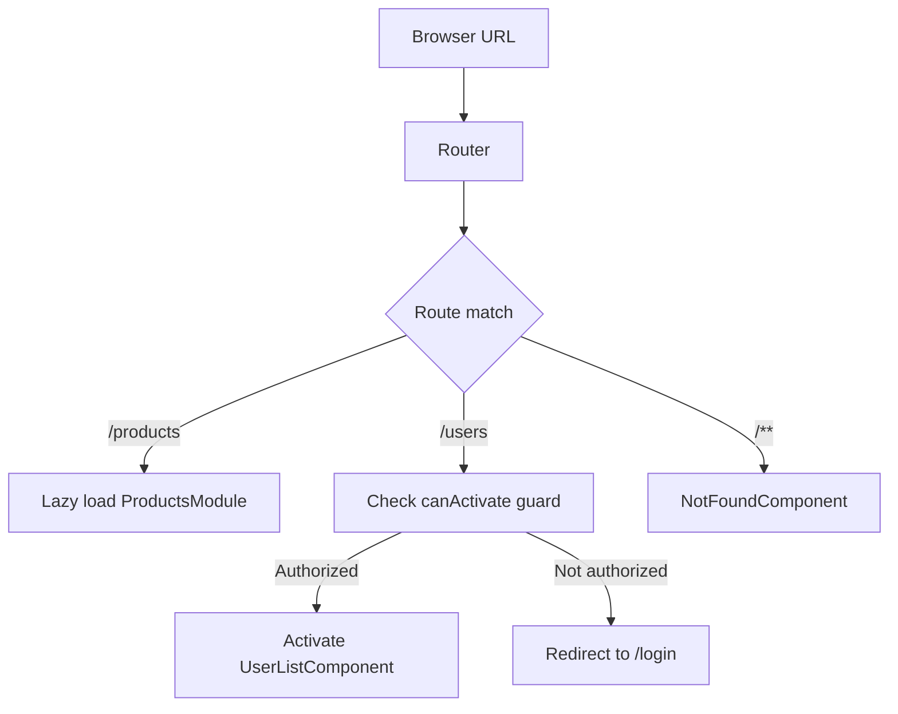
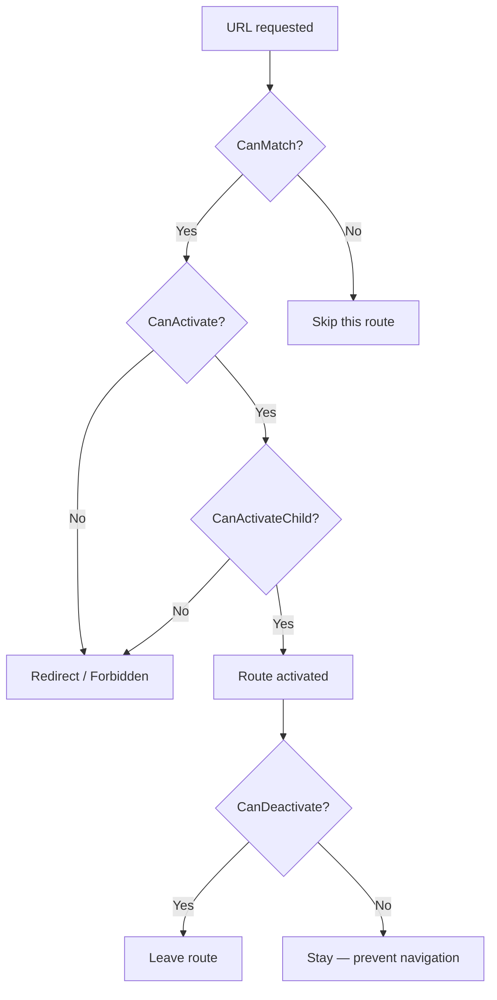

# Routing Basics

> [!summary] Goal
> Build navigation with Angular Router: define routes, navigate programmatically, protect with guards, lazy-load feature modules, and receive route parameters.

## Table of Contents

1. [Why Routing Matters](#why-routing-matters)
2. [Route Configuration](#route-configuration)
3. [`RouterOutlet` and `RouterLink`](#routeroutlet-and-routerlink)
4. [Route Parameters](#route-parameters)
5. [Route Guards](#route-guards)
6. [Resolvers](#resolvers)
7. [Lazy Loading](#lazy-loading)
8. [Nested and Child Routes](#nested-and-child-routes)
9. [Navigation](#navigation)
10. [Pitfalls](#pitfalls)

---

## Why Routing Matters

Routing maps URL paths to components. Angular's Router provides:

- **Lazy loading** — load code only when a route is visited
- **Guards** — prevent unauthorized access
- **Resolvers** — pre-fetch data before navigation
- **Nested routes** — complex layouts with child routes



---

## Route Configuration

```typescript
// app.routes.ts
import { Routes } from '@angular/router';
import { authGuard } from './core/auth.guard';
import { userResolver } from './users/user.resolver';

export const routes: Routes = [
  // Simple route
  { path: 'home', component: HomeComponent },

  // Route with parameter
  { path: 'users/:id', component: UserDetailComponent },

  // Route with guard and resolver
  {
    path: 'users/:id',
    component: UserDetailComponent,
    canActivate: [authGuard],
    resolve: { user: userResolver },
    title: 'User Details',            // Dynamic page title
  },

  // Redirect
  { path: '', redirectTo: '/home', pathMatch: 'full' },

  // 404
  { path: '**', component: NotFoundComponent },

  // Lazy-loaded route
  {
    path: 'products',
    loadComponent: () => import('./products/product-list.component')
      .then(m => m.ProductListComponent),
  },
];
```

```typescript
// app.config.ts — provide router
import { ApplicationConfig } from '@angular/core';
import { provideRouter, withComponentInputBinding, withRouterConfig } from '@angular/router';

export const appConfig: ApplicationConfig = {
  providers: [
    provideRouter(routes,
      withComponentInputBinding(),     // Bind route params to @Input
      withRouterConfig({ onSameUrlNavigation: 'reload' }),
    ),
  ],
};
```

### Route definition properties

| Property | Purpose |
|----------|---------|
| `path` | URL segment or pattern |
| `component` | Component to render (eager) |
| `loadComponent` | Lazy-load component |
| `loadChildren` | Lazy-load child routes |
| `redirectTo` | Redirect to another path |
| `pathMatch` | `'full'` or `'prefix'` |
| `canActivate` | Guard — allow access |
| `canActivateChild` | Guard — child route access |
| `canDeactivate` | Guard — prevent leaving |
| `canMatch` | Guard — match route conditionally |
| `resolve` | Pre-fetch route data |
| `data` | Static route data |
| `title` | Page title (sets `document.title`) |
| `providers` | Route-level DI providers |

---

## `RouterOutlet` and `RouterLink`

```html
<!-- app.component.html — main template -->
<nav>
  <a routerLink="/home">Home</a>
  <a routerLink="/users">Users</a>
  <a [routerLink]="['/users', userId]">User Detail</a>
  <a routerLink="/products" routerLinkActive="active">Products</a>
</nav>

<router-outlet />  <!-- Route content renders here -->
```

```typescript
// RouterLink active class
@Component({
  selector: 'app-nav',
  template: `
    <a routerLink="/dashboard"
       routerLinkActive="active-link"
       [routerLinkActiveOptions]="{ exact: true }">
      Dashboard
    </a>
  `,
})
export class NavComponent { }
```

| Directive | Purpose |
|-----------|---------|
| `<router-outlet>` | Renders the matched route's component |
| `routerLink` | Navigation link (triggers route transition) |
| `routerLinkActive` | CSS class when link is active |
| `routerLinkActiveOptions` | `{ exact: true }` for exact path match |

---

## Route Parameters

### Using `ActivatedRoute`

```typescript
@Component({ ... })
export class UserDetailComponent implements OnInit {
  private route = inject(ActivatedRoute);
  private userService = inject(UserService);

  // Path parameter: /users/42 → id = 42
  userId$ = this.route.paramMap.pipe(
    map(params => +params.get('id')!),
  );

  // Query parameter: /users?page=2&sort=name
  queryParams$ = this.route.queryParamMap.pipe(
    map(params => ({
      page: +(params.get('page') ?? 1),
      sort: params.get('sort') ?? 'name',
    })),
  );

  // Snapshot (one-time read)
  ngOnInit() {
    const id = this.route.snapshot.params['id'];
    const page = this.route.snapshot.queryParamMap.get('page');
  }
}
```

### `withComponentInputBinding` (Angular 14+)

With `provideRouter(routes, withComponentInputBinding())`, route params are automatically bound to `@Input`:

```typescript
// No ActivatedRoute injection needed!
@Component({ ... })
export class UserDetailComponent {
  @Input() id!: string;       // Bound from route param /users/:id
  @Input() page?: string;     // Bound from query param ?page=
}
```

---

## Route Guards



```typescript
// CanActivate — allow or deny access to a route
import { inject } from '@angular/core';
import { CanActivateFn, Router } from '@angular/router';

export const authGuard: CanActivateFn = (route, state) => {
  const auth = inject(AuthService);
  const router = inject(Router);

  if (auth.isLoggedIn()) {
    return true;
  }
  return router.parseUrl('/login');
};
```

```typescript
// CanDeactivate — prevent leaving (dirty forms)
export const dirtyFormGuard: CanDeactivateFn<DirtyFormComponent> = (component) => {
  return component.hasUnsavedChanges()
    ? confirm('You have unsaved changes. Leave anyway?')
    : true;
};
```

```typescript
// CanMatch — match route conditionally (feature gating)
export const featureGuard: CanMatchFn = () => {
  return inject(FeatureService).isEnabled('beta-feature');
};
```

```typescript
// Route definition with guards
const routes: Routes = [
  {
    path: 'dashboard',
    canActivate: [authGuard],              // Must be authenticated
    canActivateChild: [authGuard],
    loadComponent: () => import('./dashboard.component'),
    children: [
      { path: 'settings', canDeactivate: [dirtyFormGuard], ... },
    ],
  },
  {
    path: 'beta',
    canMatch: [featureGuard],             // Route won't match if feature off
    component: BetaComponent,
  },
];
```

---

## Resolvers

Resolvers pre-fetch data before activating a route — the component waits until data is ready:

```typescript
// user.resolver.ts
import { ResolveFn } from '@angular/router';

export const userResolver: ResolveFn<User> = (route, state) => {
  const userService = inject(UserService);
  const id = route.paramMap.get('id')!;
  return userService.getById(+id);
  // Data is available as route.data['user'] in the component
};
```

```typescript
// Route definition
{
  path: 'users/:id',
  resolve: { user: userResolver },
  loadComponent: () => import('./user-detail.component'),
}
```

```typescript
// Component — data available on initialization
@Component({ ... })
export class UserDetailComponent implements OnInit {
  private route = inject(ActivatedRoute);

  ngOnInit() {
    // Access resolved data
    this.route.data.subscribe(data => {
      this.user = data['user'];
    });
  }

  // Or with withComponentInputBinding + resolver:
  // @Input() user!: User;  // Automatically set from resolver
}
```

---

## Lazy Loading

Lazy loading loads code only when the user visits that route:

```typescript
// Lazy-load a single component (Angular 14+)
const routes: Routes = [
  { path: 'reports',
    loadComponent: () => import('./reports/reports.component')
      .then(m => m.ReportsComponent),
  },
];
```

### Preloading strategies

```typescript
import { provideRouter, withPreloading, PreloadAllModules } from '@angular/router';

export const appConfig: ApplicationConfig = {
  providers: [
    provideRouter(
      routes,
      withPreloading(PreloadAllModules),  // Preload ALL lazy modules after initial load
    ),
  ],
};
```

| Strategy | Behavior |
|----------|----------|
| `NoPreloading` (default) | Load lazy chunks only on navigation |
| `PreloadAllModules` | Load lazy chunks in background after initial load |
| Custom strategy | Implement `PreloadingStrategy` for selective preloading |

---

## Nested and Child Routes

```typescript
// Parent route with children
const routes: Routes = [
  {
    path: 'users',
    component: UsersComponent,     // Layout with its own <router-outlet>
    canActivate: [authGuard],
    children: [
      { path: '', component: UserListComponent },         // /users
      { path: ':id', component: UserDetailComponent },    // /users/42
      { path: ':id/posts', component: UserPostsComponent }, // /users/42/posts
    ],
  },
];
```

```typescript
// users.component.html — layout component
<h2>Users Section</h2>
<router-outlet />   <!-- Child route renders here -->
```

---

## Navigation

```typescript
@Component({ ... })
export class NavigationComponent {
  private router = inject(Router);
  private location = inject(Location);

  navigateToUser(id: number) {
    // Absolute path
    this.router.navigate(['/users', id]);

    // Relative to current route
    this.router.navigate(['..', 'settings'], { relativeTo: this.activatedRoute });

    // With query params
    this.router.navigate(['/users'], {
      queryParams: { page: 2, sort: 'name' },
      queryParamsHandling: 'merge',  // preserve existing params
    });
  }

  goBack() {
    this.location.back();
  }
}
```

### Navigation extras

| Option | Purpose |
|--------|---------|
| `relativeTo` | Navigate relative to a route |
| `queryParams` | Set query parameters |
| `queryParamsHandling` | `'merge'` or `'preserve'` |
| `preserveFragment` | Keep URL fragment |
| `replaceUrl` | Replace current history entry |
| `state` | Pass state object (not in URL) |

---

## Pitfalls

### `pathMatch: 'full'` vs `'prefix'`

```typescript
{ path: '', redirectTo: '/home', pathMatch: 'full' }  // Only matches EMPTY string
{ path: '', redirectTo: '/home', pathMatch: 'prefix' } // Matches ALWAYS — infinite loop!
```

### Lazy-loaded route not working

Make sure the lazy import returns the component correctly:

```typescript
// ❌ Wrong
loadComponent: () => import('./product.component')
// ✅ Correct
loadComponent: () => import('./product.component').then(m => m.ProductComponent)
```

### Guard redirect loop

```typescript
// If the redirect URL is also guarded, you get an infinite loop
export const authGuard: CanActivateFn = () => {
  return inject(Router).parseUrl('/login');   // /login must NOT have this guard
};
```

---

> [!question]- Interview Questions
>
> **Q: What is the difference between `CanActivate` and `CanMatch`?**
> A: `CanActivate` allows/denies access to a route AFTER it's matched. `CanMatch` determines whether the route should be considered for matching at all — useful for conditional routing based on feature flags.
>
> **Q: How do you pass route parameters to a component?**
> A: Three ways: (1) Inject `ActivatedRoute` and read `paramMap` / `snapshot.params`. (2) Use `withComponentInputBinding()` — params bind directly to `@Input()`. (3) Use a resolver to pre-fetch data.
>
> **Q: What is lazy loading and how does it work?**
> A: Lazy loading defers loading component code until the route is visited. `loadComponent: () => import('./path').then(m => m.Component)` tells the build system to create a separate chunk. The chunk is loaded on demand, reducing the initial bundle size.

---

## Cross-Links

- [[Angular/02_Core/01_Standalone_Components]] for route providers
- [[Angular/01_Foundations/03_DI_Services_and_Providers]] for guard/service injection
- [[Angular/03_Advanced/01_Change_Detection_and_Performance]] for navigation performance
- [[Angular/05_Projects/01_Standalone_Signals_Router_Starter_App]] for full routing example
