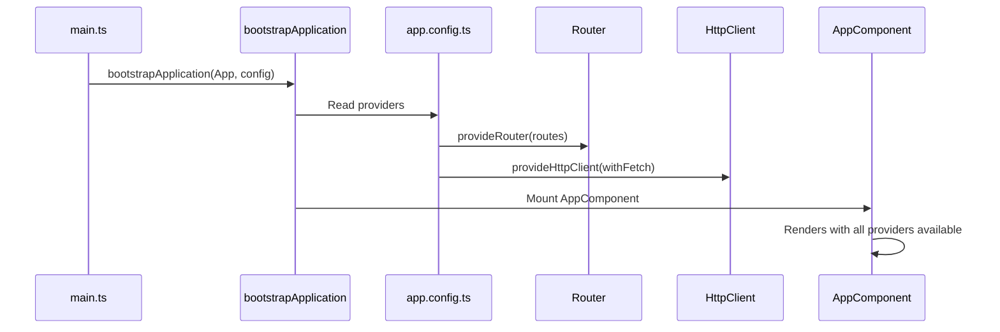

# Standalone Components

> [!summary] Goal
> Build Angular applications without NgModules using standalone components. Understand how to bootstrap an app, provide dependencies, and migrate from NgModules.

## Table of Contents

1. [Why Standalone Matters](#why-standalone-matters)
2. [Standalone Bootstrap](#standalone-bootstrap)
3. [Standalone Component, Directive, Pipe](#standalone-component-directive-pipe)
4. [Standalone vs NgModule](#standalone-vs-ngmodule)
5. [Migration from NgModules](#migration-from-ngmodules)
6. [Pitfalls](#pitfalls)

---

## Why Standalone Matters

Standalone components remove the need for `NgModule`. Each component imports its own dependencies directly, making the module system optional.

```mermaid
flowchart LR
    subgraph "NgModule approach"
        A[AppModule] --> B[declares AppComponent]
        A --> C[imports SharedModule]
        C --> D[exports CommonModule, FormsModule]
    end
    subgraph "Standalone approach"
        E[AppComponent] --> F[imports: [CommonModule, FormsModule]]
    end
    D -->|"Simpler"| F
```

---

## Standalone Bootstrap

```typescript
// main.ts
import { bootstrapApplication } from '@angular/platform-browser';
import { AppComponent } from './app/app.component';
import { appConfig } from './app/app.config';

bootstrapApplication(AppComponent, appConfig)
  .catch(err => console.error(err));
```

```typescript
// app.config.ts
import { ApplicationConfig } from '@angular/core';
import { provideRouter, withComponentInputBinding } from '@angular/router';
import { provideHttpClient, withFetch, withInterceptors } from '@angular/common/http';
import { provideAnimations } from '@angular/platform-browser/animations';
import { authInterceptor } from './core/auth.interceptor';
import { routes } from './app.routes';

export const appConfig: ApplicationConfig = {
  providers: [
    provideRouter(routes, withComponentInputBinding()),
    provideHttpClient(withFetch(), withInterceptors([authInterceptor])),
    provideAnimations(),
    // NgModule backward compatibility
    // importProvidersFrom(NgModule),
  ],
};
```



### Commonly used provide functions

| Function | Purpose |
|----------|---------|
| `provideRouter(routes)` | Configure routing |
| `provideHttpClient(...)` | Configure HTTP client |
| `provideAnimations()` | Enable animations |
| `provideNoopAnimations()` | Disable animations (tests) |
| `provideZoneChangeDetection({ eventCoalescing: true })` | Zone.js config |
| `importProvidersFrom(NgModule)` | Use NgModule-based code in standalone |

---

## Standalone Component, Directive, Pipe

```typescript
// Standalone component
@Component({
  selector: 'app-user-card',
  standalone: true,
  imports: [CommonModule, RouterLink],       // What this component needs
  template: `...`,
})
export class UserCardComponent { }

// Standalone directive
@Directive({
  selector: '[appHighlight]',
  standalone: true,
})
export class HighlightDirective { }

// Standalone pipe
@Pipe({
  name: 'truncate',
  standalone: true,
})
export class TruncatePipe implements PipeTransform {
  transform(value: string, limit = 20): string {
    return value.length > limit ? value.slice(0, limit) + '...' : value;
  }
}
```

```typescript
// Using standalone in other components — no module needed
@Component({
  selector: 'app-user-list',
  standalone: true,
  imports: [CommonModule, UserCardComponent, HighlightDirective, TruncatePipe, RouterLink],
  template: `
    <div *ngFor="let user of users">
      <app-user-card [user]="user" appHighlight />
      <p>{{ user.bio | truncate:100 }}</p>
    </div>
  `,
})
export class UserListComponent { }
```

---

## Standalone vs NgModule

| Aspect | Standalone | NgModule |
|--------|-----------|----------|
| **Declaration** | `standalone: true` in `@Component`/`@Directive`/`@Pipe` | Listed in `declarations: [Component]` in `@NgModule` |
| **Dependencies** | `imports: [CommonModule, RouterLink]` | `imports: [SharedModule]` then module exports |
| **Bootstrap** | `bootstrapApplication(AppComponent, config)` | `platformBrowserDynamic().bootstrapModule(AppModule)` |
| **Lazy loading** | `loadComponent: () => import(...)` | `loadChildren: () => import(...)` |
| **Providers** | provide functions in `ApplicationConfig` | `providers: [...]` in `@NgModule` |
| **When to use** | **New projects** (default since v17), simple apps | Legacy code, library authoring, shared module collections |

---

## Migration from NgModules

### Step 1: Generate migration

```bash
ng generate @angular/core:standalone
```

This command converts:
- Components/Directives/Pipes to `standalone: true`
- NgModules to `imports` arrays
- `main.ts` to `bootstrapApplication`
- Creates `app.config.ts` with providers

### Step 2: Manual migration patterns

```typescript
// BEFORE: NgModule structure
@NgModule({
  declarations: [UserCardComponent, HighlightDirective],
  imports: [CommonModule, FormsModule, RouterModule.forChild(routes)],
  providers: [UserService],
  exports: [UserCardComponent],
})
export class UserModule {}

// AFTER: Standalone component
@Component({
  standalone: true,
  imports: [CommonModule, FormsModule, RouterLink, RouterOutlet],
  providers: [UserService],    // Component-level providers
  // exports handled by using imports directly
})
export class UserCardComponent {}
```

### Step 3: Lazy loading conversion

```typescript
// BEFORE
{ path: 'users', loadChildren: () => import('./users/users.module').then(m => m.UsersModule) }

// AFTER
{ path: 'users', loadComponent: () => import('./users/user-list.component').then(m => m.UserListComponent) }
```

---

## Pitfalls

### `importProvidersFrom` for NgModule interop

When consuming NgModule-based code (e.g., `AngularMaterialModule`), use `importProvidersFrom`:

```typescript
providers: [
  importProvidersFrom(MatDialogModule, MatSnackBarModule),
]
```

### Forgetting `standalone: true`

If you create a component with the CLI and it's not standalone, it can't import other standalone components.

**Fix**: `ng g c my-comp --standalone` or add `standalone: true` manually.

### Route-level providers vs component providers

`Route.providers` create instances shared across all matching routes. `@Component.providers` create instances per component instance.

---

> [!question]- Interview Questions
>
> **Q: What is the difference between standalone and NgModule-based architecture?**
> A: Standalone components declare their own `imports` directly — no NgModule wrapper needed. Bootstrap uses `bootstrapApplication` instead of `bootstrapModule`. Standalone is the default since Angular 17.
>
> **Q: How do you provide HTTP client in a standalone app?**
> A: In `app.config.ts`: `provideHttpClient(withFetch(), withInterceptors([authInterceptor]))`.
>
> **Q: How do you migrate an NgModule-based app to standalone?**
> A: Run `ng generate @angular/core:standalone`. This converts components, migrates bootstrap, and creates `app.config.ts`. Manual cleanup may be needed for complex module structures.

---

## Cross-Links

- [[Angular/01_Foundations/01_Angular_App_Structure_and_Build]] for CLI generation
- [[Angular/01_Foundations/04_Routing_Basics]] for route configuration
- [[Angular/02_Core/04_HttpClient_and_Interceptors]] for provideHttpClient
