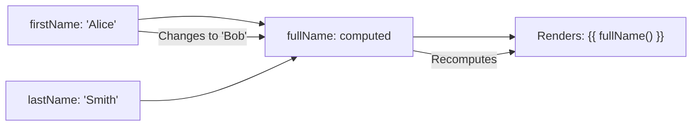
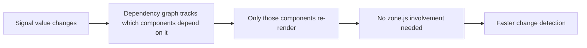

# Signals Essentials

> [!summary] Goal
> Use Angular signals for reactive state: understand `WritableSignal` vs `Signal`, `computed`, `effect`, signal-based inputs/outputs, and how signals integrate with change detection.

## Table of Contents

1. [Why Signals Matter](#why-signals-matter)
2. [WritableSignal and Signal](#writablesignal-and-signal)
3. [`computed`](#computed)
4. [`effect`](#effect)
5. [Signal-based @Input, @Output, and @Model](#signal-based-input-output-and-model)
6. [Signal-based Queries](#signal-based-queries)
7. [RxJS Interop](#rxjs-interop)
8. [Signal-Based Change Detection](#signal-based-change-detection)
9. [Pitfalls](#pitfalls)

---

## Why Signals Matter

Signals are a reactive primitive. When a signal's value changes, Angular automatically knows which components depend on it — no zone.js needed for those components.

```mermaid
flowchart LR
    A["signal(0)"] --> B["computed(() => a() * 2)"]
    A --> C["effect(() => console.log(a()))"]
    B --> D[Template: {{ doubled() }}]
    C --> D
    note: A changes → B recomputed → D re-renders (no zone.js)
```

---

## `WritableSignal` and `Signal`

```typescript
import { signal, computed, effect, WritableSignal, Signal } from '@angular/core';

// WritableSignal — can be updated using set, update, or mutate
const count: WritableSignal<number> = signal(0);

// Signal — read-only, derived value
const doubled: Signal<number> = computed(() => count() * 2);

// Reading a signal (call it like a function)
console.log(count());      // 0
console.log(doubled());    // 0

// Updating a writable signal
count.set(5);              // Replace value
count.update(v => v + 1);  // Derive new value from old
// count() becomes 6
```

### Type inference

```typescript
const name = signal('Alice');           // WritableSignal<string>
const items = signal<string[]>([]);     // WritableSignal<string[]>
const count = signal(0);                // WritableSignal<number>

const doubled = computed(() => count() * 2);  // Signal<number>
```

---

## `computed`

`computed` creates a read-only signal that derives its value from other signals. It's **lazy** and **memoized** — only recomputes when its dependencies change.

```typescript
const firstName = signal('Alice');
const lastName = signal('Smith');

const fullName = computed(() => `${firstName()} ${lastName()}`);

console.log(fullName());         // "Alice Smith"

firstName.set('Bob');
console.log(fullName());         // "Bob Smith" — automatically recomputed
```



---

## `effect`

`effect` runs side effects whenever its tracked dependencies change:

```typescript
const count = signal(0);

effect(() => {
  console.log(`Count changed to: ${count()}`);
  // Automatically tracks count() as a dependency
});
// Logs: "Count changed to: 0"

count.set(1);
// Logs: "Count changed to: 1"
```

### Effect cleanup

```typescript
effect(() => {
  const id = setInterval(() => {
    console.log('tick');
  }, 1000);

  // Cleanup runs when the effect is destroyed or re-executed
  onCleanup(() => clearInterval(id));
});
```

### Effect with DestroyRef

```typescript
const destroyRef = inject(DestroyRef);

effect(() => {
  const sub = someObservable$.subscribe();
  destroyRef.onDestroy(() => sub.unsubscribe());
});
```

### Using `effect` outside components

```typescript
@Injectable({ providedIn: 'root' })
export class StateService {
  private count = signal(0);
  private effectRef = effect(() => {
    console.log(`Count: ${this.count()}`);
  });
}
```

---

## Signal-based @Input, @Output, and @Model

```typescript
import { input, output, model } from '@angular/core';

@Component({ ... })
export class CounterComponent {
  // Required input
  minValue = input.required<number>();

  // Optional input with default
  stepSize = input(1);

  // Input with transform
  multiplier = input(2, { transform: (v: string) => parseInt(v, 10) });

  // Output
  valueChange = output<number>();

  // Two-way binding (like [(ngModel)])
  count = model(0);   // Can be used as [(count)] by parent

  increment() {
    this.count.update(v => v + this.stepSize());
    this.valueChange.emit(this.count());
  }
}
```

```html
<!-- Parent usage -->
<app-counter
  [minValue]="0"
  [stepSize]="5"
  [(count)]="pageNumber"
  (valueChange)="onValueChange($event)"
/>
```

| API | Classic | Signal-based |
|-----|---------|-------------|
| Input | `@Input() foo: string` | `foo = input('default')` |
| Required input | `@Input({ required: true }) foo: string` | `foo = input.required<string>()` |
| Output | `@Output() foo = new EventEmitter<T>()` | `foo = output<T>()` |
| Two-way | `@Input() foo + @Output() fooChange` | `foo = model(initial)` |

---

## Signal-based Queries

```typescript
@Component({ ... })
export class ParentComponent {
  // Query a template reference
  myInput = viewChild<ElementRef<HTMLInputElement>>('myInput');

  // Query the first child component
  child = viewChild(ChildComponent);

  // Query with required (ensures it exists)
  header = viewChild.required<ElementRef>('header');

  // Query all children
  items = viewChildren(ListItemComponent);

  // Content projection queries
  projected = contentChild(ProjectedComponent);
  projectedAll = contentChildren(ProjectedComponent);

  ngAfterViewInit() {
    this.myInput()?.nativeElement.focus();    // ✅ Available now
    console.log(this.child()?.someMethod());
  }
}
```

---

## RxJS Interop

```typescript
import { toSignal, toObservable } from '@angular/core/rxjs-interop';

// Observable → Signal
@Component({ template: '{{ user()?.name }}' })
export class UserComponent {
  private http = inject(HttpClient);
  private route = inject(ActivatedRoute);

  // Observable becomes a signal — automatically subscribed/unsubscribed
  user = toSignal(
    this.route.paramMap.pipe(
      switchMap(params => this.http.get<User>(`/api/users/${params.get('id')}`))
    )
  );
  // user() is User | undefined, signal updates when Observable emits
}

// Signal → Observable
@Component({ ... })
export class SearchComponent {
  private query = signal('');
  query$ = toObservable(this.query);
  // query$ fires whenever this.query() changes

  debouncedResults$ = this.query$.pipe(
    debounceTime(300),
    switchMap(q => this.http.get(`/api/search?q=${q}`)),
  );
}
```

---

## Signal-Based Change Detection

When ALL components in a tree use **signals** + **OnPush**, Angular can skip zone.js entirely for those components:



```typescript
@Component({
  changeDetection: ChangeDetectionStrategy.OnPush,
  template: `{{ count() }} seen {{ count() }} times`,
})
export class CounterComponent {
  count = signal(0);

  increment() {
    this.count.update(v => v + 1);
    // No zone.js needed — signal change triggers render directly
  }
}
```

---

## Pitfalls

### Don't call signal setter inside `computed`

```typescript
// ❌ Bad — can cause infinite loops
const a = signal(1);
const b = computed(() => {
  a.set(2);  // signals can't be set inside computed!
  return a() * 2;
});
```

### Effect runs at least once

`effect()` runs its callback once to collect dependencies. The initial run happens when the effect is created — not lazily.

### `toSignal` doesn't trigger change detection for zone-less apps

`toSignal` subscribes to the observable, but it doesn't trigger `markForCheck`. In OnPush components, you may need to ensure the component is checked.

---

> [!question]- Interview Questions
>
> **Q: What is the difference between `signal()` and `computed()`?**
> A: `signal()` creates a `WritableSignal` — you can `set`, `update`, or `mutate` its value. `computed()` creates a read-only `Signal` that derives its value from other signals and only recomputes when dependencies change.
>
> **Q: How do signals improve Angular performance?**
> A: Signals create a dependency graph. When a signal value changes, only components that actually depend on that signal re-render — no zone.js involvement, no full tree traversal.
>
> **Q: What is `model()` used for?**
> A: `model()` creates a signal-based two-way binding. It's like a writable signal that also emits changes so a parent can use `[(modelName)]` binding.

---

## Cross-Links

- [[Angular/01_Foundations/02_Components_Templates_and_Data_Binding]] for signal-based @Input/@Output
- [[Angular/02_Core/03_RxJS_in_Angular]] for toSignal / toObservable
- [[Angular/03_Advanced/01_Change_Detection_and_Performance]] for signal-based CD
