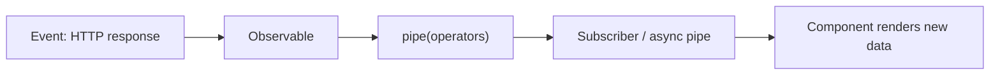
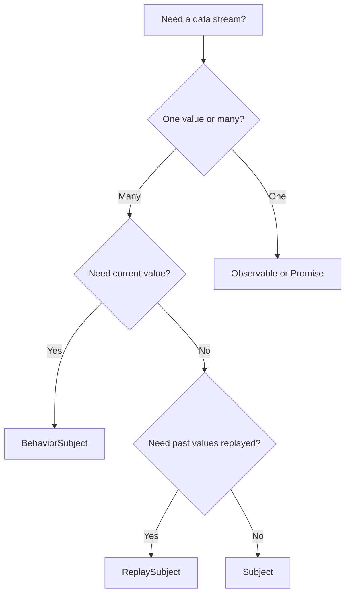
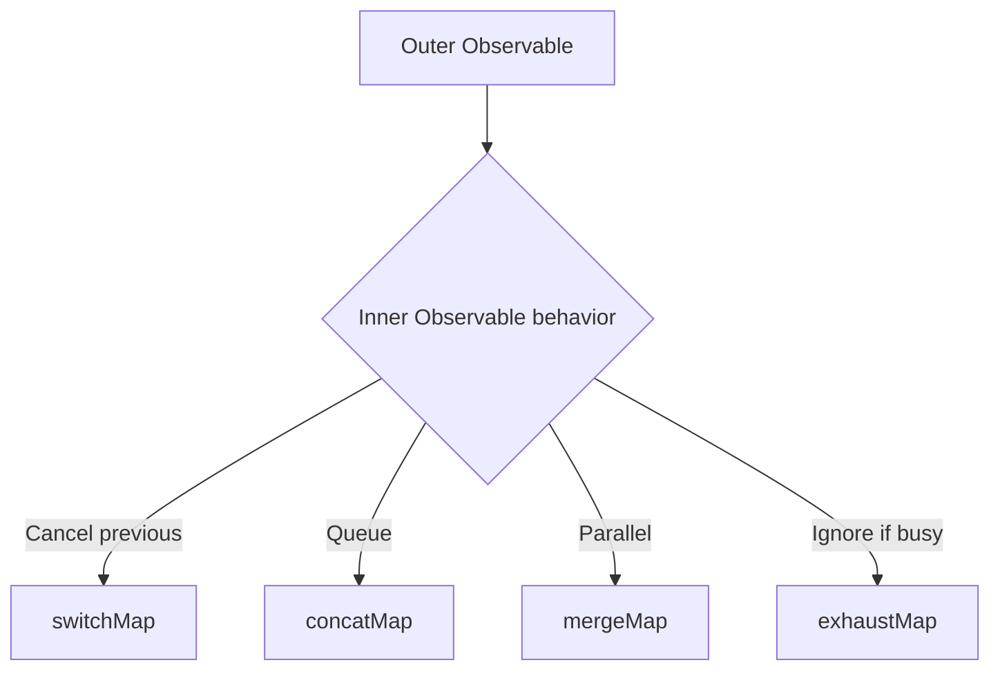

# RxJS in Angular

> [!summary] Goal
> Use RxJS effectively in Angular: understand Subjects, key operators, the async pipe, HTTP composition, error handling, and the interop with signals.

## Table of Contents

1. [Why RxJS Matters](#why-rxjs-matters)
2. [Observable and Subject Types](#observable-and-subject-types)
3. [Creation Functions](#creation-functions)
4. [Key Operators](#key-operators)
5. [Higher-Order Mapping Operators](#higher-order-mapping-operators)
6. [Error Handling Operators](#error-handling-operators)
7. [`async` Pipe](#async-pipe)
8. [Hot vs Cold Observables](#hot-vs-cold-observables)
9. [Signals Interop](#signals-interop)
10. [Pitfalls](#pitfalls)

---

## Why RxJS Matters

RxJS is fundamental to Angular: `HttpClient`, `ActivatedRoute`, `FormControl.valueChanges`, and the router all use Observables.



---

## Observable and Subject Types

```typescript
// Observable — a data source you can subscribe to
const obs = new Observable<number>(subscriber => {
  subscriber.next(1);
  subscriber.next(2);
  subscriber.complete();
});

// Subject — an Observable that can also emit values
const subject = new Subject<string>();
subject.subscribe(v => console.log(v));
subject.next('hello');    // Logs: "hello"

// BehaviorSubject — always has a current value (starts with initial)
const behavior = new BehaviorSubject<number>(0);
behavior.subscribe(v => console.log(v)); // Logs: 0 (immediately)
behavior.next(1);                          // Logs: 1

// ReplaySubject — replays past values to new subscribers
const replay = new ReplaySubject<string>(2); // Buffer last 2 values
replay.next('a'); replay.next('b'); replay.next('c');
replay.subscribe(v => console.log(v));   // Logs: "b", "c"
```



---

## Creation Functions

```typescript
import { of, from, fromEvent, interval, timer, forkJoin, combineLatest, merge } from 'rxjs';

// Create from values
of(1, 2, 3).subscribe(v => console.log(v));        // 1, 2, 3
of({ id: 1, name: 'Alice' }).subscribe(user => ...);

// Create from array/promise
from([1, 2, 3]).subscribe(v => ...);                // 1, 2, 3
from(fetch('/api/data')).then(response => ...);

// DOM events
fromEvent(document, 'click').subscribe(event => ...);

// Time-based
interval(1000).subscribe(i => console.log(i));      // 0, 1, 2, ... every second
timer(3000).subscribe(() => console.log('3s passed'));  // fires once after 3s
timer(0, 1000).subscribe(i => ...);                 // like interval with immediate start

// Combine streams
forkJoin({ users: http.get('/users'), posts: http.get('/posts') })
  .subscribe(({ users, posts }) => ...);             // All must complete

combineLatest([http.get('/users'), http.get('/roles')])
  .subscribe(([users, roles]) => ...);               // Latest value from each

merge(source1$, source2$).subscribe(v => ...);       // Emit from either source
```

---

## Key Operators

```typescript
import { map, filter, debounceTime, distinctUntilChanged, take, takeUntil, skip, first, catchError, retry, tap } from 'rxjs/operators';

// map — transform each value
this.http.get<User[]>('/users').pipe(
  map(users => users.filter(u => u.isActive)),
  map(users => users.map(u => u.name)),
);

// filter — let through values that pass a test
from([1, 2, 3, 4, 5]).pipe(
  filter(n => n % 2 === 0),   // 2, 4
);

// debounceTime — wait for pause before emitting
searchInput.valueChanges.pipe(
  debounceTime(300),           // Wait 300ms after last keystroke
  distinctUntilChanged(),       // Don't emit same value twice
  switchMap(query => this.http.get(`/search?q=${query}`)),
);

// take — take N values then complete
interval(1000).pipe(take(5)).subscribe(v => console.log(v)); // 0, 1, 2, 3, 4

// takeUntil — keep going until another observable emits
interval(1000).pipe(
  takeUntil(this.destroy$),    // Unsubscribe when component destroys
).subscribe(v => console.log(v));

// tap — side effect (logging, debugging)
this.http.get('/data').pipe(
  tap(data => console.log('fetched', data)),
  catchError(err => {
    console.error('error', err);
    return of([]);              // Return fallback
  }),
);
```

---

## Higher-Order Mapping Operators

These operators map each emitted value to an inner Observable and subscribe to it — essential for HTTP composition.



```typescript
// switchMap — cancel previous inner observable when new one emits
// Best for: typeahead search, autocomplete
searchInput.valueChanges.pipe(
  debounceTime(300),
  switchMap(query => this.http.get(`/api/search?q=${query}`)),
  // Previous HTTP request is cancelled when a new keystroke arrives
);

// concatMap — queue inner observables, execute in order
// Best for: sequential API calls, save order
from(ids).pipe(
  concatMap(id => this.http.delete(`/api/users/${id}`)),
  // Deletions happen one at a time, in order
);

// mergeMap (flatMap) — execute all inner observables in parallel
// Best for: independent parallel API calls
from(urls).pipe(
  mergeMap(url => this.http.get(url)),
  // All HTTP calls fire in parallel
);

// exhaustMap — ignore new emissions while inner observable is active
// Best for: prevent duplicate clicks, refresh tokens
submitButton.clicks.pipe(
  exhaustMap(() => this.http.post('/api/order', order)),
  // Additional clicks while saving are ignored
);
```

---

## Error Handling Operators

```typescript
import { catchError, retry, retryWhen, throwError } from 'rxjs';

// catchError — catch and handle/replace the error
this.http.get('/data').pipe(
  catchError(err => {
    console.error('Request failed', err);
    return of([]);                          // Return fallback data
  }),
);

// retry — retry failed requests
this.http.get('/data').pipe(
  retry(3),                                  // Retry up to 3 times
  catchError(err => of(fallbackData)),
);

// retry with delay
this.http.get('/data').pipe(
  retryWhen(errors =>
    errors.pipe(
      delay(1000),                           // Wait 1s between retries
      take(3),                               // Max 3 retries
      tap(() => console.log('retrying...')),
    )
  ),
);
```

---

## `async` Pipe

The `async` pipe subscribes to an Observable automatically and marks the component for change detection on each emission:

```typescript
@Component({
  template: `
    <!-- async pipe subscribes and unsubscribes automatically -->
    <div *ngIf="user$ | async as user">
      {{ user.name }} ({{ user.email }})
    </div>

    <!-- Multiple observables -->
    <div *ngIf="{
      user: user$ | async,
      orders: orders$ | async
    } as data">
      {{ data.user?.name }} has {{ data.orders?.length }} orders
    </div>
  `,
})
export class UserComponent {
  private http = inject(HttpClient);
  private route = inject(ActivatedRoute);

  user$ = this.route.paramMap.pipe(
    switchMap(params => this.http.get<User>(`/api/users/${params.get('id')}`)),
    shareReplay(1),
  );
}
```

**Why use `async` pipe:**
- Automatic subscription/unsubscription (no memory leaks)
- Triggers change detection automatically
- Works seamlessly with `OnPush` strategy

---

## Hot vs Cold Observables

```typescript
// COLD — each subscriber gets its own execution (HTTP, from, of)
const cold$ = http.get('/api/users');
cold$.subscribe(a => console.log(a));  // Makes HTTP request
cold$.subscribe(b => console.log(b));  // Makes ANOTHER HTTP request

// HOT — the execution is shared (Subject, fromEvent, shareReplay)
const hot$ = new BehaviorSubject('initial');
hot$.subscribe(a => console.log('A:', a));  // A: initial
hot$.next('update');                          // A: update

// Making a cold observable hot with shareReplay
const shared$ = http.get('/api/users').pipe(
  shareReplay(1),     // Cache last value, share with all subscribers
);
shared$.subscribe(a => console.log(a));  // Shares the same HTTP call
shared$.subscribe(b => console.log(b));  // Gets cached value, no new request
```

---

## Signals Interop

```typescript
import { toSignal, toObservable } from '@angular/core/rxjs-interop';

// Observable → Signal
const user = toSignal(http.get<User>('/api/me'));
// user() is User | undefined

// Signal → Observable
const searchTerm = signal('');
const results$ = toObservable(searchTerm).pipe(
  debounceTime(300),
  switchMap(term => http.get(`/api/search?q=${term}`)),
);
```

---

## Pitfalls

### Not unsubscribing

```typescript
// ❌ Memory leak — observable never completes
ngOnInit() { interval(1000).subscribe(v => console.log(v)); }
```

**Fix**: `takeUntilDestroyed` or manual unsubscribe in `ngOnDestroy`.

### Using `mergeMap` for sequential operations

```typescript
// ❌ Wrong order — mergeMap runs all in parallel
from(saveOrders).pipe(
  mergeMap(order => this.http.post('/api/orders', order)),
);
```

**Fix**: Use `concatMap` for sequential, `mergeMap` only for parallel.

### Using `switchMap` for saves

```typescript
// ❌ Dangerous — switchMap cancels previous save
submit$.pipe(
  switchMap(() => this.http.post('/api/orders', data)),
);
```

**Fix**: Use `exhaustMap` or `concatMap` for operations that must not be cancelled.

---

> [!question]- Interview Questions
>
> **Q: What is the difference between `Subject`, `BehaviorSubject`, and `ReplaySubject`?**
> A: `Subject` has no initial value and doesn't replay. `BehaviorSubject` requires an initial value and emits the current value to new subscribers. `ReplaySubject` replays a configurable number of past values.
>
> **Q: When would you use `switchMap` vs `mergeMap` vs `concatMap`?**
> A: `switchMap` for typeahead (cancel previous request). `mergeMap` for parallel independent requests. `concatMap` for sequential ordered requests. `exhaustMap` for ignore-while-busy patterns.
>
> **Q: What does the `async` pipe do?**
> A: It subscribes to an Observable, renders the latest value, marks the component for change detection on each emission, and automatically unsubscribes when the component is destroyed.

---

## Cross-Links

- [[Angular/02_Core/04_HttpClient_and_Interceptors]] for HTTP operator usage
- [[Angular/02_Core/02_Signals_Essentials]] for toSignal / toObservable
- [[Angular/02_Core/05_Forms_Template_vs_Reactive]] for Form control observables
