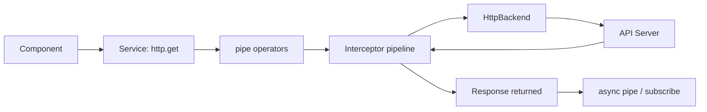
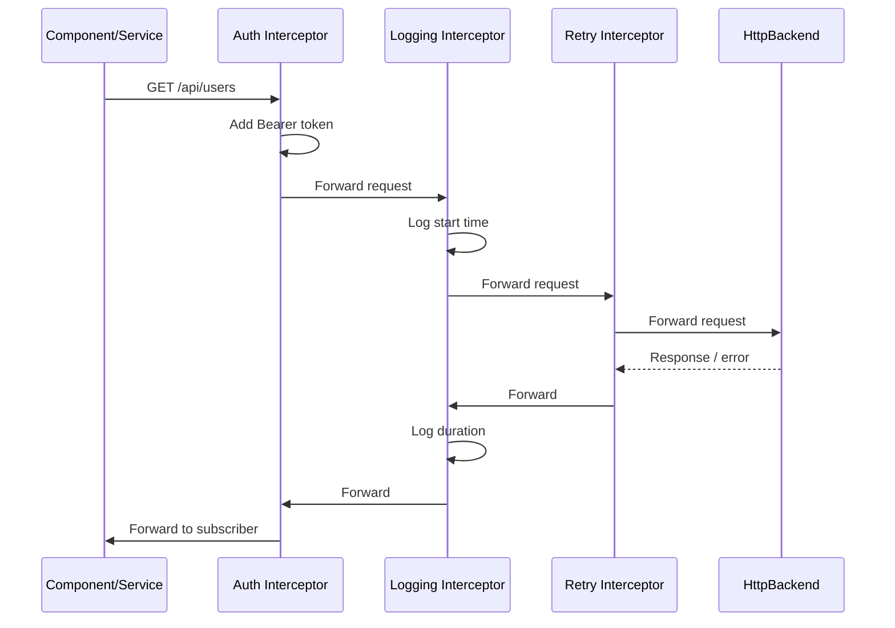

# HttpClient and Interceptors

> [!summary] Goal
> Make HTTP calls consistently: configure the client, use typed requests, handle errors, and use interceptors for cross-cutting concerns like auth and logging.

## Table of Contents

1. [Why HttpClient Matters](#why-httpclient-matters)
2. [Setting Up `provideHttpClient`](#setting-up-providehttpclient)
3. [Making Requests](#making-requests)
4. [Request Configuration](#request-configuration)
5. [Functional Interceptors](#functional-interceptors)
6. [Error Handling](#error-handling)
7. [Upload Progress](#upload-progress)
8. [Testing](#testing)
9. [Pitfalls](#pitfalls)

---

## Why HttpClient Matters

`HttpClient` is Angular's HTTP client built on RxJS. Every request returns an `Observable` — composable with operators, cancellable, and integrable with `async` pipe.



---

## Setting Up `provideHttpClient`

```typescript
// app.config.ts
import { provideHttpClient, withFetch, withInterceptors, withInterceptorsFromDi } from '@angular/common/http';

export const appConfig: ApplicationConfig = {
  providers: [
    provideHttpClient(
      withFetch(),                                    // Use fetch API instead of XHR
      withInterceptors([authInterceptor, loggingInterceptor]),  // Functional interceptors
    ),
  ],
};
```

| Feature | Description |
|---------|-------------|
| `withFetch()` | Use `fetch` API (smaller bundle, modern) |
| `withInterceptors([])` | Register functional interceptors |
| `withInterceptorsFromDi()` | Register class-based interceptors (`HTTP_INTERCEPTORS`) |
| `withJsonpSupport()` | Enable JSONP requests |
| `withRequestsMadeViaParent()` | Defer to parent injector's HTTP client |

---

## Making Requests

```typescript
import { HttpClient } from '@angular/common/http';

@Injectable({ providedIn: 'root' })
export class ApiService {
  private http = inject(HttpClient);

  // GET — fetch data
  getUsers(): Observable<User[]> {
    return this.http.get<User[]>('/api/users');
  }

  // GET with params
  getUsers(page: number, sort: string): Observable<PaginatedResponse<User>> {
    return this.http.get<PaginatedResponse<User>>('/api/users', {
      params: { page, sort },
    });
  }

  // POST — create resource
  createUser(user: CreateUserDto): Observable<User> {
    return this.http.post<User>('/api/users', user);
  }

  // PUT — update resource
  updateUser(id: number, user: UpdateUserDto): Observable<User> {
    return this.http.put<User>(`/api/users/${id}`, user);
  }

  // PATCH — partial update
  patchUser(id: number, changes: Partial<User>): Observable<User> {
    return this.http.patch<User>(`/api/users/${id}`, changes);
  }

  // DELETE — remove resource
  deleteUser(id: number): Observable<void> {
    return this.http.delete<void>(`/api/users/${id}`);
  }

  // Text response
  getText(): Observable<string> {
    return this.http.get('/api/health', { responseType: 'text' });
  }

  // Raw HTTP response with headers/status
  getWithFullResponse(): Observable<HttpResponse<User>> {
    return this.http.get<User>('/api/users/me', { observe: 'response' });
  }
}
```

---

## Request Configuration

```typescript
// Query parameters
this.http.get('/api/users', {
  params: {
    page: 2,
    sort: 'name',
    filter: JSON.stringify({ active: true }),
  },
});

// Using HttpParams
const params = new HttpParams()
  .set('page', '2')
  .set('sort', 'name')
  .set('filter', JSON.stringify({ active: true }));

// HttpHeaders
const headers = new HttpHeaders({
  'X-Correlation-Id': crypto.randomUUID(),
  'Accept': 'application/json',
});

// HttpContext — pass metadata to interceptors
import { HTTP_CONTEXT, HTTP_TOKEN } from './http-context';

this.http.get('/api/data', {
  context: new HttpContext().set(SKIP_AUTH, true),
});
```

---

## Functional Interceptors

```typescript
import { HttpInterceptorFn } from '@angular/common/http';
import { inject } from '@angular/core';

// Auth interceptor — adds token to every request
export const authInterceptor: HttpInterceptorFn = (req, next) => {
  const auth = inject(AuthService);
  const token = auth.getToken();

  if (token) {
    req = req.clone({
      setHeaders: { Authorization: `Bearer ${token}` },
    });
  }
  return next(req);
};

// Logging interceptor — logs every request
export const loggingInterceptor: HttpInterceptorFn = (req, next) => {
  const start = performance.now();
  return next(req).pipe(
    tap({
      next: () => console.log(`${req.method} ${req.url} — ${performance.now() - start}ms`),
      error: (err) => console.error(`${req.method} ${req.url} FAILED`, err),
    }),
  );
};

// Retry interceptor — retries on failure
export const retryInterceptor: HttpInterceptorFn = (req, next) => {
  if (req.method === 'GET') {
    return next(req).pipe(retry(2));
  }
  return next(req);
};

// Cache interceptor — skip if context says so
export const cacheInterceptor: HttpInterceptorFn = (req, next) => {
  if (req.context.get(SKIP_CACHE)) {
    return next(req);
  }
  // Cache logic...
  return next(req);
};
```



---

## Error Handling

```typescript
@Injectable({ providedIn: 'root' })
export class ApiService {
  private http = inject(HttpClient);

  getData(): Observable<Data> {
    return this.http.get<Data>('/api/data').pipe(
      catchError(this.handleError),
    );
  }

  private handleError(error: HttpErrorResponse): Observable<never> {
    let message = 'An unknown error occurred';

    if (error.error instanceof ErrorEvent) {
      // Client-side error
      message = `Network error: ${error.error.message}`;
    } else {
      // Server-side error
      message = `Server error (${error.status}): ${error.error?.message}`;
    }

    console.error(message);
    return throwError(() => new Error(message));
  }
}
```

### Progress events

```typescript
// Upload with progress
uploadFile(file: File): Observable<number> {
  const formData = new FormData();
  formData.append('file', file);

  return this.http.post('/api/upload', formData, {
    reportProgress: true,
    observe: 'events',
  }).pipe(
    filter(event => event.type === HttpEventType.UploadProgress),
    map(event => event as HttpUploadProgressEvent),
    map(event => Math.round(100 * event.loaded / event.total!)),
  );
}
```

---

## Testing

```typescript
import { provideHttpClientTesting, HttpTestingController } from '@angular/common/http/testing';

describe('ApiService', () => {
  let service: ApiService;
  let httpMock: HttpTestingController;

  beforeEach(() => {
    TestBed.configureTestingModule({
      providers: [
        ApiService,
        provideHttpClient(withInterceptors([authInterceptor])),
        provideHttpClientTesting(),
      ],
    });

    service = TestBed.inject(ApiService);
    httpMock = TestBed.inject(HttpTestingController);
  });

  afterEach(() => {
    httpMock.verify();  // Ensure no outstanding requests
  });

  it('should fetch users', () => {
    const mockUsers = [{ id: 1, name: 'Alice' }];

    service.getUsers().subscribe(users => {
      expect(users).toEqual(mockUsers);
    });

    const req = httpMock.expectOne('/api/users');
    expect(req.request.method).toBe('GET');
    req.flush(mockUsers);
  });
});
```

---

## Pitfalls

### Not handling errors

```typescript
// ❌ Unhandled error kills the observable stream
this.http.get('/api/data').subscribe(data => ...);
```

**Fix**: Add `catchError` in the pipe, or use an error interceptor.

### Forgetting to provide HttpClient

```typescript
// ❌ HttpClient injection fails
Error: NullInjectorError: No provider for HttpClient!
```

**Fix**: Add `provideHttpClient()` in the app config.

### Interceptor order matters

Interceptors run in the order they're registered. Auth must come before logging if you want to log the auth header.

```typescript
withInterceptors([authInterceptor, loggingInterceptor])
// authInterceptor adds the header FIRST, then loggingInterceptor logs it
```

---

> [!question]- Interview Questions
>
> **Q: How do you add an auth token to every HTTP request?**
> A: Create a functional interceptor (`HttpInterceptorFn`) that clones the request with `setHeaders: { Authorization: Bearer ${token} }`. Register it in `provideHttpClient(withInterceptors([authInterceptor]))`.
>
> **Q: What is the difference between `observe: 'body'`, `'response'`, and `'events'`?**
> A: `body` (default) returns the parsed response body. `response` returns the full `HttpResponse` with headers and status. `events` returns `HttpEvent` objects — useful for tracking upload/download progress.
>
> **Q: How do you test HTTP calls in Angular?**
> A: Use `provideHttpClientTesting()` and inject `HttpTestingController`. Call `expectOne(url)` to assert a request was made, then `flush(mockData)` to provide the response. Call `verify()` in `afterEach` to ensure no outstanding requests.

---

## Cross-Links

- [[Angular/02_Core/03_RxJS_in_Angular]] for RxJS operator usage
- [[Angular/04_Playbooks/03_HTTP_Interceptors_Auth_and_Retries]] for interceptor patterns
- [[Angular/02_Core/01_Standalone_Components]] for app config setup
