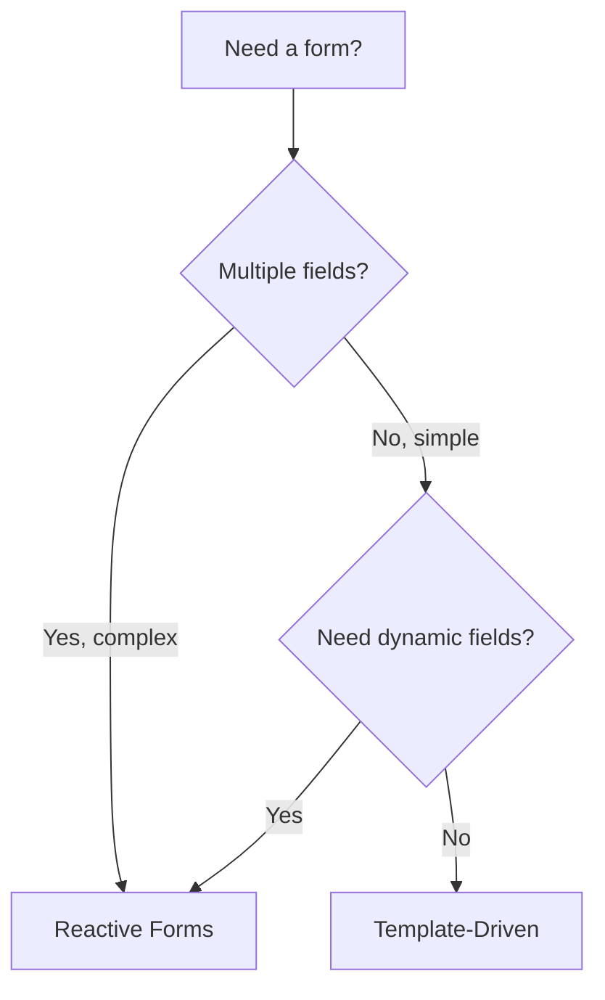

# Forms: Reactive vs Template-Driven

> [!summary] Goal
> Build complex forms with validation using Reactive Forms. Understand when to use template-driven vs reactive, how to handle dynamic fields, and how to create custom validators.

## Table of Contents

1. [Why Forms Matter](#why-forms-matter)
2. [Reactive vs Template-Driven](#reactive-vs-template-driven)
3. [Reactive Forms Setup](#reactive-forms-setup)
4. [FormBuilder and FormGroup](#formbuilder-and-formgroup)
5. [FormArray — Dynamic Fields](#formarray-dynamic-fields)
6. [Validation](#validation)
7. [`valueChanges` and `statusChanges`](#valuechanges-and-statuschanges)
8. [Custom Form Controls (ControlValueAccessor)](#custom-form-controls)
9. [Typed Forms](#typed-forms)
10. [Pitfalls](#pitfalls)

---

## Why Forms Matter

Angular provides two form approaches: **reactive** (programmatic, testable, scalable) and **template-driven** (simple, NgModel-based, less code for basic forms).

---

## Reactive vs Template-Driven

| Aspect | Reactive Forms | Template-Driven Forms |
|--------|---------------|----------------------|
| **Setup** | `FormGroup`, `FormControl` in component class | `ngModel` directives in template |
| **Module** | `ReactiveFormsModule` | `FormsModule` |
| **Validation** | Functions in TypeScript | Directives in template |
| **Testing** | Easy (plain TypeScript) | Needs TestBed |
| **Dynamic fields** | `FormArray`, `addControl` | Difficult |
| **Async validation** | Built-in `AsyncValidatorFn` | Custom directive needed |
| **Form model** | Explicit (defined in code) | Implicit (generated from template) |
| **When to use** | Complex forms, dynamic fields, testing | Simple login, search forms |



---

## Reactive Forms Setup

### How reactive forms work at runtime

```mermaid
sequenceDiagram
    participant T as Template (HTML)
    participant F as FormGroup
    participant C as Component
    participant V as Validator
    participant API as Backend

    T->>F: User types in <input formControlName="email">
    F->>F: Updates internal value
    F->>V: Run sync validators
    F->>C: valueChanges emits
    C->>C: debounceTime(300)
    C->>API: Check email availability
    API-->>C: "Already taken"
    C->>F: setErrors({emailTaken: true})
    F->>T: Shows error message
    Note over T: status: 'INVALID', errors: { emailTaken: true }
```



```typescript
import { ReactiveFormsModule } from '@angular/forms';

@Component({
  selector: 'app-login',
  standalone: true,
  imports: [ReactiveFormsModule],     // Required for reactive forms
  template: `
    <form [formGroup]="loginForm" (ngSubmit)="onSubmit()">
      <label>
        Email:
        <input formControlName="email" type="email" />
        <span *ngIf="email?.invalid && email?.touched" class="error">
          Valid email is required
        </span>
      </label>

      <label>
        Password:
        <input formControlName="password" type="password" />
      </label>

      <button type="submit" [disabled]="loginForm.invalid">
        Sign In
      </button>
    </form>
  `,
})
export class LoginComponent {
  loginForm = new FormGroup({
    email: new FormControl('', { validators: [Validators.required, Validators.email] }),
    password: new FormControl('', { validators: [Validators.required, Validators.minLength(8)] }),
  });

  get email() { return this.loginForm.get('email'); }

  onSubmit() {
    if (this.loginForm.valid) {
      console.log(this.loginForm.value);
    }
  }
}
```

---

## FormBuilder and FormGroup

`FormBuilder` is a DI service that reduces boilerplate:

```typescript
@Component({ ... })
export class ProfileComponent {
  private fb = inject(FormBuilder);

  profileForm = this.fb.group({
    name: ['', [Validators.required, Validators.minLength(2)]],
    email: ['', [Validators.required, Validators.email]],
    address: this.fb.group({                  // Nested FormGroup
      street: [''],
      city: ['', Validators.required],
      zip: ['', [Validators.required, Validators.pattern(/^\d{5}$/)]],
    }),
    notifications: this.fb.array([            // FormArray
      this.fb.control('email'),
    ]),
  });

  updateProfile() {
    if (this.profileForm.invalid) return;

    // Mark all controls as touched to show validation errors
    this.profileForm.markAllAsTouched();

    // patchValue — update specific fields
    this.profileForm.patchValue({ name: 'New Name' });

    // setValue — must provide ALL fields
    this.profileForm.setValue({ name: 'Alice', email: 'a@b.com', ... });
  }

  // Reset form
  resetForm() {
    this.profileForm.reset({ name: '', email: '' });
  }
}
```

### setValue vs patchValue

| Method | Requires | Behavior |
|--------|----------|----------|
| `setValue(value)` | All fields | Replaces the entire form value |
| `patchValue(value)` | Partial | Merges with existing values |

---

## FormArray — Dynamic Fields

```typescript
@Component({ template: `
  <div formArrayName="items">
    <div *ngFor="let item of items.controls; let i = index" [formGroupName]="i">
      <input formControlName="name" placeholder="Item name" />
      <input formControlName="quantity" type="number" />
      <button (click)="removeItem(i)">Remove</button>
    </div>
  </div>
  <button (click)="addItem()">Add Item</button>
`})
export class OrderFormComponent {
  private fb = inject(FormBuilder);

  orderForm = this.fb.group({
    customer: ['', Validators.required],
    items: this.fb.array<FormGroup<ItemForm>>([]),
  });

  get items() {
    return this.orderForm.get('items') as FormArray;
  }

  addItem() {
    const itemForm = this.fb.group({
      name: ['', Validators.required],
      quantity: [1, [Validators.required, Validators.min(1)]],
    });
    this.items.push(itemForm);
  }

  removeItem(index: number) {
    this.items.removeAt(index);
  }

  clearItems() {
    this.items.clear();
  }
}

interface ItemForm {
  name: FormControl<string | null>;
  quantity: FormControl<number | null>;
}
```

---

## Validation

### Built-in validators

```typescript
import { Validators } from '@angular/forms';

// Single validator
const name = new FormControl('', Validators.required);

// Multiple validators
const email = new FormControl('', [Validators.required, Validators.email]);
const age = new FormControl('', [Validators.min(18), Validators.max(120)]);
const zip = new FormControl('', Validators.pattern(/^\d{5}$/));
```

### Custom synchronous validator

```typescript
import { AbstractControl, ValidationErrors, ValidatorFn } from '@angular/forms';

export function forbiddenNameValidator(name: string): ValidatorFn {
  return (control: AbstractControl): ValidationErrors | null => {
    const forbidden = control.value?.toLowerCase() === name.toLowerCase();
    return forbidden ? { forbiddenName: { value: control.value } } : null;
  };
}

// Usage
this.form = this.fb.group({
  username: ['', [Validators.required, forbiddenNameValidator('admin')]],
});
```

### Cross-field validation

```typescript
export function passwordsMatchValidator(): ValidatorFn {
  return (group: AbstractControl): ValidationErrors | null => {
    const password = group.get('password')?.value;
    const confirm = group.get('confirmPassword')?.value;
    return password === confirm ? null : { passwordsMismatch: true };
  };
}

// Add validators to the FormGroup level
this.form = this.fb.group({
  password: ['', Validators.required],
  confirmPassword: ['', Validators.required],
}, { validators: passwordsMatchValidator() });
```

### Async validator

```typescript
import { AsyncValidatorFn } from '@angular/forms';

export function uniqueEmailValidator(userService: UserService): AsyncValidatorFn {
  return (control: AbstractControl) => {
    return userService.checkEmail(control.value).pipe(
      map(isTaken => (isTaken ? { emailTaken: true } : null)),
      catchError(() => of(null)),
    );
  };
}

// Usage
this.form = this.fb.group({
  email: ['', {
    validators: [Validators.required, Validators.email],
    asyncValidators: [uniqueEmailValidator(this.userService)],
    updateOn: 'blur',           // Validate on blur, not on every keystroke
  }],
});
```

---

## `valueChanges` and `statusChanges`

```typescript
@Component({ ... })
export class SearchFormComponent {
  private fb = inject(FormBuilder);

  searchForm = this.fb.group({
    query: ['', Validators.minLength(2)],
    category: ['all'],
  });

  // React to value changes
  private destroyRef = inject(DestroyRef);

  constructor() {
    this.searchForm.valueChanges.pipe(
      debounceTime(300),
      takeUntilDestroyed(this.destroyRef),
    ).subscribe(values => {
      // values === { query: string, category: string }
      this.onSearch(values);
    });

    // React to status changes (VALID, INVALID, PENDING)
    this.searchForm.statusChanges.pipe(
      filter(status => status === 'VALID'),
      takeUntilDestroyed(this.destroyRef),
    ).subscribe(() => {
      console.log('Form is valid!');
    });
  }
}
```

---

## Custom Form Controls (ControlValueAccessor)

```typescript
@Component({
  selector: 'app-star-rating',
  template: `
    <div class="stars">
      <span *ngFor="let star of [1,2,3,4,5]; let i = index"
        (click)="setRating(i + 1)"
        [class.filled]="i < value">
        ★
      </span>
    </div>
  `,
  providers: [{
    provide: NG_VALUE_ACCESSOR,
    useExisting: StarRatingComponent,
    multi: true,
  }],
})
export class StarRatingComponent implements ControlValueAccessor {
  value = 0;
  disabled = false;

  onChange: any = () => {};
  onTouched: any = () => {};

  setRating(val: number) {
    if (!this.disabled) {
      this.value = val;
      this.onChange(val);
      this.onTouched();
    }
  }

  // ControlValueAccessor methods
  writeValue(val: number): void { this.value = val; }
  registerOnChange(fn: any): void { this.onChange = fn; }
  registerOnTouched(fn: any): void { this.onTouched = fn; }
  setDisabledState(isDisabled: boolean): void { this.disabled = isDisabled; }
}
```

```html
<!-- Usage — works with formControlName just like native inputs -->
<form [formGroup]="reviewForm">
  <app-star-rating formControlName="rating" />
</form>
```

---

## Typed Forms (Angular 14+)

```typescript
import { FormControl, FormGroup } from '@angular/forms';

interface LoginForm {
  email: FormControl<string | null>;
  password: FormControl<string | null>;
}

const login = new FormGroup<LoginForm>({
  email: new FormControl('', [Validators.required, Validators.email]),
  password: new FormControl('', Validators.required),
});

// NonNullableFormBuilder — controls never emit null
const nnfb = inject(NonNullableFormBuilder);
const form = nnfb.group({
  name: 'Alice',              // FormControl<string>
  age: 30,                    // FormControl<number>
});
```

---

## Pitfalls

### `markAllAsTouched` before checking validity

```typescript
if (this.form.invalid) {
  this.form.markAllAsTouched();  // Show errors on all fields
  return;
}
```

### Not resetting FormArray after submit

After submission, `this.orderForm.reset()` doesn't clear the FormArray items.

**Fix**: Call `this.items.clear()` then `this.orderForm.reset()`.

### Async validators cause `PENDING` status

While an async validator is running, the form status is `PENDING`. Buttons should handle this:

```html
<button [disabled]="form.invalid || form.pending">Submit</button>
```

---

> [!question]- Interview Questions
>
> **Q: What is the difference between reactive and template-driven forms?**
> A: Reactive forms define the form model explicitly in TypeScript — better for complex validation, dynamic fields, and testing. Template-driven forms define the model implicitly via `ngModel` directives — simpler for basic forms.
>
> **Q: How do you create a dynamic list of form controls?**
> A: Use `FormArray`. Add controls with `push(control)`, remove with `removeAt(index)`. Iterate with `*ngFor` over `formArray.controls`.
>
> **Q: What is `ControlValueAccessor`?**
> A: An interface that lets a custom component work with Angular forms like a native input. Implement `writeValue`, `registerOnChange`, `registerOnTouched`, and optionally `setDisabledState`. Provide it via `NG_VALUE_ACCESSOR`.

---

## Cross-Links

- [[Angular/02_Core/03_RxJS_in_Angular]] for valueChanges/debounceTime patterns
- [[Angular/05_Projects/02_Forms_Heavy_App_Reactive_Forms]] for multi-step form project
- [[Angular/03_Advanced/01_Change_Detection_and_Performance]] for OnPush with forms
