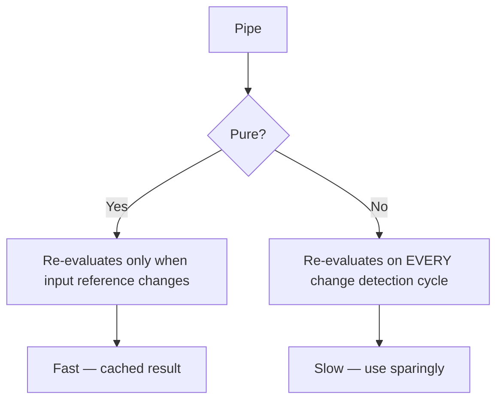
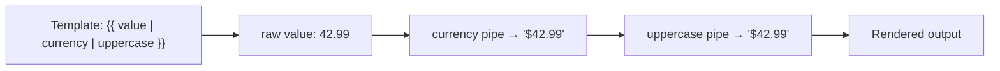

# Pipes: Built-In and Custom

> [!summary] Goal
> Transform data in templates using built-in pipes and create custom pipes for reusable formatting.

## Table of Contents

1. [Why Pipes Matter](#why-pipes-matter)
2. [Built-in Pipes Reference](#built-in-pipes-reference)
3. [Custom Pipes](#custom-pipes)
4. [Pure vs Impure Pipes](#pure-vs-impure-pipes)
5. [Pipe Composition](#pipe-composition)
6. [Pitfalls](#pitfalls)

---

## Why Pipes Matter

Pipes transform values in templates. They're the Angular alternative to computed properties — concise, reusable, and testable.

```html
<p>{{ user.createdAt | date:'medium' }}</p>
<p>{{ product.price | currency:'USD' }}</p>
<p>{{ user.role | uppercase }}</p>
```

---

## Built-in Pipes Reference

```html
<!-- Date formats -->
<p>{{ today | date }}</p>                     <!-- May 3, 2026 -->
<p>{{ today | date:'medium' }}</p>             <!-- May 3, 2026, 2:30:00 PM -->
<p>{{ today | date:'short' }}</p>              <!-- 5/3/26, 2:30 PM -->
<p>{{ today | date:'yyyy-MM-dd' }}</p>         <!-- 2026-05-03 -->

<!-- Currency -->
<p>{{ price | currency }}</p>                  <!-- $42.99 -->
<p>{{ price | currency:'EUR' }}</p>            <!-- €42.99 -->
<p>{{ price | currency:'EUR':'symbol':'1.2-2' }}</p>

<!-- Number/Decimal -->
<p>{{ 3.14159 | number }}</p>                  <!-- 3.142 -->
<p>{{ 3.14159 | number:'1.2-2' }}</p>          <!-- 3.14 -->
<p>{{ 0.5 | percent }}</p>                     <!-- 50% -->

<!-- Text -->
<p>{{ 'hello world' | uppercase }}</p>         <!-- HELLO WORLD -->
<p>{{ 'HELLO WORLD' | lowercase }}</p>         <!-- hello world -->
<p>{{ 'hello world' | titlecase }}</p>         <!-- Hello World -->

<!-- Object -->
<pre>{{ user | json }}</pre>                   <!-- {"id":1,"name":"Alice"} -->

<!-- Array -->
<p>{{ items | slice:0:2 | json }}</p>          <!-- First 2 items -->

<!-- Key/Value -->
<div *ngFor="let item of object | keyvalue">
  {{ item.key }}: {{ item.value }}
</div>

<!-- i18n Plural -->
<p>{{ messages.length | i18nPlural:messageMapping }}</p>

<!-- i18n Select -->
<p>{{ gender | i18nSelect:genderMapping }}</p>

<!-- Async — subscribes to Observable and updates on emission -->
<p>{{ stream$ | async }}</p>
<p *ngIf="data$ | async as data">{{ data.name }}</p>
```

| Pipe | Purpose | Usage |
|------|---------|-------|
| `date` | Format dates | `date:'medium'`, `date:'yyyy-MM-dd'` |
| `currency` | Format currency | `currency:'EUR':'symbol'` |
| `number` | Format numbers | `number:'1.2-2'` |
| `percent` | Format percentages | `percent:'1.0-2'` |
| `uppercase` | Convert to uppercase | — |
| `lowercase` | Convert to lowercase | — |
| `titlecase` | Capitalize words | — |
| `json` | JSON.stringify | Debugging |
| `slice` | Slice arrays/strings | `slice:0:10` |
| `keyvalue` | Object to key-value pairs | `*ngFor="let item of obj \| keyvalue"` |
| `async` | Subscribe to Observables | Auto-unsubscribe |
| `i18nPlural` | Plural rules | Internationalization |
| `i18nSelect` | Gender/select mapping | Internationalization |

---

## Custom Pipes

```typescript
import { Pipe, PipeTransform } from '@angular/core';

@Pipe({
  name: 'truncate',
  standalone: true,
})
export class TruncatePipe implements PipeTransform {
  transform(value: string, maxLength = 20, suffix = '...'): string {
    if (!value) return '';
    if (value.length <= maxLength) return value;
    return value.slice(0, maxLength) + suffix;
  }
}
```

```html
<!-- Usage -->
<p>{{ longText | truncate }}</p>             <!-- Default: 20 chars -->
<p>{{ longText | truncate:50 }}</p>          <!-- 50 chars -->
<p>{{ longText | truncate:30:'…' }}</p>      <!-- Custom suffix -->
```

### Pipe with dependency injection

```typescript
import { Pipe, PipeTransform, inject } from '@angular/core';

@Pipe({
  name: 'countryName',
  standalone: true,
})
export class CountryNamePipe implements PipeTransform {
  private http = inject(HttpClient);  // ❌ Not recommended — avoid DI in pipes

  transform(code: string): string {
    // Prefer a pure transformation without DI
    const countries: Record<string, string> = {
      US: 'United States',
      GB: 'United Kingdom',
      DE: 'Germany',
    };
    return countries[code] ?? code;
  }
}
```

### Pipe with arguments

```typescript
@Pipe({ name: 'filter', standalone: true })
export class FilterPipe implements PipeTransform {
  transform<T>(items: T[], searchFn: (item: T) => boolean): T[] {
    return items.filter(searchFn);
  }
}
```

```html
<!-- Usage — passing a function reference -->
<div *ngFor="let user of users | filter: activeFilter">
  {{ user.name }}
</div>
```

---

## Pure vs Impure Pipes

```typescript
// Pure pipe (default) — only re-evaluates when input reference changes
@Pipe({
  name: 'purePipe',
  pure: true,       // default
})
export class PurePipe implements PipeTransform { ... }

// Impure pipe — re-evaluates on every change detection cycle
@Pipe({
  name: 'impurePipe',
  pure: false,
})
export class ImpurePipe implements PipeTransform { ... }
```



| Aspect | Pure pipe | Impure pipe |
|--------|-----------|-------------|
| **When it runs** | On input reference change | Every change detection cycle |
| **Performance** | Fast (cached) | Slow — use only when necessary |
| **Default** | ✅ Yes | ❌ Must set `pure: false` |
| **When to use** | String/number/immutable transformations | Array filtering (where you mutate the array) |

**When to use impure pipes:** Almost never. For filtering/sorting collections, compute the result in the component class instead.

---

## Pipe Composition

```html
<!-- Pipes chain left to right -->
<p>{{ value | currency | uppercase }}</p>
<!-- First: currency pipe formats the number
     Then: uppercase pipe converts the result -->

<p>{{ date | date:'fullDate' | uppercase }}</p>
<!-- "WEDNESDAY, MAY 3, 2026" -->

<!-- async + other pipes -->
<p>{{ stream$ | async | json }}</p>
```

---

## Pipe Composition

```html
<!-- Pipes chain left to right -->
<p>{{ value | currency | uppercase }}</p>
<!-- First: currency pipe formats the number
     Then: uppercase pipe converts the result -->

<p>{{ date | date:'fullDate' | uppercase }}</p>
<!-- "WEDNESDAY, MAY 3, 2026" -->

<!-- async + other pipes -->
<p>{{ stream$ | async | json }}</p>
```



---

## Pitfalls

### Pipes re-evaluate for every change detection

An impure pipe that filters a large array runs on every change detection — causing performance issues.

**Fix**: Use `pure: true` and ensure the array reference changes when data changes. For filtering, compute in the component.

### Pipes with expensive computation

```typescript
// ❌ Bad: computed on every change detection (even if input hasn't changed)
transform(items: HeavyItem[]) { /* heavy computation */ }
```

**Fix**: Keep transformations light in pipes. Use component methods or NgRx selectors for heavy work.

### Missing `standalone: true`

In standalone projects, custom pipes must have `standalone: true` and be imported in the component's `imports` array.

---

> [!question]- Interview Questions
>
> **Q: What is the difference between a pure and an impure pipe?**
> A: Pure pipes re-evaluate only when the input reference changes — fast and cached. Impure pipes re-evaluate on every change detection cycle — slower, use sparingly. Pipes are pure by default.
>
> **Q: How do you create a custom pipe with parameters?**
> A: Implement `PipeTransform` with a `transform(value, ...args)` method. Add parameters after the pipe name in the template: `{{ value | pipeName:arg1:arg2 }}`.
>
> **Q: What is the `async` pipe and why is it recommended?**
> A: The `async` pipe subscribes to an Observable, renders its latest value, and automatically unsubscribes when the component is destroyed. It also triggers change detection on each emission — making it the safest way to use Observables in templates.

---

## Cross-Links

- [[Angular/02_Core/03_RxJS_in_Angular]] for the async pipe
- [[Angular/02_Core/02_Signals_Essentials]] for signal-based data transformation
- [[Angular/02_Core/01_Standalone_Components]] for importing pipes
