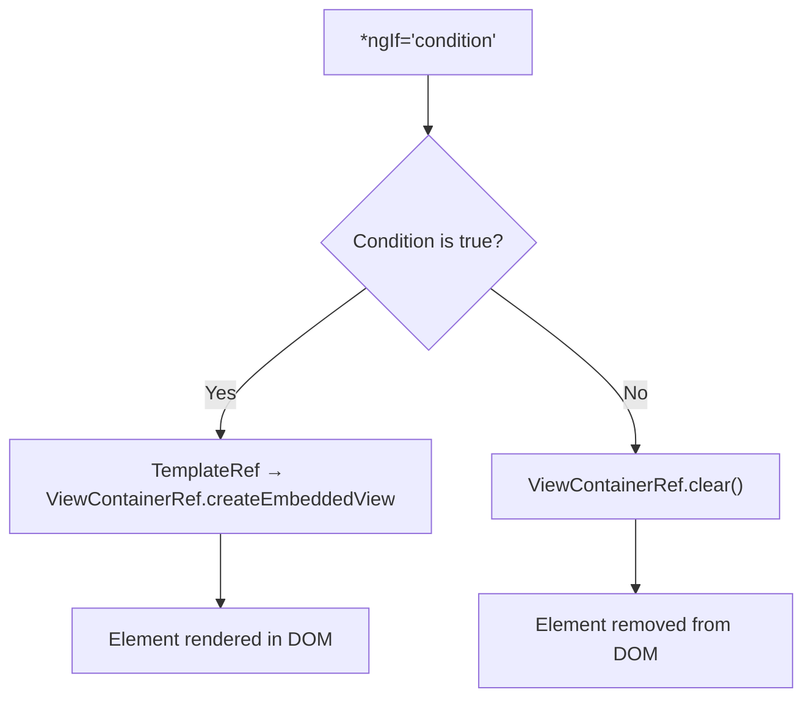
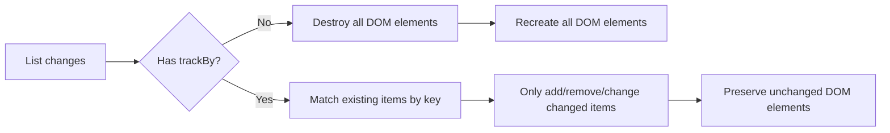

# Directives: Structural and Attribute

> [!summary] Goal
> Use built-in structural and attribute directives and create custom directives for reusable DOM behavior.

## Table of Contents

1. [Why Directives Matter](#why-directives-matter)
2. [Attribute Directives](#attribute-directives)
3. [Structural Directives](#structural-directives)
4. [Custom Structural Directive](#custom-structural-directive)
5. [`trackBy` for Performance](#trackby-for-performance)
6. [Pitfalls](#pitfalls)

---

## Why Directives Matter

Directives add behavior to existing DOM elements. **Attribute directives** change appearance or behavior. **Structural directives** add/remove elements from the DOM.

---

## Attribute Directives

Attribute directives change the appearance or behavior of an element without adding/removing it:

```typescript
import { Directive, ElementRef, HostListener, HostBinding, Input } from '@angular/core';

@Directive({
  selector: '[appHighlight]',
  standalone: true,
})
export class HighlightDirective {
  @Input() appHighlight = 'yellow';  // Default highlight color

  // Bind to the host element's style
  @HostBinding('style.backgroundColor') bgColor?: string;

  // Listen to events on the host element
  @HostListener('mouseenter') onMouseEnter() {
    this.bgColor = this.appHighlight;
  }

  @HostListener('mouseleave') onMouseLeave() {
    this.bgColor = undefined;
  }
}
```

```html
<!-- Usage -->
<p appHighlight>Default yellow highlight</p>
<p appHighlight="lightblue">Blue highlight</p>
```

### Built-in attribute directives

```html
<!-- ngClass — dynamic CSS classes -->
<div [ngClass]="{
  active: isActive,
  disabled: !isEnabled,
  highlighted: isHighlighted
}">...</div>

<!-- ngStyle — dynamic inline styles -->
<div [ngStyle]="{
  color: textColor,
  'font-size': fontSize + 'px',
  'background-color': bgColor
}">...</div>
```

---

## Structural Directives

Structural directives add/remove elements from the DOM. They start with `*` — Angular's microsyntax shorthand.

### `*ngIf`

```html
<!-- Basic condition -->
<div *ngIf="isLoggedIn">Welcome back!</div>

<!-- With else block -->
<div *ngIf="isLoggedIn; else loginPrompt">Welcome back!</div>
<ng-template #loginPrompt>Please sign in.</ng-template>

<!-- With then and else -->
<div *ngIf="isLoggedIn; then welcome; else loginPrompt"></div>
<ng-template #welcome>Welcome!</ng-template>
<ng-template #loginPrompt>Please sign in.</ng-template>
```

### `*ngFor`

```html
<!-- Basic iteration -->
<div *ngFor="let user of users">{{ user.name }}</div>

<!-- With local variables -->
<div *ngFor="let user of users; trackBy: trackFn; index as i; first as f; last as l; even as e; odd as o">
  {{ i }}: {{ user.name }} <span *ngIf="f">(first)</span>
</div>
```

### `*ngSwitch`

```html
<div [ngSwitch]="status">
  <p *ngSwitchCase="'loading'">Loading...</p>
  <p *ngSwitchCase="'success'">Data loaded</p>
  <p *ngSwitchCase="'error'">Error occurred</p>
  <p *ngSwitchDefault>Unknown status</p>
</div>
```

---

## Custom Structural Directive

Structural directives use `TemplateRef` and `ViewContainerRef`:

```typescript
import { Directive, Input, TemplateRef, ViewContainerRef } from '@angular/core';

@Directive({
  selector: '[appHasPermission]',
  standalone: true,
})
export class HasPermissionDirective {
  private templateRef = inject(TemplateRef<any>);
  private viewContainer = inject(ViewContainerRef);

  @Input() set appHasPermission(permission: string) {
    const userPermissions = ['admin', 'editor'];
    if (userPermissions.includes(permission)) {
      this.viewContainer.createEmbeddedView(this.templateRef);
    } else {
      this.viewContainer.clear();
    }
  }
}
```

```html
<!-- Usage -->
<div *appHasPermission="'admin'">Admin content — only visible to admins</div>
```

### How structural directives work



---

## `trackBy` for Performance

`trackBy` tells Angular how to identify items in a list — preventing unnecessary DOM operations:

```typescript
@Component({ template: `
  <div *ngFor="let user of users; trackBy: trackByUserId">
    {{ user.name }}
  </div>
`})
export class UserListComponent {
  trackByUserId(index: number, user: User): number {
    return user.id;  // Unique identifier
  }
}
```



---

## Pitfalls

### Multiple structural directives on the same element

```html
<!-- ❌ Error: Can't have multiple structural directives -->
<div *ngIf="visible" *ngFor="let item of items">...</div>
```

**Fix**: Use `<ng-container>` to wrap one of them:

```html
<ng-container *ngFor="let item of items">
  <div *ngIf="visible">{{ item }}</div>
</ng-container>
```

### `trackBy` not set for large lists

Without `trackBy`, Angular destroys and recreates ALL list items on every change — causing performance issues in large lists.

**Fix**: Always set `trackBy` for lists that can change after initial render.

### `[ngClass]` and `[class.*]` conflicts

When both `[ngClass]` and `[class.active]` set the same class, `[class.active]` wins.

---

> [!question]- Interview Questions
>
> **Q: What is the difference between attribute and structural directives?**
> A: Attribute directives change the appearance or behavior of elements (e.g., ngClass, ngStyle). Structural directives add/remove elements from the DOM (e.g., ngIf, ngFor).
>
> **Q: How does `*ngFor` with `trackBy` improve performance?**
> A: `trackBy` provides a unique identifier for each item. When the list changes, Angular reuses existing DOM elements for items that didn't change, instead of destroying and recreating them.
>
> **Q: How do structural directives work internally?**
> A: The `*` prefix is syntactic sugar. Angular converts `*ngIf="condition"` to `<ng-template [ngIf]="condition">` with `TemplateRef` and `ViewContainerRef` controlling when the embedded view is created or destroyed.

---

## Cross-Links

- [[Angular/01_Foundations/02_Components_Templates_and_Data_Binding]] for template bindings
- [[Angular/02_Core/05_Forms_Template_vs_Reactive]] for ngModel directive
- [[Angular/01_Foundations/03_DI_Services_and_Providers]] for DI in directives
