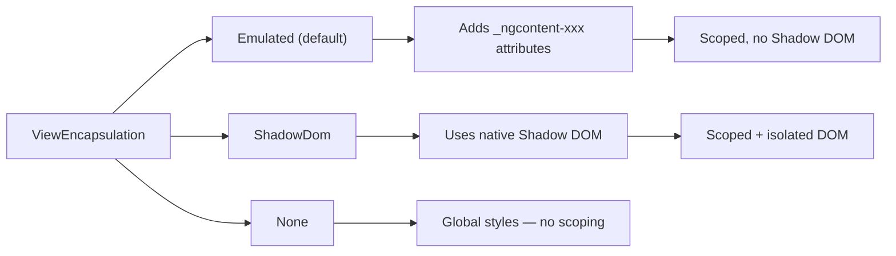
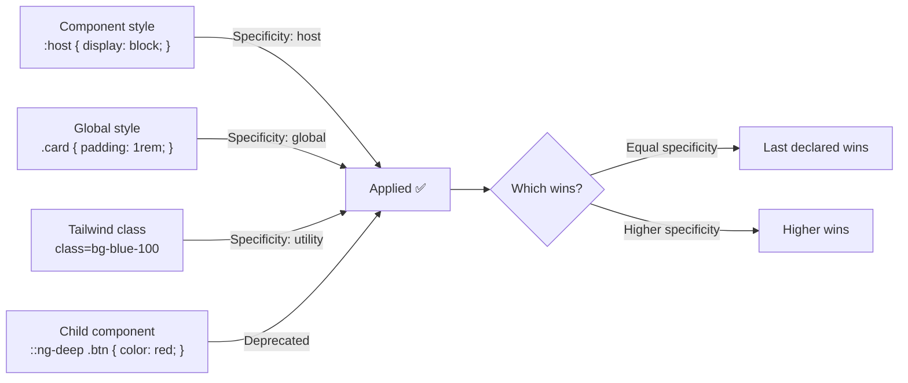

# Styling and View Encapsulation

> [!summary] Goal
> Style Angular components with View Encapsulation, SCSS, Tailwind CSS, and global styles. Understand `:host`, `:host-context`, and `::ng-deep`.

## Table of Contents

1. [Why Styling Matters](#why-styling-matters)
2. [View Encapsulation](#view-encapsulation)
3. [Component Styles: `:host`, `:host-context`, `::ng-deep`](#component-styles-host-host-context-ng-deep)
4. [Global Styles](#global-styles)
5. [SCSS with Angular](#scss-with-angular)
6. [Tailwind CSS with Angular](#tailwind-css-with-angular)
7. [Styling Approaches Comparison](#styling-approaches-comparison)
8. [Pitfalls](#pitfalls)

---

## Why Styling Matters

Angular scopes component styles by default — a button style in one component doesn't bleed into another. Understanding encapsulation and the available styling approaches is essential for building maintainable UIs.

---

## View Encapsulation

View Encapsulation controls how component styles are applied:

```typescript
@Component({
  selector: 'app-user-card',
  styles: [`
    .card { border: 1px solid #ccc; padding: 1rem; }
    .name { font-weight: bold; }
  `],
  encapsulation: ViewEncapsulation.Emulated,  // Default
})
export class UserCardComponent { }
```

### Encapsulation modes



| Mode | How it works | Use case |
|------|-------------|----------|
| `Emulated` (default) | Adds unique `_ngcontent-xxx` attributes to each element. Component styles target those attributes. | Most cases — scoped, no browser API needed |
| `ShadowDom` | Uses native Shadow DOM. Components are truly isolated — global styles don't penetrate. | Web components, strict isolation |
| `None` | No scoping. Styles are global. | When you intentionally want global styles from a component |

```typescript
@Component({
  standalone: true,
  styles: [`:host { display: block; }`],
  encapsulation: ViewEncapsulation.ShadowDom,  // True isolation
})
export class IsolatedComponent { }
```

---

## Component Styles: `:host`, `:host-context`, `::ng-deep`

```scss
// :host — style the component's own host element
:host {
  display: block;
  border: 1px solid #ddd;
  padding: 1rem;
}

// :host with class — only when the host has a specific class
:host(.active) {
  border-color: blue;
  background: #f0f8ff;
}

// :host-context — style based on ancestor CSS class
:host-context(.dark-theme) {
  background: #333;
  color: white;
}

// ::ng-deep — penetrate into child components (DEPRECATED)
:host ::ng-deep .child-class {
  font-size: 14px;
}
```

> [!warning] `::ng-deep` is deprecated. Use it only as a last resort for overriding third-party component styles. Prefer CSS custom properties (variables) for theming third-party components.

---

## Global Styles

```scss
// src/styles.scss — global application styles
@tailwind base;
@tailwind components;
@tailwind utilities;

/* Variables */
:root {
  --primary: #3b82f6;
  --danger: #ef4444;
  --text: #1f2937;
}

body {
  font-family: 'Inter', system-ui, sans-serif;
  color: var(--text);
  margin: 0;
}
```

```json
// angular.json
{
  "styles": [
    "src/styles.scss",
    "node_modules/ngx-toastr/toastr.css"  // Third-party styles
  ]
}
```

---

## SCSS with Angular

Angular CLI generates `.scss` files by default (`ng new my-app --style scss`). SCSS features available:

```scss
// Variables
$primary: #3b82f6;
$breakpoint-md: 768px;

// Mixins
@mixin card {
  border-radius: 8px;
  padding: 1rem;
  box-shadow: 0 1px 3px rgba(0, 0, 0, 0.1);
}

// Nesting
.user-card {
  @include card;

  .header {
    display: flex;
    align-items: center;
    gap: 0.5rem;

    .avatar {
      width: 48px;
      height: 48px;
      border-radius: 50%;
    }
  }

  .name {
    font-weight: 600;
    font-size: 1.125rem;
  }
}
```

---

## Tailwind CSS with Angular

### Setup

```bash
npm install tailwindcss @tailwindcss/vite
```

```typescript
// vite.config.ts
import tailwindcss from '@tailwindcss/vite';

export default defineConfig({
  plugins: [tailwindcss()],
});
```

```scss
// src/styles.scss
@import "tailwindcss";
```

### Usage in components

```typescript
@Component({
  selector: 'app-user-card',
  standalone: true,
  template: `
    <div class="rounded-lg border border-gray-200 bg-white p-4 shadow-sm hover:shadow-md transition-shadow">
      <h3 class="text-lg font-semibold text-gray-900">{{ user.name }}</h3>
      <p class="text-sm text-gray-600">{{ user.email }}</p>
      <button
        class="mt-2 rounded bg-blue-600 px-4 py-1.5 text-sm font-medium text-white hover:bg-blue-700 focus:outline-none focus:ring-2 focus:ring-blue-500 focus:ring-offset-2"
        (click)="onEdit()">
        Edit
      </button>
    </div>
  `,
  // No styles array needed — Tailwind handles everything
})
export class UserCardComponent { }
```

### Dynamic classes with `ngClass`

```html
<div [ngClass]="{
  'bg-blue-100 border-blue-500': isSelected,
  'bg-white border-gray-200': !isSelected
}" class="rounded-lg border p-4">
  {{ user.name }}
</div>
```



---

## Styling Approaches Comparison

| Approach | Scoped? | Learning curve | Dynamic styles | Best for |
|----------|---------|---------------|---------------|----------|
| **Tailwind CSS** | ✅ Utility classes | Medium | `ngClass` + string interpolation | New projects, rapid development |
| **SCSS (inline)** | ✅ `:host` scoping | Low | `[class.active]` | Component-specific styles |
| **Global SCSS** | ❌ Global | Low | CSS variables | Design tokens, typography |
| **Shadow DOM** | ✅ Full isolation | High | CSS custom properties | Web components |
| **CSS Modules** | ✅ Emulated via CLI | Low | `[class.active]` | Prefer Tailwind for new code |

---

## Pitfalls

### Global styles overriding component styles

A global style with the same specificity as a component style overrides it — even with Emulated encapsulation.

**Fix**: Use higher-specificity selectors in component styles, or use ShadowDom for true isolation.

### `::ng-deep` not working in production

`::ng-deep` is deprecated and behaves inconsistently across Angular versions and build tools.

**Fix**: Use CSS custom properties for theming, or ask the component library to expose styling hooks.

### Tailwind classes not generating

If you construct class names dynamically (e.g., `text-{{color}}-500`), the JIT engine may not detect them.

**Fix**: Use full class names in template or use `ngClass` with a whitelist:

```html
<!-- Will NOT generate text-blue-500 if used dynamically -->
<div [class]="'text-' + color + '-500'">...</div>

<!-- Will generate — full class name in template -->
<div [ngClass]="{ 'text-blue-500': color === 'blue', 'text-red-500': color === 'red' }">...</div>
```

---

> [!question]- Interview Questions
>
> **Q: What is View Encapsulation and what are the three modes?**
> A: View Encapsulation controls how component styles are scoped. `Emulated` (default) — adds attribute selectors for scoping. `ShadowDom` — uses native Shadow DOM for true isolation. `None` — styles are global.
>
> **Q: What does `:host` and `:host-context` do?**
> A: `:host` styles the component's own host element. `:host-context(selector)` applies styles only when the component has an ancestor matching the selector — useful for theming.
>
> **Q: How do you integrate Tailwind CSS with Angular?**
> A: Install Tailwind, add the Vite plugin, import `@import "tailwindcss"` in `styles.scss`, and use utility classes directly in templates. No component styles needed.

---

## Cross-Links

- [[Angular/01_Foundations/02_Components_Templates_and_Data_Binding]] for [class.*] and [style.*] bindings
- [[Angular/02_Core/05_Forms_Template_vs_Reactive]] for form styling patterns
- [[Angular/03_Advanced/01_Change_Detection_and_Performance]] for style-based CD optimization
