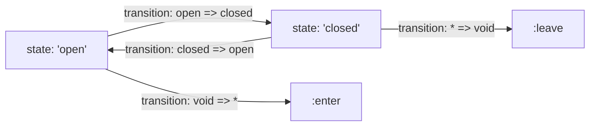
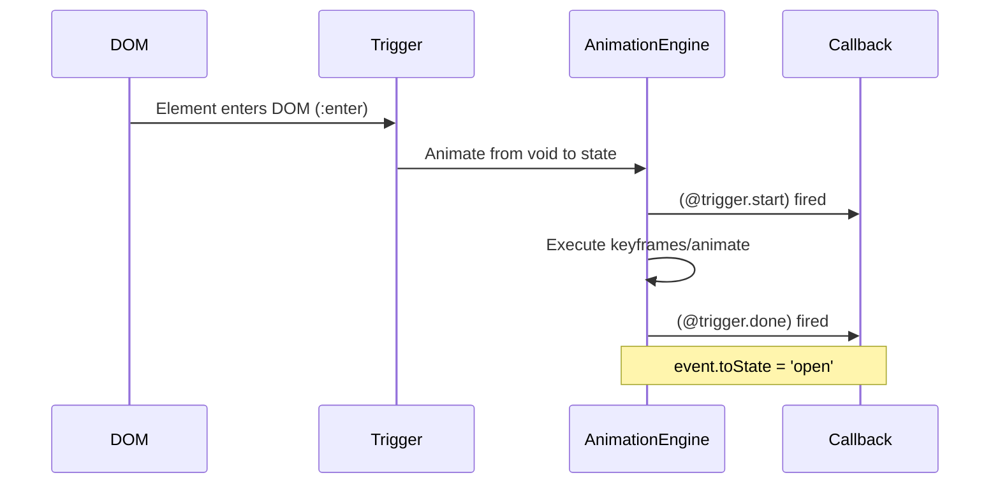

# Angular Animations

> [!summary] Goal
> Add animations to Angular components using trigger/state/transition, animate properties, and keyframes for complex motion.

## Table of Contents

1. [Why Animations Matter](#why-animations-matter)
2. [Setup](#setup)
3. [Trigger and State](#trigger-and-state)
4. [Transitions and `animate`](#transitions-and-animate)
5. [Wildcard and Void States](#wildcard-and-void-states)
6. [Keyframes](#keyframes)
7. [Animation Callbacks](#animation-callbacks)
8. [Pitfalls](#pitfalls)

---

## Why Animations Matter

Angular animations are declarative — you define how elements enter, leave, and transition between states using the `@angular/animations` DSL.

---

## Setup

```typescript
// app.config.ts
import { provideAnimations } from '@angular/platform-browser/animations';

export const appConfig: ApplicationConfig = {
  providers: [
    provideAnimations(),     // Enable animations (browser)
    // provideNoopAnimations()  // Disable animations (tests)
  ],
};
```

---

## Trigger and State

```typescript
import { trigger, state, style, transition, animate, keyframes } from '@angular/animations';

@Component({
  template: `
    <div @openClose
      (@openClose.start)="animationStarted($event)"
      (@openClose.done)="animationDone($event)"
      (click)="isOpen = !isOpen">
      {{ isOpen ? 'Close' : 'Open' }}
    </div>
  `,
  animations: [
    trigger('openClose', [
      // Define named states
      state('open', style({
        height: '200px',
        opacity: 1,
        backgroundColor: '#3b82f6',
      })),
      state('closed', style({
        height: '50px',
        opacity: 0.5,
        backgroundColor: '#9ca3af',
      })),
      // Define transitions between states
      transition('open => closed', [
        animate('300ms ease-in'),
      ]),
      transition('closed => open', [
        animate('300ms ease-out'),
      ]),
    ]),
  ],
})
export class ExpandableComponent {
  isOpen = true;
}
```



---

## Transitions and `animate`

```typescript
// Duration and easing
transition('open => closed', animate('300ms ease-in'))
transition('closed => open', animate('300ms 100ms ease-out'))  // 100ms delay

// Style during transition
transition('open => closed', [
  style({ backgroundColor: '#f59e0b' }),     // At transition start
  animate('300ms'),
])

// Multi-step transition
transition('* => *', [
  animate('200ms', style({ opacity: 0 })),
  animate('200ms'),
])
```

### Animation timing syntax

| Format | Meaning |
|--------|---------|
| `'300ms'` | Duration only |
| `'300ms ease-in'` | Duration + easing |
| `'300ms 100ms ease-out'` | Duration + delay + easing |
| `'200ms 200ms'` | Duration + delay |

---

## Wildcard and Void States

```typescript
animations: [
  trigger('fadeInOut', [
    // :enter — when element is added to DOM (* => void)
    transition(':enter', [
      style({ opacity: 0 }),
      animate('300ms ease-out', style({ opacity: 1 })),
    ]),
    // :leave — when element is removed from DOM (void => *)
    transition(':leave', [
      animate('300ms ease-in', style({ opacity: 0 })),
    ]),
  ]),

  trigger('listAnimation', [
    // * matches ANY state (wildcard)
    transition('* => *', [
      animate('200ms'),
    ]),
  ]),
]
```

```html
<div *ngIf="isVisible" @fadeInOut>Fades in and out</div>

<div *ngFor="let item of items; trackBy: trackFn" @fadeInOut>
  Each item animates on enter/leave
</div>
```

---

## Keyframes

```typescript
animations: [
  trigger('bounceIn', [
    transition(':enter', [
      animate('600ms', keyframes([
        style({ opacity: 0, transform: 'scale3d(0.3, 0.3, 0.3)', offset: 0 }),
        style({ transform: 'scale3d(1.1, 1.1, 1.1)', offset: 0.2 }),
        style({ transform: 'scale3d(0.9, 0.9, 0.9)', offset: 0.4 }),
        style({ transform: 'scale3d(1.03, 1.03, 1.03)', offset: 0.6 }),
        style({ transform: 'scale3d(0.97, 0.97, 0.97)', offset: 0.8 }),
        style({ opacity: 1, transform: 'scale3d(1, 1, 1)', offset: 1 }),
      ])),
    ]),
  ]),

  trigger('slideIn', [
    transition(':enter', [
      style({ transform: 'translateX(-100%)' }),
      animate('300ms ease-out', style({ transform: 'translateX(0)' })),
    ]),
    transition(':leave', [
      animate('300ms ease-in', style({ transform: 'translateX(-100%)' })),
    ]),
  ]),
]
```

---

## Animation Callbacks

```typescript
@Component({
  template: `
    <div @fadeInOut
      (@fadeInOut.start)="onStart($event)"
      (@fadeInOut.done)="onDone($event)">
      Content
    </div>
  `,
})
export class AnimatedComponent {
  onStart(event: AnimationEvent) {
    console.log('Animation started:', event.triggerName, event.phaseName);
  }

  onDone(event: AnimationEvent) {
    console.log('Animation done:', event.toState);
  }
}
```



---

## Pitfalls

### Animation not running on initial render

Animations on `:enter` don't run if the element is already present when the component initializes.

**Fix**: Ensure the element is conditionally rendered (`*ngIf`) so the `:enter` transition triggers.

### `provideAnimations` not set

If animations aren't provided in the app config, all `[@trigger]` expressions are ignored — no error, no animation.

### Performance

Animating `width`, `height`, `top`, `left` triggers layout recalculations. Prefer `transform` and `opacity` for smooth 60fps animations.

---

> [!question]- Interview Questions
>
> **Q: What is the Angular animation DSL?**
> A: A declarative syntax using `trigger`, `state`, `style`, `transition`, and `animate` to define how elements transition between states. Defined in the `animations` array of `@Component`.
>
> **Q: What are `:enter` and `:leave` transitions?**
> A: `:enter` is triggered when an element is added to the DOM (`*ngIf` becomes true, new item in `*ngFor`). `:leave` is triggered when removed. They're shorthand for `void => *` and `* => void`.
>
> **Q: How do you animate with multiple steps?**
> A: Use `keyframes()` with `offset` values from 0 to 1. Each `offset` defines a waypoint in the animation timeline.

---

## Cross-Links

- [[Angular/02_Core/03_RxJS_in_Angular]] for animation sequence observables
- [[Angular/01_Foundations/02_Components_Templates_and_Data_Binding]] for *ngIf render conditions
- [[Angular/02_Core/05_Forms_Template_vs_Reactive]] for form validation animations
