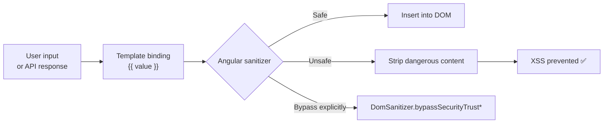
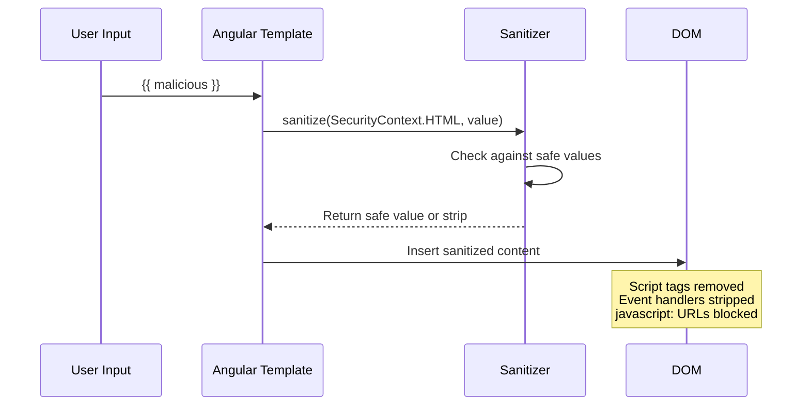
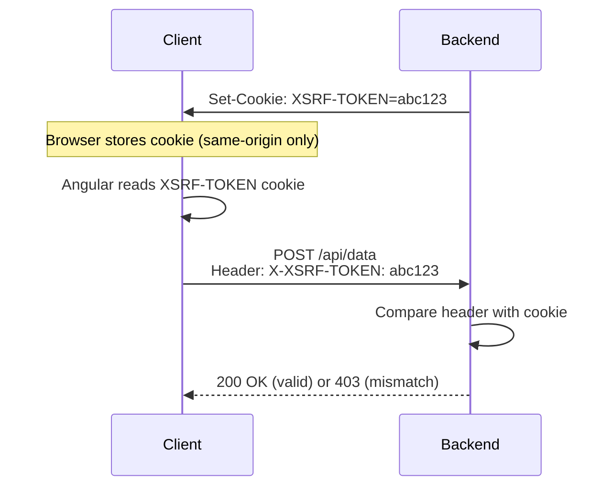

# Angular Security

> [!summary] Goal
> Protect Angular applications against XSS, CSRF, and injection attacks. Understand Angular's built-in sanitization, when to bypass it safely, and how to configure CSP and Trusted Types.

## Table of Contents

1. [Angular's Security Model](#angulars-security-model)
2. [Built-in Sanitization](#built-in-sanitization)
3. [DomSanitizer — Bypassing Security](#domsanitizer-bypassing-security)
4. [Trusted Types](#trusted-types)
5. [Content Security Policy (CSP)](#content-security-policy)
6. [CSRF / XSRF Protection](#csrf-xsrf-protection)
7. [Pitfalls](#pitfalls)

---

## Angular's Security Model

Angular treats all values as **untrusted by default** and sanitizes them before insertion into the DOM. This prevents XSS even if a malicious value reaches a template binding.



### What Angular sanitizes automatically

| Context | Example | Sanitized? |
|---------|---------|------------|
| HTML | `{{ htmlContent }}` | ✅ Strips `<script>`, event handlers |
| URL | `[href]="userLink"` | ✅ Blocks `javascript:` URLs |
| Style | `[style]="userStyle"` | ✅ Strips `expression()`, `url()` |
| Resource URL | `[src]="userImg"` | ✅ Blocks untrusted URLs |

### What Angular does NOT sanitize

- `@Input()` values used in child components (trust the child)
- `innerHTML` with `[innerHTML]="trustedHtml"` (requires explicit bypass)
- Values in `eval()`, `setTimeout(string)`, `new Function(string)` (not Angular's concern)

---

## Built-in Sanitization

```typescript
import { Component } from '@angular/core';

@Component({
  template: `
    <!-- Automatically sanitized: unsafe HTML is stripped -->
    <div [innerHTML]="userBio"></div>

    <!-- Automatically sanitized: javascript: URLs are blocked -->
    <a [href]="userLink">Click</a>
  `,
})
export class ProfileComponent {
  userBio = '<script>alert("xss")</script><b>Hello</b>';
  // Renders: <b>Hello</b>  — script tag removed

  userLink = "javascript:alert('xss')";
  // Angular blocks this — no navigation occurs
}
```



---

## DomSanitizer — Bypassing Security

When you need to insert **trusted** content (rendered markdown, SVG icons, video embeds):

```typescript
import { DomSanitizer, SafeHtml, SafeUrl, SafeStyle, SafeResourceUrl } from '@angular/platform-browser';

@Component({
  template: `
    <div [innerHTML]="trustedHtml"></div>
    <iframe [src]="videoUrl"></iframe>
    <a [href]="safeLink">Download</a>
  `,
})
export class SafeContentComponent {
  private sanitizer = inject(DomSanitizer);

  // Trust this HTML — it comes from a markdown renderer
  trustedHtml: SafeHtml = this.sanitizer.sanitize(SecurityContext.HTML, '<b>Bold</b>')!;
  // OR bypass:
  // trustedHtml = this.sanitizer.bypassSecurityTrustHtml('<b>Bold</b>');

  // Trust a YouTube embed URL
  videoUrl: SafeResourceUrl = this.sanitizer.bypassSecurityTrustResourceUrl(
    'https://www.youtube.com/embed/dQw4w9WgXcQ'
  );
}
```

### All bypass methods

| Method | Context | When to use |
|--------|---------|-------------|
| `bypassSecurityTrustHtml(value)` | HTML | Rendered markdown, rich text from trusted source |
| `bypassSecurityTrustStyle(value)` | CSS | Dynamic CSS values from a known source |
| `bypassSecurityTrustUrl(value)` | URL | Links from a trusted source |
| `bypassSecurityTrustResourceUrl(value)` | Resource URL | iframe embeds (YouTube, maps) from a trusted source |
| `bypassSecurityTrustScript(value)` | Script | Almost never — script injection is extremely dangerous |

> [!warning] Only bypass sanitization when the value is from a **trusted source** (your own server, a trusted CDN, or after rigorous client-side validation). Never bypass for raw user input.

---

## Trusted Types

Trusted Types is a browser API (supported in Chrome, Edge) that eliminates DOM XSS by enforcing a policy on `innerHTML` assignments.

### Angular's Trusted Types support

Angular 15+ supports Trusted Types out of the box. When the browser enforces a Trusted Types CSP, Angular's sanitizer produces `TrustedHTML` objects instead of strings.

```typescript
// angular.json — enable Trusted Types in CSP
{
  "headers": {
    "Content-Security-Policy": "require-trusted-types-for 'script'"
  }
}
```

### Custom Trusted Types policy

```typescript
import { TrustedTypesPolicy, TrustedHTML } from '@angular/platform-browser';

// Only needed if you bypass sanitization with custom policies
const policy: TrustedTypesPolicy = (window as any).trustedTypes?.createPolicy('my-policy', {
  createHTML: (input: string) => {
    // Your own sanitizer — DOMPurify, etc.
    return DOMPurify.sanitize(input);
  },
  createScriptURL: (input: string) => input,
});

// Now use the policy
const safeHtml = (window as any).trustedTypes?.emptyScript;
```

### Trusted Types compatible libraries

| Library | Compatible | Notes |
|---------|-----------|-------|
| Angular (15+) | ✅ Native | Produces TrustedHTML internally |
| DOMPurify | ✅ | Can be wrapped in a policy |
| marked (markdown) | ⚠️| Requires DOMPurify integration |
| highlight.js | ⚠️| May need a custom policy |

---

## Content Security Policy (CSP)

A CSP header prevents XSS even if Angular's sanitization is bypassed:

```nginx
# nginx.conf
add_header Content-Security-Policy "
  default-src 'self';
  script-src 'self' 'strict-dynamic' 'nonce-{random}';
  style-src 'self' 'unsafe-inline';
  img-src 'self' https: data:;
  font-src 'self' https:;
  frame-src 'self' https://www.youtube.com;
  require-trusted-types-for 'script';
" always;
```

### CSP directives for Angular

| Directive | Required for Angular | Notes |
|-----------|---------------------|-------|
| `script-src 'self'` | ✅ | Without this, JS bundles won't load |
| `style-src 'unsafe-inline'` | ✅ | Angular adds styles via inline `<style>` tags |
| `img-src 'self' https: data:` | ⚠️ | Needed for external images |
| `require-trusted-types-for 'script'` | Optional | Strict XSS protection |
| `frame-src` | ⚠️ | Needed only if you embed iframes |

### Nonce-based CSP with Angular SSR

```typescript
// server.ts (Angular SSR)
import { ngExpressEngine } from '@angular/ssr';

server.get('*', (req, res) => {
  const nonce = crypto.randomUUID();

  res.render('index', {
    req,
    providers: [{ provide: 'nonce', useValue: nonce }],
  });

  // Set CSP header with nonce
  res.setHeader(
    'Content-Security-Policy',
    `script-src 'self' 'nonce-${nonce}'; style-src 'self' 'unsafe-inline';`,
  );
});
```

---

## CSRF / XSRF Protection

Angular's `HttpClient` has built-in XSRF protection:

```typescript
// This happens automatically with provideHttpClient()
// Angular reads the XSRF-TOKEN cookie and sends it as X-XSRF-TOKEN header

import { provideHttpClient, withNoXsrfProtection, withXsrfConfiguration } from '@angular/common/http';

export const appConfig: ApplicationConfig = {
  providers: [
    // Default behavior — reads XSRF-TOKEN cookie, sends X-XSRF-TOKEN header
    provideHttpClient(),

    // OR custom cookie/header names
    provideHttpClient(
      withXsrfConfiguration({
        cookieName: 'MY-XSRF-TOKEN',
        headerName: 'MY-XSRF-HEADER',
      }),
    ),

    // OR disable XSRF entirely (not recommended)
    provideHttpClient(withNoXsrfProtection()),
  ],
};
```



> [!tip] This only protects against **cross-origin** requests. Same-origin attacks (e.g., another page on the same domain) can still read the cookie. Use `SameSite=Strict` cookie attribute for stronger protection.

---

## Pitfalls

### Bypassing sanitization on user input

```typescript
// ❌ Never do this
this.trustedHtml = this.sanitizer.bypassSecurityTrustHtml(userInput);

// ✅ Only bypass when the source is trusted
this.trustedHtml = this.sanitizer.bypassSecurityTrustHtml(
  this.markdownRenderer.render(this.sanitizedInput)
);
```

### Using `innerHTML` with untrusted data

```html
<!-- ❌ Dangerous even with Angular's sanitizer — complex HTML can bypass simple sanitization -->
<div [innerHTML]="untrustedHtml"></div>
```

**Fix**: Use Angular templates instead of `innerHTML`. If you must render HTML, sanitize with a library like DOMPurify first.

### Forgetting CSP in production

Angular depends on inline styles. Without `'unsafe-inline'` in `style-src`, styles won't render. Test CSP policies in a staging environment before deploying.

### Not configuring XSRF for custom HTTP methods

Angular's XSRF protection only applies to mutating methods (POST, PUT, DELETE, PATCH). GET requests are not protected — they shouldn't need to be, but verify your API doesn't mutate on GET.

---

> [!question]- Interview Questions
>
> **Q: How does Angular prevent XSS attacks?**
> A: Angular automatically sanitizes all values bound to the DOM. It strips `<script>` tags, event handlers, and `javascript:` URLs from HTML contexts. Values are never inserted raw unless explicitly bypassed with `DomSanitizer.bypassSecurityTrust*`.
>
> **Q: When would you use `DomSanitizer.bypassSecurityTrustHtml`?**
> A: When rendering trusted content like rendered markdown, SVG icons from a known source, or video embeds. Always ensure the content comes from a trusted source before bypassing.
>
> **Q: What is a Content Security Policy and why does Angular need `unsafe-inline` for styles?**
> A: CSP is an HTTP header that restricts what resources can load. Angular applies component styles via inline `<style>` elements — without `'unsafe-inline'` in `style-src`, component styles break. For scripts, use nonces or hashes instead of `unsafe-inline`.
>
> **Q: How does Angular's HttpClient handle CSRF protection?**
> A: It reads an `XSRF-TOKEN` cookie (set by the server) and sends its value as the `X-XSRF-TOKEN` header on mutating requests. The server validates the header matches the cookie.
>
> **Q: What are Trusted Types and how does Angular support them?**
> A: Trusted Types is a browser API that prevents DOM XSS by requiring `innerHTML` assignments to use `TrustedHTML` objects. Angular 15+ natively produces TrustedHTML output when the browser enforces a Trusted Types CSP.

---

## Cross-Links

- [[Angular/02_Core/04_HttpClient_and_Interceptors]] for XSRF configuration
- [[Angular/03_Advanced/06_Angular_CLI_and_Configuration]] for CSP header configuration in deployments
- [[Angular/01_Foundations/02_Components_Templates_and_Data_Binding]] for template rendering contexts
- [[CICD/Docker/03_Advanced/02_Security]] for Docker security headers
