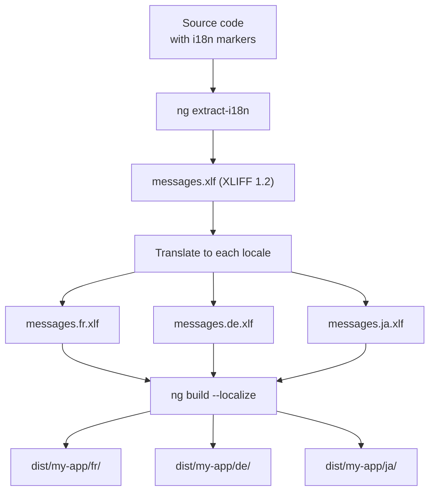

# Internationalization (i18n)

> [!summary] Goal
> Internationalize Angular applications using the built-in `@angular/localize` package: template translations, ICU expressions, locale configuration, runtime switching, and build-time extraction.

## Table of Contents

1. [i18n Architecture](#i18n-architecture)
2. [Template Translations](#template-translations)
3. [ICU Expressions](#icu-expressions)
4. [Locale Configuration](#locale-configuration)
5. [`$localize` Tagged Template](#localize-tagged-template)
6. [Translation Extraction and Build](#translation-extraction-and-build)
7. [Runtime Locale Switching](#runtime-locale-switching)
8. [Pitfalls](#pitfalls)

---

## i18n Architecture



| Build approach | How it works | When to use |
|---------------|-------------|-------------|
| **`--localize`** | Build once per locale, separate deploy paths | Server-rendered or static multi-language sites |
| **Runtime** | Load translations at runtime via `$localize` | Client-rendered SPA with language switching |
| **SSR** | Detect locale per request, serve localized build | Angular Universal / SSR apps |

---

## Template Translations

### Marking text for translation

```html
<!-- Basic translation -->
<h1 i18n>Welcome to our application</h1>

<!-- Translation with meaning and description -->
<p i18n="greeting|A friendly welcome message@@welcomeMessage">Hello {{ userName }}</p>
```

| Attribute | Purpose | Example |
|-----------|---------|---------|
| `i18n` | Mark element for translation | `<h1 i18n>Hello</h1>` |
| `i18n="meaning\|description"` | Add context for translators | `i18n="button\|Submit button text"` |
| `i18n="@@id"` | Custom translation ID | `i18n="@@app.submit"` |
| `i18n-attribute` | Translate an attribute value | `i18n-title="Tooltip text"` |

### Translating attributes

```html
<!-- Attribute translation -->

<input
  [placeholder]="searchText"
  i18n-placeholder="Search input placeholder"
/>

<!-- Or with custom ID -->
<button
  i18n-title="@@user.submitBtn.tooltip"
  title="Click to save changes"
  i18n="@@user.submitBtn"
>Save</button>
```

### Translating with elements

```html
<!-- Nested elements within translation -->
<p i18n>
  Please <strong>click here</strong> to continue.
</p>

<!-- Plural ICU inside a translated block -->
<p i18n>
  {items.length, plural,
    =0 {Your cart is empty}
    =1 {You have 1 item}
    other {You have {{items.length}} items}
  }
</p>
```

---

## ICU Expressions

ICU (International Components for Unicode) messages handle plurals, select, and gender:

### Plural ICU

```html
<p i18n>
  Updated {minutes, plural,
    =0 {just now}
    =1 {one minute ago}
    other {{{minutes}} minutes ago}
  }
</p>
```

| ICU plural category | Matches |
|--------------------|---------|
| `=0` | Exactly 0 |
| `=1` | Exactly 1 |
| `=2` | Exactly 2 |
| `zero` | Zero (CLDR plural category) |
| `one` | Singular (CLDR plural category) |
| `few` | Few (CLDR — e.g., 2-4 in Czech) |
| `many` | Many (CLDR — e.g., 5+ in Polish) |
| `other` | Everything else (always required) |

### Select ICU (gender / string matching)

```html
<p i18n>
  {gender, select,
    male {He has invited you}
    female {She has invited you}
    other {They have invited you}
  } to {{eventName}}.
</p>
```

### Nested ICU

```html
<p i18n>
  {items.length, plural,
    =0 {No items}
    other {{{items.length}}
      {items.length, plural,
        =1 {item}
        other {items}
      }
    }
  } in cart.
</p>
```

---

## Locale Configuration

```typescript
// app.config.ts
import { provideLocale } from '@angular/common';
import { LOCALE_ID } from '@angular/core';
import localeFr from '@angular/common/locales/fr';
import localeDe from '@angular/common/locales/de';
import { registerLocaleData } from '@angular/common';

// Register locale data for pipes (date, currency, number)
registerLocaleData(localeFr);
registerLocaleData(localeDe);

export const appConfig: ApplicationConfig = {
  providers: [
    // Set the active locale
    { provide: LOCALE_ID, useValue: 'fr-FR' },
    // Or dynamic:
    // { provide: LOCALE_ID, useFactory: () => navigator.language || 'en-US' },
  ],
};
```

### All locale registration

```typescript
import { registerLocaleData } from '@angular/common';
import localeFr from '@angular/common/locales/fr';
import localeFrExtra from '@angular/common/locales/extra/fr';

// Register with extra data (day periods, etc.)
registerLocaleData(localeFr, 'fr-FR', localeFrExtra);

// Multiple locales
registerLocaleData(localeDe);
registerLocaleData(localeJa);
registerLocaleData(localeZh);
```

### Locale effects on pipes

```typescript
// With LOCALE_ID = 'fr-FR'
{{ today | date:'full' }}        // "vendredi 9 mai 2026"
{{ 42.99 | currency:'EUR' }}     // "42,99 €"
{{ 0.5 | percent }}              // "50 %"
```

---

## `$localize` Tagged Template

For translations in TypeScript code (outside templates):

```typescript
import { $localize } from '@angular/localize/init';

@Component({...})
export class NotificationService {
  showSuccess(message: string) {
    // $localize works like a tagged template literal
    const text = $localize`Operation completed successfully`;
    this.toast.show(text);
  }

  showError(code: number) {
    // With placeholders
    const text = $localize`:@@errors.notFound:Record ${code}:id: not found`;
    this.toast.error(text);
  }
}
```

### `$localize` with ICU

```typescript
function itemCountLabel(count: number): string {
  return $localize`:@@cart.itemCount:{count, plural,
    =0 {Your cart is empty}
    =1 {You have 1 item}
    other {You have ${count} items}
  }`;
}
```

| API | Where | Purpose |
|-----|-------|---------|
| `i18n` attribute | Templates | Mark HTML for translation |
| `$localize` tag | TypeScript | Translate strings in code |
| `ng extract-i18n` | CLI | Extract messages to XLIFF/XMB |
| `@angular/localize` | Runtime | Activate translations at build time |

---

## Translation Extraction and Build

### Extract messages

```bash
ng extract-i18n --output-path src/locale --format xlf2
```

This creates `src/locale/messages.xlf` with all `i18n`-marked strings.

### XLIFF format

```xml
<!-- messages.xlf -->
<xliff version="1.2">
  <file source-language="en" target-language="fr">
    <unit id="welcomeMessage">
      <segment>
        <source>Hello {{userName}}</source>
        <target>Bonjour {{userName}}</target>
      </segment>
    </unit>
    <unit id="app.submit">
      <segment>
        <source>Submit</source>
        <target>Envoyer</target>
      </segment>
    </unit>
  </file>
</xliff>
```

### Build per locale

```json
// angular.json
{
  "projects": {
    "my-app": {
      "i18n": {
        "sourceLocale": "en-US",
        "locales": {
          "fr": {
            "translation": "src/locale/messages.fr.xlf",
            "baseHref": "/fr/"
          },
          "de": {
            "translation": "src/locale/messages.de.xlf",
            "baseHref": "/de/"
          }
        }
      },
      "architect": {
        "build": {
          "builder": "@angular-devkit/build-angular:application",
          "configurations": {
            "production": {
              "localize": true    // Build all locales
            }
          }
        }
      }
    }
  }
}
```

```bash
# Build all configured locales
ng build --configuration production

# Output: dist/my-app/
#   en-US/index.html
#   fr/index.html
#   de/index.html

# Build single locale
ng build --localize=fr

# Dev server for a specific locale
ng serve --configuration=fr
```

---

## Runtime Locale Switching

For SPAs that switch language without reload:

```typescript
// locale.service.ts
import { Injectable, Inject, LOCALE_ID } from '@angular/core';
import { BehaviorSubject } from 'rxjs';
import { registerLocaleData } from '@angular/common';

@Injectable({ providedIn: 'root' })
export class LocaleService {
  private currentLocale = new BehaviorSubject<string>(
    localStorage.getItem('locale') || 'en-US'
  );

  readonly locale$ = this.currentLocale.asObservable();

  private loadedLocales = new Set<string>(['en-US']);

  async setLocale(locale: string): Promise<void> {
    if (!this.loadedLocales.has(locale)) {
      // Dynamic import of locale data
      const localeModule = await import(
        `@angular/common/locales/global/${locale.split('-')[0]}`
      );
      registerLocaleData(localeModule.default);
      this.loadedLocales.add(locale);
    }

    localStorage.setItem('locale', locale);
    this.currentLocale.next(locale);
    location.reload();  // Simple approach: reload to pick up LOCALE_ID
  }
}
```

> [!tip] For true runtime switching without reload, use a library like `ngx-translate` or `@ngx-translate/core`. Angular's built-in i18n works best with per-locale builds — runtime switching requires additional tooling or a post-build approach.

---

## Pitfalls

### Not registering locale data

Without `registerLocaleData(localeFr)`, date/currency/number pipes use the default (en-US) formatting even when `LOCALE_ID` is `fr-FR`.

### Forgetting `@angular/localize` polyfill

```typescript
// polyfills.ts or angular.json polyfills
import '@angular/localize/init';
```

Without this, `$localize` throws a runtime error: `The $localize tag is not loaded`.

### ICU placeholders and `--localize` builds

ICU expressions require Angular's runtime i18n. If you use `--localize`, the build handles ICU at compile time — no extra work. But if you switch locales at runtime, ICU expressions won't re-evaluate without a full re-render.

### Missing `other` category in ICU

```html
<!-- ❌ Error: 'other' category is required -->
{count, plural, =1 {One item}}

<!-- ✅ Correct -->
{count, plural, =1 {One item} other {{{count}} items}}
```

### Translation ID collisions

If two elements share the same `@@id`, only one translation is used. Use unique IDs or let Angular auto-generate them.

---

> [!question]- Interview Questions
>
> **Q: How does Angular's i18n system work at build time?**
> A: `ng extract-i18n` scans templates and `$localize` tags to produce an XLIFF file. Translators fill in the translations. `ng build --localize` creates a separate build output per locale, with translations baked in at compile time.
>
> **Q: What are ICU messages and when would you use them?**
> A: ICU messages handle pluralization, gender, and select patterns. Use them for translated text that depends on a numeric value (plural) or a variable string (select/gender). They're defined inline in the template inside `{ }` with the `plural` or `select` keyword.
>
> **Q: What is the difference between `i18n` and `$localize`?**
> A: `i18n` is an HTML attribute used in templates to mark elements for translation. `$localize` is a tagged template literal used in TypeScript code. Both extract to the same XLIFF format.
>
> **Q: How do you handle multiple locales in Angular?**
> A: Configure each locale in `angular.json` with its translation file and baseHref. Call `registerLocaleData()` for each locale. Build with `--localize` to produce per-locale output directories (`dist/app/fr/`, `dist/app/de/`).
>
> **Q: What is `LOCALE_ID` and what does it affect?**
> A: `LOCALE_ID` is an Angular injection token that determines locale-specific formatting for date, currency, number, and percent pipes. It doesn't affect i18n translations — those are baked in at build time.

---

## Cross-Links

- [[Angular/02_Core/06_Pipes_BuiltIn_and_Custom]] for locale-aware pipes (`date`, `currency`, `number`, `i18nPlural`, `i18nSelect`)
- [[Angular/03_Advanced/06_Angular_CLI_and_Configuration]] for `angular.json` i18n configuration
- [[Angular/01_Foundations/01_Angular_App_Structure_and_Build]] for polyfills and build output
- [[Angular/03_Advanced/04_SSR_Hydration_and_Prerendering]] for SSR with per-locale builds
