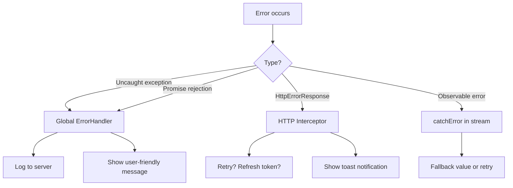
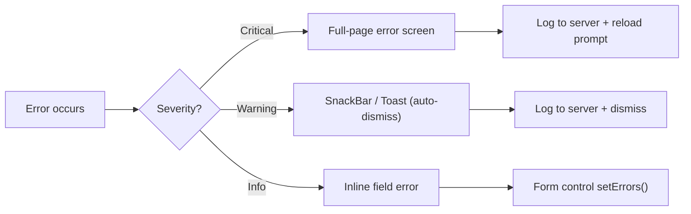

# Error Handling

> [!summary] Goal
> Handle errors at every layer: global `ErrorHandler`, HTTP errors, component errors, and user-friendly error displays. Build a production-grade error logging system.

## Table of Contents

1. [Error Handling Layers](#error-handling-layers)
2. [Global Error Handler](#global-error-handler)
3. [HTTP Error Handling](#http-error-handling)
4. [Component Error Handling](#component-error-handling)
5. [User-Facing Error Display](#user-facing-error-display)
6. [Pitfalls](#pitfalls)

---

## Error Handling Layers



| Layer | Handler | What it catches |
|-------|---------|-----------------|
| **Global** | `ErrorHandler` class | Uncaught exceptions, unhandled promise rejections |
| **HTTP** | `HttpInterceptorFn` + `catchError` | HTTP 4xx/5xx, network errors |
| **Component** | `try/catch` in component methods, `@if` null checks | Template errors, null reference, async errors |
| **User display** | SnackBar, inline errors, error pages | Errors propagated from lower layers |

---

## Global Error Handler

### Default behavior

Angular's default `ErrorHandler` just logs to console. For production, override it:

```typescript
// core/global-error-handler.ts
import { ErrorHandler, Injectable, inject } from '@angular/core';

@Injectable({ providedIn: 'root' })
export class GlobalErrorHandler implements ErrorHandler {
  private errorLoggingService = inject(ErrorLoggingService);

  handleError(error: any): void {
    // 1. Log to server
    this.errorLoggingService.logError({
      message: error.message ?? 'Unknown error',
      stack: error.stack,
      timestamp: new Date().toISOString(),
      url: window.location.href,
    });

    // 2. Log to console in development
    console.error('Global error caught:', error);

    // 3. Show user-friendly message (but don't throw again)
    // Using inject() in constructor might fail if ErrorHandler is called early
    // So we defer UI interaction
    setTimeout(() => {
      const snackBar = inject(MatSnackBar, { optional: true });
      snackBar?.open('Something went wrong. Our team has been notified.', 'Dismiss', {
        duration: 5000,
      });
    });
  }
}
```

```typescript
// app.config.ts — provide the custom handler
import { ErrorHandler } from '@angular/core';

export const appConfig: ApplicationConfig = {
  providers: [
    { provide: ErrorHandler, useClass: GlobalErrorHandler },
  ],
};
```

### Error logging service

```typescript
// core/error-logging.service.ts
export interface ErrorLog {
  message: string;
  stack?: string;
  timestamp: string;
  url: string;
  userId?: string;
  errorGroup?: string;
}

@Injectable({ providedIn: 'root' })
export class ErrorLoggingService {
  private http = inject(HttpClient);

  logError(error: ErrorLog): void {
    // Batch errors — send at most once every 5 seconds
    this.buffer.push(error);
    this.flushScheduled ??= setTimeout(() => this.flush(), 5000);
  }

  private buffer: ErrorLog[] = [];
  private flushScheduled: ReturnType<typeof setTimeout> | null = null;

  private flush(): void {
    const batch = this.buffer.splice(0);
    this.flushScheduled = null;

    this.http.post('/api/logs/errors', batch).pipe(
      catchError(() => of(null)),  // Don't let logging errors cause more errors
    ).subscribe();
  }
}
```

---

## HTTP Error Handling

### Interceptor-based error handling

```typescript
// core/error.interceptor.ts
export const errorInterceptor: HttpInterceptorFn = (req, next) => {
  return next(req).pipe(
    catchError((error: HttpErrorResponse) => {
      let userMessage = 'An unexpected error occurred';

      if (error.error instanceof ErrorEvent) {
        // Client-side error (network, CORS, etc.)
        userMessage = 'Network error. Please check your connection.';
        console.error('Client error:', error.error.message);
      } else {
        // Server-side error
        switch (error.status) {
          case 400: userMessage = 'Invalid request. Please check your input.'; break;
          case 401: userMessage = 'Session expired. Please log in again.'; break;
          case 403: userMessage = 'You do not have permission.'; break;
          case 404: userMessage = 'Resource not found.'; break;
          case 429: userMessage = 'Too many requests. Please wait.'; break;
          case 500: userMessage = 'Server error. Please try again later.'; break;
          case 502:
          case 503: userMessage = 'Service temporarily unavailable.'; break;
        }
      }

      // Show user notification
      const snackBar = inject(MatSnackBar, { optional: true });
      snackBar?.open(userMessage, 'Dismiss', { duration: 5000 });

      // Log to server
      const errorLogService = inject(ErrorLoggingService);
      errorLogService.logError({
        message: `HTTP ${error.status}: ${error.message}`,
        stack: error.error?.stack,
        timestamp: new Date().toISOString(),
        url: req.url,
        errorGroup: `http-${error.status}`,
      });

      return throwError(() => error);
    }),
  );
};
```

### Typed error responses

```typescript
// models/api-error.ts
export interface ApiError {
  code: string;
  message: string;
  details?: Record<string, string[]>;  // Field-level validation errors
}

// Mapping server validation errors to form controls
@Injectable({ providedIn: 'root' })
export class ApiErrorMapper {
  mapToFormErrors(form: FormGroup, apiError: ApiError): void {
    if (!apiError.details) return;

    for (const [field, errors] of Object.entries(apiError.details)) {
      const control = form.get(field);
      if (control) {
        control.setErrors({ serverError: errors.join(', ') });
      }
    }
  }
}
```

---

## Component Error Handling

### Error boundaries pattern (manual)

Angular doesn't have React-style error boundaries, but you can achieve the same:

```typescript
@Component({
  selector: 'app-error-boundary',
  template: `
    @if (hasError()) {
      <div class="error-fallback">
        <h3>Something went wrong</h3>
        <p>{{ errorMessage() }}</p>
        <button (click)="retry()">Try Again</button>
      </div>
    } @else {
      <ng-content />
    }
  `,
})
export class ErrorBoundaryComponent implements AfterViewInit {
  private errorHandler = inject(ErrorHandler);
  private contentError = signal(false);
  private errorMessage = signal('');

  hasError = this.contentError.asReadonly();

  ngAfterViewInit() {
    // Wrap the original ErrorHandler to catch errors in this component's subtree
    const original = this.errorHandler.handleError.bind(this.errorHandler);
    this.errorHandler.handleError = (error: any) => {
      this.contentError.set(true);
      this.errorMessage.set(error.message ?? 'Unknown error');
      original(error);  // Still forward to global handler
    };
  }

  retry(): void {
    this.contentError.set(false);
    this.errorMessage.set('');
  }
}
```

```html
<app-error-boundary>
  <app-user-profile [userId]="id" />
</app-error-boundary>
```

### Safe navigation in templates

```html
<!-- ❌ Throws if user or address is null -->
<p>{{ user.address.street }}</p>

<!-- ✅ Safe: returns null without error -->
<p>{{ user?.address?.street }}</p>

<!-- ✅ Better: @if with type narrowing -->
@if (user) {
  <p>{{ user.address?.street }}</p>
}
```

---

## User-Facing Error Display



### Error display service

```typescript
// core/error-display.service.ts
export type ErrorSeverity = 'critical' | 'warning' | 'info';

@Injectable({ providedIn: 'root' })
export class ErrorDisplayService {
  private snackBar = inject(MatSnackBar);

  showError(message: string, severity: ErrorSeverity = 'warning'): void {
    switch (severity) {
      case 'critical':
        // Redirect to error page
        inject(Router).navigate(['/error'], {
          state: { message, code: 500 },
        });
        break;
      case 'warning':
        this.snackBar.open(message, 'Dismiss', { duration: 5000 });
        break;
      case 'info':
        this.snackBar.open(message, '', { duration: 3000 });
        break;
    }
  }
}
```

---

## Pitfalls

### ErrorHandler throwing itself

```typescript
// ❌ If handleError throws, Angular can't catch it → silent failure
handleError(error: any): void {
  throw new Error('Wrapping error');  // Never do this
}

// ✅ Always handle gracefully
handleError(error: any): void {
  try {
    this.loggingService.log(error);
  } catch (loggingError) {
    console.error('Error logging failed:', loggingError);
  }
}
```

### Forgetting to provide the custom ErrorHandler

Custom `ErrorHandler` must be provided in `app.config.ts`. If it's only in a lazy-loaded module's providers, it won't override the root handler.

### Not handling Observable errors downstream

```typescript
// ❌ Error in interceptor but not handled in component — unhandled
this.http.get('/api/data').subscribe(data => this.data.set(data));

// ✅ Handle in component too
this.http.get('/api/data').pipe(
  catchError(() => of(fallbackData)),
).subscribe(data => this.data.set(data));
```

### Circular error logging

If the error logging service itself throws, the `ErrorHandler` catches that error and tries to log it again — infinite loop. Always guard the logging call with a `try/catch`.

---

> [!question]- Interview Questions
>
> **Q: How do you implement a global error handler in Angular?**
> A: Create a class implementing `ErrorHandler` with a `handleError` method. Provide it in `app.config.ts` with `{ provide: ErrorHandler, useClass: GlobalErrorHandler }`. It catches all uncaught exceptions and unhandled promise rejections.
>
> **Q: How do you handle HTTP errors centrally?**
> A: Use an HTTP interceptor with `catchError`. Inspect the `HttpErrorResponse.status` to determine the error type. Show user-friendly notifications per status code (401 → session expired, 500 → server error). Log to the server for monitoring.
>
> **Q: How do you map server validation errors to form controls?**
> A: Create a service that accepts the `ApiError` response (with field-level `details`). Iterate over the details, find each form control by field name, and call `control.setErrors({ serverError: message })`.
>
> **Q: What is an error boundary in Angular?**
> A: Angular doesn't have built-in error boundaries like React. You can create one by wrapping the `ErrorHandler` per component subtree, catching errors in `ngAfterViewInit`, and showing a fallback UI with a retry button.

---

## Cross-Links

- [[Angular/02_Core/04_HttpClient_and_Interceptors]] for HTTP error interceptor patterns
- [[Angular/02_Core/12_Angular_Material_and_CDK]] for MatSnackBar error display
- [[Angular/04_Playbooks/03_HTTP_Interceptors_Auth_and_Retries]] for retry + error handling playbook
- [[SystemDesign/03_Advanced/02_Observability_Monitoring_Logging]] for server-side error monitoring
