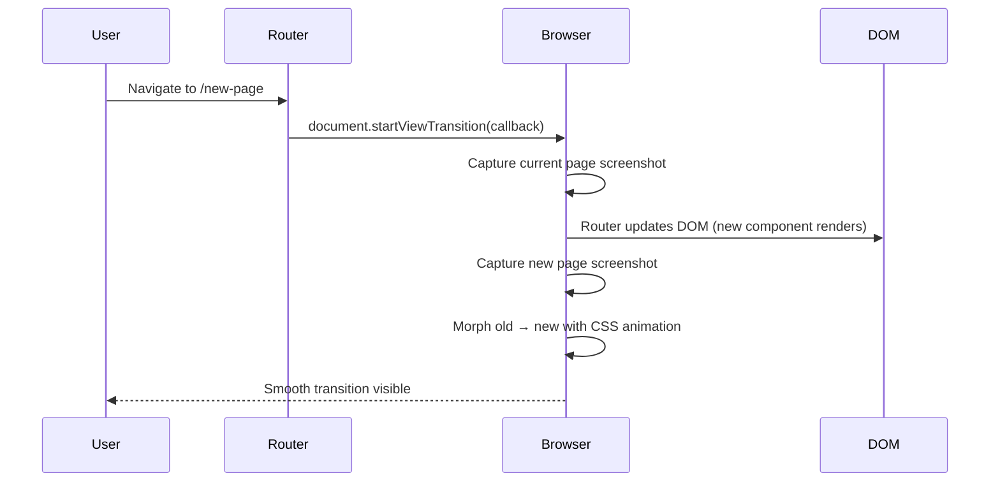
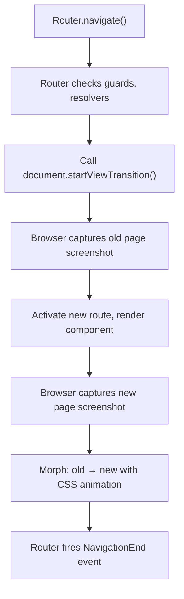
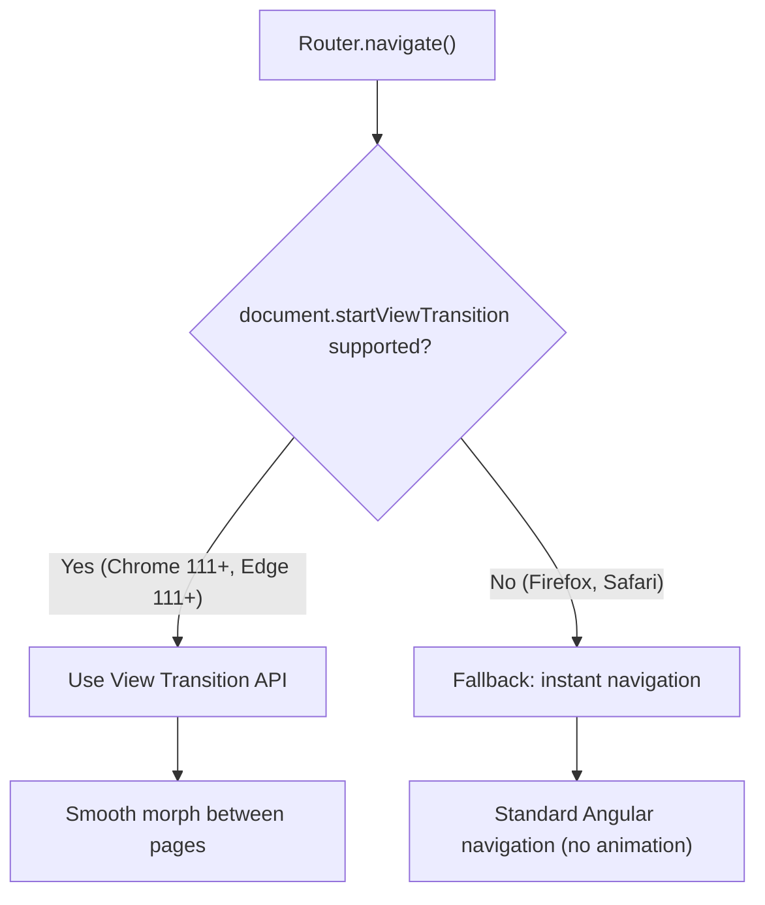

# Router View Transitions

> [!summary] Goal
> Add smooth page transitions between routes using the browser View Transition API (`withViewTransitions` in Angular 18+). Customize transition animations and handle fallbacks for unsupported browsers.

## Table of Contents

1. [How View Transitions Work](#how-view-transitions-work)
2. [Setup with Angular Router](#setup-with-angular-router)
3. [Customizing Transitions](#customizing-transitions)
4. [Per-Route Transitions](#per-route-transitions)
5. [Browser Support and Fallbacks](#browser-support-and-fallbacks)
6. [Pitfalls](#pitfalls)

---

## How View Transitions Work

The browser View Transition API (Chrome 111+, Edge 111+) captures a snapshot of the current page before the DOM updates, morphs it into the new page snapshot, and animates between them.



### Without vs with View Transitions

| Aspect | Regular navigation | With View Transitions |
|--------|-------------------|----------------------|
| **Visual** | Instant swap (flash of white) | Smooth morph between pages |
| **Performance** | Fast (no extra work) | Negligible overhead (hardware composited) |
| **Implementation** | Zero code | `withViewTransitions()` + optional CSS |
| **Browser support** | All browsers | Chrome/Edge 111+, limited Safari/Firefox |
| **Accessibility** | Neutral | Respects `prefers-reduced-motion` |

---

## Setup with Angular Router

### Enable view transitions globally

```typescript
// app.routes.ts
import { provideRouter, withViewTransitions } from '@angular/router';

export const appRoutes: Routes = [
  { path: '', component: HomeComponent },
  { path: 'about', component: AboutComponent },
  { path: 'contact', component: ContactComponent },
];

export const appConfig: ApplicationConfig = {
  providers: [
    provideRouter(
      appRoutes,
      withViewTransitions({
        // Optional: callback when the transition is created
        onViewTransitionCreated: (transitionInfo) => {
          console.log('Transition created:', transitionInfo);
        },
        // Optional: skip transitions for specific navigations
        skipInitialTransition: true,
      }),
    ),
  ],
};
```

### How Angular integrates



---

## Customizing Transitions

### CSS pseudo-elements

View Transitions expose CSS pseudo-elements for custom animations. Angular supports them via global styles:

```scss
// styles.scss — custom transition animation

// Default crossfade (works without custom CSS)
::view-transition-old(root) {
  animation: 300ms ease-out both fadeOut;
}
::view-transition-new(root) {
  animation: 300ms ease-in both fadeIn;
}

@keyframes fadeOut {
  from { opacity: 1; }
  to { opacity: 0; }
}
@keyframes fadeIn {
  from { opacity: 0; }
  to { opacity: 1; }
}
```

### Named view transitions (shared elements)

For shared elements that should "morph" between pages (e.g., a product card that expands into a detail page):

```typescript
// Assign view-transition-name to elements
@Component({
  template: `
    <div class="card" style="view-transition-name: product-card">
      
      <h3>{{ product.name }}</h3>
    </div>
  `,
})
export class ProductCardComponent { }
```

```scss
// The browser automatically morphs elements with matching view-transition-name
// No extra CSS needed for the morph — just the name must match on both pages

::view-transition-old(product-card) {
  animation: none;  // Hold old state
}
::view-transition-new(product-card) {
  animation: none;  // Hold new state
}
// Without animation, the browser smoothly morphs position/size
```

> [!tip] `view-transition-name` must be unique per page (no duplicate values). Use Angular's `@let` or a component ID to ensure uniqueness for repeated elements in lists.

### Respecting reduced motion

```scss
@media (prefers-reduced-motion: reduce) {
  ::view-transition-group(*),
  ::view-transition-old(*),
  ::view-transition-new(*) {
    animation: none !important;
  }
}
```

---

## Per-Route Transitions

Skip transitions for specific routes or customize per navigation:

```typescript
import { provideRouter, withViewTransitions } from '@angular/router';

export const appConfig: ApplicationConfig = {
  providers: [
    provideRouter(
      routes,
      withViewTransitions({
        onViewTransitionCreated: ({ transition }) => {
          // Skip transition for back/forward browser navigation
          if (navigation.type === 'traverse') {
            transition.skipTransition();
          }
        },
        // Don't animate on first load
        skipInitialTransition: true,
      }),
    ),
  ],
};
```

### Skip transition conditionally

```typescript
// In a component
constructor() {
  const router = inject(Router);
  const lastNavigation = inject(LastSuccessfulNavigation);  // Not a real token

  router.events.pipe(
    filter(event => event instanceof NavigationStart),
  ).subscribe(event => {
    if (event.navigationTrigger === 'popstate') {
      // Browser back/forward — skip transition (feels more natural)
      // This can be set via the onViewTransitionCreated callback
    }
  });
}
```

### Combine with Angular animations

```typescript
@Component({
  animations: [
    trigger('fadeSlide', [
      transition(':enter', [
        style({ opacity: 0, transform: 'translateY(20px)' }),
        animate('300ms ease-out'),
      ]),
    ]),
  ],
  template: `
    <div @fadeSlide *ngIf="data">
      <!-- Content with Angular animation inside a view transition -->
    </div>
  `,
})
export class DetailComponent { }
```

View transitions animate between **pages** (the whole document). Angular animations animate **elements within a page**. They can coexist — the view transition covers the page morph, while Angular animations handle individual element entries within the new page.

---

## Browser Support and Fallbacks



### Feature detection

```typescript
export function isViewTransitionSupported(): boolean {
  return 'startViewTransition' in document;
}
```

### Fallback strategy

View transitions degrade gracefully — unsupported browsers skip the transition entirely and perform a normal navigation. No extra code needed.

| Browser | View Transitions | Behavior |
|---------|-----------------|----------|
| Chrome 111+ | ✅ Full support | Morph animation |
| Edge 111+ | ✅ Full support | Morph animation |
| Opera 97+ | ✅ Full support | Morph animation |
| Safari 18+ | ⚠️ Partial | Limited support |
| Firefox | ❌ Not supported | Instant navigation (no animation) |
| Samsung Internet | ✅ Supported | Morph animation |

---

## Pitfalls

### Transition flash (white flash between pages)

If the new page takes time to render (async data loading), the browser shows a flash before the screenshot is captured.

**Fix**: Load data in resolvers before route activation. Use `skipInitialTransition: true` to avoid the flash on first load. Keep the old page visible until the new page is ready.

### `view-transition-name` collisions

If two elements on the same page have the same `view-transition-name`, the transition breaks.

**Fix**: Ensure unique names per page. For lists, append the item ID: `view-transition-name: product-{{ product.id }}`. Note that template expressions in `view-transition-name` may not work — use `@let` or `[style.view-transition-name]` binding.

### Not testing with `prefers-reduced-motion`

Users with motion sensitivity may experience dizziness. Always override transitions for `prefers-reduced-motion: reduce` and test with the accessibility settings enabled.

### Large page snapshots

On pages with heavy DOM, capturing the screenshot may cause a frame drop. Keep the initial rendered DOM lean (lazy load below-fold content) for smooth transitions.

---

> [!question]- Interview Questions
>
> **Q: What is the View Transition API and how does Angular integrate it?**
> A: The View Transition API (Chrome 111+) captures a screenshot of the current page before DOM updates and morphs it into the new page. Angular integrates it via `withViewTransitions()` in the `provideRouter` config.
>
> **Q: How do you customize view transition animations?**
> A: Use CSS pseudo-elements: `::view-transition-old(root)` for the outgoing page, `::view-transition-new(root)` for the incoming page. Apply custom `animation` properties. For shared elements, use `view-transition-name` CSS property to identify elements that should morph between pages.
>
> **Q: What happens in browsers that don't support View Transitions?**
> A: The browser ignores `startViewTransition()` and performs a normal instant navigation. No error is thrown. The feature degrades gracefully.
>
> **Q: Are view transitions the same as Angular animations?**
> A: No. View transitions animate between full page navigations (the document/root). Angular animations animate elements within a page (enter/leave, state changes). They can coexist — view transitions for page morphs, Angular animations for element entrances within the new page.
>
> **Q: How do you ensure accessibility with view transitions?**
> A: Use `@media (prefers-reduced-motion: reduce)` to disable transitions. Test with reduced motion enabled. Never rely solely on animations to convey information.

---

## Cross-Links

- [[Angular/01_Foundations/04_Routing_Basics]] for route configuration fundamentals
- [[Angular/02_Core/09_Angular_Animations]] for Angular's animation DSL
- [[Angular/03_Advanced/01_Change_Detection_and_Performance]] for render performance during transitions
- [[Angular/03_Advanced/04_SSR_Hydration_and_Prerendering]] for SSR considerations with view transitions
