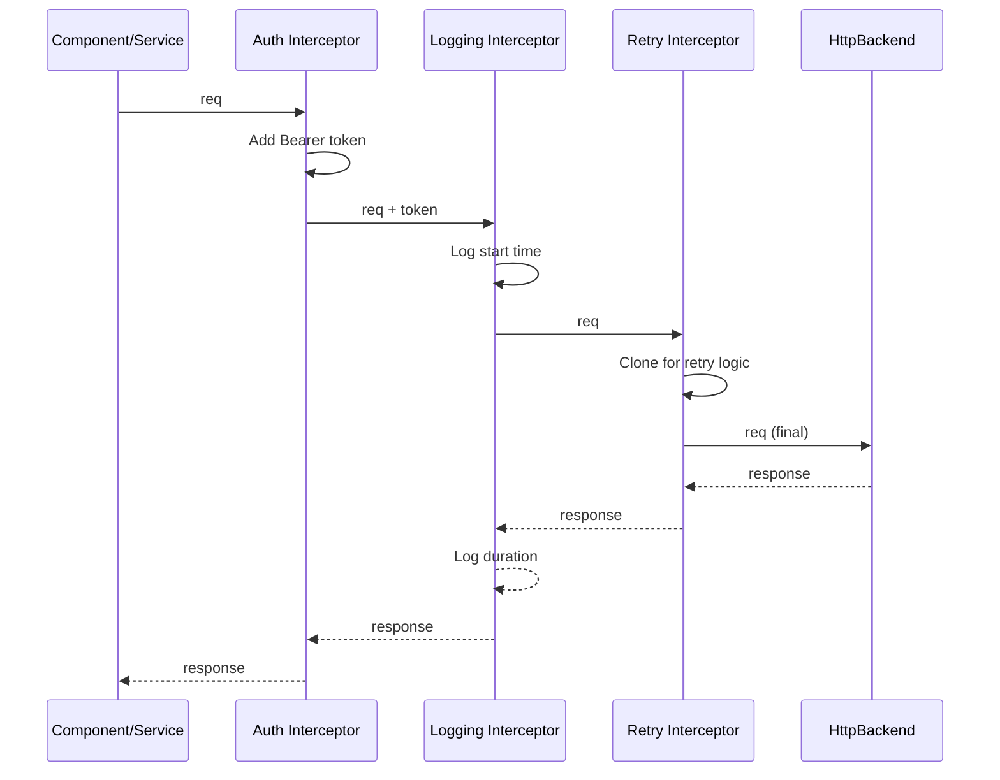

# Interceptors Deep Dive

> [!summary] Goal
> Master Angular functional interceptors (`HttpInterceptorFn`): request/response transformation, `HttpContextToken` for per-request metadata, retry with exponential backoff, caching, upload/download progress events, the `HttpEvent` stream, and interceptor testing.

## Table of Contents

1. [Interceptor Pipeline and Execution Order](#interceptor-pipeline-and-execution-order)
2. [HttpContextToken — Per-Request Metadata](#httpcontexttoken--per-request-metadata)
3. [Retry Patterns (Exponential Backoff)](#retry-patterns-exponential-backoff)
4. [Caching Interceptors](#caching-interceptors)
5. [Progress Events (Upload/Download)](#progress-events-uploaddownload)
6. [Error Normalization and Correlation IDs](#error-normalization-and-correlation-ids)
7. [Interceptor Testing](#interceptor-testing)

---

## Interceptor Pipeline and Execution Order

> [!info] Interceptor pipeline
> Interceptors form a chain. Each interceptor receives the request and a `next` function to pass the request to the next interceptor in the chain. The order in `withInterceptors([])` determines the execution order. Requests travel FORWARD through the chain; responses travel BACKWARD.



```typescript
// Interceptor order — set in app.config.ts:
provideHttpClient(
  withInterceptors([
    authInterceptor,        // Runs FIRST (outgoing), LAST (incoming)
    loggingInterceptor,     // Runs SECOND (outgoing), SECOND-LAST (incoming)
    retryInterceptor,       // Runs THIRD (outgoing), FIRST (incoming)
  ])
);
// Request flow: auth → logging → retry → backend
// Response flow: backend → retry → logging → auth → component
```

### `HttpInterceptorFn` signature

```typescript
import { HttpInterceptorFn } from '@angular/common/http';

export const myInterceptor: HttpInterceptorFn = (req, next) => {
  // req: HttpRequest<any> — immutable, use req.clone()
  // next: HttpHandlerFn — pass the (possibly modified) request

  // Modify request:
  const modifiedReq = req.clone({ ... });

  // Pass to next interceptor:
  return next(modifiedReq).pipe(
    // Transform the response stream
  );
};
```

---

## `HttpContextToken` — Per-Request Metadata

> [!info] HttpContextToken
> `HttpContextToken` lets you pass metadata from the calling code to interceptors WITHOUT changing the request signature. This is how you tell an interceptor "skip auth for this request" or "use cache for this request."

```typescript
// Define tokens:
import { HttpContextToken } from '@angular/common/http';

export const SKIP_AUTH = new HttpContextToken<boolean>(() => false);
export const CACHE_TTL = new HttpContextToken<number>(() => 300_000);
export const RETRY_COUNT = new HttpContextToken<number>(() => 3);

// Use tokens in the service:
this.http.get('/api/public/data', {
  context: new HttpContext()
    .set(SKIP_AUTH, true)       // Auth interceptor will skip this
    .set(CACHE_TTL, 60_000)     // Cache for 60 seconds
    .set(RETRY_COUNT, 0),       // No retries for this request
});

// Read tokens in the interceptor:
export const authInterceptor: HttpInterceptorFn = (req, next) => {
  if (req.context.get(SKIP_AUTH)) return next(req);  // Skip auth
  const token = inject(AuthService).getToken();
  return next(req.clone({ setHeaders: { Authorization: `Bearer ${token}` } }));
};
```

---

## Retry Patterns (Exponential Backoff)

```typescript
import { HttpInterceptorFn, HttpErrorResponse } from '@angular/common/http';
import { retry, timer, delay, mergeMap, throwError, Observable } from 'rxjs';

export const retryInterceptor: HttpInterceptorFn = (req, next) => {
  const maxRetries = req.context.get(CACHE_RETRY_COUNT) ?? 3;

  return next(req).pipe(
    retry({
      count: maxRetries,
      delay: (error, retryCount) => {
        // Only retry on server errors (5xx), not client errors (4xx)
        if (error instanceof HttpErrorResponse && error.status >= 500) {
          // Exponential backoff: 1s, 2s, 4s, 8s...
          const delayMs = Math.pow(2, retryCount) * 1000;
          // Add jitter: randomize within ±50% to prevent thundering herd
          const jitter = Math.random() * delayMs;
          return timer(delayMs + jitter);
        }
        return throwError(() => error);  // Don't retry 4xx errors
      },
    })
  );
};
```

---

## Caching Interceptors

```typescript
import { HttpInterceptorFn, HttpContextToken } from '@angular/common/http';
import { of, tap } from 'rxjs';

// In-memory cache with TTL:
const cache = new Map<string, { data: any; expiry: number }>();
export const CACHE_TTL = new HttpContextToken<number>(() => 0);

export const cacheInterceptor: HttpInterceptorFn = (req, next) => {
  // Only cache GET requests
  if (req.method !== 'GET') return next(req);

  const ttl = req.context.get(CACHE_TTL);
  if (ttl <= 0) return next(req);  // No caching requested

  const cacheKey = req.urlWithParams;
  const cached = cache.get(cacheKey);

  // Return cached response if still valid
  if (cached && cached.expiry > Date.now()) {
    return of(cached.data);
  }

  // Skip stale cache entry
  return next(req).pipe(
    tap(response => {
      cache.set(cacheKey, { data: response, expiry: Date.now() + ttl });
    }),
  );
};
```

---

## Progress Events (Upload/Download)

```typescript
import { HttpEventType, HttpInterceptorFn } from '@angular/common/http';
import { filter, map, tap } from 'rxjs';

// Interceptor that logs upload/download progress:
export const progressInterceptor: HttpInterceptorFn = (req, next) => {
  return next(req).pipe(
    tap(event => {
      if (event.type === HttpEventType.UploadProgress) {
        const percent = Math.round(100 * event.loaded / (event.total ?? 1));
        console.log(`Upload: ${percent}%`);
      }
      if (event.type === HttpEventType.DownloadProgress) {
        const percent = Math.round(100 * event.loaded / (event.total ?? 1));
        console.log(`Download: ${percent}%`);
      }
      if (event.type === HttpEventType.Response) {
        console.log(`Response received: ${event.status}`);
      }
    }),
  );
};

// Or filter specific events in component:
this.http.get('/api/large-file', { reportProgress: true, observe: 'events' }).pipe(
  filter(event => event.type === HttpEventType.DownloadProgress),
  map(event => event as HttpDownloadProgressEvent),
);
// Cast to HttpDownloadProgressEvent — event.loaded, event.total
```

---

## Error Normalization and Correlation IDs

```typescript
import { HttpInterceptorFn } from '@angular/common/http';
import { catchError, throwError } from 'rxjs';

// Error normalization interceptor:
export const errorInterceptor: HttpInterceptorFn = (req, next) => {
  return next(req).pipe(
    catchError((error: HttpErrorResponse) => {
      let normalizedError: AppError;

      if (error.error instanceof ErrorEvent) {
        // Client-side error (network error, timeout)
        normalizedError = { message: 'Network error. Please check your connection.', code: 'NETWORK_ERROR' };
      } else {
        // Server-side error
        normalizedError = {
          message: error.error?.message ?? `Server error (${error.status})`,
          code: error.error?.code ?? `HTTP_${error.status}`,
          details: error.error,
        };
      }
      return throwError(() => normalizedError);
    }),
  );
};

// Correlation ID interceptor (tracing across requests):
export const correlationInterceptor: HttpInterceptorFn = (req, next) => {
  const correlationId = crypto.randomUUID();

  const clonedReq = req.clone({
    setHeaders: { 'X-Correlation-Id': correlationId },
  });

  return next(clonedReq).pipe(
    tap({
      error: (err) => {
        console.error(`[${correlationId}] Request failed: ${req.method} ${req.url}`);
      },
    }),
  );
};
```

---

## Interceptor Testing

```typescript
import { TestBed } from '@angular/core/testing';
import { HttpClientTestingModule, HttpTestingController } from '@angular/common/http/testing';
import { HTTP_INTERCEPTORS, HttpClient, HttpRequest } from '@angular/common/http';
import { authInterceptor } from './auth.interceptor';
import { AuthService } from './auth.service';

describe('authInterceptor', () => {
  let httpClient: HttpClient;
  let httpController: HttpTestingController;
  let authService: jasmine.SpyObj<AuthService>;

  beforeEach(() => {
    authService = jasmine.createSpyObj('AuthService', ['getToken']);
    authService.getToken.and.returnValue('test-token-123');

    TestBed.configureTestingModule({
      providers: [
        provideHttpClient(
          withInterceptors([authInterceptor]),
        ),
        { provide: AuthService, useValue: authService },
      ],
    });

    httpClient = TestBed.inject(HttpClient);
    httpController = TestBed.inject(HttpTestingController);
  });

  it('should add Authorization header', () => {
    httpClient.get('/api/data').subscribe();

    const req = httpController.expectOne('/api/data');
    expect(req.request.headers.get('Authorization')).toBe('Bearer test-token-123');
    req.flush({});
  });

  it('should not add token when SKIP_AUTH is set', () => {
    httpClient.get('/api/public', {
      context: new HttpContext().set(SKIP_AUTH, true),
    }).subscribe();

    const req = httpController.expectOne('/api/public');
    expect(req.request.headers.has('Authorization')).toBeFalse();
    req.flush({});
  });

  afterEach(() => httpController.verify());
});
```

---

## Cross-Links

- [[Angular/02_Core/04_HttpClient_and_Interceptors]] for HttpClient setup and base interceptors
- [[Angular/01_Foundations/03_DI_Services_and_Providers]] for `inject()` patterns
- [[Angular/03_Advanced/02_Testing_Angular_Components]] for `HttpTestingController` setup
- [[Angular/02_Core/13_Error_Handling]] for error handling strategies
