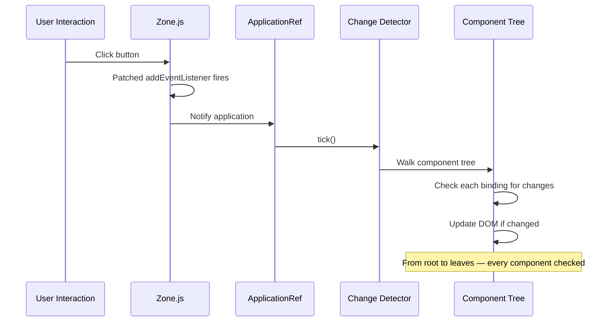
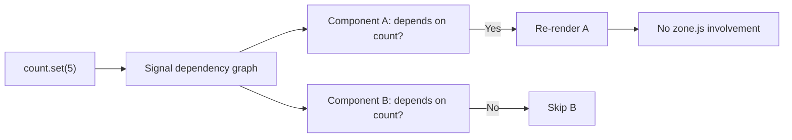

# Change Detection and Performance

> [!summary] Goal
> Understand how Angular detects changes, use OnPush strategy, optimize with signals, and measure performance with Angular DevTools.

## Table of Contents

1. [How Change Detection Works](#how-change-detection-works)
2. [`ChangeDetectionStrategy.OnPush`](#changedetectionstrategy-onpush)
3. [`ChangeDetectorRef`](#changedetectorref)
4. [`NgZone` — Running Outside Angular](#ngzone-running-outside-angular)
5. [Signal-Based Change Detection](#signal-based-change-detection)
6. [Performance Measurement](#performance-measurement)
7. [`@defer` for Render Optimization](#defer-for-render-optimization)
8. [Pitfalls](#pitfalls)

---

## How Change Detection Works

Angular uses **Zone.js** to monkey-patch browser APIs (`setTimeout`, `addEventListener`, `fetch`). After any async operation, Zone tells Angular to run change detection:



### Default behavior

- Every async event triggers a full tree traversal
- Each component's bindings are checked for changes
- The DOM is updated where values differ
- This is **conservative** (always correct) but can be **slow**

---

## `ChangeDetectionStrategy.OnPush`

`OnPush` tells Angular to skip a component and its subtree UNLESS one of these occurs:

| Trigger | Description |
|---------|-------------|
| **`@Input` reference changes** | A new object reference is set (not mutation) |
| **Event in the component** | A click, keyup, etc. inside this component |
| **`async` pipe emits** | An Observable bound with `\| async` emits a new value |
| **`markForCheck()` called** | Explicitly mark the component as dirty |
| **Signal updates** | A signal read in the template changes |

```typescript
import { ChangeDetectionStrategy } from '@angular/core';

@Component({
  selector: 'app-user-card',
  standalone: true,
  changeDetection: ChangeDetectionStrategy.OnPush,  // 👈
  template: `{{ user().name }} — {{ items$ | async }}`,
})
export class UserCardComponent {
  // Signal — triggers CD when value changes
  user = input.required<User>();

  // Observable with async pipe — triggers CD on emission
  items$ = this.http.get<Item[]>('/api/items').pipe(shareReplay(1));
}
```

```mermaid
flowchart TD
    A[Change detection triggered] --> B{OnPush component?}
    B -->|No (Default)| C[Check ALL bindings]
    B -->|Yes| D{Input reference changed?}
    D -->|Yes| E[Check this component]
    D -->|No| F{Event in component?}
    F -->|Yes| E
    F -->|No| G{async pipe emitted?}
    G -->|Yes| E
    G -->|No| H{markForCheck called?}
    H -->|Yes| E
    H -->|No| I[Skip this subtree]
    C --> J[Update DOM where changed]
    E --> J
```

### OnPush example — immutable data pattern

```typescript
@Component({
  changeDetection: ChangeDetectionStrategy.OnPush,
  template: `{{ user.name }}`,
})
export class UserDetailComponent {
  // ❌ Mutation doesn't trigger CD
  updateName(name: string) {
    this.user.name = name;  // Same reference — no check!
  }

  // ✅ New reference triggers CD
  updateName(name: string) {
    this.user = { ...this.user, name };  // New object — triggers check!
  }
}
```

---

## `ChangeDetectorRef`

`ChangeDetectorRef` gives you manual control over change detection:

```typescript
@Component({ ... })
export class ManualComponent {
  private cdr = inject(ChangeDetectorRef);

  // Mark this component and ancestors as dirty — check on next tick
  refresh() {
    this.cdr.markForCheck();
  }

  // Run change detection immediately on this subtree
  detectChanges() {
    this.cdr.detectChanges();
  }

  // Detach from the change detection tree — no more checks
  detach() {
    this.cdr.detach();
  }

  // Reattach to the tree
  reattach() {
    this.cdr.reattach();
  }

  // Verify mode — check for changes and throw if found (dev only)
  checkNoChanges() {
    this.cdr.checkNoChanges();
  }
}
```

| Method | Effect |
|--------|--------|
| `markForCheck()` | Marks the component path as dirty — CD will check on next tick |
| `detectChanges()` | Runs CD immediately on this component and children |
| `detach()` | Removes component from the CD tree |
| `reattach()` | Puts it back |
| `checkNoChanges()` | Dev mode — checks for changes after CD and throws if found |

---

## `NgZone` — Running Outside Angular

```typescript
@Component({ ... })
export class HeavyComponent implements OnInit {
  private ngZone = inject(NgZone);
  private http = inject(HttpClient);

  ngOnInit() {
    // Set up a recurring timer outside Angular zone
    this.ngZone.runOutsideAngular(() => {
      setInterval(() => {
        // This runs outside zone — no change detection triggered
        console.log('Tick');

        // When you need to update the UI, re-enter the zone
        this.ngZone.run(() => {
          this.tickCount++;
          this.cdr.markForCheck();
        });
      }, 1000);
    });
  }
}
```

### When to use `runOutsideAngular`

- Frequent timers (animations, polling)
- Mouse tracking (mousemove)
- WebSocket messages
- Third-party libraries with their own change detection

---

## Signal-Based Change Detection

Angular 17+ signals can trigger change detection **without Zone.js**:

```typescript
@Component({
  changeDetection: ChangeDetectionStrategy.OnPush,
  template: `{{ count() }}`,
})
export class CounterComponent {
  count = signal(0);

  increment() {
    // This triggers change detection directly via the signal graph
    // Zone.js is NOT needed — the component knows it depends on count()
    this.count.update(v => v + 1);
  }
}
```



When ALL components in a subtree use signals + OnPush, the zone.js check for that subtree is skipped entirely.

---

## Performance Measurement

### Angular DevTools

```bash
ng serve
# Open Chrome DevTools → Angular tab → Profiler
```

1. Record a session (click record, interact, stop)
2. View the change detection flame chart
3. Identify components that check too often
4. Apply `OnPush`, `trackBy`, or signals

### Key metrics

| Metric | Target | How to improve |
|--------|--------|---------------|
| Change detection cycles per interaction | < 3 | OnPush, signals |
| Component tree walk duration | < 10ms | OnPush, detach heavy subtrees |
| Bundle size (initial) | < 200KB | `@defer`, lazy routes |
| Re-renders per interaction | < 5 | `trackBy`, memoized selects |

---

## `@defer` for Render Optimization

`@defer` (Angular 17+) defers rendering of heavy components:

```html
@defer (on viewport) {
  <app-heavy-chart />
} @placeholder {
  <div class="h-48 animate-pulse bg-gray-200 rounded"></div>
} @loading {
  <app-spinner />
}

@defer (on interaction) {
  <app-comments />
} @placeholder {
  <button (click)="showComments.set(true)">Show Comments</button>
}
```

---

## Pitfalls

### Mutating objects with OnPush

```typescript
this.items.push(newItem);        // ❌ Same array reference — no CD
this.items = [...this.items, newItem];  // ✅ New reference — triggers CD
```

### `detectChanges()` called too often

`detectChanges()` runs CD synchronously. In a loop, each iteration triggers a full check.

**Fix**: Call `markForCheck()` once at the end instead.

### Zone.js not loading

If `zone.js` is not polyfilled, async operations don't trigger change detection.

**Fix**: Ensure `zone.js` is in the `polyfills` array in `angular.json`.

---

> [!question]- Interview Questions
>
> **Q: How does Angular's default change detection work?**
> A: Zone.js monkey-patches browser async APIs. After each async operation, `ApplicationRef.tick()` walks the entire component tree and checks every binding for changes. The DOM is updated where values differ.
>
> **Q: What is the difference between Default and OnPush change detection?**
> A: Default checks every component on every async event. OnPush only checks when: @Input reference changes, component event fires, async pipe emits, markForCheck() is called, or a signal dependency updates.
>
> **Q: What is `runOutsideAngular` used for?**
> A: It runs a callback outside the Angular zone — async operations inside it don't trigger change detection. Used for frequent events (mousemove, WebSocket messages, timers) where you don't want Angular checking the entire tree.

---

## Cross-Links

- [[Angular/02_Core/02_Signals_Essentials]] for signal-based CD
- [[Angular/01_Foundations/02_Components_Templates_and_Data_Binding]] for OnPush components
- [[Angular/04_Playbooks/01_Debug_ChangeDetection_and_Perf]] for debugging CD
