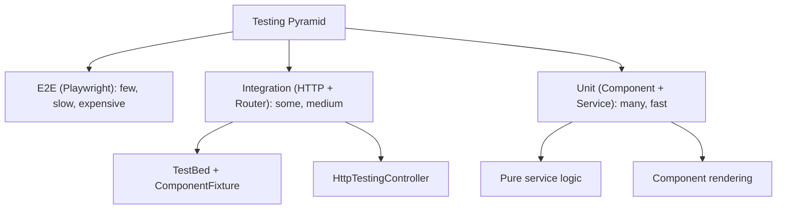
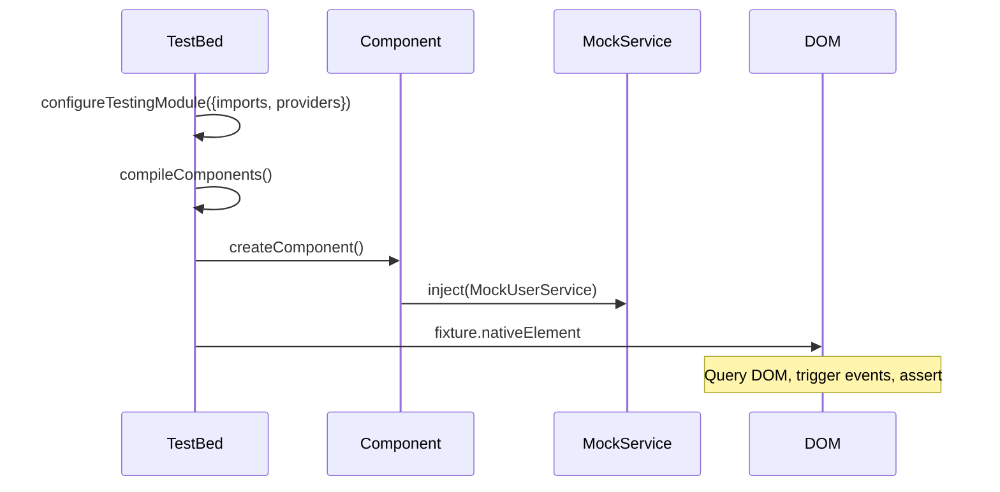

# Testing Angular Components

> [!summary] Goal
> Test Angular components, services, and HTTP calls using TestBed, ComponentFixture, and Jasmine. Cover component rendering, async behavior, and HTTP mocking.

## Table of Contents

1. [Why Testing Matters](#why-testing-matters)
2. [The Testing Pyramid for Angular](#the-testing-pyramid-for-angular)
3. [Setting Up TestBed](#setting-up-testbed)
4. [ComponentFixture](#componentfixture)
5. [Testing Async Code](#testing-async-code)
6. [HTTP Testing](#http-testing)
7. [Component Harnesses](#component-harnesses)
8. [Route Testing](#route-testing)
9. [Pitfalls](#pitfalls)

---

## Why Testing Matters

Angular's `TestBed` creates a test module that mimics the real Angular module system. You can test components in isolation with mocked services.



| Test type | Tools | Speed | Coverage |
|-----------|-------|-------|----------|
| **Unit** | Jasmine + `TestBed` | Fast (ms) | Isolated component/service |
| **Integration** | `HttpTestingController` + Router harness | Medium | Component + HTTP + routing |
| **E2E** | Playwright/Cypress | Slow (s) | User flows across the app |

---

## Why Testing Matters

Angular's `TestBed` creates a test module that mimics the real Angular module system. You can test components in isolation with mocked services.

---

## Setting Up TestBed

### TestBed is a mini Angular module for testing



```typescript
import { TestBed } from '@angular/core/testing';
import { provideHttpClientTesting } from '@angular/common/http/testing';

describe('UserCardComponent', () => {
  beforeEach(async () => {
    await TestBed.configureTestingModule({
      imports: [UserCardComponent],           // Standalone component
      providers: [
        provideHttpClientTesting(),           // Mock HTTP
        { provide: UserService, useClass: MockUserService },
      ],
    }).compileComponents();
  });
});
```

### For NgModule-based code

```typescript
TestBed.configureTestingModule({
  declarations: [UserCardComponent],           // Declare the component
  imports: [CommonModule],
  providers: [{ provide: UserService, useClass: MockUserService }],
}).compileComponents();
```

---

## ComponentFixture

```typescript
describe('UserCardComponent', () => {
  let fixture: ComponentFixture<UserCardComponent>;
  let component: UserCardComponent;

  beforeEach(() => {
    fixture = TestBed.createComponent(UserCardComponent);
    component = fixture.componentInstance;

    // Set @Input values
    fixture.componentRef.setInput('user', { id: 1, name: 'Alice' });

    // Trigger change detection
    fixture.detectChanges();
  });

  it('should display user name', () => {
    const compiled = fixture.nativeElement as HTMLElement;
    expect(compiled.querySelector('.name')?.textContent).toContain('Alice');
  });

  it('should emit edit event on button click', () => {
    spyOn(component.edit, 'emit');

    const button = fixture.debugElement.query(By.css('[data-testid="edit-btn"]'));
    button.nativeElement.click();

    expect(component.edit.emit).toHaveBeenCalledWith(1);  // user.id
  });
});
```

### Common fixture patterns

```typescript
// Query elements
const debugEl = fixture.debugElement.query(By.css('.name'));
const nativeEl: HTMLElement = fixture.nativeElement;

// Trigger change detection
fixture.detectChanges();           // Run CD (needs to be called manually)
fixture.autoDetectChanges();       // Auto-detect changes (slower)

// Wait for async
fixture.whenStable().then(() => { ... });

// Component reference
fixture.componentInstance.someMethod();
fixture.componentRef.setInput('prop', value);  // Set @Input
```

---

## Testing Async Code

### `fakeAsync` and `tick`

```typescript
import { fakeAsync, tick, flush } from '@angular/core/testing';

describe('LoginComponent', () => {
  it('should debounce input', fakeAsync(() => {
    const component = fixture.componentInstance;
    const input = fixture.nativeElement.querySelector('input');

    // Type quickly
    input.value = 'al';
    input.dispatchEvent(new Event('input'));

    // Simulate 300ms debounce
    tick(300);

    // Type more
    input.value = 'alice';
    input.dispatchEvent(new Event('input'));
    tick(300);

    // Flush pending timers
    flush();
  }));
});
```

### `async` / `await` pattern

```typescript
it('should load data on init', async () => {
  fixture.detectChanges();       // Triggers ngOnInit
  await fixture.whenStable();     // Wait for async operations
  fixture.detectChanges();       // Update view with data
  expect(fixture.nativeElement.textContent).toContain('Data loaded');
});
```

---

## HTTP Testing

```typescript
import { provideHttpClientTesting, HttpTestingController } from '@angular/common/http/testing';

describe('UserService', () => {
  let service: UserService;
  let httpMock: HttpTestingController;

  beforeEach(() => {
    TestBed.configureTestingModule({
      providers: [
        UserService,
        provideHttpClient(withInterceptors([authInterceptor])),
        provideHttpClientTesting(),
      ],
    });

    service = TestBed.inject(UserService);
    httpMock = TestBed.inject(HttpTestingController);
  });

  afterEach(() => {
    httpMock.verify();  // No outstanding requests
  });

  it('should fetch users', () => {
    const mockUsers = [{ id: 1, name: 'Alice' }];

    service.getUsers().subscribe(users => {
      expect(users).toEqual(mockUsers);
    });

    const req = httpMock.expectOne('/api/users');
    expect(req.request.method).toBe('GET');
    expect(req.request.headers.get('Authorization')).toBe('Bearer test-token');

    req.flush(mockUsers);  // Provide mock response
  });

  it('should handle error', () => {
    service.getUsers().subscribe({
      error: (err) => expect(err.status).toBe(404),
    });

    const req = httpMock.expectOne('/api/users');
    req.flush('Not found', { status: 404, statusText: 'Not Found' });
  });
});
```

---

## Component Harnesses

`@angular/cdk/testing` provides a test API that works across unit and E2E tests:

```typescript
import { HarnessLoader } from '@angular/cdk/testing';
import { TestbedHarnessEnvironment } from '@angular/cdk/testing/testbed';
import { MatButtonHarness } from '@angular/material/button/testing';

describe('ButtonComponent', () => {
  let loader: HarnessLoader;

  beforeEach(() => {
    fixture = TestBed.createComponent(ButtonComponent);
    loader = TestbedHarnessEnvironment.loader(fixture);
  });

  it('should click button via harness', async () => {
    const button = await loader.getHarness(MatButtonHarness);
    await button.click();
    expect(await button.getText()).toBe('Click me');
  });
});
```

---

## Route Testing

```typescript
import { provideRouter, Router, Routes } from '@angular/router';
import { RouterTestingHarness } from '@angular/router/testing';

describe('UserDetailComponent', () => {
  let harness: RouterTestingHarness;

  beforeEach(async () => {
    TestBed.configureTestingModule({
      imports: [UserDetailComponent],
      providers: [
        provideRouter([
          { path: 'users/:id', component: UserDetailComponent },
        ]),
      ],
    });

    harness = await RouterTestingHarness.create();
  });

  it('should display user by route param', async () => {
    const component = await harness.navigateByUrl('/users/42', UserDetailComponent);
    expect(component).toBeTruthy();
    // Component's id @Input is 42 (with withComponentInputBinding)
  });
});
```

---

## Testing with Zoneless

```typescript
import { provideZonelessChangeDetection } from '@angular/core';

describe('SignalComponent with zoneless', () => {
  beforeEach(async () => {
    await TestBed.configureTestingModule({
      imports: [SignalComponent],
      providers: [
        provideZonelessChangeDetection(),
      ],
    }).compileComponents();

    fixture = TestBed.createComponent(SignalComponent);
  });

  it('should update view when signal changes', async () => {
    const component = fixture.componentInstance;
    component.count.set(5);

    // With zoneless, we still need detectChanges to render
    fixture.detectChanges();
    await fixture.whenStable();

    expect(fixture.nativeElement.textContent).toContain('Count: 5');
  });

  it('should work with fakeAsync', fakeAsync(() => {
    const component = fixture.componentInstance;

    component.loadData();
    tick(1000);
    fixture.detectChanges();

    expect(fixture.nativeElement.textContent).toContain('Loaded');
  }));
});
```

---

## Testing `@if` / `@for` Control Flow

```typescript
@Component({
  standalone: true,
  template: `
    @if (isAdmin) {
      <p class="admin-badge">Admin</p>
    } @else {
      <p class="user-badge">User</p>
    }

    @for (item of items; track item.id) {
      <div class="item">{{ item.name }}</div>
    } @empty {
      <p class="empty">No items</p>
    }
  `,
})
class TestControlFlowComponent {
  isAdmin = false;
  items: { id: number; name: string }[] = [];
}
```

```typescript
describe('Built-in control flow testing', () => {
  let fixture: ComponentFixture<TestControlFlowComponent>;

  beforeEach(() => {
    fixture = TestBed.createComponent(TestControlFlowComponent);
    fixture.detectChanges();
  });

  it('should render @if block', () => {
    const badge = fixture.nativeElement.querySelector('.admin-badge');
    expect(badge).toBeFalsy();  // User, not admin

    fixture.componentInstance.isAdmin = true;
    fixture.detectChanges();

    const adminBadge = fixture.nativeElement.querySelector('.admin-badge');
    expect(adminBadge).toBeTruthy();
    expect(adminBadge.textContent).toBe('Admin');
  });

  it('should render @for with items', () => {
    fixture.componentInstance.items = [
      { id: 1, name: 'Item 1' },
      { id: 2, name: 'Item 2' },
    ];
    fixture.detectChanges();

    const rendered = fixture.nativeElement.querySelectorAll('.item');
    expect(rendered.length).toBe(2);
    expect(rendered[0].textContent).toBe('Item 1');
  });

  it('should render @empty when no items', () => {
    const empty = fixture.nativeElement.querySelector('.empty');
    expect(empty).toBeTruthy();
    expect(empty.textContent).toBe('No items');
  });
});
```

---

## Pitfalls

### Not calling `fixture.detectChanges()`

TestBed doesn't run change detection automatically. Without `detectChanges()`, the template doesn't render.

**Fix**: Call `fixture.detectChanges()` after setting up inputs or triggering async operations.

### `compileComponents()` not awaited in async beforeEach

```typescript
beforeEach(async () => {
  TestBed.configureTestingModule({ imports: [Component] });
  // ❌ Forgot await — components aren't compiled
  TestBed.compileComponents();
});
```

### HTTP testing without `verify()`

If a test makes an HTTP request but doesn't handle it, the test still passes — the error is swallowed.

**Fix**: Call `httpMock.verify()` in `afterEach` to assert no unmatched requests.

---

> [!question]- Interview Questions
>
> **Q: What is `TestBed`?**
> A: TestBed is Angular's primary testing API. It configures a test module that mimics the real Angular module system — you can provide mocks, import components, and compile templates for testing.
>
> **Q: What is the difference between `fixture.detectChanges()` and `fixture.autoDetectChanges()`?**
> A: `detectChanges()` runs change detection once manually — you control when it happens. `autoDetectChanges()` runs it automatically after each async task — easier but slower.
>
> **Q: How do you test HTTP calls in Angular?**
> A: Use `provideHttpClientTesting()` and inject `HttpTestingController`. Call `expectOne(url)` to assert a request was made, then `flush(mockData)` to provide the response. Call `verify()` in `afterEach` to ensure no outstanding requests.

---

## Cross-Links

- [[Angular/02_Core/04_HttpClient_and_Interceptors]] for HTTP testing
- [[Angular/03_Advanced/01_Change_Detection_and_Performance]] for CD in tests
- [[Angular/04_Playbooks/03_HTTP_Interceptors_Auth_and_Retries]] for testing interceptors
