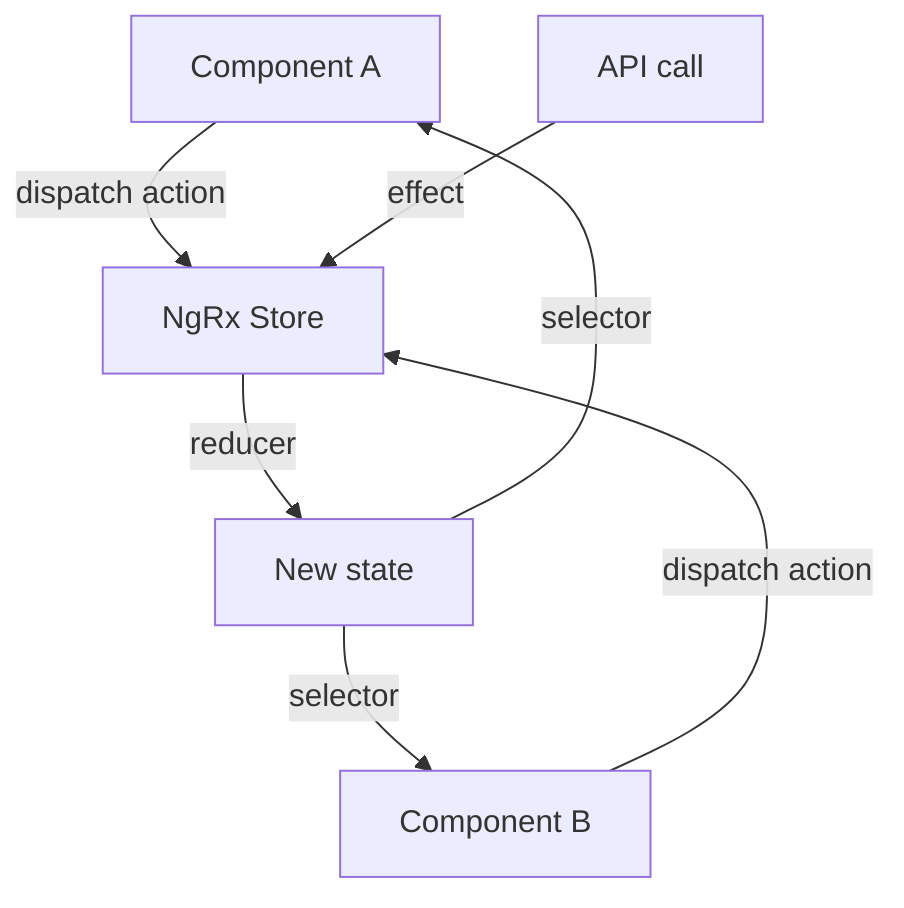
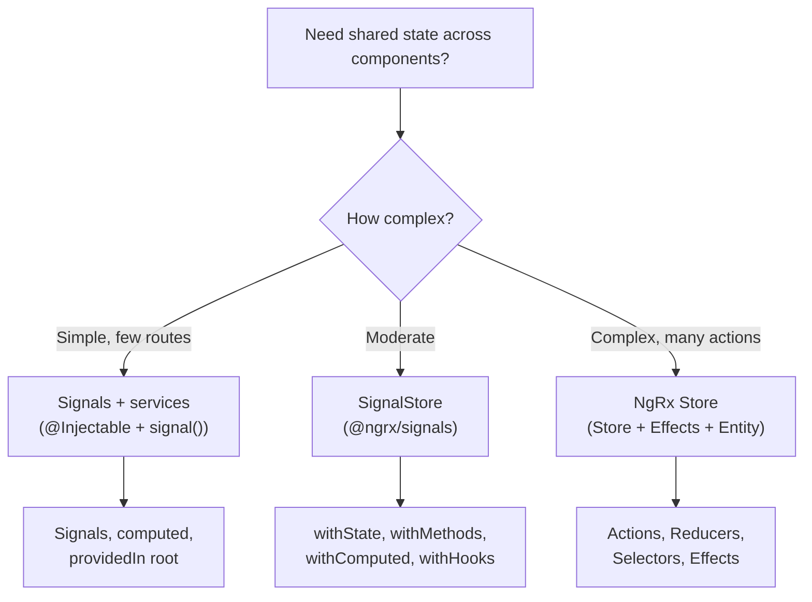

# State Management: NgRx and SignalStore

> [!summary] Goal
> Manage application state with NgRx (Store, Effects, Entity) and the modern SignalStore pattern. Understand when to use each approach and how to structure state for scalable applications.

## Table of Contents

1. [Why State Management Matters](#why-state-management-matters)
2. [When to Use State Management](#when-to-use-state-management)
3. [NgRx: Store, Actions, Reducers, Selectors](#ngrx-store-actions-reducers-selectors)
4. [NgRx: Effects](#ngrx-effects)
5. [SignalStore (@ngrx/signals)](#signalstore)
6. [State Management Comparison](#state-management-comparison)
7. [Pitfalls](#pitfalls)

---

## Why State Management Matters

As applications grow, component-level state and shared services become hard to coordinate. State management centralizes state, makes data flow predictable, and simplifies debugging.



---

## When to Use State Management



| Pattern | Lines of code | Learning curve | When to use |
|---------|--------------|----------------|-------------|
| Signals in services | Low | Low | Simple shared state, user preferences |
| SignalStore | Medium | Medium | Feature-level state, moderate complexity |
| NgRx Store | High | High | Global app state, complex action flows, dev tools |

---

## NgRx: Store, Actions, Reducers, Selectors

### Setup

```bash
ng add @ngrx/store@latest
ng add @ngrx/effects@latest
ng add @ngrx/entity@latest
ng add @ngrx/store-devtools@latest
```

```typescript
import { isDevMode } from '@angular/core';
import { provideStore } from '@ngrx/store';
import { provideEffects } from '@ngrx/effects';
import { provideStoreDevtools } from '@ngrx/store-devtools';
import { provideRouterStore, routerReducer } from '@ngrx/router-store';

export const appConfig: ApplicationConfig = {
  providers: [
    provideStore({
      users: userReducer,
      router: routerReducer,
    }),
    provideEffects([UserEffects]),
    provideStoreDevtools({ maxAge: 25, logOnly: !isDevMode() }),
    provideRouterStore(),
  ],
};
```

### Actions

```typescript
import { createActionGroup, emptyProps, props } from '@ngrx/store';

export const UserActions = createActionGroup({
  source: 'Users',
  events: {
    'Load Users': emptyProps(),
    'Load Users Success': props<{ users: User[] }>(),
    'Load Users Failure': props<{ error: string }>(),
    'Select User': props<{ userId: number }>(),
  },
});
```

### Reducers

```typescript
import { createReducer, on } from '@ngrx/store';
import { UserActions } from './user.actions';

export interface UserState {
  users: User[];
  selectedUserId: number | null;
  loading: boolean;
  error: string | null;
}

export const initialState: UserState = {
  users: [],
  selectedUserId: null,
  loading: false,
  error: null,
};

export const userReducer = createReducer(
  initialState,
  on(UserActions.loadUsers, (state) => ({
    ...state,
    loading: true,
    error: null,
  })),
  on(UserActions.loadUsersSuccess, (state, { users }) => ({
    ...state,
    users,
    loading: false,
  })),
  on(UserActions.loadUsersFailure, (state, { error }) => ({
    ...state,
    loading: false,
    error,
  })),
  on(UserActions.selectUser, (state, { userId }) => ({
    ...state,
    selectedUserId: userId,
  })),
);
```

### Selectors

```typescript
import { createSelector, createFeatureSelector } from '@ngrx/store';

export const selectUserState = createFeatureSelector<UserState>('users');

export const selectUsers = createSelector(
  selectUserState,
  (state) => state.users,
);

export const selectSelectedUserId = createSelector(
  selectUserState,
  (state) => state.selectedUserId,
);

export const selectSelectedUser = createSelector(
  selectUsers,
  selectSelectedUserId,
  (users, id) => users.find(u => u.id === id) ?? null,
);

export const selectUsersLoading = createSelector(
  selectUserState,
  (state) => state.loading,
);
```

### Using in Components

```typescript
@Component({ ... })
export class UserListComponent {
  private store = inject(Store);

  users$ = this.store.select(selectUsers);
  loading$ = this.store.select(selectUsersLoading);
  selectedId$ = this.store.select(selectSelectedUserId);

  ngOnInit() {
    this.store.dispatch(UserActions.loadUsers());
  }

  selectUser(id: number) {
    this.store.dispatch(UserActions.selectUser({ userId: id }));
  }
}
```

```html
<div *ngIf="loading$ | async">Loading...</div>
<div *ngFor="let user of users$ | async; trackBy: trackByUserId"
     (click)="selectUser(user.id)"
     [class.selected]="(selectedId$ | async) === user.id">
  {{ user.name }}
</div>
```

---

## NgRx: Effects

Effects handle side effects (API calls, timers, WebSocket) — they listen for actions, perform async work, and dispatch result actions:

```typescript
import { Injectable, inject } from '@angular/core';
import { Actions, createEffect, ofType } from '@ngrx/effects';
import { catchError, map, mergeMap, switchMap } from 'rxjs/operators';
import { of } from 'rxjs';

@Injectable()
export class UserEffects {
  private actions$ = inject(Actions);
  private http = inject(HttpClient);

  loadUsers$ = createEffect(() =>
    this.actions$.pipe(
      ofType(UserActions.loadUsers),
      switchMap(() =>
        this.http.get<User[]>('/api/users').pipe(
          map(users => UserActions.loadUsersSuccess({ users })),
          catchError(error => of(UserActions.loadUsersFailure({
            error: error.message,
          }))),
        ),
      ),
    ),
  );
}
```

### Effect patterns

| Pattern | Usage |
|---------|-------|
| `switchMap` | Cancel previous request (default for data fetch) |
| `concatMap` | Queue requests in order |
| `mergeMap` | Parallel requests |
| `exhaustMap` | Ignore new while busy (submit forms) |

---

## SignalStore (@ngrx/signals)

SignalStore is the modern, simpler alternative to NgRx Store — uses signals, no boilerplate:

```bash
npm install @ngrx/signals
```

### Basic SignalStore

```typescript
import { signalStore, withState, withMethods, withComputed, withHooks } from '@ngrx/signals';
import { addEntity, removeEntity, updateEntity, withEntities } from '@ngrx/signals/entities';

interface UserState {
  users: User[];
  selectedUserId: number | null;
  loading: boolean;
}

export const UserStore = signalStore(
  { providedIn: 'root' },

  // Initial state
  withState<UserState>({
    users: [],
    selectedUserId: null,
    loading: false,
  }),

  // Computed values (like selectors)
  withComputed(({ users, selectedUserId }) => ({
    selectedUser: computed(() =>
      users().find(u => u.id === selectedUserId()) ?? null
    ),
    userCount: computed(() => users().length),
  })),

  // Methods (like reducers + effects combined)
  withMethods((store, http = inject(HttpClient)) => ({
    loadUsers() {
      patchState(store, { loading: true });

      http.get<User[]>('/api/users').subscribe({
        next: (users) => patchState(store, { users, loading: false }),
        error: () => patchState(store, { loading: false }),
      });
    },

    selectUser(userId: number) {
      patchState(store, { selectedUserId: userId });
    },

    addUser(user: User) {
      patchState(store, { users: [...store.users(), user] });
    },
  })),

  // Lifecycle hooks
  withHooks({
    onInit(store) {
      store.loadUsers();
    },
  }),
);
```

### Using SignalStore in components

```typescript
@Component({
  template: `
    <div *ngIf="store.loading()">Loading...</div>
    <div *ngFor="let user of store.users(); trackBy: trackByUserId"
         (click)="store.selectUser(user.id)"
         [class.selected]="store.selectedUser()?.id === user.id">
      {{ user.name }}
    </div>
    <p>Total: {{ store.userCount() }}</p>
  `,
})
export class UserListComponent {
  readonly store = inject(UserStore);
}
```

### SignalStore with entities

```typescript
export const ProductStore = signalStore(
  { providedIn: 'root' },
  withEntities<Product>(),   // Adds ids, entities, selectors automatically
  withState({ loading: false }),

  withComputed(({ entities, loading }) => ({
    productCount: computed(() => entities().length),
    isLoading: computed(() => loading()),
  })),

  withMethods((store, http = inject(HttpClient)) => ({
    load() {
      patchState(store, { loading: true });
      http.get<Product[]>('/api/products').subscribe(products => {
        patchState(store, setAllEntities(products));
        patchState(store, { loading: false });
      });
    },
  })),
);
```

---

## State Management Comparison

| Aspect | Signals in services | SignalStore | NgRx Store |
|--------|-------------------|-------------|------------|
| **Boilerplate** | Minimal | Low | High (actions, reducers, selectors, effects) |
| **Async actions** | `switchMap`/`async` | Methods with `subscribe` | Effects |
| **DevTools** | ❌ | ❌ | ✅ Time-travel debugging |
| **Selectors** | `computed` | `withComputed` | `createSelector` (memoized) |
| **Entity support** | Manual | `withEntities` | `@ngrx/entity` |
| **Learning curve** | Low | Medium | High |
| **Bundle size** | Zero | Small | Moderate |
| **When to use** | Simple state, forms | Feature state | App-wide state, complex flows |

---

## Pitfalls

### Over-engineering with NgRx

Using NgRx for a simple login form adds ~50 lines of boilerplate per action.

**Fix**: Use signals in services for local/feature-level state. Reserve NgRx for truly global, complex state that multiple features share.

### Mutable state in reducers

```typescript
// ❌ BAD — mutates state
on(UserActions.addUser, (state, { user }) => {
  state.users.push(user);  // mutates — breaks time-travel debugging
  return state;
});
```

**Fix**: Always return new state: `{ ...state, users: [...state.users, user] }`.

### SignalStore called outside component context

SignalStore providers need an injection context. Calling `store.loadUsers()` in a constructor or `ngOnInit` is fine — calling it in a plain function is not.

**Fix**: Ensure SignalStore usage stays within Angular's injection context.

---

> [!question]- Interview Questions
>
> **Q: What is the difference between NgRx Store and SignalStore?**
> A: NgRx Store uses classic Redux pattern — actions, reducers, selectors, effects — with time-travel debugging. SignalStore uses signals with less boilerplate (no actions, reducers, selectors as separate concepts), better for feature-level state.
>
> **Q: What is an NgRx Effect?**
> A: An Effect listens for dispatched actions, performs side effects (API calls, timers), then dispatches new actions with the result. Effects keep components pure — they don't call services directly.
>
> **Q: When would you use signals in a service instead of state management?**
> A: For simple shared state (theme, user preferences, form state). When the state doesn't need time-travel debugging, doesn't cross many features, and doesn't involve complex async flows.

---

## Cross-Links

- [[Angular/02_Core/02_Signals_Essentials]] for signal fundamentals
- [[Angular/02_Core/03_RxJS_in_Angular]] for effect operators
- [[Angular/03_Advanced/01_Change_Detection_and_Performance]] for signal-based CD
