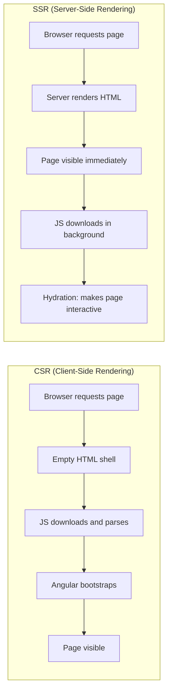
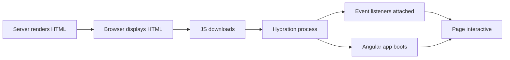

# SSR, Hydration, and Prerendering

> [!summary] Goal
> Render Angular on the server with SSR for faster initial page loads and better SEO. Understand hydration, prerendering, and the `@angular/ssr` package.

## Table of Contents

1. [Why SSR Matters](#why-ssr-matters)
2. [Setup with `@angular/ssr`](#setup-with-angular-ssr)
3. [Hydration](#hydration)
4. [Prerendering](#prerendering)
5. [`TransferState`](#transferstate)
6. [SSR vs Prerendering](#ssr-vs-prerendering)
7. [Pitfalls](#pitfalls)

---

## Why SSR Matters

Client-side rendered Angular sends an empty `index.html` and relies on JavaScript to render the page. SSR sends fully rendered HTML from the server — the user sees content immediately.



| Metric | CSR | SSR |
|--------|-----|-----|
| **First Contentful Paint** | ~2-5s | ~0.3-1s |
| **Largest Contentful Paint** | ~3-8s | ~0.5-2s |
| **SEO** | Limited | Full (Google renders JS, but SSR is safer) |
| **Time to Interactive** | Same as FCP | After hydration |

---

## Setup with `@angular/ssr`

```bash
# Add SSR to an existing project
ng add @angular/ssr

# Create a new project with SSR
ng new my-app --ssr
```

### What SSR adds

```
src/
├── main.server.ts         # Server entry point
├── server.ts              # Express server configuration
├── app/
│   ├── app.component.ts
│   └── app.config.server.ts  # Server-specific providers
```

```typescript
// src/main.server.ts
import { bootstrapApplication } from '@angular/platform-browser';
import { AppComponent } from './app/app.component';
import { config } from './app/app.config.server';

const bootstrap = () => bootstrapApplication(AppComponent, config);
export default bootstrap;
```

```typescript
// app.config.ts — add provideClientHydration
import { provideClientHydration } from '@angular/platform-browser';

export const appConfig: ApplicationConfig = {
  providers: [
    provideRouter(routes),
    provideClientHydration(),            // 👈 Enables hydration
    provideHttpClient(withFetch()),
  ],
};
```

### Running SSR

```bash
ng build                   # Build for production
ng serve                   # Dev server (SSR with live reload)
node dist/my-app/server/server.mjs  # Start production SSR server
```

---

## Hydration

Hydration attaches event listeners and makes the static HTML rendered by the server interactive:



### What can break hydration

```typescript
// ❌ Content mismatch between server and client
@Component({ template: `{{ randomValue }}` })
export class BadComponent {
  randomValue = Math.random();  // Different on server vs client → hydration error
}
```

**Fix**: Use deterministic values, or defer the non-deterministic content to client-only:

```typescript
@Component({ template: `{{ clientValue() }}` })
export class GoodComponent {
  clientValue = signal('');

  constructor() {
    // Set after hydration — no mismatch
    afterNextRender(() => this.clientValue.set(Math.random().toString()));
  }
}
```

### Augury for hydration debugging

Angular logs hydration errors to the console with detailed information about mismatched nodes. Use `ng:hydration` attribute in DevTools to see which nodes were hydrated.

---

## Prerendering

Prerendering generates static HTML at build time — no server needed at runtime:

```bash
ng build --prerender
ng build --prerender # Routes from Angular Router are prerendered by default
```

```typescript
// angular.json — configure routes to prerender
{
  "prerender": {
    "routes": [
      "/",
      "/about",
      "/products"
    ]
  }
}
```

### When to use prerendering

| Approach | Rendered | Server needed | Use case |
|----------|----------|--------------|----------|
| **Prerendering** | At build time | No | Static pages (docs, marketing, blog) |
| **SSR** | On each request | Yes | Dynamic pages (user dashboard, search results) |
| **CSR only** | In browser | No | Admin panels, internal tools |

---

## `TransferState`

`TransferState` passes server-only data to the client — avoiding duplicate API calls:

```typescript
import { TransferState, makeStateKey } from '@angular/core';
import { of } from 'rxjs';

const USERS_KEY = makeStateKey<User[]>('users');

@Injectable({ providedIn: 'root' })
export class UserService {
  private transferState = inject(TransferState);
  private http = inject(HttpClient);

  getUsers(): Observable<User[]> {
    // Check if data is already in transfer state (set by server)
    const stored = this.transferState.get(USERS_KEY, null);

    if (stored) {
      // Client-side: remove from transfer state (only use once)
      this.transferState.remove(USERS_KEY);
      return of(stored);
    }

    // Server-side: fetch and store in transfer state
    return this.http.get<User[]>('/api/users').pipe(
      tap(users => this.transferState.set(USERS_KEY, users)),
    );
  }
}
```

---

## SSR vs Prerendering

| Aspect | SSR | Prerendering |
|--------|-----|-------------|
| **When HTML is generated** | Per request | At build time |
| **Server required** | Yes (Node.js server) | No (static files) |
| **Dynamic data** | ✅ Fresh on each request | ❌ Build-time snapshot |
| **Cold start latency** | ~100-500ms (first request) | Instant (CDN) |
| **Scale cost** | Server cost (CPU per request) | Storage cost (static files) |
| **Best for** | User-specific content, dashboards | Marketing pages, blog, docs |
| **Angular command** | `ng add @angular/ssr` | `ng build --prerender` |

---

## Pitfalls

### Thundering herd on SSR

Each SSR request calls the server API. If 1000 users load the page simultaneously, the server makes 1000 API calls.

**Fix**: Add a reverse proxy cache (CDN, Nginx, Redis) for SSR responses. Use prerendering for static pages.

### Hydration mismatch from `localStorage` or `sessionStorage`

Server has no access to `localStorage`. Code that reads it during construction or `ngOnInit` throws errors.

**Fix**: Use `afterNextRender` or `isPlatformBrowser` to guard browser-only code.

### Third-party libraries not SSR-compatible

Some libraries access `window`, `document`, or `navigator` at import time — causing SSR to fail.

**Fix**: Lazy-load the library with `@defer` or import it only in client components using `afterNextRender`.

---

> [!question]- Interview Questions
>
> **Q: What is hydration in Angular SSR?**
> A: Hydration is the process where Angular takes the static HTML rendered by the server and attaches event listeners to make it interactive. It reuses the existing DOM nodes instead of recreating them, ensuring a smooth transition from server-rendered to client-rendered content.
>
> **Q: What is `TransferState` used for?**
> A: `TransferState` passes server-only data (API responses) to the client without serializing them in the HTML or making duplicate API calls. The server sets the data, and the client reads and removes it on first access.
>
> **Q: What is the difference between SSR and prerendering?**
> A: SSR renders pages per request on the server — dynamic, requires a running server. Prerendering generates static HTML at build time — no server needed, content is always the same until the next build.

---

## Cross-Links

- [[Angular/03_Advanced/01_Change_Detection_and_Performance]] for runtime performance after hydration
- [[Angular/03_Advanced/05_Image_Optimization_and_Performance]] for SSR image strategies
- [[Angular/02_Core/04_HttpClient_and_Interceptors]] for HTTP with TransferState
