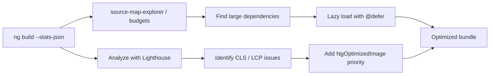
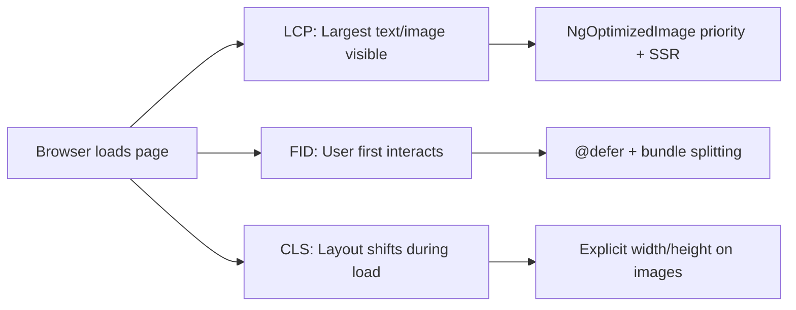

# Image Optimization and Performance

> [!summary] Goal
> Optimize Angular applications for performance: images with `NgOptimizedImage`, bundle analysis, lazy loading, Core Web Vitals, and Lighthouse scores.

## Table of Contents

1. [Why Performance Matters](#why-performance-matters)
2. [Image Optimization with `NgOptimizedImage`](#image-optimization-with-ngoptimizedimage)
3. [Bundle Analysis](#bundle-analysis)
4. [Lazy Loading Scenarios](#lazy-loading-scenarios)
5. [`@defer` Strategies](#defer-strategies)
6. [Core Web Vitals](#core-web-vitals)
7. [Pitfalls](#pitfalls)

---

## Why Performance Matters

Performance directly impacts user retention. A 1-second delay in page load reduces conversions by 7%. Angular provides built-in tools for optimization.



---

## Image Optimization with `NgOptimizedImage`

```typescript
import { NgOptimizedImage } from '@angular/common';

@Component({
  standalone: true,
  imports: [NgOptimizedImage],
  template: `
    <!-- Basic optimized image -->
    

    <!-- Lazy-loaded image -->
    

    <!-- Fill mode (container-based sizing) -->
    <div style="position: relative; width: 100%; height: 400px">
      
    </div>
  `,
})
export class HeroComponent { }
```

### Setup

```typescript
import { provideImgixLoader } from '@angular/common';

export const appConfig: ApplicationConfig = {
  providers: [
    // For image CDN (Cloudinary, Imgix, Cloudflare)
    provideImgixLoader('https://my-images.imgix.net'),
  ],
};
```

| Feature | `ngSrc` vs `src` |
|---------|-----------------|
| `priority` | Adds `fetchpriority="high"` + preload tag — use for LCP images |
| `loading="lazy"` | Native lazy loading (browser defers load until near viewport) |
| `fill` | Image fills parent container — needs explicit `sizes` |
| `ngSrcset` | Auto-generate srcset for responsive images |
| CDN integration | `provideImgixLoader` generates optimized URLs |

---

## Bundle Analysis

```bash
# Build with source maps and stats
ng build --stats-json --source-map

# Visualize bundle
npx source-map-explorer dist/my-app/**/*.js
npx vite-bundle-visualizer  # For Vite builds
```

### Bundle budgets

```json
// angular.json
"budgets": [
  { "type": "initial", "maximumWarning": "300kb", "maximumError": "500kb" },
  { "type": "anyComponentStyle", "maximumWarning": "2kb", "maximumError": "4kb" },
  { "type": "anyScript", "maximumWarning": "100kb", "maximumError": "200kb" },
  { "type": "bundle", "name": "main", "maximumWarning": "200kb", "maximumError": "400kb" }
]
```

```bash
# Check budgets
ng build --configuration production
# If exceeded: "budget exceeded" error with actual vs allowed sizes
```

---

## `@defer` Strategies

Beyond basic `on viewport`:

```typescript
@Component({
  template: `
    <!-- Immediately (right after parent renders) -->
    @defer (on immediate) { <app-quick-component /> }

    <!-- After idle time -->
    @defer (on idle) { <app-analytics /> }

    <!-- After a timer -->
    @defer (on timer(5s)) { <app-delayed-component /> }

    <!-- On interaction + prefetch on hover -->
    @defer (on interaction; prefetch on hover(.preview)) {
      <app-detail />
    }
    <div class="preview">Hover to prefetch</div>

    <!-- Minimum time blocks (avoid flash) -->
    @defer (on viewport) {
      <app-heavy />
    } @placeholder (minimum 1s) {
      <div class="skeleton">Loading...</div>
    } @loading (after 100ms; minimum 300ms) {
      <app-spinner />
    }
  `,
})
export class PerformanceComponent { }
```

---

## Core Web Vitals



| Metric | Target | Angular tools |
|--------|--------|---------------|
| **LCP** (Largest Contentful Paint) | < 2.5s | `NgOptimizedImage` with `priority`, SSR, CDN |
| **FID** (First Input Delay) | < 100ms | `@defer`, lazy loading, bundle splitting |
| **CLS** (Cumulative Layout Shift) | < 0.1 | Explicit `width`+`height` on images, `fill` with `sizes`, skeleton placeholders |

### Measuring with Angular DevTools

```bash
ng serve
# Chrome DevTools → Lighthouse → Generate report
# Angular DevTools → Profiler → Check bundle size tab
```

---

## Pitfalls

### Missing `width` and `height` on images

Without explicit dimensions, images cause layout shifts (CLS) as they load.

**Fix**: Always set `width` and `height` on `ngSrc` images, or use `fill` with a container.

### Over-splitting bundles

Creating too many lazy chunks (every component its own chunk) causes excessive HTTP requests.

**Fix**: Group related components into feature bundles. Use `@defer` only for genuinely heavy components (charts, maps, rich text editors).

### Not auditing budget regularly

Team adds dependencies → bundle grows → `ng build` fails → developer increases budget instead of fixing.

**Fix**: Set budgets as **errors** (not warnings). Review weekly.

---

> [!question]- Interview Questions
>
> **Q: What is the difference between `ngSrc` and regular `src`?**
> A: `NgOptimizedImage` (`ngSrc`) generates responsive srcsets, supports lazy loading natively, can prioritize LCP images with `priority`, and integrates with image CDNs. Regular `src` doesn't have these features.
>
> **Q: How do you analyze Angular bundle size?**
> A: Run `ng build --stats-json --source-map`, then use `source-map-explorer` or build-time budgets in `angular.json` to catch oversized bundles.
>
> **Q: What are Core Web Vitals and how does Angular address them?**
> A: LCP (loading) — use `NgOptimizedImage` + SSR. FID (interactivity) — use `@defer` + lazy loading. CLS (stability) — use explicit image dimensions + skeleton placeholders.

---

## Cross-Links

- [[Angular/03_Advanced/04_SSR_Hydration_and_Prerendering]] for SSR performance
- [[Angular/03_Advanced/01_Change_Detection_and_Performance]] for runtime CD optimization
- [[Angular/02_Core/01_Standalone_Components]] for lazy route loading
