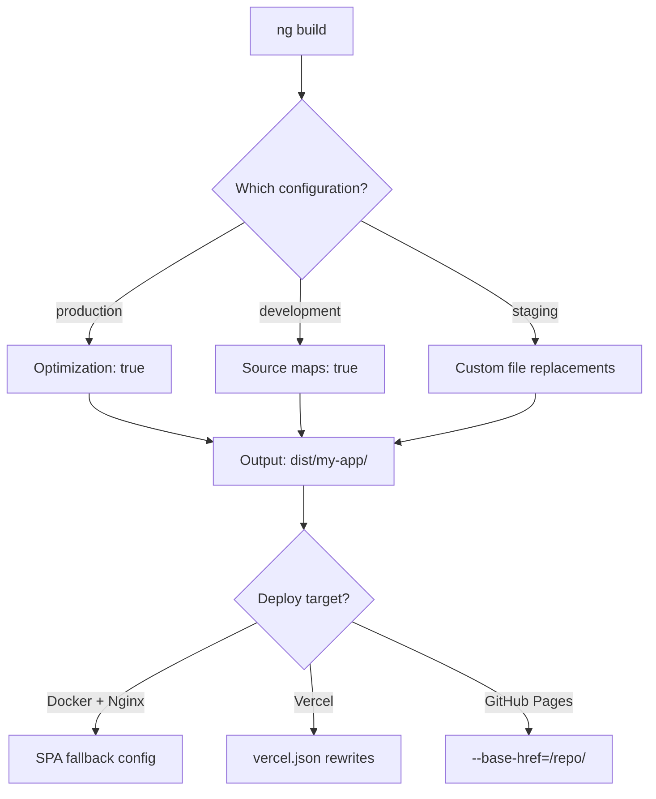
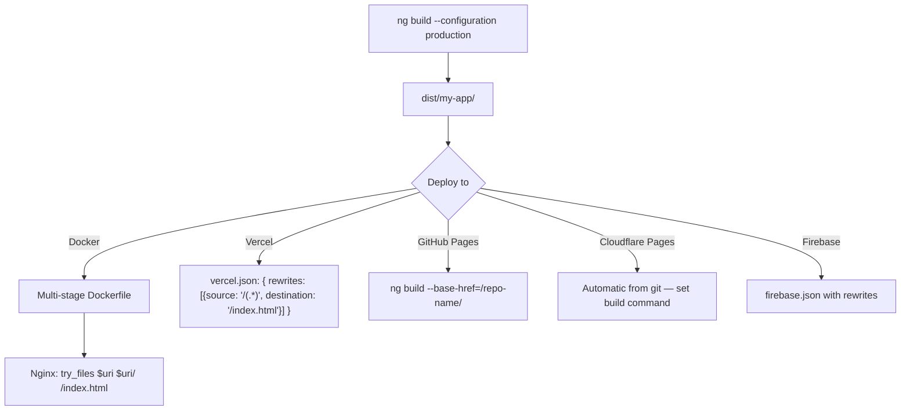

# Angular CLI and Configuration

> [!summary] Goal
> Configure and extend Angular's build system: `angular.json` deep dive, custom builders, environment configuration, and deployment strategies.

## Table of Contents

1. [Why CLI Configuration Matters](#why-cli-configuration-matters)
2. [`angular.json` Deep Dive](#angular-json-deep-dive)
3. [Build Targets and Configurations](#build-targets-and-configurations)
4. [Deployment Strategies](#deployment-strategies)
5. [Pitfalls](#pitfalls)

---

## Why CLI Configuration Matters

The CLI handles most things out of the box, but custom configuration is needed for specific build targets, environment switching, and deployment optimization.



---

## `angular.json` Deep Dive

```json
{
  "$schema": "./node_modules/@angular/cli/lib/config/schema.json",
  "version": 1,
  "projects": {
    "my-app": {
      "projectType": "application",
      "root": "",
      "sourceRoot": "src",
      "prefix": "app",
      "architect": {
        "build": {
          "builder": "@angular-devkit/build-angular:application",
          "options": {
            "outputPath": "dist/my-app",
            "index": "src/index.html",
            "browser": "src/main.ts",
            "server": "src/main.server.ts",
            "polyfills": ["zone.js"],
            "assets": [{ "glob": "**/*", "input": "public" }],
            "styles": ["src/styles.scss"],
            "scripts": [],
            "allowedCommonJsDependencies": ["some-lib"]
          },
          "configurations": {
            "production": {
              "optimization": true,
              "outputHashing": "all",
              "sourceMap": false,
              "namedChunks": false,
              "extractLicenses": true,
              "vendorChunk": false,
              "budgets": [
                { "type": "initial", "maximumWarning": "300kb", "maximumError": "500kb" }
              ],
              "fileReplacements": [{
                "replace": "src/environments/environment.ts",
                "with": "src/environments/environment.prod.ts"
              }]
            },
            "staging": {
              "optimization": true,
              "budgets": { /* Less strict budgets */ }
            }
          }
        },
        "serve": {
          "builder": "@angular-devkit/build-angular:dev-server",
          "configurations": {
            "production": { "buildTarget": "my-app:build:production" },
            "development": { "buildTarget": "my-app:build:development" }
          },
          "defaultConfiguration": "development"
        }
      }
    }
  }
}
```

### Key options explained

| Option | Default | Purpose |
|--------|---------|---------|
| `optimization` | `true` (prod) | Minify, tree-shake, bundle. Set `styles: false` to debug CSS |
| `outputHashing` | `all` (prod) | Hash filenames for cache-busting. `media` for font/images only |
| `vendorChunk` | `false` (prod) | Separate third-party code into its own chunk |
| `namedChunks` | `false` (prod) | Readable chunk names (`users-module-*.js`) |
| `extractLicenses` | `true` (prod) | Extract license comments from third-party code |
| `allowedCommonJsDependencies` | `[]` | Silence warnings for CommonJS dependencies |

---

## Build Targets and Configurations

### Custom build targets

```json
{
  "architect": {
    "build": { ... },
    "custom-build": {
      "builder": "@angular-devkit/build-angular:application",
      "options": { /* ... */ }
    }
  }
}
```

```bash
ng run my-app:custom-build
```

### Using Angular CLI for different environments

```bash
ng build --configuration production
ng build --configuration staging
ng build --configuration development

# Custom config per environment
ng build --configuration=staging --output-path=dist/staging
```

---

## Deployment Strategies

### Platform comparison



### Standard (static files)

```bash
ng build --configuration production
# Output in dist/my-app/ — deploy to any static host
```

### Docker

```dockerfile
FROM node:20 AS build
WORKDIR /app
COPY package*.json ./
RUN npm ci
COPY . .
RUN npm run build -- --configuration production

FROM nginx:alpine
COPY nginx.conf /etc/nginx/nginx.conf
COPY --from=build /app/dist/my-app/browser /usr/share/nginx/html
EXPOSE 80
```

```nginx
# nginx.conf — SPA fallback
server {
  listen 80;
  root /usr/share/nginx/html;
  index index.html;
  location / { try_files $uri $uri/ /index.html; }
}
```

### Vercel

```bash
npm i -g vercel
vercel --prod
```

```json
// vercel.json
{
  "buildCommand": "ng build --configuration production",
  "outputDirectory": "dist/my-app/browser",
  "rewrites": [{ "source": "/(.*)", "destination": "/index.html" }]
}
```

### GitHub Pages

```bash
ng build --configuration production --base-href=/my-repo/
npx angular-cli-ghpages --dir=dist/my-app/browser
```

---

## Development Tooling

### ESLint with Angular

```bash
# Install ESLint for an existing project
ng add @angular-eslint/schematics

# This generates:
# - .eslintrc.json with Angular-specific rules
# - Updates angular.json with lint builder
```

```json
// .eslintrc.json
{
  "root": true,
  "ignorePatterns": ["projects/**/*"],
  "overrides": [
    {
      "files": ["*.ts"],
      "parser": "@typescript-eslint/parser",
      "plugins": ["@angular-eslint"],
      "extends": [
        "eslint:recommended",
        "plugin:@typescript-eslint/recommended",
        "plugin:@angular-eslint/recommended",
        "plugin:@angular-eslint/template/process-inline-templates"
      ],
      "rules": {
        "@angular-eslint/component-selector": [
          "error",
          { "type": "element", "prefix": "app", "style": "kebab-case" }
        ],
        "@angular-eslint/directive-selector": [
          "error",
          { "type": "attribute", "prefix": "app", "style": "camelCase" }
        ],
        "@angular-eslint/no-host-metadata-property": "error",
        "@angular-eslint/no-input-rename": "warn",
        "@angular-eslint/no-output-rename": "warn"
      }
    },
    {
      "files": ["*.html"],
      "extends": ["plugin:@angular-eslint/template/recommended"],
      "rules": {
        "@angular-eslint/template/banana-in-box": "error",
        "@angular-eslint/template/no-negated-async": "warn",
        "@angular-eslint/template/cyclomatic-complexity": ["warn", { "maxComplexity": 5 }]
      }
    }
  ]
}
```

```bash
# Run lint
ng lint

# Auto-fix
ng lint --fix

# Run lint in CI
ng lint --format=json --output-file=lint-report.json
```

| Key ESLint rule | What it enforces |
|----------------|-----------------|
| `@angular-eslint/component-selector` | Component tag naming convention (e.g., `app-*`) |
| `@angular-eslint/directive-selector` | Directive attribute naming convention |
| `@angular-eslint/no-host-metadata-property` | Use `@Component.host` instead of `host` metadata |
| `@angular-eslint/template/banana-in-box` | Enforces `[(...)]` syntax (not `[...]` or `([...])`) |
| `@angular-eslint/template/cyclomatic-complexity` | Limits template complexity |

### Prettier integration

```json
// .prettierrc
{
  "singleQuote": true,
  "trailingComma": "all",
  "tabWidth": 2,
  "printWidth": 100,
  "overrides": [
    { "files": "*.html", "options": { "parser": "angular" } }
  ]
}
```

```json
// .eslintrc.json — disable rules Prettier handles
{
  "extends": ["plugin:prettier/recommended"]
}
```

### Nx Monorepo with Angular

Nx extends the Angular CLI with monorepo capabilities:

```bash
# Create an Nx workspace with Angular
npx create-nx-workspace@latest my-org --preset=angular-standalone

# Or add Nx to an existing Angular project
ng add @nx/angular
```

```json
// nx.json
{
  "targetDefaults": {
    "build": {
      "dependsOn": ["^build"],
      "inputs": ["production", "^production"]
    },
    "lint": {
      "inputs": ["default", "{workspaceRoot}/.eslintrc.json"]
    },
    "test": {
      "inputs": ["default", "^production", "{workspaceRoot}/jest.config.ts"]
    }
  },
  "affected": {
    "defaultBase": "main"
  }
}
```

```bash
# Nx commands for Angular projects
nx build my-app              # Build (with computation caching)
nx test my-app               # Test
nx lint my-app               # Lint
nx affected:test             # Test only projects affected by changes
nx graph                     # Visualize project dependency graph
nx run-many --target=build   # Build all projects
```

| Feature | Angular CLI | Nx |
|---------|-------------|-----|
| **Workspace** | Single app | Multiple apps + libs |
| **Caching** | None | Computation caching (local + remote) |
| **Affected commands** | Manual | `nx affected:*` detects changed projects |
| **Dependency graph** | None | `nx graph` |
| **Code generation** | `ng generate` | `nx generate` (Angular + Nx schematics) |
| **CI optimization** | Manual | `nx affected` + distributed task execution |

---

## Pitfalls

### `allowedCommonJsDependencies` not set

Using a CommonJS library (e.g., `lodash`, `moment`) without adding it to `allowedCommonJsDependencies` generates build warnings.

### Forgetting `--base-href` for subpath deployment

Deploying to `https://example.com/my-app/` without `--base-href=/my-app/` breaks asset paths and routing.

**Fix**: `ng build --configuration production --base-href=/my-app/`

### Not clearing dist/ between builds

Old build artifacts in `dist/` can cause confusion when switching configurations.

**Fix**: `rm -rf dist/ && ng build` or use `outputPath` per configuration.

---

> [!question]- Interview Questions
>
> **Q: What is the purpose of `fileReplacements` in `angular.json`?**
> A: It swaps files at build time for specific configurations. Common use: replacing `environment.ts` (development defaults) with `environment.prod.ts` (production values).
>
> **Q: How do you deploy an Angular app to a subpath?**
> A: Build with `--base-href=/subpath/` so that `index.html` has `<base href="/subpath/">`. Configure the web server to serve the app at that path.
>
> **Q: What is the difference between `vendorChunk` and `namedChunks`?**
> A: `vendorChunk: true` extracts third-party imports into a separate `vendor.js` file (better caching). `namedChunks: true` generates readable chunk names instead of random IDs.

---

## Cross-Links

- [[Angular/01_Foundations/01_Angular_App_Structure_and_Build]] for project creation
- [[Angular/03_Advanced/05_Image_Optimization_and_Performance]] for bundle budgets
- [[Angular/03_Advanced/07_Migration_Module_to_Standalone]] for build configuration during migration
