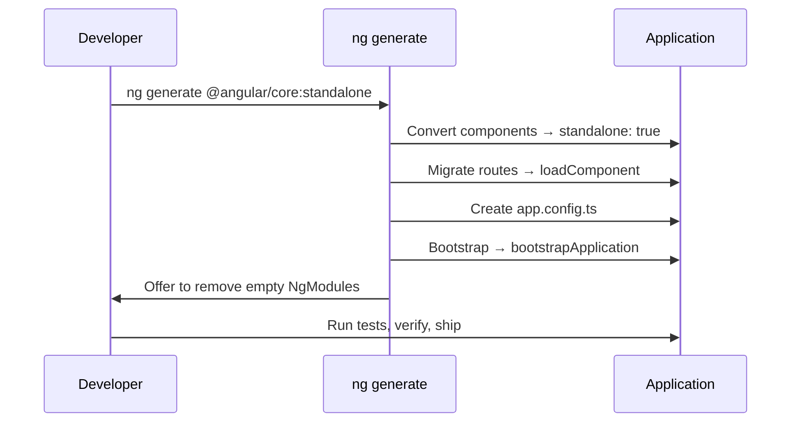
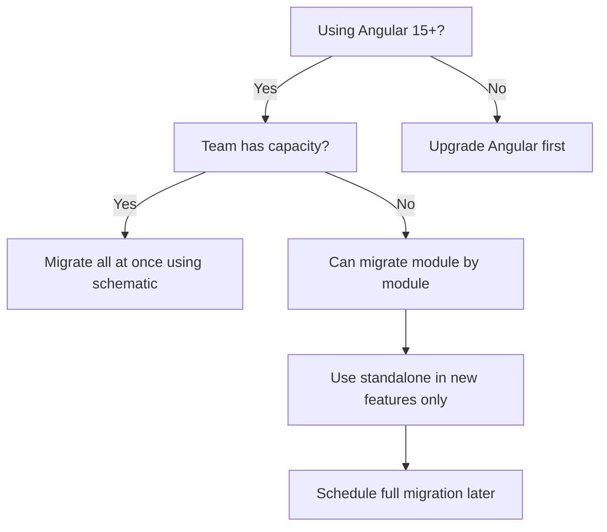

# Migration: NgModule to Standalone

> [!summary] Goal
> Migrate an NgModule-based Angular application to standalone components — step by step, with before/after examples and common pitfalls.

## Table of Contents

1. [Why Migrate](#why-migrate)
2. [Migration Overview](#migration-overview)
3. [Step 1: Run the Schematic](#step-1-run-the-schematic)
4. [Step 2: Convert Components](#step-2-convert-components)
5. [Step 3: Convert Routing](#step-3-convert-routing)
6. [Step 4: Bootstrap Standalone](#step-4-bootstrap-standalone)
7. [Step 5: Clean Up NgModules](#step-5-clean-up-ngmodules)
8. [Pitfalls](#pitfalls)

---

## Why Migrate

Standalone components eliminate NgModule boilerplate, reduce cognitive overhead, and make lazy loading simpler.

---

## Migration Overview

### Migration workflow



Should you migrate?



---

## Step 1: Run the Schematic

```bash
ng generate @angular/core:standalone
```

This runs an interactive migration that:

1. Converts all components, directives, and pipes to `standalone: true`
2. Migrates `main.ts` to `bootstrapApplication`
3. Converts lazy-loaded modules to `loadComponent`
4. Creates `app.config.ts` with providers
5. Offers to remove empty NgModules

### What the schematic changes

| Pattern | Before | After |
|---------|--------|-------|
| Components | `@Component({})` in `declarations` | `@Component({ standalone: true, imports: [] })` |
| Bootstrap | `platformBrowserDynamic().bootstrapModule(AppModule)` | `bootstrapApplication(AppComponent, config)` |
| Lazy loading | `loadChildren: () => import('./feature.module')` | `loadComponent: () => import('./feature.component')` |
| Providers | `@NgModule({ providers: [...] })` | `provideRouter(routes)` |
| Pipes/Directives | Declared in NgModule | `standalone: true` + imported in components |

---

## Step 2: Convert Components

### Before: NgModule

```typescript
// user.module.ts
@NgModule({
  declarations: [UserCardComponent, HighlightDirective, TruncatePipe],
  imports: [CommonModule, FormsModule, RouterModule],
  exports: [UserCardComponent],
})
export class UserModule {}

// user-card.component.ts
@Component({})
export class UserCardComponent {}
```

### After: Standalone

```typescript
// user-card.component.ts
@Component({
  standalone: true,                         // No NgModule needed
  imports: [CommonModule, FormsModule, RouterLink, HighlightDirective, TruncatePipe],
  // imports replaces: NgModule's imports + declarations combined
})
export class UserCardComponent {}
```

---

## Step 3: Convert Routing

```typescript
// BEFORE: NgModule lazy loading
const routes: Routes = [
  { path: 'users', loadChildren: () => import('./users/users.module')
      .then(m => m.UsersModule) },
];

// AFTER: Standalone lazy loading
const routes: Routes = [
  { path: 'users', loadComponent: () => import('./users/users-list.component')
      .then(m => m.UsersListComponent) },
  {
    path: 'users/:id',
    loadComponent: () => import('./users/user-detail.component')
      .then(m => m.UserDetailComponent),
  },
];
```

---

## Step 4: Bootstrap Standalone

### Before: NgModule

```typescript
// main.ts
import { platformBrowserDynamic } from '@angular/platform-browser-dynamic';
import { AppModule } from './app/app.module';

platformBrowserDynamic().bootstrapModule(AppModule)
  .catch(err => console.error(err));
```

```typescript
// app.module.ts
@NgModule({
  declarations: [AppComponent],
  imports: [BrowserModule, AppRoutingModule, HttpClientModule],
  providers: [AuthService],
  bootstrap: [AppComponent],
})
export class AppModule {}
```

### After: Standalone

```typescript
// main.ts
import { bootstrapApplication } from '@angular/platform-browser';
import { AppComponent } from './app/app.component';
import { appConfig } from './app/app.config';

bootstrapApplication(AppComponent, appConfig)
  .catch(err => console.error(err));
```

```typescript
// app.config.ts
export const appConfig: ApplicationConfig = {
  providers: [
    provideRouter(routes),
    provideHttpClient(withFetch()),
    AuthService,
  ],
};
```

---

## Step 5: Clean Up NgModules

```bash
# After the schematic, remove empty NgModules
# Check for remaining: grep -r "@NgModule" src/app/

# Remove empty module files
rm src/app/app.module.ts
rm src/app/shared.module.ts

# Convert any remaining to standalone
# Feature modules that only provided configuration:
@NgModule({ providers: [SearchService] })
export class SearchModule {}
# Replace with @Injectable({ providedIn: 'root' }) on the service
```

---

## Pitfalls

### Lazy modules with providers

If a lazy-loaded NgModule had providers, those providers were scoped to the lazy route. With `loadComponent`, the component's `providers` array serves the same purpose.

```typescript
// Replace module providers with component providers
@Component({
  standalone: true,
  providers: [FeatureService],  // Same scope as lazy module had
})
export class FeatureComponent {}
```

### Shared NgModules

Modules that only declared + exported components should be replaced by importing the standalone components directly.

```typescript
// Replace: imports: [SharedModule]
// With: imports: [SharedButtonComponent, SharedCardComponent, SharedPipe]
```

### Circular imports from shared modules

When converting shared modules, components may import each other in a cycle.

**Fix**: Group truly interdependent components in the same file, or extract the minimal common dependency.

---

> [!question]- Interview Questions
>
> **Q: What is the main benefit of migrating from NgModules to standalone?**
> A: Standalone eliminates NgModule boilerplate. Components declare their own dependencies directly. Lazy loading uses `loadComponent` instead of `loadChildren()`. The migration is automated by `ng generate @angular/core:standalone`.
>
> **Q: How do you handle lazy-loaded module providers after migration?**
> A: Move the providers from `NgModule.providers` to the lazy-loaded component's `providers` array. This preserves the lazy-loading scope.
>
> **Q: What happens to `BrowserModule` and `HttpClientModule` after migration?**
> A: They're replaced by the provider functions: `provideRouter(routes)`, `provideHttpClient()`, `provideAnimations()` in `app.config.ts`.

---

## Cross-Links

- [[Angular/02_Core/01_Standalone_Components]] for standalone bootstrap
- [[Angular/01_Foundations/04_Routing_Basics]] for standalone routing patterns
- [[Angular/01_Foundations/03_DI_Services_and_Providers]] for provider scopes
