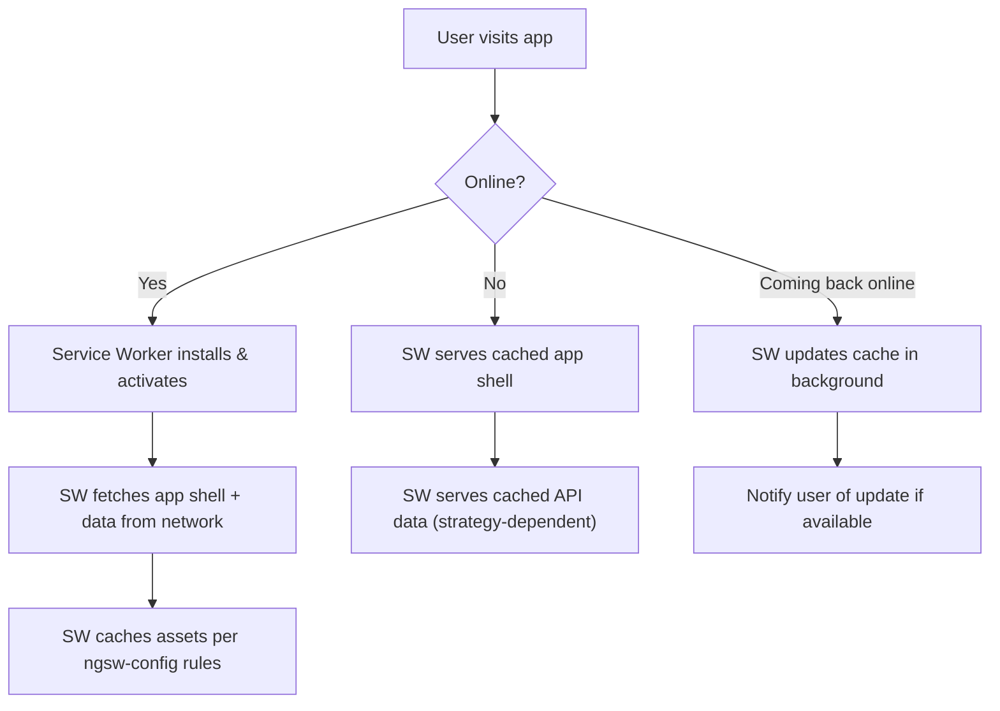
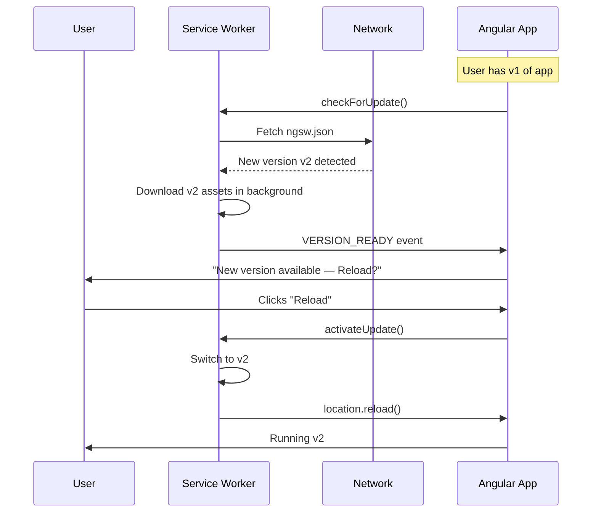
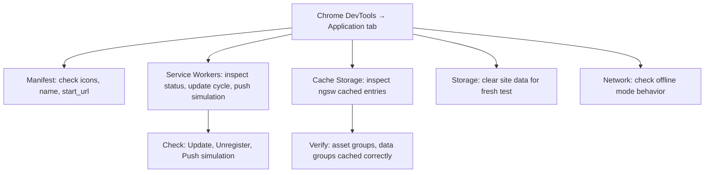

# Progressive Web Apps (PWA)

> [!summary] Goal
> Turn an Angular app into a PWA with service worker caching, offline support, install prompts, and push notifications using `@angular/pwa`.

## Table of Contents

1. [PWA Architecture](#pwa-architecture)
2. [Setup with `@angular/pwa`](#setup-with-angular-pwa)
3. [Service Worker Configuration](#service-worker-configuration)
4. [Update Management](#update-management)
5. [Install Prompt](#install-prompt)
6. [Push Notifications](#push-notifications)
7. [Testing and Debugging](#testing-and-debugging)
8. [Pitfalls](#pitfalls)

---

## PWA Architecture



| Component | Role |
|-----------|------|
| **Service Worker** | Background script that intercepts network requests, serves cached content, handles push events |
| `ngsw-config.json` | Configuration for caching strategies, asset groups, data groups |
| **Manifest** (`manifest.webmanifest`) | App metadata: name, icons, theme color, display mode, start URL |
| **Install prompt** | Browser event (`beforeinstallprompt`) that lets users add the app to their home screen |

---

## Setup with `@angular/pwa`

```bash
# Add PWA support to an existing project
ng add @angular/pwa

# This generates:
# - src/manifest.webmanifest
# - src/ngsw-config.json
# - src/assets/icons/ (icon files)
# - Updates angular.json with service worker config
# - Registers service worker in main.ts or app.module
```

### What `ng add @angular/pwa` changes

| File | What it does |
|------|-------------|
| `src/manifest.webmanifest` | App name, icons, theme_color, background_color, display, start_url |
| `src/ngsw-config.json` | Caching rules for app assets and data APIs |
| `src/assets/icons/` | PWA icons in various sizes (72x72 to 512x512) |
| `angular.json` | Adds `"serviceWorker": true` to production build config |
| `src/main.ts` | Registers the service worker |

### Manual setup

```typescript
// main.ts — register service worker (if not using @angular/pwa schematic)
import { provideServiceWorker } from '@angular/service-worker';
import { isDevMode } from '@angular/core';

export const appConfig: ApplicationConfig = {
  providers: [
    provideServiceWorker('ngsw-worker.js', {
      enabled: !isDevMode(),
      registrationStrategy: 'registerWhenStable:30000',
    }),
  ],
};
```

`registrationStrategy` options:

| Strategy | Behavior |
|----------|----------|
| `'registerImmediately'` | Register as soon as the app bootstraps |
| `'registerWhenStable:30000'` | Wait for app to be stable, timeout after 30s |
| `'registerWithDelay:5000'` | Wait 5 seconds, then register |

---

## Service Worker Configuration

```json
// ngsw-config.json
{
  "$schema": "./node_modules/@angular/service-worker/config/schema.json",
  "index": "/index.html",
  "assetGroups": [
    {
      "name": "app",
      "installMode": "prefetch",
      "updateMode": "prefetch",
      "resources": {
        "files": [
          "/favicon.ico",
          "/index.html",
          "/*.css",
          "/*.js"
        ]
      }
    },
    {
      "name": "assets",
      "installMode": "lazy",
      "updateMode": "prefetch",
      "resources": {
        "files": [
          "/assets/**",
          "/*.(svg|cur|jpg|jpeg|png|apng|webp|avif|gif|ico|otf|ttf|woff|woff2)"
        ]
      }
    }
  ],
  "dataGroups": [
    {
      "name": "api-performance",
      "urls": ["/api/users/**", "/api/products/**"],
      "cacheConfig": {
        "maxSize": 100,
        "maxAge": "1d",
        "timeout": "10s",
        "strategy": "performance"
      }
    },
    {
      "name": "api-freshness",
      "urls": ["/api/orders/**"],
      "cacheConfig": {
        "maxSize": 50,
        "maxAge": "1h",
        "timeout": "5s",
        "strategy": "freshness"
      }
    }
  ]
}
```

### Asset group caching strategies

| `installMode` | `updateMode` | Behavior |
|--------------|--------------|----------|
| `prefetch` | `prefetch` | Download all assets on install, update all on new version |
| `prefetch` | `lazy` | Download all on install, update individually on access |
| `lazy` | `prefetch` | Download each asset on first access, update all on new version |
| `lazy` | `lazy` | Download and update on first access only |

### Data group caching strategies

| Strategy | Behavior | When to use |
|----------|----------|-------------|
| `performance` | Cache-first — serve cached, refresh in background | API data that changes infrequently (product catalog, user profiles) |
| `freshness` | Network-first — try network, fall back to cache | API data that must be current (orders, inventory, prices) |

---

## Update Management

```typescript
// app.component.ts
import { SwUpdate, VersionReadyEvent } from '@angular/service-worker';
import { filter, switchMap } from 'rxjs';

@Component({...})
export class AppComponent {
  private swUpdate = inject(SwUpdate);
  private snackBar = inject(MatSnackBar);

  constructor() {
    if (!this.swUpdate.isEnabled) return;

    // Check for updates periodically
    this.swUpdate.versionUpdates
      .pipe(
        filter((evt): evt is VersionReadyEvent => evt.type === 'VERSION_READY'),
        switchMap(() => {
          const snack = this.snackBar.open('New version available', 'Reload');
          return snack.onAction();
        }),
      )
      .subscribe(() => {
        this.swUpdate.activateUpdate().then(() => document.location.reload());
      });
  }

  // Manual update check
  checkForUpdate(): void {
    this.swUpdate.checkForUpdate();
  }
}
```

### Update flow



---

## Install Prompt

```typescript
// app.component.ts
import { Injectable, signal, effect } from '@angular/core';

@Injectable({ providedIn: 'root' })
export class PwaInstallService {
  private deferredPrompt: any = null;
  readonly canInstall = signal(false);

  constructor() {
    window.addEventListener('beforeinstallprompt', (e) => {
      e.preventDefault();
      this.deferredPrompt = e;
      this.canInstall.set(true);
    });

    window.addEventListener('appinstalled', () => {
      this.canInstall.set(false);
      this.deferredPrompt = null;
    });
  }

  async promptInstall(): Promise<boolean> {
    if (!this.deferredPrompt) return false;
    this.deferredPrompt.prompt();
    const result = await this.deferredPrompt.userChoice;
    this.deferredPrompt = null;
    this.canInstall.set(false);
    return result.outcome === 'accepted';
  }
}
```

```html
<button *ngIf="pwaInstall.canInstall()" (click)="install()">
  Install App
</button>
```

```typescript
@Component({...})
export class NavComponent {
  private pwaInstall = inject(PwaInstallService);

  async install() {
    const installed = await this.pwaInstall.promptInstall();
    if (installed) console.log('App installed!');
  }
}
```

---

## Push Notifications

```typescript
// push.service.ts
import { Injectable } from '@angular/core';
import { SwPush } from '@angular/service-worker';
import { HttpClient } from '@angular/common/http';

@Injectable({ providedIn: 'root' })
export class PushNotificationService {
  private swPush = inject(SwPush);
  private http = inject(HttpClient);

  // VAPID public key from your server
  readonly VAPID_PUBLIC_KEY = 'BBc...';

  get isEnabled(): boolean {
    return this.swPush.isEnabled;
  }

  async subscribeToPush(): Promise<void> {
    if (!this.isEnabled) return;

    try {
      const sub = await this.swPush.requestSubscription({
        serverPublicKey: this.VAPID_PUBLIC_KEY,
      });

      // Send the subscription object to your server
      await this.http.post('/api/push/subscribe', sub).toPromise();
    } catch (err) {
      console.error('Push subscription failed:', err);
    }
  }

  // Listen for incoming push messages
  message$ = this.swPush.messages.pipe(
    map(msg => msg.notification ?? null),
  );

  // Handle notification clicks
  notificationClicks$ = this.swPush.notificationClicks.pipe(
    map(event => event.action),
  );
}
```

### Push notification display

```typescript
// Handle push in service worker (custom SW script, or via Angular's default)
// Default Angular SW handles basic push — custom logic needs a custom SW
// src/ngsw-worker.js (custom build needed for advanced push)
self.addEventListener('push', (event) => {
  const data = event.data?.json() ?? {};
  const options = {
    body: data.body,
    icon: '/assets/icons/icon-192x192.png',
    badge: '/assets/icons/badge-72x72.png',
    actions: [
      { action: 'view', title: 'View' },
      { action: 'dismiss', title: 'Dismiss' },
    ],
  };

  event.waitUntil(
    self.registration.showNotification(data.title, options)
  );
});
```

---

## Testing and Debugging

### Chrome DevTools



### Common debugging techniques

```bash
# Build with service worker
ng build --configuration production

# Serve with local HTTP server (needs http-server or similar)
npx http-server dist/my-app -p 4200 -c-1

# Visit http://localhost:4200 — SW works in production mode only

# Check SW status in DevTools
# Application → Service Workers → Update / Unregister
```

```typescript
// Debug logging in dev
import { SwUpdate } from '@angular/service-worker';

if (!isDevMode()) {
  this.swUpdate.versionUpdates.subscribe(evt => {
    console.log('SW update event:', evt.type, evt);
  });
}
```

---

## Pitfalls

### Service worker only works in production

Angular's service worker is disabled in development mode (`isDevMode() === true`). To test PWA features, you must build with `--configuration production` and serve from a local HTTP server (not `ng serve`).

### Stale cache after API changes

With `performance` strategy (cache-first), users might see stale data until the cache expires (`maxAge`). Use `freshness` strategy for data that changes frequently, or add a cache version to your API responses.

### Forgetting to update `ngsw-config.json` after adding routes

If you add new lazy-loaded routes without updating `ngsw-config.json`, the service worker may not cache their assets. The user sees a broken page when offline.

**Fix**: Re-run `ng build --configuration production` — the SW config regenerates automatically based on the build output and `ngsw-config.json`.

### Notification permission denied

If the user denies notification permission, `SwPush.requestSubscription()` throws. Handle this gracefully:

```typescript
try {
  await this.swPush.requestSubscription({...});
} catch {
  // User denied or browser doesn't support push
  this.notificationDenied.set(true);
}
```

### Multiple tabs with different SW versions

Each browser tab has its own SW registration. If one tab updates to v2 but another is on v1, they have different cached assets. Angular's SW handles this by activating the update only when all tabs are closed and the page is revisited, or when `activateUpdate()` is called explicitly.

---

> [!question]- Interview Questions
>
> **Q: What does `ng add @angular/pwa` generate?**
> A: It generates `manifest.webmanifest`, `ngsw-config.json`, icon files, updates `angular.json` with `"serviceWorker": true`, and registers the service worker in `main.ts`.
>
> **Q: What is the difference between `performance` and `freshness` data group strategies?**
> A: `performance` serves cached data first and updates in the background (fast but potentially stale). `freshness` tries the network first and falls back to cache (current data but slower).
>
> **Q: How do you notify users that a new app version is available?**
> A: Subscribe to `SwUpdate.versionUpdates`, filter for `VERSION_READY` events, show a snack bar with "Reload" action. On user action, call `swUpdate.activateUpdate()` then `location.reload()`.
>
> **Q: How does the `beforeinstallprompt` event work?**
> A: The browser fires it when the app meets PWA install criteria (service worker active, manifest valid). You intercept it with `e.preventDefault()`, save the event, and show a custom install button. On click, call `prompt()` to show the native install dialog.
>
> **Q: Why doesn't the service worker work with `ng serve`?**
> A: `ng serve` uses in-memory compilation and hot module replacement. The service worker requires a built production bundle with hashed file names. Always test PWA features with `ng build --configuration production` served over HTTP(S).

---

## Cross-Links

- [[Angular/03_Advanced/05_Image_Optimization_and_Performance]] for PWA bundle optimization
- [[Angular/03_Advanced/06_Angular_CLI_and_Configuration]] for production build configuration
- [[Angular/02_Core/04_HttpClient_and_Interceptors]] for API caching strategies
- [[CICD/Docker/03_Advanced/02_Security]] for HTTPS requirements (PWA requires HTTPS)
