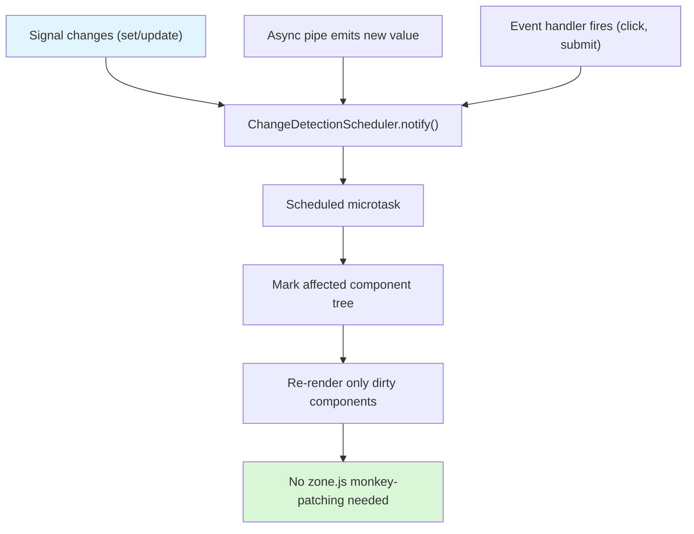
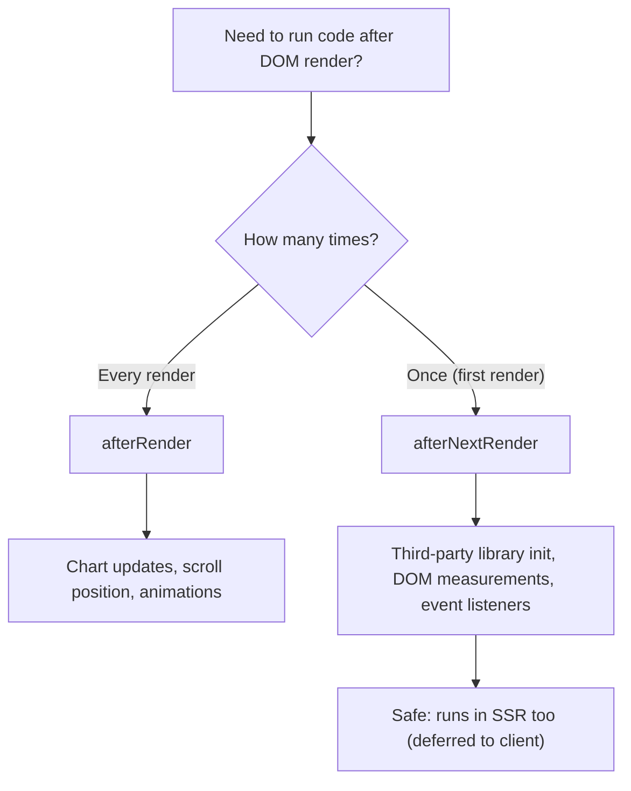

# Zoneless and New Control Flow

> [!summary] Goal
> Understand Angular 17+ features: the built-in control flow (`@if`, `@for`, `@switch`), zoneless change detection (`provideZonelessChangeDetection`), `@let` template variables, and the `afterRender`/`afterNextRender` lifecycle hooks.

## Table of Contents

1. [Built-in Control Flow](#built-in-control-flow)
2. [`@let` Template Variables](#let-template-variables)
3. [Zoneless Change Detection](#zoneless-change-detection)
4. [`afterRender` and `afterNextRender`](#afterrender-and-afternextrender)
5. [Pitfalls](#pitfalls)

---

## Built-in Control Flow

Angular 17 introduced a new built-in control flow (`@if`, `@for`, `@switch`) that replaces structural directives (`*ngIf`, `*ngFor`, `*ngSwitch`). It's the default in new Angular 17+ projects.

### `@if` — replacing `*ngIf`

```html
<!-- ❌ Old: *ngIf -->
<div *ngIf="isLoggedIn; else loginPrompt">Welcome back!</div>
<ng-template #loginPrompt>Please log in</ng-template>

<!-- ✅ New: @if -->
@if (isLoggedIn) {
  <div>Welcome back!</div>
} @else {
  <div>Please log in</div>
}
```

```html
<!-- Multiple conditions -->
@if (role === 'admin') {
  <admin-panel />
} @else if (role === 'editor') {
  <editor-panel />
} @else {
  <viewer-panel />
}
```

### `@for` — replacing `*ngFor`

```html
<!-- ❌ Old: *ngFor with trackBy -->
<li *ngFor="let user of users; trackBy: trackByFn">{{ user.name }}</li>

<!-- ✅ New: @for with required track -->
@for (user of users; track user.id) {
  <li>{{ user.name }}</li>
} @empty {
  <li>No users found</li>
}
```

`track` is **required** in `@for` — no more forgetting it.

| `@for` implicit variables | Purpose |
|--------------------------|---------|
| `$index` | Current index (0-based) |
| `$first` | `true` for first item |
| `$last` | `true` for last item |
| `$even` | `true` for even index |
| `$odd` | `true` for odd index |
| `$count` | Total items in the collection |

```html
@for (user of users; track user.id; let i = $index, isEven = $even) {
  <li [class.even]="isEven">#{{ i }}: {{ user.name }}</li>
}
```

### `@switch` — replacing `*ngSwitch`

```html
<!-- ❌ Old: *ngSwitch -->
<div [ngSwitch]="status">
  <p *ngSwitchCase="'loading'">Loading...</p>
  <p *ngSwitchCase="'error'">Error occurred</p>
  <p *ngSwitchDefault>Ready</p>
</div>

<!-- ✅ New: @switch -->
@switch (status) {
  @case ('loading') {
    <p>Loading...</p>
  }
  @case ('error') {
    <p>Error occurred</p>
  }
  @default {
    <p>Ready</p>
  }
}
```

### Comparison: structural directives vs built-in control flow

| Aspect | Structural directives (`*ngIf`, `*ngFor`, `*ngSwitch`) | Built-in control flow (`@if`, `@for`, `@switch`) |
|--------|------------------------------------------------------|--------------------------------------------------|
| **Introduced** | Angular 2 | Angular 17 |
| **`track` required** | ❌ Optional | ✅ Required |
| **`@empty` block** | ❌ Manual `*ngIf="items.length === 0"` | ✅ Built-in `@empty` |
| **Performance** | Creates embedded `ng-template` per item | More efficient — single template |
| **Type narrowing** | Manual | Automatic (e.g., `@if (user)` narrows to non-nullable in the block) |
| **Bundle size** | Larger (structural directive code) | Smaller (compiler syntax) |
| **Custom structural directives** | ✅ Yes | ❌ No |
| **Migration tool** | Optional — `ng generate @angular/core:control-flow` | N/A |

### Migrating from structural directives

```bash
ng generate @angular/core:control-flow
```

This migrates all `*ngIf`, `*ngFor`, `*ngSwitch` to the new syntax. The migration:

- Handles `else` → `@else`
- Converts `trackBy` → `track` expression
- Adds `@empty` where applicable
- Flattens nested `ng-container` blocks

---

## `@let` Template Variables

Angular 18+ introduces `@let` for declaring template-local variables:

```html
@let user = currentUser();

@if (user) {
  <h1>Welcome, {{ user.name }}</h1>
  <p>Email: {{ user.email }}</p>
}
```

```html
<!-- Computed template variables -->
@let total = cart.items().reduce((sum, item) => sum + item.price, 0);
@let itemCount = cart.items().length;

<div>
  <p>{{ itemCount }} items — {{ total | currency }}</p>
</div>
```

```html
<!-- With async pipe -->
@let data = (data$ | async);

@if (data) {
  <pre>{{ data | json }}</pre>
} @else {
  <p>Loading...</p>
}
```

| `@let` behavior | Details |
|-----------------|---------|
| **Scope** | Block-scoped to the element and its siblings/children |
| **Reactivity** | Re-evaluates when the bound expression changes |
| **Read-only** | Cannot be reassigned (it's a template constant) |
| **Initialization** | Must be initialized inline — `@let x;` alone is invalid |
| **Best for** | Avoiding repeated expensive expressions or pipe calls |

---

## Zoneless Change Detection

Angular 18+ supports running change detection without Zone.js. Instead of monkey-patching every async API, Angular uses signals and `ChangeDetectionScheduler` to know exactly when to update.

### Setup

```bash
ng new my-app --no-zone
```

```typescript
// app.config.ts
import { provideZonelessChangeDetection } from '@angular/core';

export const appConfig: ApplicationConfig = {
  providers: [
    provideZonelessChangeDetection(),
  ],
};
```

### Remove zone.js

```typescript
// angular.json — remove zone.js polyfill
{
  "polyfills": [
    // "zone.js"   ← Remove this line
  ],
}
```

```typescript
// Remove zone.js import from main.ts or polyfills.ts
// Remove: import 'zone.js';
```

### How zoneless works



With Zone.js, **every** async event triggers a full tree traversal. With zoneless, Angular only checks components whose signals changed, or components that fired an event.

### Zoneless-compatible patterns

```typescript
// ✅ These work with zoneless:
signal.set(value);                    // Signal-based CD
effect(() => { /* cleanup */ });      // Signal effects
async pipe;                           // Async pipe triggers CD
(click)="handler()"                   // Event binding

// These also work (but don't trigger CD on their own):
setTimeout(() => { /* won't update UI */ });     // ❌ No CD trigger
Promise.resolve().then(() => { /* won't update */ }); // ❌
// FIX: use signals explicitly
```

```typescript
// ✅ Correct in zoneless — wrap async results in signals
@Component({...})
export class DataComponent {
  private data = signal<Data | null>(null);

  constructor() {
    fetch('/api/data')
      .then(res => res.json())
      .then(data => this.data.set(data));  // Explicitly triggers CD
  }
}
```

### Testing with zoneless

```typescript
import { provideZonelessChangeDetection } from '@angular/core';

TestBed.configureTestingModule({
  providers: [
    provideZonelessChangeDetection(),
  ],
});

// With zoneless:
// - fakeAsync/tick still work for time-based tests
// - fixture.detectChanges() still runs CD manually
// - whenStable() resolves after pending tasks
```

### Zoneless vs Zone.js

| Aspect | Zone.js | Zoneless |
|--------|--------|----------|
| **Bundle size** | Larger (+ zone.js polyfill ~15KB gzipped) | Smaller (no polyfill) |
| **Change detection** | Full tree traversal on every async event | Targeted to affected components |
| **Debugging** | More verbose CD cycles | Cleaner profiler output |
| **Compatibility** | Works with all third-party libs | Requires signal-based patterns |
| **Zone patching** | Monkey-patches all async APIs | No patching needed |
| **Browser support** | All browsers | All modern browsers |
| **Angular version** | 2+ | 18+ (experimental in 17) |
| **Testing** | Traditional TestBed | Same API + provideZonelessChangeDetection |

---

## `afterRender` and `afterNextRender`

These are lifecycle hooks introduced in Angular 17 for running code after the DOM has been rendered or updated.

### `afterRender`

Runs **every time** the component's view is rendered:

```typescript
import { afterRender, Component } from '@angular/core';

@Component({...})
export class ChartComponent {
  private chart: Chart | null = null;

  constructor() {
    afterRender(() => {
      // Runs every time the view is re-rendered
      this.chart?.update();
    });
  }
}
```

### `afterNextRender`

Runs only **once** after the next render. Ideal for one-time DOM setup:

```typescript
import { afterNextRender, Component, ElementRef, viewChild } from '@angular/core';

@Component({...})
export class MapComponent {
  private mapContainer = viewChild<ElementRef>('mapContainer');

  constructor() {
    afterNextRender(() => {
      // DOM is guaranteed available — safe to access native elements
      const el = this.mapContainer()?.nativeElement;
      if (el) {
        new google.maps.Map(el, { center: { lat: 0, lng: 0 }, zoom: 2 });
      }
    });
  }
}
```

### Phases

```typescript
import { afterNextRender, AfterRenderPhase } from '@angular/core';

@Component({...})
export class PhaseExampleComponent {
  constructor() {
    afterNextRender({
      // 1. Early read — before any DOM mutations
      earlyRead: () => {
        const rect = this.element.getBoundingClientRect();
      },
      // 2. Write — safe to mutate DOM
      write: () => {
        this.element.style.width = '100px';
      },
      // 3. Mixed read/write — for complex operations
      mixedReadWrite: () => {
        const height = this.element.offsetHeight;
        this.otherElement.style.height = `${height}px`;
      },
      // 4. Read — after all writes are done
      read: () => {
        console.log('Final layout', this.element.offsetHeight);
      },
    });
  }
}
```

| Phase | When it runs | Common use |
|-------|-------------|------------|
| `earlyRead` | Before any DOM writes | Read element geometry before mutations |
| `write` | After early reads | DOM mutations (set styles, add classes) |
| `mixedReadWrite` | After writes | Complex operations that read and write |
| `read` | After all phases | Final measurements |

### When to use which



> [!tip] Unlike `ngAfterViewInit`, `afterNextRender` is **safe for SSR** — it only runs on the client, never during server-side rendering. Use it for any DOM-dependent initialization.

---

## Pitfalls

### `@for` without `track` is a compile error

```html
<!-- ❌ Error: @for must have a track expression -->
@for (item of items) { ... }

<!-- ✅ Correct -->
@for (item of items; track item.id) { ... }
```

### `@let` cannot be reassigned

```html
<!-- ❌ Error: @let is read-only -->
@let x = someValue();
@let x = otherValue();  <!-- Redeclaration error -->
```

### Zoneless: async operations don't trigger CD

```typescript
// ❌ In zoneless mode, this won't update the UI
setTimeout(() => {
  this.data = 'loaded';  // No signal → no CD trigger
}, 1000);

// ✅ Use signals
private data = signal<string>('');
setTimeout(() => this.data.set('loaded'), 1000);
```

**Fix**: Wrap state in signals. Use `effect()` for side effects that should sync with CD.

### `afterRender` causing infinite loops

```typescript
// ❌ If afterRender triggers a signal change → another render → infinite loop
afterRender(() => {
  this.counter.set(this.counter() + 1);  // Triggers re-render → afterRender again
});
```

**Fix**: Use `afterNextRender` for one-time operations, or add guards to prevent re-triggering.

### Not removing zone.js polyfill

If you use `provideZonelessChangeDetection` but still have `zone.js` in `angular.json` polyfills, both systems run. Zone.js still monkey-patches APIs, and zoneless CD also runs — no error, but no bundle size benefit. Remove `zone.js` from polyfills for full benefit.

---

> [!question]- Interview Questions
>
> **Q: What is the new built-in control flow in Angular 17?**
> A: `@if`, `@for`, and `@switch` replace `*ngIf`, `*ngFor`, and `*ngSwitch`. They have better performance (single template vs embedded views), type narrowing, required `track` in `@for`, and a built-in `@empty` block. Migrate with `ng generate @angular/core:control-flow`.
>
> **Q: What is `@let` and when would you use it?**
> A: `@let` declares a template-local read-only variable in Angular 18+. Use it to avoid repeating expensive expressions (e.g., `@let total = computeTotal(items)`) or to capture async pipe results without repeated subscriptions.
>
> **Q: How does zoneless change detection work?**
> A: Instead of Zone.js monkey-patching all async APIs, Angular uses signals and `ChangeDetectionScheduler` to know exactly when a component's state changes. Only affected components re-render — no full tree traversal. Enable with `provideZonelessChangeDetection()`.
>
> **Q: What is the difference between `afterRender` and `afterNextRender`?**
> A: `afterRender` runs after every render cycle. `afterNextRender` runs only once after the next render. Both are SSR-safe (deferred to client). Use `afterNextRender` for one-time DOM setup (third-party library init, measurements) and `afterRender` for ongoing updates.
>
> **Q: What are the phases of `afterNextRender`?**
> A: `earlyRead` (read geometry before writes), `write` (safe DOM mutations), `mixedReadWrite` (complex read+write), and `read` (final measurements after all writes). Execute them as separate methods or pass a phase config object.

---

## Cross-Links

- [[Angular/03_Advanced/01_Change_Detection_and_Performance]] for CD fundamentals and OnPush
- [[Angular/02_Core/02_Signals_Essentials]] for signal-based reactivity (foundation for zoneless)
- [[Angular/01_Foundations/02_Components_Templates_and_Data_Binding]] for template rendering
- [[Angular/03_Advanced/04_SSR_Hydration_and_Prerendering]] for afterNextRender SSR safety
- [[Angular/03_Advanced/02_Testing_Angular_Components]] for testing with zoneless
