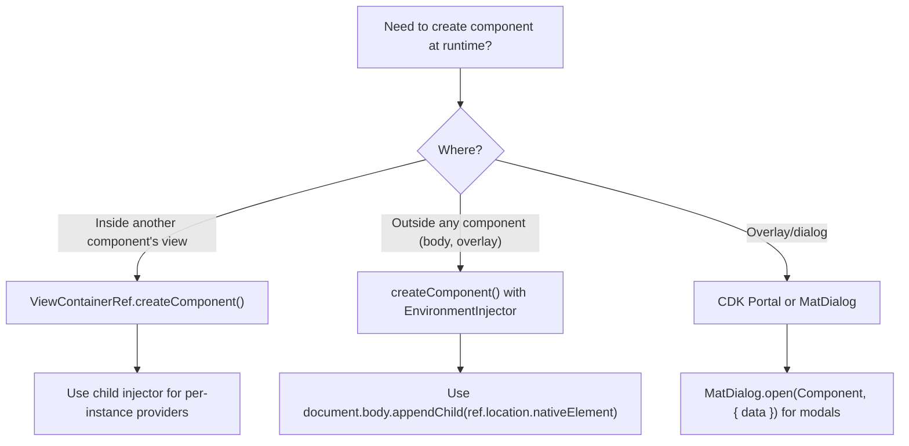

# Angular Elements and Dynamic Components

> [!summary] Goal
> Package Angular components as native web components with `@angular/elements` and create components at runtime with `ViewContainerRef.createComponent()` for dashboards, modals, and plugin systems.

## Table of Contents

1. [Dynamic Components](#dynamic-components)
2. [Angular Elements](#angular-elements)
3. [Pitfalls](#pitfalls)

---

## Dynamic Components

Creating components at runtime — useful for modals, tab panels, dashboards, and plugin architectures.

### `ViewContainerRef.createComponent()`

```typescript
import { ViewContainerRef, ComponentRef, inject, Component } from '@angular/core';

@Component({
  template: `<ng-template #container></ng-template>`,
})
export class DashboardComponent {
  private viewContainer = inject(ViewContainerRef);

  loadWidget(widgetType: typeof WidgetComponent): void {
    // Clear previous widgets
    this.viewContainer.clear();

    // Create the component dynamically
    const componentRef: ComponentRef<WidgetComponent> =
      this.viewContainer.createComponent(widgetType);

    // Set inputs
    componentRef.setInput('title', 'Dashboard Widget');
    componentRef.setInput('data', this.widgetData);

    // Listen to outputs
    componentRef.instance.action.subscribe((event) => {
      console.log('Widget action:', event);
    });
  }
}
```

### Dynamic component with `@Input` and `@Output`

```typescript
@Component({
  template: `
    <div class="widget">
      <h3>{{ title }}</h3>
      <button (click)="onAction()">Action</button>
    </div>
  `,
})
export class WidgetComponent {
  title = signal('');
  data = signal<unknown>(null);
  action = output<void>();

  onAction(): void {
    this.action.emit();
  }
}
```

### Dynamic component with injector for dependencies

```typescript
import { Injector, EnvironmentInjector, createComponent } from '@angular/core';

@Component({...})
export class ModalService {
  private injector = inject(Injector);
  private environmentInjector = inject(EnvironmentInjector);

  openModal(componentType: Type<ModalComponent>, data: unknown): ComponentRef<ModalComponent> {
    // Create child injector with custom providers
    const childInjector = Injector.create({
      providers: [
        { provide: MODAL_DATA, useValue: data },
      ],
      parent: this.injector,
    });

    const componentRef = createComponent(componentType, {
      elementInjector: childInjector,
      environmentInjector: this.environmentInjector,
    });

    // Attach to DOM
    document.body.appendChild(componentRef.location.nativeElement);

    return componentRef;
  }
}
```

### Portal pattern (CDK-based)

```typescript
import { CdkPortal, DomPortalOutlet, ComponentPortal } from '@angular/cdk/portal';

@Component({
  template: `
    <!-- Template portal (embedded view) -->
    <ng-template cdk-portal>
      <p>This content is rendered via portal</p>
    </ng-template>

    <!-- Portal outlet -->
    <div class="portal-outlet"></div>
  `,
  imports: [PortalModule],
})
export class PortalExampleComponent {
  private domPortalOutlet: DomPortalOutlet;

  constructor() {
    this.domPortalOutlet = new DomPortalOutlet(
      document.querySelector('.portal-outlet')!,
      inject(ComponentFactoryResolver),
      inject(ApplicationRef),
      inject(Injector),
    );
  }

  renderComponentPortal() {
    const portal = new ComponentPortal(MyComponent);
    const ref = this.domPortalOutlet.attach(portal);
    ref.setInput('value', 42);
  }

  ngOnDestroy() {
    this.domPortalOutlet?.detach();
  }
}
```

### Dynamic component decision tree



---

## Angular Elements

Angular Elements lets you compile Angular components into **native Custom Elements** (web components) that work in any framework or no framework.

### Setup

```bash
ng add @angular/elements
```

### Creating a custom element

```typescript
// widget.component.ts
@Component({
  selector: 'app-widget',
  standalone: true,
  template: `
    <div class="widget">
      <h3>{{ title }}</h3>
      <p>{{ body }}</p>
      <button (click)="onClick()">{{ buttonText }}</button>
    </div>
  `,
})
export class WidgetComponent {
  // @Input → HTML attributes / properties
  @Input() title = 'Default Title';
  @Input() body = 'Default body text';
  @Input() buttonText = 'Click';

  // @Output → CustomEvents
  @Output() widgetClick = new EventEmitter<{ id: string }>();
  @Output() widgetClose = new EventEmitter<void>();

  onClick(): void {
    this.widgetClick.emit({ id: 'widget-1' });
  }
}
```

```typescript
// app.module.ts (or app.config.ts) — bootstrapping the element
import { createCustomElement } from '@angular/elements';
import { ApplicationRef, Injector, NgModule } from '@angular/core';

// For standalone apps:
export const appConfig: ApplicationConfig = {
  providers: [
    // ...other providers
  ],
};

// Bootstrap the app and define the custom element
// In main.ts:
import { bootstrapApplication } from '@angular/platform-browser';
import { AppComponent } from './app/app.component';

bootstrapApplication(AppComponent, appConfig).then((appRef) => {
  const injector = appRef.injector;

  // Convert the Angular component to a Custom Element
  const WidgetElement = createCustomElement(WidgetComponent, { injector });

  // Register with the browser
  customElements.define('my-widget', WidgetElement);
});
```

### Using the custom element in plain HTML

```html
<!DOCTYPE html>
<html>
<head>
  <script src="dist/my-app/main.js"></script>
</head>
<body>
  <!-- Use the Angular element like any HTML tag -->
  <my-widget
    title="My Widget"
    body="This is an Angular component in plain HTML"
    button-text="Learn More">
  </my-widget>

  <script>
    const widget = document.querySelector('my-widget');

    // Set properties programmatically
    widget.title = 'Updated Title';

    // Listen for events
    widget.addEventListener('widgetClick', (event) => {
      console.log('Widget clicked:', event.detail);
    });
  </script>
</body>
</html>
```

### Using in another framework (React)

```tsx
// React component wrapping an Angular Element
function WidgetWrapper() {
  const ref = useRef<HTMLElement>(null);

  useEffect(() => {
    const el = ref.current;
    if (!el) return;

    // Set Angular @Input properties
    (el as any).title = 'React-controlled title';
    (el as any).buttonText = 'Open';

    // Listen to Angular @Output events
    const handler = (event: CustomEvent) => {
      console.log('Event from Angular:', event.detail);
    };
    el.addEventListener('widgetClick', handler);

    return () => el.removeEventListener('widgetClick', handler);
  }, []);

  return <my-widget ref={ref} />;
}
```

### Input/output mapping

| Angular | Custom Element |
|---------|---------------|
| `@Input() title: string` | HTML attribute `title="value"` (string) |
| `@Input() config: object` | JS property `element.config = {...}` (non-string) |
| `@Output() widgetClick` | CustomEvent `widgetClick` with `event.detail` |
| `@Output()` with `EventEmitter` | `{ bubbles: true, composed: true }` by default |
| `ChangeDetectionStrategy.OnPush` | Required — elements don't have zone.js context |

> [!warning] Custom Elements use `ChangeDetectionStrategy.OnPush` by default. Call `changeDetectorRef.detectChanges()` after setting inputs programmatically to trigger a view update.

### Lifecycle in custom elements

```typescript
export class WidgetComponent implements OnChanges, OnDestroy {
  @Input() title = '';

  // connectedCallback → component constructor + ngOnInit
  // attributeChangedCallback → ngOnChanges
  // disconnectedCallback → ngOnDestroy

  ngOnChanges(changes: SimpleChanges): void {
    // Fired when attribute/property changes
    console.log('Input changed:', changes);
  }

  ngOnDestroy(): void {
    // Clean up when element is removed from DOM
    console.log('Element removed from DOM');
  }
}
```

### Building for production

```json
// angular.json — for an elements-only project
{
  "projects": {
    "widgets": {
      "architect": {
        "build": {
          "options": {
            "outputPath": "dist/widgets",
            "bundle": {
              "namedChunks": false,
              "runtimeChunk": false,
              "vendorChunk": false,
              "commonChunk": false
            },
            "optimization": true,
            "outputHashing": "none",
            "outputMode": "single-bundle"  // Single JS file
          }
        }
      }
    }
  }
}
```

```bash
ng build widgets --configuration production
# Output: dist/widgets/browser/main.js — single file, ready to embed
```

---

## Pitfalls

### Zone.js in custom elements

Custom elements created in an Angular app still depend on Zone.js for change detection. When embedded in a non-Angular page without Zone.js, changes don't propagate automatically.

**Fix**: Call `changeDetectorRef.detectChanges()` after setting inputs. Or use `provideZonelessChangeDetection()` in the elements app.

### Styles not scoped in custom elements

Custom Elements use Shadow DOM (when `ViewEncapsulation.ShadowDom` is set). Without it, component styles may leak or not apply.

**Fix**: Set `encapsulation: ViewEncapsulation.ShadowDom` on element components, or use inline styles / CSS custom properties.

### Dynamic component not registered in `@NgModule.entryComponents` (legacy)

In legacy NgModule-based apps, dynamically created components must be listed in `entryComponents` (Angular 13-) or `NgModule.bootstrap` / component's `imports` array. In standalone, just import the component.

### Memory leaks with dynamic components

```typescript
// ❌ Dynamic component never destroyed
const ref = this.viewContainer.createComponent(MyComponent);

// ✅ Always destroy when no longer needed
ref.destroy();
// ViewContainerRef.clear() destroys all its children
this.viewContainer.clear();
```

### Custom Element event not firing in React's synthetic events

React's synthetic event system doesn't pick up Custom Events from custom elements. Use `addEventListener` directly (as shown in the React example above) or a ref-based approach.

---

> [!question]- Interview Questions
>
> **Q: How do you create a component dynamically in Angular?**
> A: Inject `ViewContainerRef`, call `createComponent(ComponentType)`, set inputs via `componentRef.setInput()`, listen to outputs via `componentRef.instance.output.subscribe()`. Use `Injector.create()` with a child injector to pass per-instance providers.
>
> **Q: What is `@angular/elements`?**
> A: `@angular/elements` provides `createCustomElement()` that converts an Angular component into a native Custom Element (web component). It can be used in any HTML page or framework without Angular dependencies.
>
> **Q: How do Angular inputs and outputs map to Custom Elements?**
> A: `@Input()` string properties become HTML attributes. Non-string inputs are set as JavaScript properties on the DOM element. `@Output()` becomes a CustomEvent dispatched on the element — listen with `element.addEventListener('eventName', handler)` and read the payload from `event.detail`.
>
> **Q: What is the portal pattern in Angular?**
> A: The CDK Portal pattern lets you render a template or component into a different DOM location. `ComponentPortal(MyComponent)` attaches a component to a `DomPortalOutlet`. This is the foundation for overlays, dialogs, and side panels.
>
> **Q: How do you ensure change detection works for Custom Elements?**
> A: Custom Elements use `OnPush` by default. After setting inputs programmatically (via JS properties), call `changeDetectorRef.detectChanges()` to update the view. For zoneless apps, use signals which automatically trigger updates.

---

## Cross-Links

- [[Angular/01_Foundations/03_DI_Services_and_Providers]] for child injector creation
- [[Angular/02_Core/07_Directives_Structural_and_Attribute]] for ViewContainerRef fundamentals
- [[Angular/02_Core/12_Angular_Material_and_CDK]] for CDK Portal and Overlay patterns
- [[Angular/03_Advanced/09_Zoneless_and_New_Control_Flow]] for zoneless CD in elements
- [[Angular/02_Core/01_Standalone_Components]] for standalone component bootstrapping
