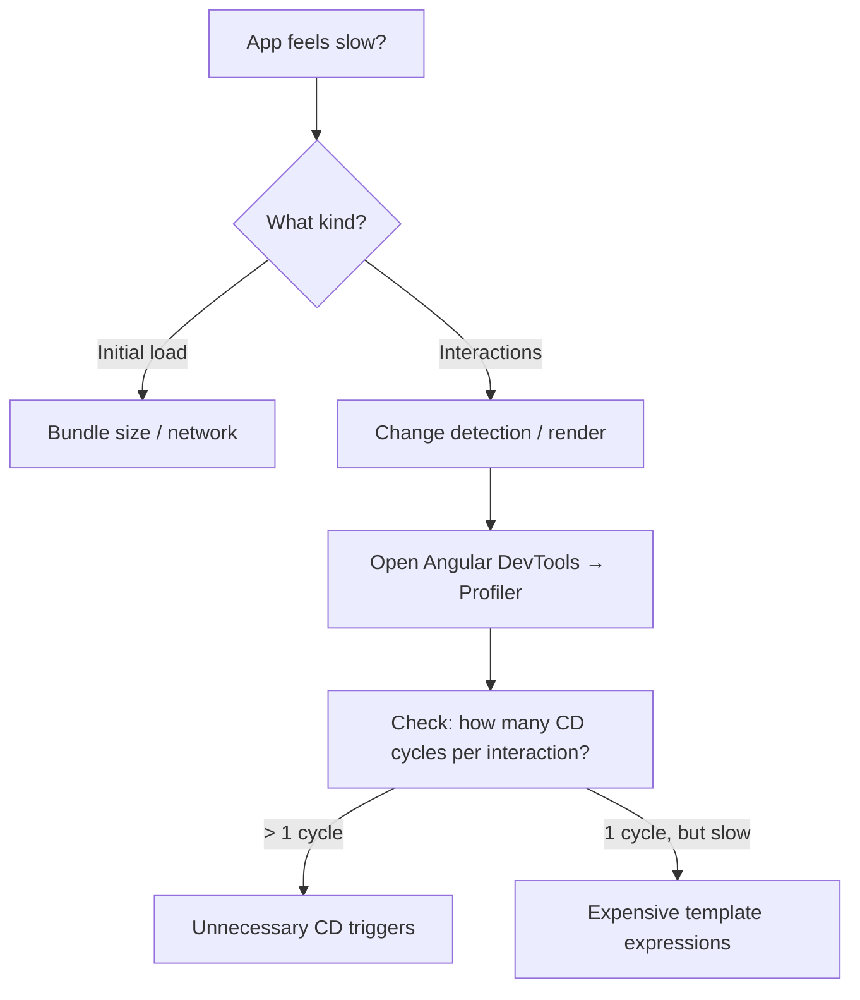
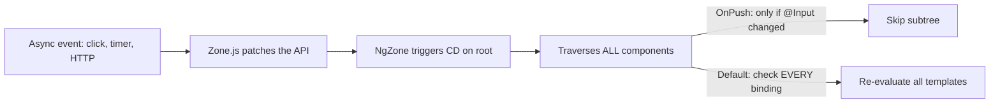
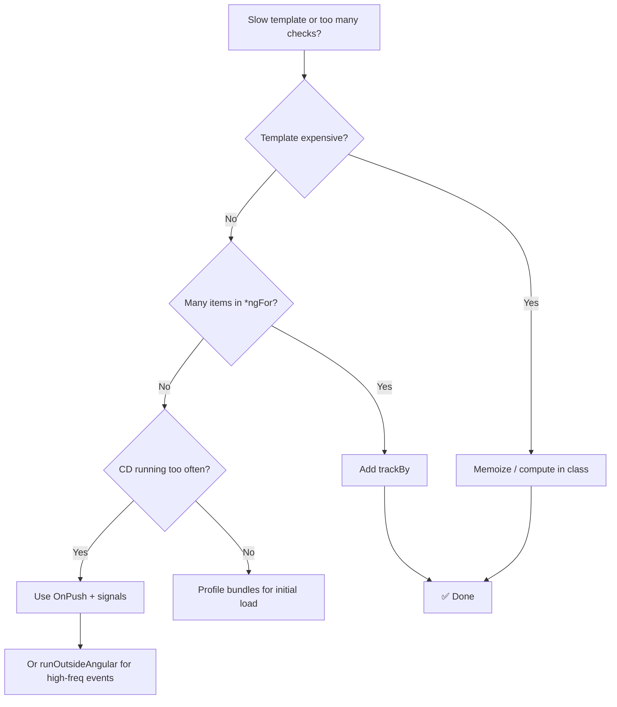

# Playbook: Debug Change Detection and Performance

> [!summary] Goal
> Identify why the UI updates too often or too slowly, and apply the smallest fix for the biggest gain.

## Table of Contents

1. [Symptom Diagnosis](#symptom-diagnosis)
2. [Common Root Causes](#common-root-causes)
3. [The Fix Decision Tree](#the-fix-decision-tree)
4. [Using Angular DevTools](#using-angular-devtools)
5. [Pitfalls](#pitfalls)
6. [Q&A](#q-a)

---

## Symptom Diagnosis



| Symptom | Likely cause | Tool |
|---------|------------|------|
| UI updates too often | Zone.js triggers CD on every async event | Angular DevTools → Profiler |
| Slow initial render | Large component tree or many bindings | Chrome Performance panel |
| Janky scrolling | Heavy DOM in `*ngFor` without `trackBy` | DevTools → Change Detection |
| Layout thrashing | Animations triggering layout (`width`, `top`) | Chrome Performance → Layout shift |

---

## Common Root Causes

### 1. Zone.js triggers CD on every async event

Every `setTimeout`, `addEventListener`, `Promise`, or `XMLHttpRequest` causes Angular to run change detection on the entire tree — unless you isolate components.



### 2. No `trackBy` on `*ngFor`

Without `trackBy`, Angular destroys and recreates every DOM element on any array change — even a single item push.

```typescript
// ❌ Bad — destroys and recreates all items
<li *ngFor="let item of items">{{ item.name }}</li>

// ✅ Good — only touch changed items
<li *ngFor="let item of items; trackBy: trackByFn">{{ item.name }}</li>

trackByFn(index: number, item: Item): number {
  return item.id;  // Helps Angular identify which item changed
}
```

### 3. Expensive template expressions

```typescript
// ❌ Bad — called on EVERY CD cycle
template: `<p>{{ heavyComputation(data) }}</p>`

// ✅ Good — compute once, store in property
template: `<p>{{ computedValue }}</p>`
```

### 4. Frequent events re-checking the whole tree

```html
<!-- ❌ Bad: mousemove fires constantly → entire tree re-checked -->
<div (mousemove)="onMove($event)">...</div>

<!-- ✅ Good: throttle events outside Angular zone -->
<div #throttled>...</div>
```

```typescript
@ViewChild('throttled', { static: true }) el!: ElementRef;

ngAfterViewInit() {
  this.ngZone.runOutsideAngular(() => {
    fromEvent(this.el.nativeElement, 'mousemove')
      .pipe(throttleTime(100))
      .subscribe(e => this.ngZone.run(() => this.onMove(e)));
  });
}
```

---

## The Fix Decision Tree



| Fix | Effort | Impact |
|-----|--------|--------|
| Add `trackBy` | Low (5 min) | High for lists |
| Switch to `OnPush` | Medium | High overall |
| Move logic out of templates | Low | Medium |
| Use `runOutsideAngular` | Medium | High for frequent events |
| Lazy load heavy modules | High | High for initial load |

---

## Using Angular DevTools

1. **Open Chrome DevTools → Angular tab**
2. **Profiler tab**: Record an interaction, see a flame chart of CD cycles
3. **Component tree**: See each component's change detection strategy and bindings
4. **Check for "Change Detection" highlights**: Green flash means CD ran on that component

```typescript
// Enable debug info in development
// angular.json → "optimization": false in dev config
```

---

## Pitfalls

### Fixing the wrong thing

Throwing `OnPush` at a slow *initial* render does nothing — you need bundle analysis and lazy loading instead. Diagnose first.

### Over-optimizing with `OnPush`

`OnPush` means the component only checks when `@Input` changes. If you pass a new object reference every time (e.g. `[user]="getUser()"` in the parent or creating a new object in the template), `OnPush` still re-checks because the reference changed.

### Forgetting `trackBy` on nested `*ngFor`

Outer list has `trackBy`, inner list doesn't → inner still recreates all elements on every change.

### Premature optimization

A single `trackBy` fix is 80% of the gain. Don't rewrite the whole CD strategy for a 2ms improvement on a rarely-rendered component.

---

> [!question]- Interview Questions
>
> **Q: How does Angular's default change detection work?**
> A: Zone.js patches browser async APIs. When any async event fires, Zone.js notifies NgZone, which triggers a full tree traversal. Each component checks every template binding for changes.
>
> **Q: What does `OnPush` change detection do?**
> A: With `OnPush`, Angular only checks a component if: an `@Input` reference changed, the component or its children fired an event, an async pipe emitted, or a signal changed. It skips the entire subtree otherwise.
>
> **Q: When would you use `runOutsideAngular`?**
> A: For high-frequency events (mousemove, scroll, WebSocket messages) where you don't need Angular to re-check after every event. Run the handler outside Angular's zone, then re-enter only when the UI needs updating.
>
> **Q: How does `trackBy` improve `*ngFor` performance?**
> A: Without `trackBy`, Angular identifies items by identity (===). On array mutation, it destroys and recreates every DOM element. With `trackBy`, Angular uses the returned key — only creating/removing changed items and reordering the rest.
>
> **Q: How do you profile an Angular app for performance?**
> A: Use the Angular DevTools Profiler tab — record interaction, see change detection cycles. Use Chrome Performance panel for layout/paint metrics. Use Lighthouse for Core Web Vitals scoring.

---

## Cross-Links

- [[Angular/03_Advanced/01_Change_Detection_and_Performance]] for deep CD concepts
- [[Angular/02_Core/02_Signals_Essentials]] for signal-based CD
- [[Angular/03_Advanced/05_Image_Optimization_and_Performance]] for bundle optimization
- [[Angular/03_Advanced/06_Angular_CLI_and_Configuration]] for budgets and build config
