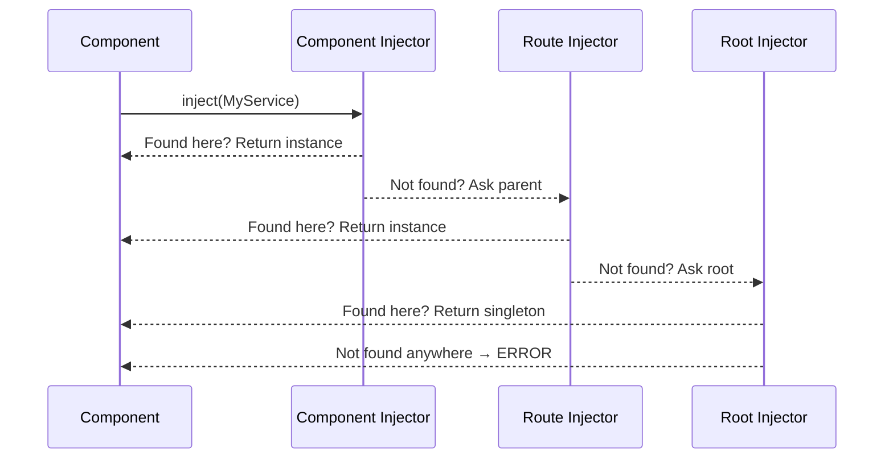
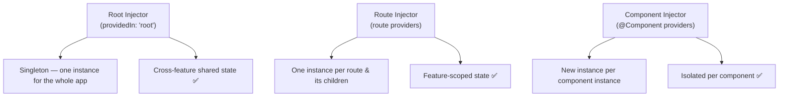
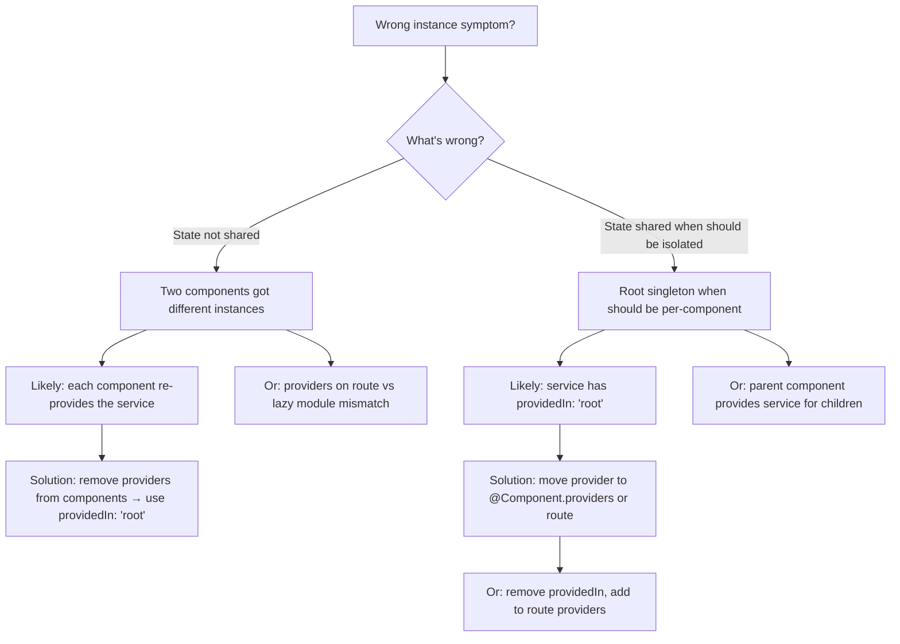
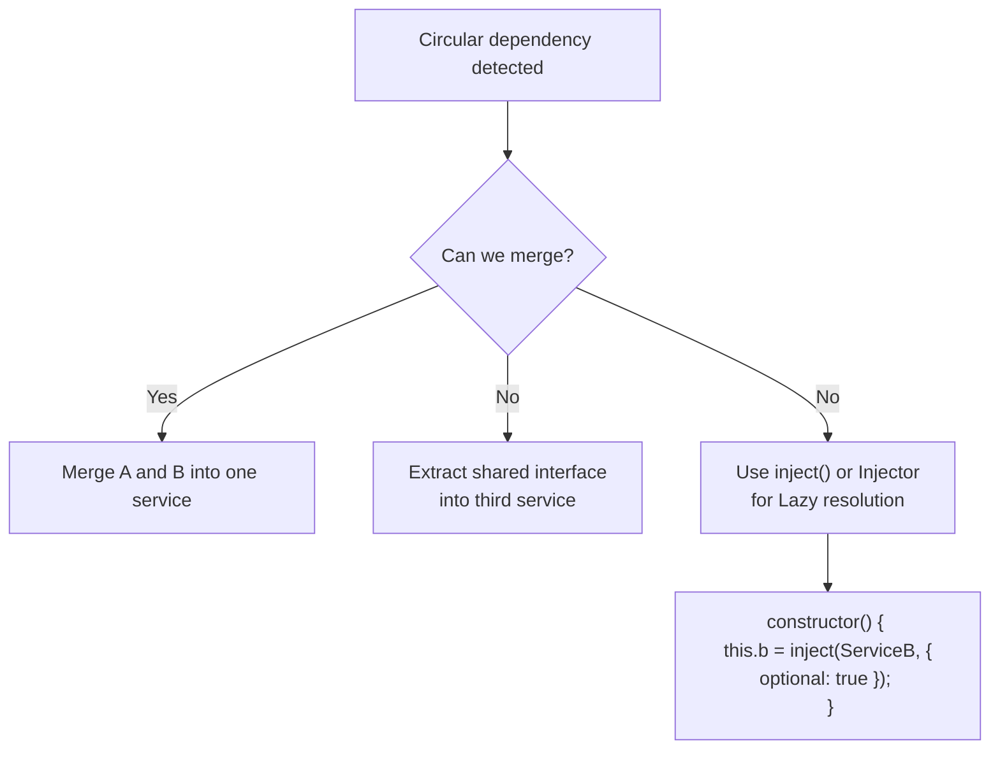

# Playbook: Debug DI Provider Scope Issues

> [!summary] Goal
> Fix "wrong instance" problems (state not shared, or shared when it shouldn't be) and circular dependencies by tracing provider scopes.

## Table of Contents

1. [How Provider Resolution Works](#how-provider-resolution-works)
2. [The Three Injector Tiers](#the-three-injector-tiers)
3. [Diagnosis Decision Tree](#diagnosis-decision-tree)
4. [Circular Dependencies](#circular-dependencies)
5. [Pitfalls](#pitfalls)

---

## How Provider Resolution Works

When Angular needs a dependency, it walks **up** the injector tree — from the component's own injector to the module/route injector to the root injector — and uses the **first** provider it finds at any level.



---

## The Three Injector Tiers



### Where does the provider live?

| Provider Location | How to declare | Scope | One instance per |
|-----------------|---------------|-------|------------------|
| **Root injector** | `providedIn: 'root'` | Whole app | App lifetime |
| **Platform injector** | `@Injectable({ providedIn: 'platform' })` | Multiple apps | Platform lifetime |
| **Route providers** | `{ path: 'admin', providers: [AdminService] }` | Route + children | Route activation |
| **Component providers** | `@Component({ providers: [MyService] })` | That component + children | Component instance |
| **Directive providers** | `@Directive({ providers: [MyService] })` | Host element | Directive instance |

---

## Diagnosis Decision Tree



### Quick reference

```typescript
// ✅ Singleton — one for the app
@Injectable({ providedIn: 'root' })
export class SharedStateService { }

// ✅ Per-component instance
@Component({
  providers: [IsolatedStateService],
})
export class MyComponent { }

// ✅ Per-route instance
const routes: Routes = [{
  path: 'admin',
  providers: [AdminSessionService],
  loadComponent: () => import('./admin.component'),
}];
```

---

## Circular Dependencies

```typescript
// ❌ Circular: A → B → A
@Injectable({ providedIn: 'root' })
export class ServiceA {
  constructor(private b: ServiceB) { }
}
@Injectable({ providedIn: 'root' })
export class ServiceB {
  constructor(private a: ServiceA) { }  // Error: circular dependency
}
```

### Fix strategies



### Lazy resolution with `inject()`

```typescript
@Injectable({ providedIn: 'root' })
export class ServiceA {
  private b = inject(ServiceB);  // OK — inject() runs during construction
}

@Injectable({ providedIn: 'root' })
export class ServiceB {
  private a!: ServiceA;  // Defer resolution

  constructor() {
    // Use Injector to defer
    const injector = inject(Injector);
    setTimeout(() => {
      this.a = injector.get(ServiceA);
    });
  }
}
```

---

## Pitfalls

### Re-providing a service accidentally

```typescript
// auth.service.ts — root singleton
@Injectable({ providedIn: 'root' })
export class AuthService { }

// admin.component.ts — re-provides it as component-level
@Component({
  providers: [AuthService],  // ❌ Different instance per component!
})
export class AdminComponent { }
```

**Fix**: Remove the component-level `providers` array for services that should be singletons.

### Lazy-loaded modules create their own injector

If a lazy module provides something already provided at root, the lazy module's injector creates a **second instance** — they are NOT the same.

**Fix**: Use `providedIn: 'root'` instead of module `providers` arrays.

### `providedIn: 'root'` with `forRoot()` pattern

```typescript
// ❌ Bad: root singleton but also in forRoot()
@Injectable()
export class MyService { }

@NgModule({ providers: [MyService] })  // Double-provided
export class MyModule {
  static forRoot(): ModuleWithProviders<MyModule> {
    return { ngModule: MyModule, providers: [MyService] };
  }
}
```

**Fix**: Only provide in `forRoot()` — not in the module decorator — OR use `providedIn: 'root'` and skip the module providers entirely.

### Circular deps between services

The Angular compiler catches circular constructor injection. If `inject()` also causes a cycle, use `Injector.get()` with `SkipSelf` or defer resolution with `setTimeout(() => ...)`.

---

> [!question]- Interview Questions
>
> **Q: What is the injector hierarchy in Angular?**
> A: Component injector → (parent component injector) → route/module injector → root injector → platform injector. Resolution walks up this tree and returns the first provider found.
>
> **Q: What happens when a lazy-loaded module provides a service that's already providedIn: 'root'?**
> A: The lazy module creates its own child injector. The component in that module gets the module's instance, not the root singleton. Two instances exist.
>
> **Q: How do you break a circular dependency?**
> A: Extract shared logic into a third service, or use `Injector.get()` with `SkipSelf` to defer resolution. Or restructure — circular deps usually indicate a design flaw.
>
> **Q: When would you re-provide a service at the component level?**
> A: When each component instance needs its own isolated state — e.g., a form state service that should reset when the user navigates away.

---

## Cross-Links

- [[Angular/01_Foundations/03_DI_Services_and_Providers]] for DI fundamentals
- [[Angular/03_Advanced/01_Change_Detection_and_Performance]] for how component injectors affect CD
- [[Angular/03_Advanced/07_Migration_Module_to_Standalone]] for module vs standalone provider patterns
