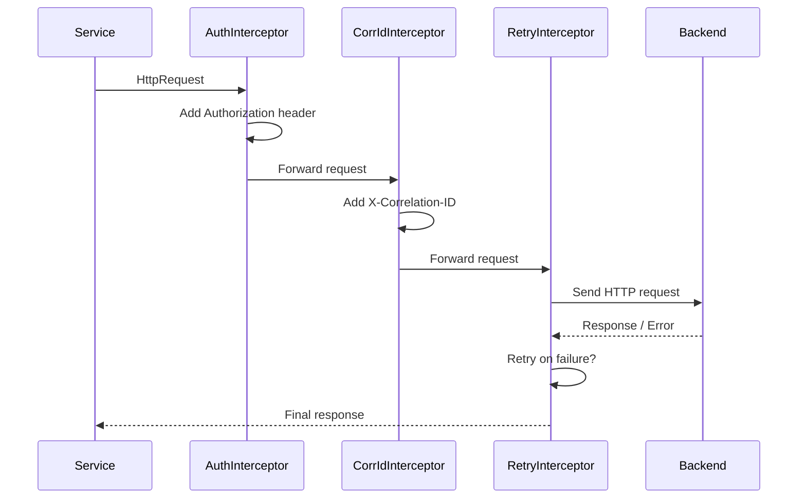
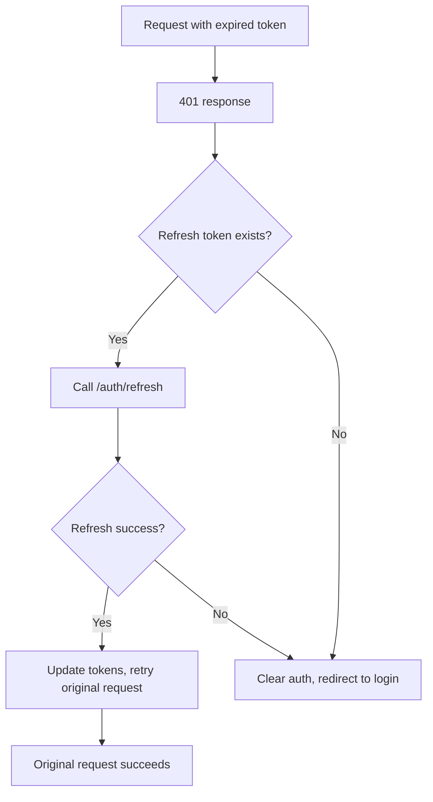

# Playbook: HTTP Interceptors (Auth, Retries, Correlation IDs)

> [!summary] Goal
> Implement cross-cutting HTTP concerns once and correctly: auth headers, retries with backoff, and tracing headers — without leaking these concerns into individual services.

## Table of Contents

1. [Interceptor Pipeline](#interceptor-pipeline)
2. [Auth Interceptor](#auth-interceptor)
3. [Retry Interceptor](#retry-interceptor)
4. [Correlation ID Interceptor](#correlation-id-interceptor)
5. [Combining Interceptors](#combining-interceptors)
6. [Pitfalls](#pitfalls)

---

## Interceptor Pipeline



Interceptor order matters — they run in the order they are provided in `provideHttpClient(withInterceptors(...))`.

---

## Auth Interceptor

```typescript
import { HttpInterceptorFn } from '@angular/common/http';
import { inject } from '@angular/core';
import { AuthService } from './auth.service';

export const authInterceptor: HttpInterceptorFn = (req, next) => {
  const auth = inject(AuthService);
  const token = auth.getToken();

  if (!token) return next(req);

  const cloned = req.clone({
    setHeaders: { Authorization: `Bearer ${token}` },
  });

  return next(cloned);
};
```

### Handling 401 responses

```typescript
export const authInterceptor: HttpInterceptorFn = (req, next) => {
  const auth = inject(AuthService);
  const router = inject(Router);

  return next(req).pipe(
    catchError((error: HttpErrorResponse) => {
      if (error.status === 401) {
        auth.clearToken();
        router.navigate(['/login']);
      }
      return throwError(() => error);
    }),
  );
};
```

### Token refresh flow



```typescript
export const authInterceptor: HttpInterceptorFn = (req, next) => {
  const auth = inject(AuthService);
  const router = inject(Router);

  return next(req).pipe(
    catchError((error: HttpErrorResponse) => {
      if (error.status !== 401) return throwError(() => error);
      if (!auth.getRefreshToken()) {
        auth.clearToken();
        router.navigate(['/login']);
        return throwError(() => error);
      }
      return auth.refreshToken().pipe(
        switchMap(() => {
          const cloned = req.clone({
            setHeaders: { Authorization: `Bearer ${auth.getToken()}` },
          });
          return next(cloned);
        }),
        catchError(() => {
          auth.clearToken();
          router.navigate(['/login']);
          return throwError(() => error);
        }),
      );
    }),
  );
};
```

---

## Retry Interceptor

```typescript
import { HttpInterceptorFn } from '@angular/common/http';
import { retry, delay, catchError, throwError, timer } from 'rxjs';

export const retryInterceptor: HttpInterceptorFn = (req, next) => {
  // Only retry safe methods (GET, HEAD, OPTIONS)
  if (!['GET', 'HEAD', 'OPTIONS'].includes(req.method)) {
    return next(req);
  }

  return next(req).pipe(
    retry({
      count: 3,
      delay: (error, retryCount) => {
        // Don't retry client errors (4xx) except 429
        if (error.status && error.status < 500 && error.status !== 429) {
          return throwError(() => error);
        }
        // Exponential backoff with jitter: 1s, 2s, 4s
        const backoff = Math.min(1000 * Math.pow(2, retryCount - 1), 10000);
        const jitter = Math.random() * 500;
        return timer(backoff + jitter);
      },
    }),
  );
};
```

| HTTP status | Retry? | Why |
|------------|--------|-----|
| 429 Too Many Requests | ✅ Yes | Transient — rate limited |
| 500, 502, 503, 504 | ✅ Yes | Server transient errors |
| 4xx (except 429) | ❌ No | Client error — retrying won't help |
| Network error (0) | ✅ Yes | Temporary connectivity issue |

---

## Correlation ID Interceptor

```typescript
import { v4 as uuidv4 } from 'uuid'; // or crypto.randomUUID()

export const correlationIdInterceptor: HttpInterceptorFn = (req, next) => {
  // Use existing ID if provided (from upstream service call)
  const existingId = req.headers.get('X-Correlation-ID');
  const corrId = existingId ?? uuidv4();

  const cloned = req.clone({
    setHeaders: { 'X-Correlation-ID': corrId },
  });

  return next(cloned);
};
```

This enables **request tracing** across microservices — every request gets a unique ID that backend logs can reference.

---

## Combining Interceptors

```typescript
// app.config.ts
import { provideHttpClient, withInterceptors } from '@angular/common/http';

export const appConfig: ApplicationConfig = {
  providers: [
    provideHttpClient(
      withInterceptors([
        correlationIdInterceptor,  // 1st: add tracing header
        authInterceptor,           // 2nd: add auth header
        retryInterceptor,          // 3rd: retry on failure
      ]),
    ),
  ],
};
```

Order matters:
- **Correlation ID first**: ensures every outgoing request has the tracing header
- **Auth second**: adds the token after the ID is set
- **Retry last**: wraps the whole chain — if auth refresh fails, retry still sees the final error

---

## Pitfalls

### Infinite auth refresh loop

If `/auth/refresh` itself returns 401, the interceptor catches it, tries to refresh again, which returns 401 again — infinite loop.

**Fix**: Exclude the refresh endpoint from the auth interceptor:

```typescript
if (req.url.includes('/auth/refresh')) {
  return next(req);  // Don't intercept refresh calls
}
```

### Retrying non-idempotent requests

POST/PUT/PATCH requests are not idempotent — retrying could cause duplicate orders, double charges, etc.

**Fix**: Only retry GET, HEAD, OPTIONS. If you must retry mutations, ensure the backend handles idempotency (check [[SystemDesign/01_Foundations/04_APIs_Idempotency_and_Retries]]).

### Losing the original error

```typescript
// ❌ Bad: throws a new generic error
catchError(() => throwError(() => new Error('Request failed')))

// ✅ Good: preserves original error for downstream handlers
catchError((error) => throwError(() => error))
```

### Interceptor order dependency

If auth interceptor runs after retry interceptor, a 401 causes a retry with the same expired token — all 3 retries fail 401 before the auth interceptor even sees the response.

**Fix**: Auth interceptor must handle 401 **before** retry runs. Place auth interceptor before retry in the `withInterceptors` array.

---

> [!question]- Interview Questions
>
> **Q: What is an Angular HTTP interceptor?**
> A: A function that intercepts every HTTP request/response. It can modify the request, handle responses, or catch errors — implementing cross-cutting concerns without touching individual services.
>
> **Q: How do you avoid infinite auth refresh loops?**
> A: Exclude the refresh endpoint from the auth interceptor by checking `req.url` and passing through. Also ensure the refresh endpoint returns a distinct error (e.g., 403) when the refresh token itself is invalid.
>
> **Q: Why should you only retry idempotent HTTP methods?**
> A: Retrying POST/PUT could create duplicate resources or cause side effects. GET, HEAD, and OPTIONS are safe to retry because they don't mutate server state. For mutations, require idempotency keys.
>
> **Q: How do you pass state between interceptors?**
> A: Store state on the request via `req.clone({ context: ... })` using `HttpContextToken`. The retry interceptor can set a retry count, and the auth interceptor can read it.
>
> **Q: What is a correlation ID and why use it?**
> A: A unique identifier attached to each request (X-Correlation-ID header). It lets you trace a single user request across multiple backend services, useful for debugging distributed systems.

---

## Cross-Links

- [[Angular/02_Core/04_HttpClient_and_Interceptors]] for the interceptor API reference
- [[SystemDesign/01_Foundations/04_APIs_Idempotency_and_Retries]] for idempotency deep dive
- [[Angular/03_Advanced/01_Change_Detection_and_Performance]] for avoiding CD issues with HTTP polling
