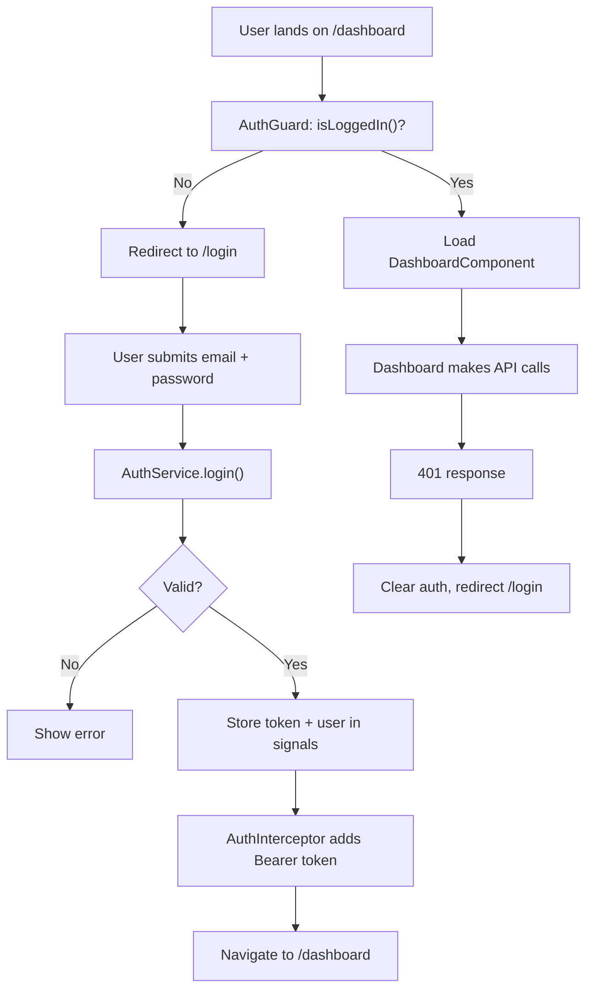
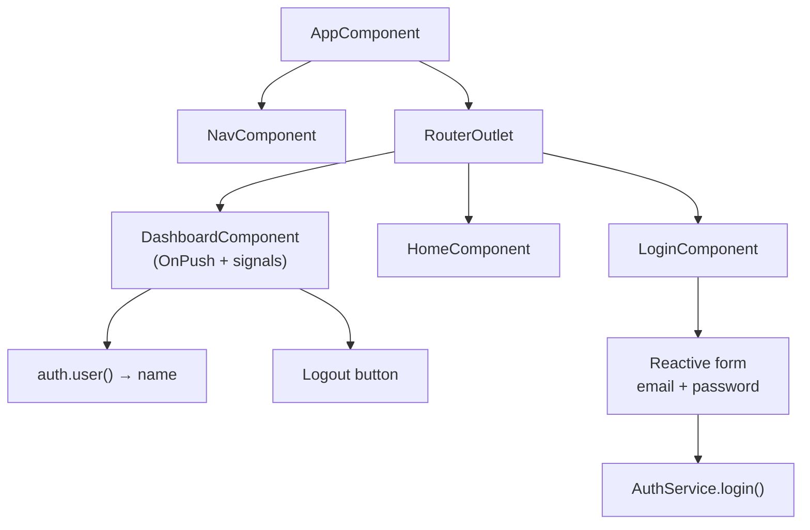

# Project: Standalone Signals Router Starter App

> [!summary] Goal
> Build a complete Angular starter app with standalone components, signals, routing, auth, HTTP interceptors, and tests.

## Project Structure

```
src/
├── app/
│   ├── app.component.ts
│   ├── app.config.ts
│   ├── app.routes.ts
│   ├── core/
│   │   ├── auth.service.ts
│   │   ├── auth.guard.ts
│   │   └── auth.interceptor.ts
│   ├── pages/
│   │   ├── login/login.component.ts
│   │   ├── home/home.component.ts
│   │   └── dashboard/dashboard.component.ts
│   └── shared/
│       └── nav/nav.component.ts
├── main.ts
├── index.html
└── styles.scss
```

## Step 1: Bootstrap

```typescript
// main.ts
import { bootstrapApplication } from '@angular/platform-browser';
import { AppComponent } from './app/app.component';
import { appConfig } from './app/app.config';

bootstrapApplication(AppComponent, appConfig);
```

```typescript
// app.config.ts
import { ApplicationConfig } from '@angular/core';
import { provideRouter, withComponentInputBinding } from '@angular/router';
import { provideHttpClient, withInterceptors } from '@angular/common/http';
import { authInterceptor } from './core/auth.interceptor';
import { routes } from './app.routes';

export const appConfig: ApplicationConfig = {
  providers: [
    provideRouter(routes, withComponentInputBinding()),
    provideHttpClient(withInterceptors([authInterceptor])),
  ],
};
```

## Step 2: Routing

```typescript
// app.routes.ts
import { Routes } from '@angular/router';
import { authGuard } from './core/auth.guard';

export const routes: Routes = [
  { path: 'login', loadComponent: () => import('./pages/login/login.component').then(m => m.LoginComponent) },
  { path: 'dashboard', loadComponent: () => import('./pages/dashboard/dashboard.component').then(m => m.DashboardComponent), canActivate: [authGuard] },
  { path: 'home', component: HomeComponent },
  { path: '', redirectTo: '/home', pathMatch: 'full' },
  { path: '**', redirectTo: '/home' },
];
```

## Step 3: Auth Service with Signals

```typescript
// core/auth.service.ts
export class User {
  constructor(public id: number, public email: string, public name: string) {}
}

@Injectable({ providedIn: 'root' })
export class AuthService {
  private currentUser = signal<User | null>(null);
  readonly isLoggedIn = computed(() => this.currentUser() !== null);
  readonly user = this.currentUser.asReadonly();

  private http = inject(HttpClient);
  private router = inject(Router);

  login(email: string, password: string): Observable<void> {
    return this.http.post<{ user: User; token: string }>('/api/login', { email, password }).pipe(
      tap(({ user, token }) => {
        localStorage.setItem('token', token);
        this.currentUser.set(user);
        this.router.navigate(['/dashboard']);
      }),
      map(() => void 0),
    );
  }

  logout() {
    localStorage.removeItem('token');
    this.currentUser.set(null);
    this.router.navigate(['/login']);
  }
}
```

### How auth flows through the app



---

## Step 4: Auth Guard

```typescript
// core/auth.guard.ts
export const authGuard: CanActivateFn = () => {
  const auth = inject(AuthService);
  const router = inject(Router);
  return auth.isLoggedIn() ? true : router.parseUrl('/login');
};
```

## Step 5: Auth Interceptor

```typescript
// core/auth.interceptor.ts
export const authInterceptor: HttpInterceptorFn = (req, next) => {
  const token = typeof localStorage !== 'undefined' ? localStorage.getItem('token') : null;
  if (token) {
    req = req.clone({ setHeaders: { Authorization: `Bearer ${token}` } });
  }
  return next(req);
};
```

## Step 6: Login Component

```typescript
// pages/login/login.component.ts
@Component({
  standalone: true,
  imports: [ReactiveFormsModule, RouterLink],
  template: `
    <form [formGroup]="form" (ngSubmit)="onSubmit()">
      <input formControlName="email" type="email" placeholder="Email" />
      <input formControlName="password" type="password" placeholder="Password" />
      <button type="submit" [disabled]="form.invalid || loading()">Sign In</button>
      <p *ngIf="error()" class="error">{{ error() }}</p>
    </form>
  `,
})
export class LoginComponent {
  private auth = inject(AuthService);
  private destroyRef = inject(DestroyRef);

  form = new FormGroup({
    email: new FormControl('', [Validators.required, Validators.email]),
    password: new FormControl('', Validators.required),
  });
  loading = signal(false);
  error = signal('');

  onSubmit() {
    if (this.form.invalid) return;
    this.loading.set(true);
    this.error.set('');

    this.auth.login(this.form.value.email!, this.form.value.password!)
      .pipe(takeUntilDestroyed(this.destroyRef))
      .subscribe({
        error: (err) => {
          this.error.set(err.message);
          this.loading.set(false);
        },
      });
  }
}
```

## Step 7: Dashboard Component

### Component hierarchy



```typescript
// pages/dashboard/dashboard.component.ts
@Component({
  standalone: true,
  imports: [CommonModule],
  template: `
    <h1>Welcome, {{ auth.user()?.name }}</h1>
    <button (click)="auth.logout()">Logout</button>
  `,
  changeDetection: ChangeDetectionStrategy.OnPush,
})
export class DashboardComponent {
  protected auth = inject(AuthService);
}
```

---

## Cross-Links

- [[Angular/01_Foundations/04_Routing_Basics]] for routing patterns
- [[Angular/02_Core/02_Signals_Essentials]] for signal-based state
- [[Angular/02_Core/04_HttpClient_and_Interceptors]] for auth interceptor
