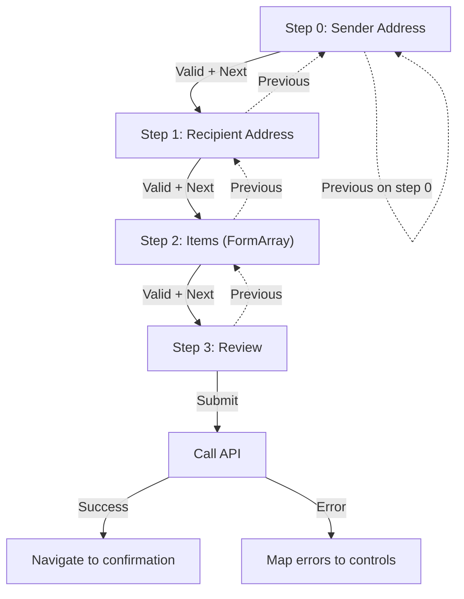
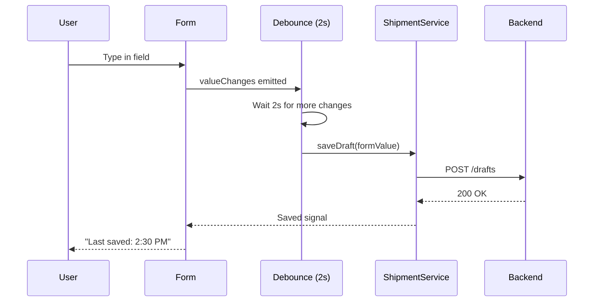

# Project: Forms-Heavy App (Reactive Forms)

> [!summary] Goal
> Build a production-ready multi-step reactive form with typed forms, async validation, cross-field validation, dynamic FormArrays, and auto-save.

## Table of Contents

1. [Project Structure](#project-structure)
2. [Data Model and Typed Form](#data-model-and-typed-form)
3. [Multi-Step Form Component](#multi-step-form-component)
4. [Auto-Save with Signals](#auto-save-with-signals)
5. [Async Validation](#async-validation)
6. [Pitfalls](#pitfalls)

---

## Project Structure

```
src/app/shipment/
├── shipment.component.ts        # Step container + auto-save
├── shipment.component.html
├── steps/
│   ├── address-step.component.ts
│   ├── address-step.component.html
│   ├── items-step.component.ts
│   ├── items-step.component.html
│   ├── review-step.component.ts
│   └── review-step.component.html
├── models/
│   └── shipment.model.ts
├── services/
│   └── shipment.service.ts
└── validators/
    └── zipcode.validator.ts
```

---

## Data Model and Typed Form

```typescript
// models/shipment.model.ts
export interface Address {
  street: string;
  city: string;
  state: string;
  zip: string;
  country: string;
}

export interface ShipmentItem {
  sku: string;
  quantity: number;
  weightKg: number;
}

export interface ShipmentForm {
  sender: Address;
  recipient: Address;
  items: ShipmentItem[];
  shippingDate: string;
  priority: 'standard' | 'express' | 'overnight';
  notes?: string;
}
```

### Typed Form Group

```typescript
// shipment.component.ts
import { FormControl, FormGroup, FormArray, NonNullableFormBuilder, Validators } from '@angular/forms';

type ShipmentFormGroup = FormGroup<{
  sender: AddressFormGroup;
  recipient: AddressFormGroup;
  items: FormArray<FormGroup<ItemFormGroup>>;
  shippingDate: FormControl<string>;
  priority: FormControl<'standard' | 'express' | 'overnight'>;
  notes: FormControl<string | null>;
}>;

type AddressFormGroup = FormGroup<{
  street: FormControl<string>;
  city: FormControl<string>;
  state: FormControl<string>;
  zip: FormControl<string>;
  country: FormControl<string>;
}>;

type ItemFormGroup = {
  sku: FormControl<string>;
  quantity: FormControl<number>;
  weightKg: FormControl<number>;
};

@Component({
  selector: 'app-shipment',
  standalone: true,
  template: `
    <h1>New Shipment</h1>
    <div class="step-indicator">
      <span *ngFor="let step of steps; let i = index"
        [class.active]="currentStep === i"
        [class.completed]="i < currentStep"
        (click)="goToStep(i)">
        Step {{ i + 1 }}: {{ step }}
      </span>
    </div>

    <div [ngSwitch]="currentStep">
      <app-address-step *ngSwitchCase="0"
        [form]="shipmentForm.controls.sender"
        title="Sender Address" />
      <app-address-step *ngSwitchCase="1"
        [form]="shipmentForm.controls.recipient"
        title="Recipient Address" />
      <app-items-step *ngSwitchCase="2"
        [itemsArray]="shipmentForm.controls.items" />
      <app-review-step *ngSwitchCase="3"
        [form]="shipmentForm" />
    </div>

    <div class="step-nav">
      <button (click)="prevStep()" [disabled]="currentStep === 0">Previous</button>
      <button (click)="nextStep()" [disabled]="currentStep === steps.length - 1 && !shipmentForm.valid">
        {{ currentStep === steps.length - 2 ? 'Submit' : 'Next' }}
      </button>
    </div>

    <p class="autosave-hint" *ngIf="saving()">Saving draft...</p>
    <p class="autosave-hint" *ngIf="lastSaved()">Last saved: {{ lastSaved() }}</p>
  `,
})
export class ShipmentComponent {
  private fb = inject(NonNullableFormBuilder);
  private shipmentService = inject(ShipmentService);

  readonly steps = ['Sender', 'Recipient', 'Items', 'Review'];
  currentStep = 0;

  readonly shipmentForm: ShipmentFormGroup = this.fb.group({
    sender: this.buildAddressGroup(),
    recipient: this.buildAddressGroup(),
    items: this.fb.array<FormGroup<ItemFormGroup>>([this.buildItemGroup()]),
    shippingDate: this.fb.control('', Validators.required),
    priority: this.fb.control('standard' as const, Validators.required),
    notes: this.fb.control<string | null>(null),
  });

  private buildAddressGroup(): AddressFormGroup {
    return this.fb.group({
      street: ['', Validators.required],
      city: ['', Validators.required],
      state: ['', Validators.required],
      zip: ['', [Validators.required, Validators.pattern(/^\d{5}(-\d{4})?$/)]],
      country: ['US', Validators.required],
    });
  }

  private buildItemGroup(): FormGroup<ItemFormGroup> {
    return this.fb.group({
      sku: ['', Validators.required],
      quantity: [1, [Validators.required, Validators.min(1)]],
      weightKg: [0.1, [Validators.required, Validators.min(0.1)]],
    });
  }

  // ... navigation methods
}
```

---

## Multi-Step Form Component



### Step validation on navigation

```typescript
nextStep(): void {
  const controls = this.getStepControls(this.currentStep);

  // Mark all controls in current step as touched
  controls.forEach(c => {
    c.markAsTouched();
    c.updateValueAndValidity();
  });

  if (controls.every(c => c.valid)) {
    this.currentStep++;
  }
}

private getStepControls(step: number): AbstractControl[] {
  switch (step) {
    case 0: return [this.shipmentForm.controls.sender];
    case 1: return [this.shipmentForm.controls.recipient];
    case 2: return [this.shipmentForm.controls.items];
    default: return [];
  }
}
```

### Child component receiving a form group

```typescript
// steps/address-step.component.ts
@Component({
  selector: 'app-address-step',
  standalone: true,
  template: `
    <fieldset [formGroup]="form">
      <legend>{{ title }}</legend>
      <div class="form-grid">
        <label>
          Street
          <input formControlName="street" />
          <span class="error" *ngIf="form.get('street')?.invalid && form.get('street')?.touched">
            Street is required
          </span>
        </label>
        <label>
          City <input formControlName="city" />
        </label>
        <label>
          State
          <select formControlName="state">
            <option *ngFor="let s of states" [value]="s.abbr">{{ s.name }}</option>
          </select>
        </label>
        <label>
          ZIP <input formControlName="zip" placeholder="12345" />
        </label>
        <label>
          Country <input formControlName="country" />
        </label>
      </div>
    </fieldset>
  `,
  imports: [ReactiveFormsModule, NgIf, NgFor],
})
export class AddressStepComponent {
  @Input({ required: true }) form!: FormGroup<AddressFormGroup>;
  @Input({ required: true }) title!: string;
}
```

### Items step with FormArray

```typescript
// steps/items-step.component.ts
@Component({
  selector: 'app-items-step',
  standalone: true,
  template: `
    <div formArrayName="items">
      <div *ngFor="let item of itemsArray.controls; let i = index" [formGroupName]="i" class="item-row">
        <label>SKU <input formControlName="sku" /></label>
        <label>Qty <input type="number" formControlName="quantity" /></label>
        <label>Weight <input type="number" formControlName="weightKg" /> kg</label>
        <button (click)="removeItem(i)" *ngIf="itemsArray.length > 1">Remove</button>
      </div>
    </div>
    <button (click)="addItem()">+ Add Item</button>
    <p class="error" *ngIf="itemsArray.invalid && itemsArray.touched">
      All items must have SKU, quantity ≥ 1, and weight ≥ 0.1 kg
    </p>
  `,
  imports: [ReactiveFormsModule, NgIf, NgFor],
})
export class ItemsStepComponent {
  @Input({ required: true }) itemsArray!: FormArray<FormGroup<ItemFormGroup>>;

  addItem(): void {
    this.itemsArray.push(this.buildItemGroup());
  }

  removeItem(index: number): void {
    this.itemsArray.removeAt(index);
  }
}
```

---

## Auto-Save with Signals

```typescript
// shipment.component.ts
import { toSignal } from '@angular/core/rxjs-interop';
import { debounceTime, distinctUntilChanged, tap } from 'rxjs';

// Auto-save signal
readonly saving = signal(false);
readonly lastSaved = signal<string | null>(null);

private autoSaveSub = Subscription;

ngAfterViewInit(): void {
  // Debounce form changes and auto-save
  this.autoSaveSub = this.shipmentForm.valueChanges
    .pipe(
      debounceTime(2000),
      distinctUntilChanged(),
      tap(() => this.saving.set(true)),
      switchMap(value =>
        this.shipmentService.saveDraft(value as ShipmentForm)
      ),
    )
    .subscribe({
      next: () => {
        this.saving.set(false);
        this.lastSaved.set(new Date().toLocaleTimeString());
      },
      error: () => this.saving.set(false),
    });
}

ngOnDestroy(): void {
  this.autoSaveSub?.unsubscribe();
}
```



---

## Async Validation

```typescript
// validators/zipcode.validator.ts
import { AbstractControl, AsyncValidatorFn, ValidationErrors } from '@angular/forms';
import { inject } from '@angular/core';
import { HttpClient } from '@angular/common/http';
import { Observable, map, catchError, of, debounceTime, distinctUntilChanged, switchMap } from 'rxjs';

export function zipcodeExistsValidator(http: HttpClient): AsyncValidatorFn {
  return (control: AbstractControl): Observable<ValidationErrors | null> => {
    if (!control.value || control.value.length < 5) {
      return of(null);  // Don't validate until enough input
    }

    return of(control.value).pipe(
      debounceTime(500),
      distinctUntilChanged(),
      switchMap(zip =>
        http.get<{ valid: boolean }>(`/api/zipcodes/${zip}`).pipe(
          map(res => res.valid ? null : { zipcodeInvalid: true }),
          catchError(() => of({ zipcodeInvalid: true })),
        )
      ),
    );
  };
}
```

### Using the async validator

```typescript
private http = inject(HttpClient);

private buildAddressGroup(): AddressFormGroup {
  return this.fb.group({
    // ...
    zip: ['', {
      validators: [Validators.required, Validators.pattern(/^\d{5}(-\d{4})?$/)],
      asyncValidators: [zipcodeExistsValidator(this.http)],
      updateOn: 'blur',
    }],
    // ...
  });
}
```

### Status display

```html
<input formControlName="zip" />
<span *ngIf="form.get('zip')?.pending" class="validating">Checking ZIP...</span>
<span *ngIf="form.get('zip')?.errors?.['zipcodeInvalid']" class="error">
  ZIP code not found
</span>
```

---

## Pitfalls

### Forgetting `updateOn: 'blur'` for async validators

Without this, async validation fires on every keystroke — causing a storm of API calls. Use `updateOn: 'blur'` or debounce within the validator.

### FormArray controls not tracking identity

If items are added/removed and you use `*ngFor` without `trackBy`, the entire list re-renders. Use `trackBy: trackByIndex` on the items step.

### Auto-save saving invalid state

```typescript
// ❌ Bad: saves even when form is completely empty
this.form.valueChanges.pipe(debounceTime(2000))...

// ✅ Good: only save if there's meaningful data
this.form.valueChanges.pipe(
  debounceTime(2000),
  filter(() => this.hasAnyValue()),
)...
```

### Step navigation skipping validation

Make sure `nextStep()` marks controls as touched and checks validity before advancing. Without this, users can skip to review with invalid data.

### Not unsubscribing from auto-save

`valueChanges` doesn't complete on destroy. Always unsubscribe in `ngOnDestroy` or use `takeUntilDestroyed()`.

---

> [!question]- Interview Questions
>
> **Q: How do you handle multi-step form validation in Angular?**
> A: Each step validates its subset of controls before allowing navigation. `nextStep()` marks current-step controls as touched and checks validity. Only advance if all pass. Use separate child components with `@Input() form` for each step.
>
> **Q: How do you implement auto-save with reactive forms?**
> A: Subscribe to `valueChanges` with `debounceTime(2000)`, use `switchMap` to call the save API. Show "Saving..." / "Last saved" indicators with signals. Unsubscribe on destroy.
>
> **Q: What is a typed reactive form?**
> A: Using Angular 14+ typed forms with `FormGroup<{ name: FormControl<string> }>` instead of untyped `FormGroup`. Provides type safety for `.value`, `.get()`, and `patchValue()`. Use `NonNullableFormBuilder` for controls that should never be null.
>
> **Q: How do you integrate async validation with reactive forms?**
> A: Pass `asyncValidators` in the control options. Use `updateOn: 'blur'` or debounce inside the validator to avoid excessive API calls. The form's `pending` property is true while the async validator runs.

---

## Cross-Links

- [[Angular/02_Core/05_Forms_Template_vs_Reactive]] for reactive vs template-driven comparison
- [[Angular/02_Core/02_Signals_Essentials]] for signal-based state
- [[Angular/02_Core/04_HttpClient_and_Interceptors]] for HTTP calls
- [[Angular/02_Core/03_RxJS_in_Angular]] for debounce/switchMap patterns
