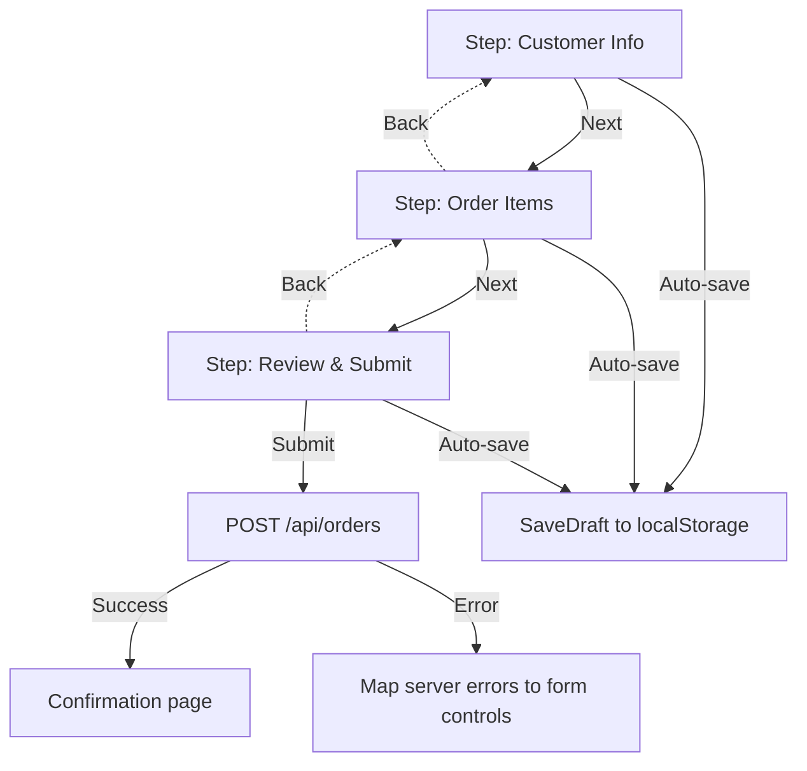
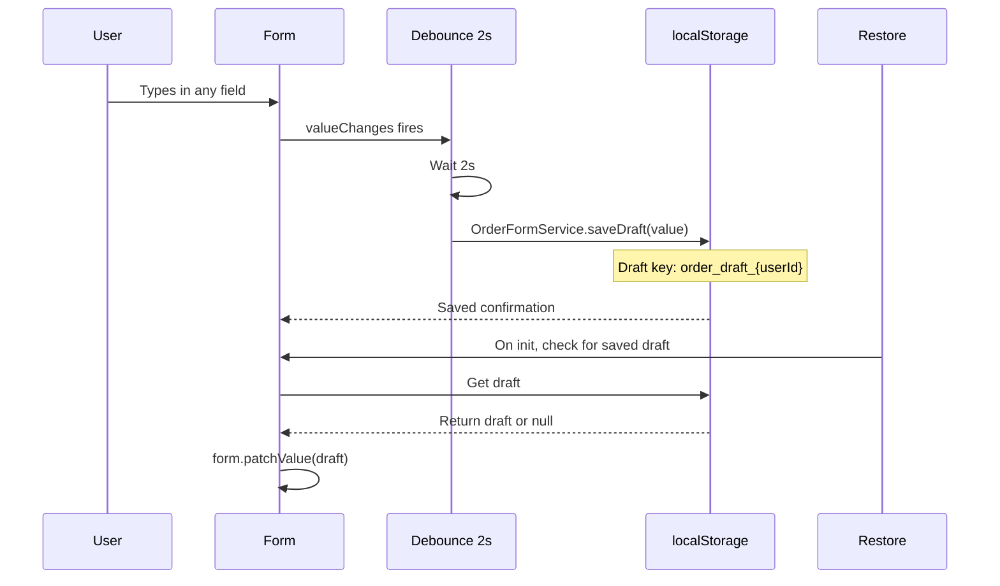

# Project: Comprehensive Form App

> [!summary] Goal
> Build a multi-step reactive form with dynamic fields, async validation, typed forms, custom controls, and auto-save using signals.

## Features

1. Multi-step wizard (3 steps) with navigation
2. Dynamic FormArray for line items
3. Async email validation
4. Custom `ControlValueAccessor` for a rating control
5. Typed forms (Angular 14+)
6. Auto-save with signals and `debounceTime`
7. Cross-field password validation

## Step 1: Multi-Step Wizard

### Multi-step wizard flow



```typescript
// order-form.component.ts
export type OrderStep = 'customer' | 'items' | 'review';

@Component({
  selector: 'app-order-form',
  standalone: true,
  imports: [ReactiveFormsModule, NgIf, NgFor, JsonPipe, RatingControlComponent],
  template: `
    <div class="steps">
      <div *ngIf="currentStep() === 'customer'">
        <app-customer-info [form]="form.controls.customer" />
      </div>
      <div *ngIf="currentStep() === 'items'">
        <app-order-items [itemsArray]="form.controls.items" />
      </div>
      <div *ngIf="currentStep() === 'review'">
        <app-review [form]="form" />
      </div>
    </div>
    <div class="nav">
      <button (click)="prevStep()" [disabled]="currentStep() === 'customer'">Back</button>
      <button (click)="nextStep()" [disabled]="!canProceed()">
        {{ currentStep() === 'review' ? 'Submit' : 'Next' }}
      </button>
    </div>
  `,
})
export class OrderFormComponent {
  currentStep = signal<OrderStep>('customer');
  private steps: OrderStep[] = ['customer', 'items', 'review'];

  nextStep() {
    const idx = this.steps.indexOf(this.currentStep());
    if (idx < this.steps.length - 1) this.currentStep.set(this.steps[idx + 1]);
  }

  prevStep() {
    const idx = this.steps.indexOf(this.currentStep());
    if (idx > 0) this.currentStep.set(this.steps[idx - 1]);
  }

  canProceed(): boolean {
    const control = this.getControlForStep(this.currentStep());
    return control?.valid ?? false;
  }
}
```

---

## Step 2: Typed Form with Dynamic Array

```typescript
interface OrderForm {
  customer: FormGroup<CustomerForm>;
  items: FormArray<FormGroup<ItemForm>>;
  notes: FormControl<string | null>;
}

interface CustomerForm {
  name: FormControl<string>;
  email: FormControl<string>;
  phone: FormControl<string | null>;
  rating: FormControl<number>;
}

interface ItemForm {
  productId: FormControl<number | null>;
  name: FormControl<string | null>;
  quantity: FormControl<number>;
  price: FormControl<number | null>;
}

@Component({...})
export class OrderFormComponent {
  private fb = inject(NonNullableFormBuilder);

  readonly form: FormGroup<OrderForm> = this.fb.group({
    customer: this.fb.group<CustomerForm>({
      name: ['', [Validators.required, Validators.minLength(2)]],
      email: ['', [Validators.required, Validators.email], [emailExistsValidator]],
      phone: [null as string | null],
      rating: [0, Validators.min(1)],
    }),
    items: this.fb.array<FormGroup<ItemForm>>([
      this.createItemGroup(),
    ]),
    notes: this.fb.control<string | null>(null),
  });

  private createItemGroup(): FormGroup<ItemForm> {
    return this.fb.group({
      productId: [null as number | null, Validators.required],
      name: [null as string | null, Validators.required],
      quantity: [1, [Validators.required, Validators.min(1)]],
      price: [null as number | null, [Validators.required, Validators.min(0.01)]],
    });
  }
}
```

---

## Step 3: Async Email Validator

```typescript
// validators/email-exists.validator.ts
export const emailExistsValidator: AsyncValidatorFn = (
  control: AbstractControl
): Observable<ValidationErrors | null> => {
  if (!control.value) return of(null);

  return control.valueChanges.pipe(
    debounceTime(400),
    distinctUntilChanged(),
    switchMap(email =>
      inject(HttpClient).get<{ exists: boolean }>(`/api/users/check-email?email=${email}`)
    ),
    map(res => (res.exists ? { emailTaken: true } : null)),
    catchError(() => of(null)),
  );
};
```

---

## Step 4: Auto-Save with Signals

### Auto-save flow



```typescript
// order-form.service.ts
@Injectable({ providedIn: 'root' })
export class OrderFormService {
  private readonly STORAGE_KEY = 'order_draft';

  saveDraft(value: Partial<OrderFormValue>): void {
    localStorage.setItem(this.STORAGE_KEY, JSON.stringify(value));
  }

  loadDraft(): Partial<OrderFormValue> | null {
    const raw = localStorage.getItem(this.STORAGE_KEY);
    return raw ? JSON.parse(raw) : null;
  }

  clearDraft(): void {
    localStorage.removeItem(this.STORAGE_KEY);
  }
}
```

```typescript
// order-form.component.ts — auto-save integration
readonly saving = signal(false);
readonly lastSaved = signal<string | null>(null);
private autoSaveSub!: Subscription;

ngAfterViewInit(): void {
  // Restore draft
  const draft = this.orderFormService.loadDraft();
  if (draft) this.form.patchValue(draft);

  // Auto-save on changes
  this.autoSaveSub = this.form.valueChanges
    .pipe(
      debounceTime(2000),
      tap(() => this.saving.set(true)),
      switchMap(value => {
        this.orderFormService.saveDraft(value);
        return of(value);
      }),
    )
    .subscribe(() => {
      this.saving.set(false);
      this.lastSaved.set(new Date().toLocaleTimeString());
    });
}

ngOnDestroy(): void {
  this.autoSaveSub?.unsubscribe();
}
```

---

## Step 5: Custom ControlValueAccessor (Rating)

```typescript
// shared/rating-control.component.ts
@Component({
  selector: 'app-rating',
  standalone: true,
  providers: [
    { provide: NG_VALUE_ACCESSOR, useExisting: RatingControlComponent, multi: true },
  ],
  template: `
    <div class="rating">
      <button *ngFor="let star of [1,2,3,4,5]; let i = index"
        (click)="writeValue(star)"
        [class.filled]="star <= value"
        [disabled]="disabled"
        type="button">
        {{ star <= value ? '★' : '☆' }}
      </button>
    </div>
  `,
})
export class RatingControlComponent implements ControlValueAccessor {
  value = 0;
  disabled = false;
  onChange: (val: number) => void = () => {};
  onTouched: () => void = () => {};

  writeValue(val: number): void {
    this.value = val;
    this.onChange(val);
  }

  registerOnChange(fn: (val: number) => void): void {
    this.onChange = fn;
  }

  registerOnTouched(fn: () => void): void {
    this.onTouched = fn;
  }

  setDisabledState(isDisabled: boolean): void {
    this.disabled = isDisabled;
  }
}
```

---

## Step 6: Cross-Field Validation (Password Match)

```typescript
// validators/password-match.ts
export const passwordMatchValidator: ValidatorFn = (control: AbstractControl) => {
  const password = control.get('password');
  const confirm = control.get('confirmPassword');
  if (!password || !confirm) return null;
  return password.value === confirm.value ? null : { passwordMismatch: true };
};
```

---

> [!question]- Interview Questions
>
> **Q: How do you implement a multi-step form with typed forms?**
> A: Define each step's typed FormGroup interface, compose them in the parent. Use a signal for the current step, conditional *ngIf rendering, and validate the current step's controls before allowing navigation.
>
> **Q: What is a ControlValueAccessor and when would you create one?**
> A: A bridge between Angular forms and custom UI controls. Implement when you need a reusable form control (star rating, color picker, toggle switch) that integrates with reactive forms via formControlName.
>
> **Q: How does auto-save with signals work?**
> A: Subscribe to valueChanges with debounceTime(2000), serialize the form value, save to localStorage. Show saving/last-saved indicators with signals. Restore draft on component init.

---

## Cross-Links

- [[Angular/02_Core/05_Forms_Template_vs_Reactive]] for form fundamentals
- [[Angular/02_Core/02_Signals_Essentials]] for signal-based state
- [[Angular/02_Core/04_HttpClient_and_Interceptors]] for async validation HTTP calls
- [[Angular/02_Core/03_RxJS_in_Angular]] for debounce/switchMap patterns
