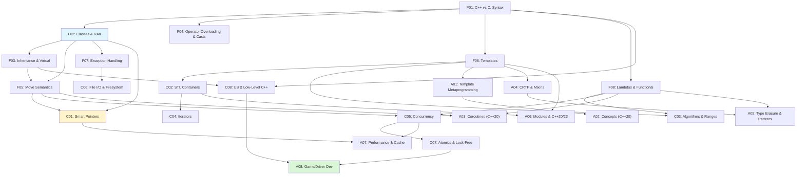

# C++

> [!summary] Scope
> Complete C++ reference from fundamentals through expert-level: classes, RAII, templates, STL, move semantics, concurrency, metaprogramming, concepts, coroutines, game engine design, and driver development.

## Learning Path

## Topic Map

| Tier | Files | Topics |
|:----|:-----:|--------|
| **Foundations** | 10 | C++ vs C, classes/RAII, inheritance/virtual, operator overloading/casts, move semantics/value categories, templates (variadic, fold), exceptions/safety, lambdas/functional, attributes/consteval/constinit, **good coding practices** |
| **Core** | 10 | Smart pointers/allocators, STL containers deep dive, algorithms/ranges, iterators/categories, concurrency/async/parallel, file I/O/filesystem, atomics/lock-free, UB/object lifetimes, **optional/chrono/format**, **random/regex** |
| **Advanced** | 9 | Template metaprogramming/SFINAE, concepts (C++20), coroutines, CRTP/mixins, type erasure/patterns, modules/C++20/23 features, performance/cache, game engine/driver dev, **PMR/jthread/C++20 sync** |
| **Playbooks** | 4 | Debug memory (ASan/Valgrind/glibcxx debug), debug concurrency (TSan/Helgrind), **debug compile time/template errors**, production readiness/ABI |
| **Projects** | 3 | Custom vector, thread pool with work stealing |

## Build Systems

| File | Topics |
|------|--------|
| **B01** [[C++/06_Build_Systems/01_CMake_Deep_Dive]] | C++ standards in CMake, compiler detection, vcpkg/Conan, C++ library management, exporting C++ targets, C++ generator expressions |
| **B02** [[C++/06_Build_Systems/02_Make_Deep_Dive]] | C++ Makefile patterns, C++ flags, auto-dependency generation, template instantiation, C++20 modules in Make |

## Key by Career Path

| Path | Focus files |
|------|-------------|
| **Game Dev** | F02, C01, C05, A04, A07, A08, Pr02 |
| **Systems/Kernel** | C08, C07, A06, A08, A07 |
| **High-Perf Computing** | C05, C07, A07, C03, A01 |
| **Interview Prep** | F02, F03, F05, F06, C01, C05, A01 |
| **Modern C++ (C++20/23)** | A02, A03, A06, C03 (Ranges) |

## References

- [cppreference.com](https://en.cppreference.com/w/cpp)
- [C++ Core Guidelines](https://isocpp.github.io/CppCoreGuidelines/)
- [isocpp.org](https://isocpp.org/)
