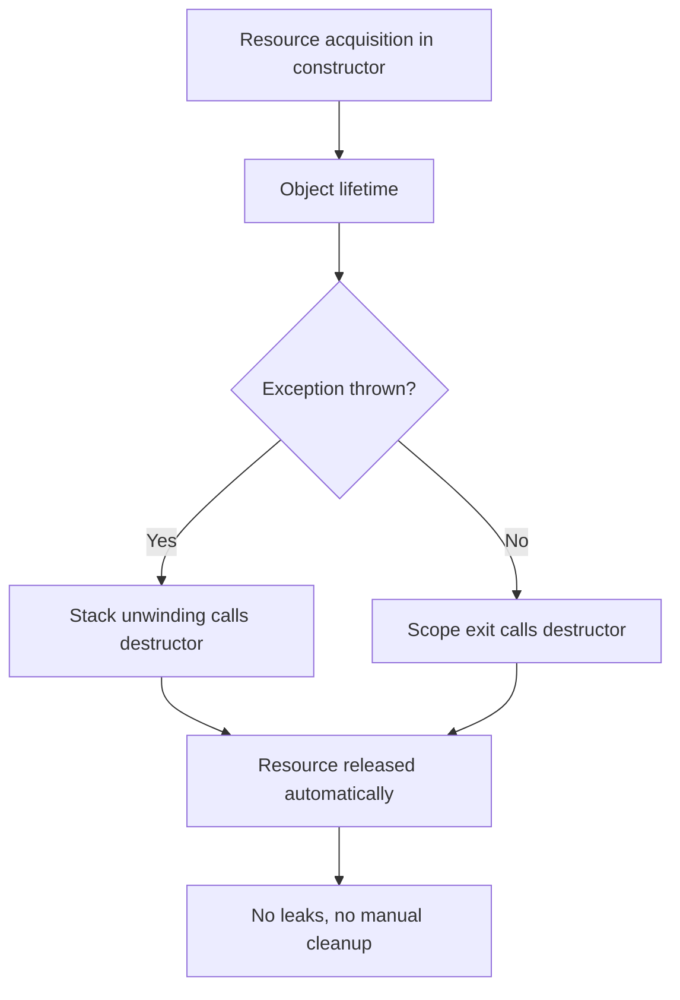
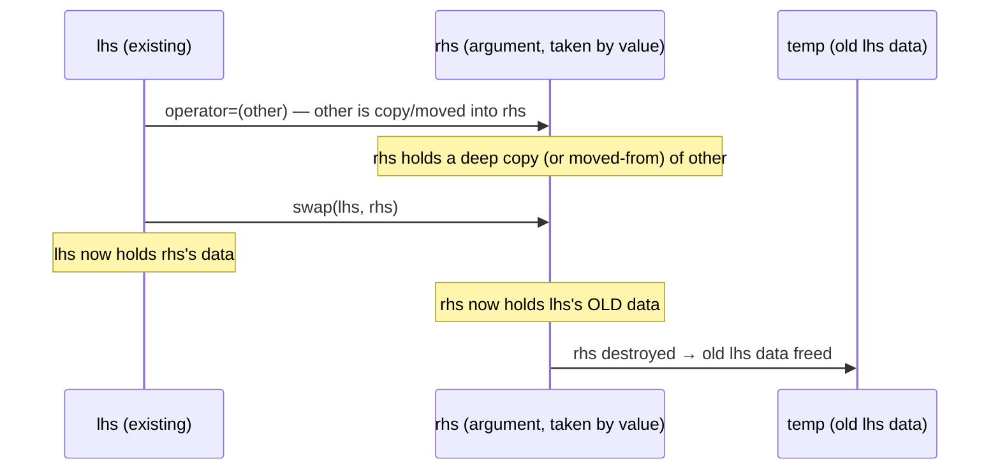

# Classes, Objects, and RAII

> [!summary] Goal
> Master C++ classes: constructors and destructors, RAII (the single most important C++ concept), member initializer lists, `this`, `const` member functions, `static` members, and the Rule of Five.

## Table of Contents

1. [Basic Class Structure](#basic-class-structure)
2. [Constructors](#constructors)
3. [Member Initializer Lists](#member-initializer-lists)
4. [Destructors and RAII](#destructors-and-raii)
5. [RAII Deep Dive](#raii-deep-dive)
6. [`this` Pointer and `const` Member Functions](#this-pointer-and-const-member-functions)
7. [`static` Members](#static-members)
8. [`= default` and `= delete`](#default-and-delete)
9. [Rule of Five (Copy-and-Swap)](#rule-of-five-copy-and-swap)
10. [Pitfalls](#pitfalls)

---

## Basic Class Structure

> [!info] Class
> A class is a user-defined type that groups data (member variables) and functions (member functions / methods). Access control (`private`, `protected`, `public`) determines visibility. By default, members of a `class` are `private`; members of a `struct` are `public`. The only difference between `class` and `struct` is the default access.

```cpp
class BankAccount {
private:                       // accessible only within this class
    std::string ownerName;
    double balance;

public:                        // accessible to everyone
    BankAccount(const std::string& name, double initialBalance);
    
    void deposit(double amount);
    void withdraw(double amount);
    double getBalance() const;  // const: doesn't modify the object
    
protected:                     // accessible in this class and derived classes
    void logTransaction(const std::string& type) const;
};
```

---

## Constructors

> [!info] Constructor
> A constructor initializes an object when it's created. It has the same name as the class and no return type. If you don't define any constructors, the compiler generates a default constructor (which does nothing). Once you define ANY constructor, the default constructor is NOT generated unless you explicitly request it.

```cpp
class Widget {
private:
    int id;
    std::string name;
    double value;

public:
    // 1. Default constructor — compiler-generated if no other constructor exists
    Widget() = default;  // Explicitly request default (C++11)
    
    // 2. Parameterized constructor
    Widget(int id, const std::string& name, double value)
        : id(id), name(name), value(value) {
        // Initializer list — more on this below
    }
    
    // 3. Delegating constructor (C++11) — calls another constructor
    Widget() : Widget(0, "default", 0.0) {
        // Default constructor delegates to the parameterized one
    }
    
    // 4. Copy constructor — create from another object
    Widget(const Widget& other)
        : id(other.id), name(other.name), value(other.value) {
        std::cout << "Copy constructed\n";
    }
    
    // 5. Copy assignment operator — assign from another object
    Widget& operator=(const Widget& other) {
        id = other.id;
        name = other.name;
        value = other.value;
        return *this;
    }
    
    // 6. Move constructor (C++11)
    Widget(Widget&& other) noexcept
        : id(other.id), name(std::move(other.name)), value(other.value) {
        other.id = 0;
        other.value = 0.0;
    }
};
```

### Constructor initialization strategies

```cpp
class Example {
    const int alwaysConst;    // MUST be in initializer list
    int& refMember;           // MUST be in initializer list (references can't be default)
    std::string str;
    int plain;
    
public:
    // ❌ WRONG: assignment in the body (inefficient for non-trivial types)
    Example(const std::string& s, int p) {
        str = s;     // calls operator= on a default-constructed string
        plain = p;
    }
    
    // ✅ CORRECT: member initializer list
    Example(const std::string& s, int p)
        : alwaysConst(42), refMember(p), str(s), plain(p) {
        // Body is empty — all initialization happened in the list
    }
};
```

---

## Member Initializer Lists

> [!info] Member initializer list
> The part of a constructor after the colon, before the body. Members are initialized in the order they're DECLARED in the class (not the order in the list). Always initialize `const` members, reference members, and base classes in the initializer list.

### Initialization order trap

```cpp
class Trap {
    int a;
    int b;
public:
    // Declared as: int a; int b;  (a before b)
    Trap(int value) : b(value), a(b) {  // ⚠️ a is initialized FIRST (declaration order)
        // a is initialized from UNINITIALIZED b because a comes before b
    }
};

// ✅ Fix: match initializer order to declaration order
class Fixed {
    int a;
    int b;
public:
    Fixed(int value) : a(value), b(value) {}
};
```

---

## Destructors and RAII

> [!info] Destructor
> A destructor runs when an object is destroyed (goes out of scope or is `delete`d). It has the class name prefixed with `~` and takes no arguments. Destructors are essential for releasing resources: closing files, freeing memory, releasing locks. The compiler calls destructors in reverse order of construction.

```cpp
class FileHandler {
    FILE* file;
public:
    FileHandler(const char* filename, const char* mode) {
        file = fopen(filename, mode);
        if (!file) throw std::runtime_error("Failed to open file");
    }
    
    ~FileHandler() {
        if (file) {
            fclose(file);      // Guaranteed to run when object goes out of scope
            std::cout << "File closed\n";
        }
    }
    
    void write(const std::string& data) {
        fprintf(file, "%s", data.c_str());
    }
};

// Usage — the file is ALWAYS closed, even if write() throws!
void process() {
    FileHandler fh("data.txt", "w");
    fh.write("Hello");       // If this throws, fh's destructor still runs
    // fh goes out of scope → fclose() called automatically
}
```

---

## RAII Deep Dive

> [!info] RAII (Resource Acquisition Is Initialization)
> RAII is the most important concept in C++. Resources (memory, file handles, mutex locks, database connections) are acquired in a constructor and released in the destructor. The destructor runs automatically when the object goes out of scope — even if an exception is thrown. This makes C++ exception-safe by default and eliminates resource leaks.



### RAII without exceptions

```cpp
// What RAII looks like without exceptions (embedded, games with -fno-exceptions)
class LockGuard {
    std::mutex& mtx;
public:
    explicit LockGuard(std::mutex& m) : mtx(m) {
        mtx.lock();
    }
    ~LockGuard() { mtx.unlock(); }
};

void threadSafeFunction() {
    std::mutex m;
    {
        LockGuard guard(m);   // m is locked
        // ... critical section ...
    }                           // guard destroyed → m is unlocked automatically
}
```

### RAII with dynamic memory

```cpp
// Manual memory management (like C) — error-prone
void oldWay() {
    int* data = new int[100];
    // ... use data ...
    // What if an exception is thrown here?
    delete[] data;  // This never runs if the code above throws!
}

// RAII with vector — safe
void raiiWay() {
    std::vector<int> data(100);  // Memory acquired in constructor
    // ... use data ...
    // Memory released automatically by vector's destructor — exception safe!
}
```

### The RAII initialization contract — the single most important detail

The name "Resource Acquisition Is **Initialization**" is carefully chosen. The key insight:

```cpp
class SuccessfulResource {
    Resource* res;
public:
    SuccessfulResource() : res(new Resource()) {
        // Constructor completed normally → resource is fully acquired
        // Destructor WILL run to clean up
    }
    ~SuccessfulResource() { delete res; }
};

class FailedResource {
    Resource* a;
    OtherResource* b;
public:
    FailedResource() : a(new Resource()), b(new OtherResource()) {
        // If OtherResource's constructor THROWS...
        // → a is already allocated, but FailedResource constructor never completed
        // → Destructor will NOT run!
        // → Resource* a LEAKS!
    }
    ~FailedResource() { delete a; delete b; }
};

// ✅ Fix: each resource acquisition must be independently RAII-wrapped
class SafeResource {
    std::unique_ptr<Resource> a;          // RAII — self-cleaning
    std::unique_ptr<OtherResource> b;     // RAII — self-cleaning
public:
    SafeResource() : a(std::make_unique<Resource>()),
                     b(std::make_unique<OtherResource>()) {
        // If b's constructor throws, a's unique_ptr destructor runs
        // (members are destroyed in reverse construction order)
        // NO LEAK!
    }
    // No destructor needed — unique_ptr handles cleanup
};
```

**The RAII contract:**
- If the constructor completes normally, the destructor IS guaranteed to run.
- If the constructor throws (fails), the destructor CANNOT run (the object was never fully constructed).
- Therefore: each resource acquisition must be independently wrapped in its own RAII object.
- `std::unique_ptr`, `std::vector`, `std::string`, `std::fstream` are all RAII wrappers.
- Raw `new` has no RAII protection — use `std::unique_ptr` or `std::vector` instead.

---

## `this` Pointer and `const` Member Functions

> [!info] `this` pointer
> Every member function has an implicit `this` pointer that points to the object on which the function was called. `this` is a prvalue — you can't take its address. In `const` member functions, `this` is a pointer to `const`.

```cpp
class Example {
    int value;
public:
    Example(int v) : value(v) {}
    
    // Non-const member function
    void setValue(int v) {
        this->value = v;   // Explicit use of this (often omitted)
    }
    
    // const member function — promises not to modify the object
    int getValue() const {
        // value = 42;     // ❌ ERROR: can't modify in const function
        return value;
    }
    
    // Both const and non-const overloads
    const int& at(int i) const { return data[i]; }           // For const objects
    int& at(int i) { return data[i]; }                        // For mutable objects
};

void use(const Example& constObj, Example& mutableObj) {
    constObj.getValue();    // OK: calls const version
    // constObj.setValue(5); // ❌ ERROR: can't call non-const on const ref
    
    mutableObj.setValue(5); // OK
    mutableObj.getValue();  // OK: non-const can call const
}
```

---

## `static` Members

> [!info] Static members
> Static members belong to the class itself, not to individual objects. All objects share one instance of a static variable. Static member functions can only access static members — they don't have a `this` pointer.

```cpp
class Logger {
public:
    static int instanceCount;               // Declaration (definition in .cpp)
    
    Logger() { ++instanceCount; }
    ~Logger() { --instanceCount; }
    
    static int getCount() { return instanceCount; }  // Static member function
};

// Definition in .cpp file (required for static members)
int Logger::instanceCount = 0;

// Usage
int main() {
    Logger a, b, c;
    std::cout << Logger::getCount();    // 3  (accessed through class)
    std::cout << a.getCount();          // 3  (also works through object)
}
```

### Inline static members (C++17)

```cpp
class Config {
public:
    static inline std::string appName = "MyApp";  // No separate definition needed!
    static inline int version = 1;
};
```

---

## `= default` and `= delete`

```cpp
class NoCopy {
public:
    NoCopy() = default;                                // Explicitly use the default
    NoCopy(const NoCopy&) = delete;                    // Prevent copying
    NoCopy& operator=(const NoCopy&) = delete;         // Prevent copy assignment
    ~NoCopy() = default;
};

// Non-nullable smart pointer (can't be copied, only moved)
class UniqueResource {
    void* resource;
public:
    UniqueResource(void* r) : resource(r) {}
    ~UniqueResource() { /* cleanup */ }
    
    UniqueResource(const UniqueResource&) = delete;            // No copy
    UniqueResource& operator=(const UniqueResource&) = delete;  // No copy
    UniqueResource(UniqueResource&&) = default;                 // Allow move
    UniqueResource& operator=(UniqueResource&&) = default;
};
```

---

## Rule of Five (Copy-and-Swap)

> [!info] Rule of Five
> If a class manages a resource directly (raw pointer, file handle, OS resource), it needs all five special member functions: destructor, copy constructor, copy assignment, move constructor, and move assignment. The **copy-and-swap** idiom provides a unified, exception-safe implementation for copy and move assignment.

For most classes, **Rule of Zero** (use RAII wrappers — `vector`, `string`, `unique_ptr` — and let the compiler generate defaults) is the goal. But when you must manage a resource directly, apply Rule of Five with copy-and-swap.

### Copy-and-Swap Idiom

The core idea: implement `swap()` as a non-throwing friend, then write **one** assignment operator that takes by value and swaps:

```cpp
class Buffer {
    int* data;
    size_t size;
public:
    // Constructor
    explicit Buffer(size_t n) : data(new int[n]), size(n) {}

    // Destructor
    ~Buffer() { delete[] data; }

    // Copy constructor
    Buffer(const Buffer& other)
        : data(new int[other.size]), size(other.size) {
        std::copy(other.data, other.data + other.size, data);
    }

    // Move constructor — noexcept is critical for std::vector
    Buffer(Buffer&& other) noexcept : data(nullptr), size(0) {
        swap(other);
    }

    // Copy-and-swap assignment — ONE operator handles both copy and move!
    Buffer& operator=(Buffer other) noexcept {   // Take by value (copy or move)
        swap(other);                              // Swap with the temporary
        return *this;                             // Temporary dies, releases old
    }

    friend void swap(Buffer& a, Buffer& b) noexcept {
        using std::swap;
        swap(a.data, b.data);
        swap(a.size, b.size);
    }
};
```



### Why copy-and-swap wins

| Concern | Naive assignment | Copy-and-swap |
|---------|:----------------:|:-------------:|
| Strong exception guarantee | ❌ Must hand-roll | ✅ Automatic |
| Self-assignment safety | ❌ Need explicit `if (this != &other)` | ✅ Automatic (self-swap is safe) |
| Code duplication | ❌ Separate copy=, move= | ✅ One function for both |
| `const` correctness | ❌ Often forgets | ✅ Natural |

### noexcept on move operations

```cpp
class Widget {
    std::vector<int> data;
public:
    // Move constructor must be noexcept for std::vector to use it
    // during reallocation (otherwise vector copies, which is slower)
    Widget(Widget&& other) noexcept : data(std::move(other.data)) {}

    // Move assignment
    Widget& operator=(Widget&& other) noexcept {
        if (this != &other) { data = std::move(other.data); }
        return *this;
    }
};
```

`std::vector` uses `std::move_if_noexcept` — if the move constructor is `noexcept`, elements are moved during reallocation. If it might throw, elements are **copied** (safe but slow). Always mark move operations `noexcept`.

> [!tip] Cross-reference
> For a deeper treatment of Rule of Five, Rule of Zero, and move semantics, see [[C++/01_Foundations/05_Move_Semantics_and_Value_Categories#rule-of-five-and-rule-of-zero|Move Semantics → Rule of Five]].

---

## Pitfalls

### Forgetting to define a virtual destructor

If a class is intended for inheritance, the destructor MUST be virtual. Otherwise, deleting a derived object through a base pointer is undefined behavior (the derived destructor won't run).

```cpp
class Base {
public:
    ~Base() { /* cleanup */ }        // ❌ Non-virtual — BUG!
};

class Derived : public Base {
    int* data = new int[100];
public:
    ~Derived() { delete[] data; }    // Won't be called if deleted through Base*
};

Base* b = new Derived();
delete b;  // ⚠️ Only Base::~Base() runs! Derived's cleanup never happens.
```

### Member initializer list order

Members are initialized in DECLARATION order, not initializer-list order. If one member depends on another, put the dependency FIRST in the class declaration.

### Forgetting the semicolon after a class definition

```cpp
class MyClass { }
int main() {}   // ❌ Compiler sees: class MyClass { } int main() {} — syntax error!
```

---

> [!question]- Interview Questions
>
> **Q: What is RAII and why is it important?**
> A: RAII (Resource Acquisition Is Initialization) ties resource management to object lifetime. Resources are acquired in constructors and released in destructors. Destructors run automatically when objects go out of scope — even during exception stack unwinding. This eliminates resource leaks and makes C++ exception-safe by default. Every C++ feature (smart pointers, containers, locks, streams) uses RAII.
>
> **Q: What is the member initializer list and when is it required?**
> A: The member initializer list initializes members before the constructor body runs. It's REQUIRED for: `const` members, reference members, and base class constructors. It's more efficient for non-trivial types (avoids default-construct-then-assign). Members are initialized in declaration order, not initializer-list order.
>
> **Q: What is the difference between a `class` and a `struct` in C++?**
> A: The only difference is default access: `class` defaults to `private`, `struct` defaults to `public`. By convention, `struct` is used for POD/passive data holders and `class` for types with invariants and member functions. Both can have constructors, member functions, and inheritance.
>
> **Q: What does `= default` and `= delete` do?**
> A: `= default` explicitly requests the compiler-generated version of a special member function (constructor, destructor, copy/move). `= delete` prevents a function from being called — use it to disable copy semantics (`= delete` on copy constructor) or to forbid implicit conversions (overload with `= delete`).
>
> **Q: Why does a class with virtual functions need a virtual destructor?**
> A: Without a virtual destructor, deleting a derived object through a base pointer is undefined behavior — the derived destructor never runs, causing resource leaks. The vtable includes the destructor address, so making it virtual ensures the correct destructor is called based on the dynamic type, not the static type.

---

## Cross-Links

- [[C++/01_Foundations/03_Inheritance_Polymorphism_and_Virtual_Functions]] for virtual destructors
- [[C++/01_Foundations/05_Move_Semantics_and_Value_Categories]] for move constructors and Rule of Five
- [[C++/01_Foundations/10_Good_Coding_Practices]] for coding conventions and `const` correctness
- [[C++/02_Core/01_Smart_Pointers_and_Memory_Management]] for RAII with smart pointers
- [[C++/01_Foundations/07_Exception_Handling_and_Safety]] for exception-safe RAII
- [[C++/03_Advanced/08_Game_Engine_and_Driver_Dev]] for RAII in game engines
