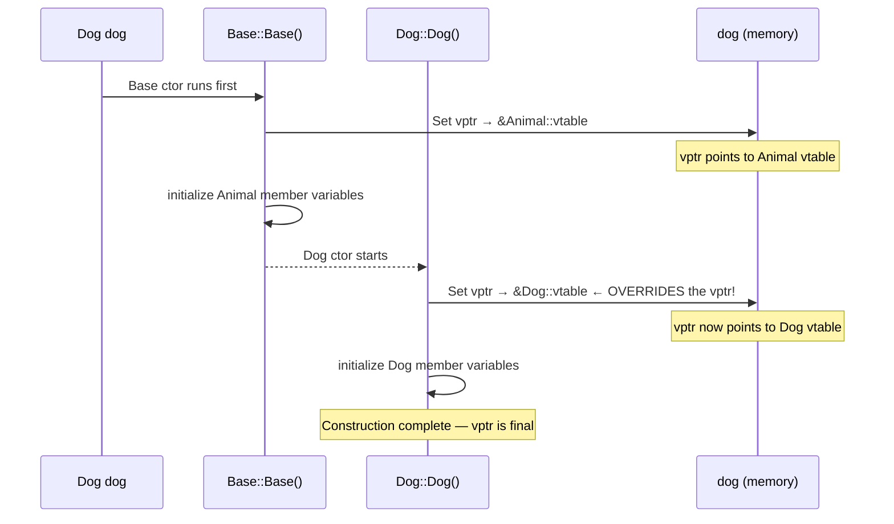
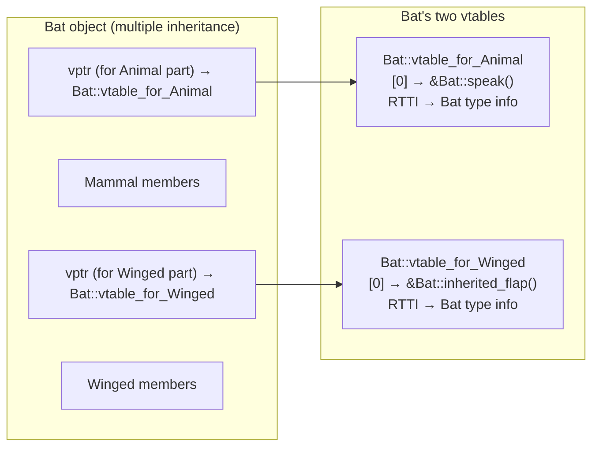
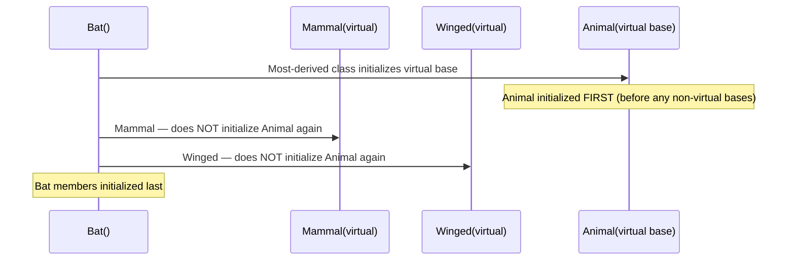

# Inheritance, Polymorphism, and Virtual Functions

> [!summary] Goal
> Understand C++ inheritance: access specifiers, virtual dispatch (how vtables work at the assembly level), abstract classes, virtual destructors, virtual inheritance (the diamond problem), and object slicing.

## Table of Contents

1. [Inheritance Basics](#inheritance-basics)
2. [Virtual Functions and the VTable](#virtual-functions-and-the-vtable)
3. [Abstract Classes and Pure Virtual Functions](#abstract-classes-and-pure-virtual-functions)
4. [Virtual Destructors](#virtual-destructors)
5. [Virtual Inheritance and the Diamond Problem](#virtual-inheritance-and-the-diamond-problem)
6. [Object Slicing](#object-slicing)
7. [Pitfalls](#pitfalls)

---

## Inheritance Basics

> [!info] Inheritance
> A derived class inherits all members of its base class (except constructors, destructor, and assignment operators). Access specifiers control how inherited members are accessible: `public` (inherited access unchanged), `protected` (inherited as protected), `private` (inherited as private — the default for `class`).

```mermaid
flowchart TD
    A["Base class<br/>public: a<br/>protected: b<br/>private: c"] -->|"public inheritance"| B["Derived sees:<br/>a (public)<br/>b (protected)"]
    A -->|"protected inheritance"| C["Derived sees:<br/>a (protected)<br/>b (protected)"]
    A -->|"private inheritance"| D["Derived sees:<br/>a (private)<br/>b (private)"]
    note for A "c is NEVER accessible to derived classes"
```

```cpp
class Animal {
public:
    void eat() { std::cout << "Eating\n"; }
protected:
    int age;
private:
    std::string id;       // Derived classes can't access this at all
};

// Public inheritance — IS-A relationship
class Dog : public Animal {
public:
    void bark() { std::cout << "Woof!\n"; }
    void setAge(int a) { age = a; }    // OK: protected member
    // void setId(...) { ... }          // ERROR: private in base
};
```

---

## Virtual Functions and the VTable

> [!info] Virtual function dispatch (how it really works)
> A virtual function enables runtime polymorphism — calling the correct function based on the **dynamic type** (actual object type) rather than the **static type** (type of the pointer/reference). The mechanism has three components: the **vtable** (one per class, built at compile time), the **vptr** (one per object, set at runtime during construction), and the **index** (a compile-time constant slot per virtual function). Every call goes through: object → vptr → vtable[index] → actual function.

### Step 1: The compiler builds a vtable per class at compile time

```mermaid
flowchart LR
    subgraph Compiler["Compiler (compile time)"]
        direction LR
        A["class Animal<br/>virtual speak() slot 0<br/>virtual move() slot 1"] --> VA["Animal::vtable<br/>[0] → &Animal::speak<br/>[1] → &Animal::move"]
        D["class Dog : Animal<br/>override speak()<br/>inherits move()"] --> VD["Dog::vtable<br/>[0] → &Dog::speak<br/>[1] → &Animal::move"]
    end
    note for A "speak() is assigned index 0<br/>move() is assigned index 1"
    note for D "Dog overrides speak() → slot 0<br/>Dog does NOT override move() → slot 1 still points to Animal::move"
```

When the compiler sees `class Animal { virtual void speak(); virtual void move(); }`, it:

1. Counts the virtual functions (including inherited ones)
2. Assigns each virtual function a **slot index** at compile time (0, 1, 2, ... based on declaration order in the base class)
3. Generates a static `vtable` array for each class — this is a **read-only data structure** placed in the compiled binary

For `Dog`, the vtable is identical to `Animal`'s except for slots where `Dog` provided an override. If `Dog` overrides `speak()` but not `move()`, Dog's vtable has `&Dog::speak` at slot 0 and `&Animal::move` at slot 1. The index for `speak()` is **the same constant** for both classes — that's how dispatch works: same number, different address in the table.

### Step 2: The vptr is set at runtime during construction



Each constructor **sets the vptr** to point to its own class's vtable. This is why:

- During `Base`'s constructor, the vptr points to `Base`'s vtable — calling a virtual function calls the **Base** version (Derived's override hasn't been constructed yet)
- When `Dog`'s constructor runs, it **overwrites** the vptr to point to `Dog`'s vtable — the final, correct vtable

This is why calling virtual functions from constructors is dangerous — the vptr is still pointing to the base class's vtable during base construction.

### Step 3: The runtime dispatch (the call site)

When you write `ref.speak()`, the compiler does **not** know whether `ref` refers to an `Animal` or a `Dog`. It cannot emit a direct `call Animal::speak` or `call Dog::speak`. Instead, it emits code that:

1. **Fetches the vptr** from the object at runtime (every polymorphic object stores this at offset 0)
2. **Loads the function pointer** from the vtable at the compile-time index for `speak()` (slot 0)
3. **Calls through that function pointer**

```nasm
; The full dispatch for ref.speak()
; rdi = &ref (the 'this' pointer)

mov rax, [rdi]           ; Step 1: load vptr from offset 0 of the object
                         ; rax now = address of the class's vtable
                         ; If ref is a Dog: rax = &Dog::vtable
                         ; If ref is an Animal: rax = &Animal::vtable

call [rax]                ; Step 2: dereference vtable index 0
                          ; [rax] = *(vtable + 0 * 8) = first function pointer
                          ; For Dog: calls Dog::speak
                          ; For Animal: calls Animal::speak
```

The key insight: **the vptr itself is the decision**. At runtime, the object's vptr already points to the correct vtable. The compiler just fetches it and calls the indexed slot — no `if`, no `switch`, no type-checking. The "decision" happened earlier when the constructor set the vptr.

For a non-virtual function like `eat()`, the compiler emits a direct call:

```nasm
call Animal::eat          ; Direct call — no indirection, no vtable lookup
                          ; Type is KNOWN at compile time (static dispatch)
```

### The vtable layout in memory

```text
Every polymorphic object's memory layout (at runtime):

Offset 0: vptr → Class::vtable (8 bytes on x86-64)
Offset 8: first member variable
Offset 12: second member variable
...

The vtable itself (read-only, in .rodata section):

       Class::vtable:
       [0] → &Class::speak()        ; slot for speak()
       [1] → &Class::move()         ; slot for move()
       [2] → &Class::~Class()       ; slot for destructor (if virtual)
       [3] → &Class::typeinfo       ; RTTI pointer (for dynamic_cast)
```

The vtable is **one per class (not per object)** — all `Dog` objects share the same vtable. Each `Dog` object just has its own vptr pointing to that shared table. This is why virtual dispatch adds only one pointer (the vptr) to each object's size.

### Multiple inheritance and multiple vptrs

When a class inherits from TWO unrelated base classes, each with virtual functions, the derived object contains **two (or more) vptrs** — one per base class that has virtual functions:



When you cast a `Bat*` to a `Winged*`, the compiler adjusts the pointer by the offset of the `Winged` subobject — this is called a **this-pointer adjustment** (also known as a **thunk**). If you call `Winged`'s virtual function through a `Winged*`, the vptr used is the one at the `Winged` offset, and a **thunk** adjusts `this` back to the full object before calling the actual implementation.

### Non-virtual multiple inheritance — construction order

```cpp
class Bat : public Mammal, public Winged { };
// Construction order: Animal → Mammal → Winged → Bat
// vptr for each base is set by its respective constructor
// Bat has two access paths to Animal (without virtual inheritance)
```

### Covariant return types

C++ allows an overriding function to return a **more derived type** than the base version:

```cpp
struct Base {
    virtual Base* clone() const { return new Base(*this); }
};

struct Derived : Base {
    // Returns Derived*, not Base* — covariant return type
    Derived* clone() const override { return new Derived(*this); }
};

// This works because slicing is avoided — the caller gets the full derived type
// The compiler automatically inserts the adjustment in the vtable
```

### `dynamic_cast` and RTTI — the vtable connection

Every polymorphic class's vtable includes a pointer to the class's `type_info` (RTTI). This is how `dynamic_cast` and `typeid` work:

```cpp
class Animal { public: virtual ~Animal() = default; };
class Dog : public Animal { };

void check(Animal* a) {
    // dynamic_cast uses the vtable's RTTI pointer:
    // 1. Fetch vptr from *a (offset 0)
    // 2. Load RTTI pointer from vtable[??] (negative offset, compiler-dependent)
    // 3. Compare against Dog's type_info
    // 4. If match, return the pointer; if not, return nullptr
    if (Dog* dog = dynamic_cast<Dog*>(a)) {
        dog->bark();
    }
    
    // typeid also goes through the vtable's RTTI pointer
    const std::type_info& info = typeid(*a);
    std::cout << info.name();  // "class Dog" or "class Animal"
}
```

### Explicit virtual function call (bypassing the vtable)

You can call a specific version of a virtual function by qualifying it with the class name — this bypasses the vtable and does a direct call:

```cpp
Dog dog;
Animal& ref = dog;

ref.speak();          // Virtual dispatch: calls Dog::speak() through vtable
ref.Animal::speak();  // Direct call: calls Animal::speak() — bypasses vtable!
dog.Animal::speak();  // Also valid: calls the base version directly
```

### Virtual function performance

Devirtualization: the compiler CAN sometimes avoid the vtable lookup if it can determine the dynamic type at compile time:

```cpp
Dog dog;
dog.speak();     // The compiler KNOWS dog is a Dog (not a reference/pointer)
                 // → devirtualized to: call Dog::speak (direct call, no vtable)

Animal& ref = dog;
ref.speak();     // Compiler does NOT know dynamic type
                 // → vtable lookup (indirect call, not inlineable)
```

A virtual call costs approximately:
- **With hot cache**: ~2 CPU cycles (one load + one indirect call)
- **With cold cache**: ~50-100 CPU cycles (vtable miss, possibly vptr miss)
- **Devirtualized**: 0 extra cycles (same as a direct call)

The indirect call also prevents inlining — the compiler can't inline a function called through a function pointer.

### Summary: Three mechanisms for polymorphism

| Mechanism | Dispatch time | Overhead | Flexibility |
|-----------|:-------------:|:--------:|:-----------:|
| **Virtual functions** (vtables) | Runtime | Small (vptr + indirect call) | Most common, heap objects |
| **CRTP** (compile-time) | Compile time | Zero (devirtualized) | Template-based, no runtime dispatch |
| **std::variant + visit** | Runtime | Switch (no vtable) | Type-safe, exhaustive |
}
```

### The `override` and `final` specifiers (C++11)

```cpp
class Base {
public:
    virtual void func(int);
    virtual void other();
};

class Derived : public Base {
public:
    void func(int) override;        // ✅ Correct: overrides base
    // void func(double) override;  // ❌ ERROR: doesn't override anything
    // void func(int) const override; // ❌ ERROR: const mismatch
    void other() final;              // Can't be overridden further
};

class MoreDerived : public Derived {
    // void other() override;        // ❌ ERROR: other is final
};
```

---

## Abstract Classes and Pure Virtual Functions

> [!info] Abstract class
> A class with at least one pure virtual function (`= 0`) is abstract. It can't be instantiated. Derived classes MUST override all pure virtual functions to become concrete. Abstract classes define interfaces (contracts) that derived classes implement.

```cpp
// Pure interface (like Java/C# interfaces)
class Drawable {
public:
    virtual ~Drawable() = default;
    virtual void draw() const = 0;           // Pure virtual
    virtual double area() const = 0;         // Pure virtual
};

// Concrete implementation
class Circle : public Drawable {
    double radius;
public:
    explicit Circle(double r) : radius(r) {}
    void draw() const override { std::cout << "Drawing circle\n"; }
    double area() const override { return 3.14159 * radius * radius; }
};

// Drawable d;                    // ❌ ERROR: can't instantiate abstract class
Drawable* d = new Circle(5.0);   // ✅ OK: pointer to concrete type
```

### Pure virtual functions CAN have a body

```cpp
class Base {
public:
    virtual void cleanup() = 0 {}  // Pure virtual WITH a body (rare, but legal)
    // Derived classes must still override, but can call Base::cleanup()
};

class Derived : public Base {
public:
    void cleanup() override {
        Base::cleanup();   // Call base's implementation
        // ... additional cleanup ...
    }
};
```

---

## Virtual Destructors

> [!info] Virtual destructor
> If a class has virtual functions (or is designed for inheritance), its destructor MUST be virtual. Otherwise, deleting a derived object through a base pointer is undefined behavior — the derived destructor won't run, causing resource leaks.

```cpp
class Base {
public:
    virtual ~Base() = default;   // ✅ Virtual destructor (C++11 default)
    virtual void process() = 0;
};

class Derived : public Base {
    int* data;
public:
    Derived() : data(new int[100]) {}
    ~Derived() override { delete[] data; }   // Runs when deleting through Base*
    void process() override { /* ... */ }
};

Base* b = new Derived();
delete b;   // ✅ With virtual dtor: runs Derived::~Derived(), then Base::~Base()
```

---

## Virtual Inheritance and the Diamond Problem

> [!info] Diamond problem
> When a class inherits from two classes that both inherit from a common base, the "diamond" creates two copies of the grandparent base class. Virtual inheritance solves this by sharing a SINGLE instance of the grandparent.

```mermaid
flowchart TD
    A["Animal"] --> B["Mammal"]
    A --> C["Winged"]
    B --> D["Bat"]
    C --> D
    note for D "Without virtual: two Animal subobjects<br/>With virtual: one shared Animal subobject"
```

```cpp
class Animal {
public:
    virtual void speak() = 0;
};

class Mammal : public virtual Animal {    // Virtual inheritance
public:
    void breathe() { std::cout << "Breathing\n"; }
};

class Winged : public virtual Animal {    // Virtual inheritance
public:
    void flap() { std::cout << "Flapping\n"; }
};

class Bat : public Mammal, public Winged {
public:
    void speak() override { std::cout << "Screech!\n"; }
};

int main() {
    Bat bat;
    bat.speak();      // OK: only ONE Animal subobject
    bat.breathe();    // From Mammal
    bat.flap();       // From Winged
    
    Animal& a = bat;  // OK: one unambiguous Animal reference
}
```

### Virtual base class memory layout and construction order

When virtual inheritance is used, the **most-derived class** is responsible for constructing the virtual base — NOT the intermediate classes:



```cpp
class Animal {
public:
    Animal() { std::cout << "Animal ctor\n"; }
    virtual void speak() = 0;
};

class Mammal : public virtual Animal {
public:
    Mammal() { std::cout << "Mammal ctor\n"; }
};

class Winged : public virtual Animal {
public:
    Winged() { std::cout << "Winged ctor\n"; }
};

class Bat : public Mammal, public Winged {
public:
    Bat() { std::cout << "Bat ctor\n"; }
    void speak() override {}
};

Bat bat;
// Output: "Animal ctor" (once — from Bat)
//         "Mammal ctor"
//         "Winged ctor"
//         "Bat ctor"
```

The virtual base subobject is stored separately from the derived classes. The derived classes access it through a **virtual base pointer (vbptr)** stored in each object. This adds a small overhead (one extra pointer per virtual base per class that virtually inherits) and one extra indirection per access.

```cpp
// ⚠️ Virtual inheritance has a performance cost:
// - Extra indirection for accessing base members
// - Objects are larger (need space for the virtual base pointer)
// - Construction order is more complex

// Use virtual inheritance ONLY when the diamond problem would occur.
// Don't use it "just in case" — it's not free.
```

---

## Object Slicing

> [!info] Object slicing
> When you pass a derived object to a function that takes a base object BY VALUE, the derived part is "sliced off." Only the base portion is copied. The derived behavior (virtual functions) is lost. Always pass polymorphic objects by reference or pointer.

```cpp
class Animal {
public:
    virtual void speak() const { std::cout << "Animal\n"; }
};

class Dog : public Animal {
public:
    void speak() const override { std::cout << "Woof!\n"; }
};

void by_value(Animal a) { a.speak(); }      // ❌ Slicing! a is always an Animal
void by_ref(const Animal& a) { a.speak(); }  // ✅ Polymorphic

int main() {
    Dog dog;
    by_value(dog);   // "Animal"   — sliced! Dog parts lost
    by_ref(dog);     // "Woof!"    — virtual dispatch works
}
```

### Preventing slicing

```cpp
class Base {
public:
    // Prevent slicing by deleting copy operations
    Base(const Base&) = delete;
    Base& operator=(const Base&) = delete;
protected:
    // Still allow derived classes to implement copying
    Base() = default;
    Base(Base&&) = default;   // Move is OK
};
```

---

## Pitfalls

### Calling virtual functions from constructors

During construction, the vtable is built as constructors run. Before the base ctor finishes, the object's type is the BASE class, not the derived class. Calling a virtual function in a constructor dispatches to the BASE version — not the derived override.

```cpp
class Base {
public:
    Base() { setup(); }          // Calls Base::setup() — even if derived overrides it!
    virtual void setup() { std::cout << "Base setup\n"; }
};

class Derived : public Base {
public:
    Derived() {}                  // First calls Base::Base(), then Derived::Derived()
    void setup() override { std::cout << "Derived setup\n"; }
};

Derived d;  // Prints "Base setup" — NOT "Derived setup"!
```

### Forgetting `override` keyword

Without `override`, the compiler doesn't check that your function actually overrides a base virtual. A typo (wrong signature) creates a NEW function, not an override. Always use `override` — it catches signature mismatches at compile time.

### Calling virtual functions from destructors

Same problem as constructors — during destruction, the vtable reverts to the base class after the derived destructor runs. Don't call virtual functions in destructors.

### Non-virtual destructor in a base class

This is the most common C++ memory leak. If a base class has non-virtual destructor and a derived class has resources to clean up, deleting through a base pointer leaks. Rule: if a class has virtual functions, it needs a virtual destructor.

---

> [!question]- Interview Questions
>
> **Q: How does virtual function dispatch work internally?**
> A: Each class with virtual functions has a vtable (array of function pointers). Each object has a vptr (hidden pointer to its class's vtable). When a virtual function is called through a pointer/reference, the compiler looks up the function address from the vtable using the vptr. This adds one indirection compared to a direct call (a few CPU cycles).
>
> **Q: What is the difference between overriding and hiding?**
> A: Overriding (with `override`) replaces a virtual function in a derived class — the correct version is called based on the dynamic type. Hiding occurs when a derived class defines a function with the same name but different signature (or non-virtual) — the base class version is hidden, and calling through a base pointer calls the base version. Use `override` to ensure you're actually overriding, not accidentally hiding.
>
> **Q: What is object slicing and how do you prevent it?**
> A: Object slicing occurs when a derived object is passed by value to a function expecting a base object — the derived parts are sliced off, and virtual dispatch breaks. Prevent by: (a) always passing polymorphic types by reference or pointer, (b) deleting copy operations on the base class, (c) making base classes abstract (can't be instantiated).
>
> **Q: What is the diamond problem and how does virtual inheritance solve it?**
> A: The diamond problem occurs when a class inherits from two classes that share a common base, creating two copies of the grandparent. Virtual inheritance (`class B : virtual public A`) merges the grandparent into a single shared subobject. This ensures one unambiguous base, but adds a small overhead (extra pointer per virtual base).
>
> **Q: Why can't you call virtual functions from constructors?**
> A: During construction, the object's vtable is built as each constructor completes. Before the base constructor finishes, the vtable points to the base class — calling a virtual function dispatches to the base version, not the derived override. The derived override is unreachable until the derived constructor starts.

---

## Cross-Links

- [[C++/01_Foundations/02_Classes_and_RAII]] for class basics, virtual destructors
- [[C++/02_Core/08_Undefined_Behavior_and_Low_Level_Cpp]] for vtable-related UB
- [[C++/03_Advanced/04_CRTP_Mixins_and_Static_Polymorphism]] for CRTP (alternative to virtual)
- [[C++/03_Advanced/05_Type_Erasure_and_Design_Patterns]] for type erasure vs virtual
- [[C++/01_Foundations/04_Operator_Overloading_and_Type_Casting]] for casting in class hierarchies
