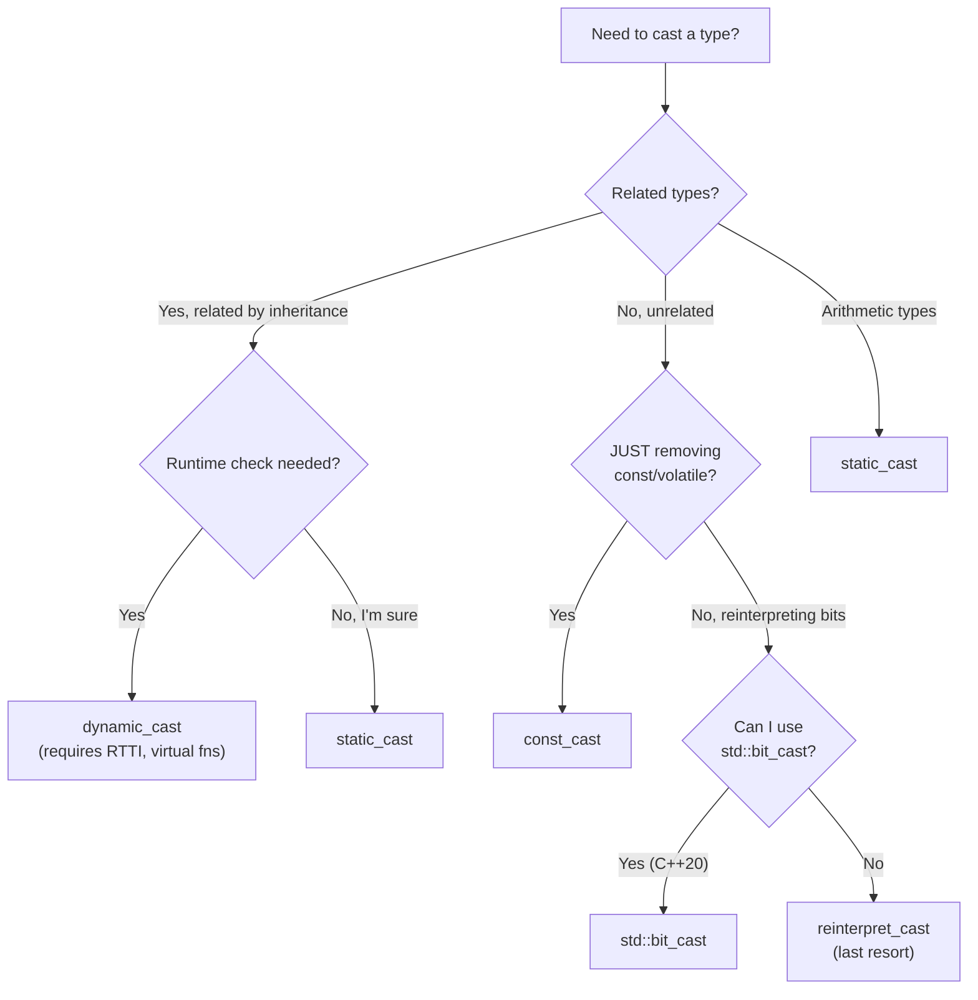

# Operator Overloading and Type Casting

> [!summary] Goal
> Master operator overloading (when and how to overload each operator) and C++ type casting (the four cast types, when to use each, and why C-style casts are dangerous).

## Table of Contents

1. [Operator Overloading](#operator-overloading)
2. [Comparison Operators](#comparison-operators)
3. [Conversion Operators](#conversion-operators)
4. [C++ Cast Types](#c-cast-types)
5. [Cast Decision Tree](#cast-decision-tree)
6. [Pitfalls](#pitfalls)

---

## Operator Overloading

> [!info] Operator overloading
> C++ allows most operators to be overloaded for user-defined types. The syntax is `ReturnType operatorSymbol(parameters)`. Operators can be defined as member functions or free functions. Not all operators can be overloaded (`.`, `::`, `sizeof`, `?:`, `.*` cannot).

### Overloadable operators

| Category | Operators | Typical overloading approach |
|----------|-----------|:----------------------------:|
| **Arithmetic** | `+ - * / %` | Friend/free function (binary), member (unary) |
| **Comparison** | `== != < > <= >=` | Free function or friend |
| **Assignment** | `= += -= *= /=` | Member function |
| **Increment/Decrement** | `++ --` (pre/post) | Member function (postfix takes `int`) |
| **Subscript** | `[]` | Member function |
| **Function call** | `()` | Member function (functors) |
| **Arrow/Dereference** | `->` `*` | Member function |
| **Stream I/O** | `<<` `>>` | Free function (friend to access internals) |
| **Index/Address** | `&` | Rarely overloaded |
| **Conversion** | `operator T()` | Member function |

### Arithmetic operators

```cpp
struct Vector2 {
    double x, y;
    
    Vector2(double x = 0, double y = 0) : x(x), y(y) {}
    
    // Compound assignment (must be member)
    Vector2& operator+=(const Vector2& other) {
        x += other.x;
        y += other.y;
        return *this;
    }
    
    // Unary minus
    Vector2 operator-() const {
        return Vector2(-x, -y);
    }
};

// Binary operator + as free function (allows mixed types)
Vector2 operator+(const Vector2& a, const Vector2& b) {
    Vector2 result = a;
    result += b;
    return result;
}

// Stream output
std::ostream& operator<<(std::ostream& os, const Vector2& v) {
    return os << "(" << v.x << ", " << v.y << ")";
}

// Usage
Vector2 a{1, 2}, b{3, 4};
Vector2 c = a + b;          // operator+(a, b)
c += Vector2{1, 1};         // c.operator+=(...)
std::cout << -c;            // Calls operator<< for stream, operator- for unary
```

### Subscript operator

```cpp
class Matrix {
    double data[4][4];
public:
    // First subscript returns a proxy (or pointer)
    double* operator[](int row) { return data[row]; }
    const double* operator[](int row) const { return data[row]; }
};

Matrix m;
m[1][2] = 3.14;    // m.operator[](1) returns double*, then [2] on double*
```

### Function call operator (functor)

```cpp
class Multiplier {
    double factor;
public:
    explicit Multiplier(double f) : factor(f) {}
    double operator()(double x) const { return x * factor; }
};

Multiplier by2(2.0);
Multiplier by3(3.0);

double result = by2(5.0);     // 10.0  — looks like a function call!
result = by3(result);          // 30.0

// Funtors can store state — useful for STL algorithms
std::vector<double> v = {1, 2, 3, 4};
std::transform(v.begin(), v.end(), v.begin(), Multiplier(10.0));
// v = {10, 20, 30, 40}
```

---

## Comparison Operators

> [!info] Spaceship operator (C++20)
> C++20 introduces the three-way comparison operator `<=>` (spaceship). The compiler can auto-generate **all** comparison operators if you define `<=>` and `==`. This eliminates the boilerplate of writing 6 separate comparison functions.

```cpp
// C++17 style — all six operators manually
struct Point {
    int x, y;
    
    friend bool operator==(const Point& a, const Point& b) {
        return a.x == b.x && a.y == b.y;
    }
    friend bool operator!=(const Point& a, const Point& b) { return !(a == b); }
    friend bool operator<(const Point& a, const Point& b) {
        return std::tie(a.x, a.y) < std::tie(b.x, b.y);
    }
    friend bool operator>(const Point& a, const Point& b)  { return b < a; }
    friend bool operator<=(const Point& a, const Point& b) { return !(b < a); }
    friend bool operator>=(const Point& a, const Point& b) { return !(a < b); }
};

// C++20 — compiler generates all six (or more) from <=> and ==
struct Point20 {
    int x, y;
    auto operator<=>(const Point20&) const = default;  // Generates <, <=, >, >=
    bool operator==(const Point20&) const = default;    // Generates ==, !=
};
```

---

## Conversion Operators

> [!info] Conversion operator
> A conversion operator allows implicit or explicit conversion from your type to another type. Implicit conversions can cause surprising behavior. Use `explicit` to require a cast.

```cpp
class Rational {
    int num, den;
public:
    Rational(int n, int d) : num(n), den(d) {}
    
    // Implicit conversion to double (dangerous!)
    operator double() const { return static_cast<double>(num) / den; }
    
    // Explicit conversion to string (requires cast)
    explicit operator std::string() const {
        return std::to_string(num) + "/" + std::to_string(den);
    }
};

Rational r(3, 4);
double d = r;                     // Implicit: calls operator double() → 0.75
double e = r + 0.5;               // Implicit: r → 0.75, 0.75 + 0.5 = 1.25
std::string s = static_cast<std::string>(r);  // Explicit cast required
```

### explicit bool conversion

```cpp
class FileHandle {
    FILE* file;
public:
    explicit operator bool() const { return file != nullptr; }
};

FileHandle fh("test.txt", "r");
if (fh) {         // OK: explicit bool in a boolean context is allowed
    std::cout << "File is open\n";
}
// bool b = fh;   // ❌ ERROR: implicit conversion to bool
```

---

## C++ Cast Types

> [!info] C++ casts
> C++ provides four named cast operators that replace the C-style cast. Each has a specific purpose and is detectable (you can search for them). The C-style cast `(T)x` is too permissive — it can do ANY of the four C++ casts, often with dangerous results.

### static_cast

```cpp
// Compile-time type conversion between related types
// No runtime check — you tell the compiler "I know this is safe"

double d = 3.14;
int i = static_cast<int>(d);              // Truncates to 3

Base* base = new Derived();
Derived* derived = static_cast<Derived*>(base);  // Downcast (no runtime check!)

void* ptr = &i;
int* ip = static_cast<int*>(ptr);         // Void* → typed*

// User-defined conversion
Rational r(3, 4);
double val = static_cast<double>(r);      // Calls operator double()
```

### dynamic_cast

```cpp
// Runtime type-checked downcast (requires RTTI)
// Returns null for pointers, throws std::bad_cast for references on failure
// Only works on classes with virtual functions

class Animal { public: virtual ~Animal() = default; };
class Dog : public Animal { public: void bark() {} };
class Cat : public Animal { public: void meow() {} };

void pet(Animal* a) {
    if (Dog* dog = dynamic_cast<Dog*>(a)) {
        dog->bark();          // Safe: only called if a is actually a Dog
    } else if (Cat* cat = dynamic_cast<Cat*>(a)) {
        cat->meow();
    }
}

Dog dog;
pet(&dog);  // "Woof!" — dynamic_cast succeeds

// Reference version — throws on failure
void pet_ref(Animal& a) {
    try {
        Dog& dog = dynamic_cast<Dog&>(a);
        dog.bark();
    } catch (const std::bad_cast&) {
        std::cout << "Not a dog\n";
    }
}
```

### const_cast

```cpp
// Adds or removes const/volatile qualification
// Using it to modify a truly const object is UNDEFINED BEHAVIOR

void legacy_api(char* str);    // Old C function that doesn't take const

void process(const std::string& s) {
    legacy_api(const_cast<char*>(s.c_str()));  // OK: we know legacy_api doesn't modify
}

// ❌ WRONG — modifying a truly const object
const int x = 5;
const_cast<int&>(x) = 10;    // UB! x was declared const — compiler may place it in ROM
```

### reinterpret_cast

```cpp
// Reinterprets the bit pattern as a different type
// Most dangerous cast — use only when absolutely necessary

// Pointer to integer
int* ptr = &value;
uintptr_t addr = reinterpret_cast<uintptr_t>(ptr);  // Useful for debugging

// Integer to pointer
int* ptr2 = reinterpret_cast<int*>(addr);

// Type punning (but prefer std::bit_cast in C++20)
float f = 3.14f;
uint32_t bits = reinterpret_cast<uint32_t&>(f);     // Get IEEE 754 representation

// ⚠️ reinterpret_cast violates strict aliasing in most cases
// Use std::bit_cast (C++20) or memcpy instead
```

### std::bit_cast (C++20) — safe type punning

```cpp
#include <bit>

float f = 3.14f;
uint32_t bits = std::bit_cast<uint32_t>(f);  // Safe — no UB, constexpr friendly
```

---

## Cast Decision Tree



| Cast | When to use | Risk level |
|------|-------------|:----------:|
| `static_cast` | Downcasting (you know the type), arithmetic conversions, `void*` → typed pointer | Low |
| `dynamic_cast` | Safe downcasting when you don't know the type (requires RTTI) | Low |
| `const_cast` | Removing const to call a legacy API | Medium |
| `reinterpret_cast` | Pointer/bit reinterpretation (device memory, serialization) | **High** |
| C-style `(T)x` | Never in modern C++ | **Very High** |

---

## Pitfalls

### Implicit conversion via single-argument constructor

```cpp
class String {
public:
    String(size_t n) { /* allocate n bytes */ }  // ❌ Not explicit — implicit!
};

void process(const String& s);

process(42);    // Compiles! Calls String(42) — allocates "42" bytes!
// Should be: process(String(42))

// Fix: mark single-argument constructors as explicit
explicit String(size_t n);
```

### Overloading `&&` or `||` breaks short-circuit evaluation

The built-in `&&` and `||` short-circuit — if the left side is false for `&&`, the right side is not evaluated. If you overload these operators, this behavior is lost — both sides are evaluated (function arguments are always evaluated before the function is called). Never overload `&&`, `||`, or `,`.

### Pre-increment vs post-increment

```cpp
class Int {
    int value;
public:
    Int& operator++() {     // Pre-increment: ++x
        ++value;
        return *this;       // Returns reference
    }
    Int operator++(int) {   // Post-increment: x++ (dummy int parameter)
        Int temp = *this;
        ++value;
        return temp;        // Returns value (must copy!)
    }
};

// Pre-increment is more efficient for non-trivial types
// Use ++it (pre) over it++ (post) for iterators
```

### Confusing `<` semantics for ordering

If `operator<` doesn't define a **strict weak ordering** (transitive, irreflexive, asymmetric), containers like `std::set` and algorithms like `std::sort` produce undefined behavior. The canonical comparison is `std::tie(a.m1, a.m2) < std::tie(b.m1, b.m2)`.

---

> [!question]- Interview Questions
>
> **Q: What is the difference between `static_cast` and `dynamic_cast`?**
> A: `static_cast` is a compile-time cast with no runtime check — use it when you're sure the conversion is valid (e.g., upcasting, arithmetic conversion). `dynamic_cast` performs a runtime check using RTTI — returns null (pointer) or throws `std::bad_cast` (reference) if the cast fails. `dynamic_cast` only works on classes with virtual functions and has performance overhead.
>
> **Q: When should you use `reinterpret_cast`?**
> A: Only when you truly need to reinterpret the bit pattern of one type as another: device memory access, serialization of pointers, or FFI (Foreign Function Interface). It's implementation-defined and breaks strict aliasing. In C++20, prefer `std::bit_cast` for type-punning (safe, constexpr). Never use `reinterpret_cast` for downcasting — use `static_cast` or `dynamic_cast`.
>
> **Q: Why should single-argument constructors be `explicit`?**
> A: Without `explicit`, a single-argument constructor acts as an implicit conversion function. This can cause surprising conversions — e.g., `String s = 42;` compiles and silently constructs a 42-byte String. Marking constructors `explicit` requires the user to write `String s(42)` or `static_cast<String>(42)`, making the intent clear.
>
> **Q: What is the spaceship operator `<=>` and what problem does it solve?**
> A: The three-way comparison operator `<=>` (C++20) returns a comparison category (`strong_ordering`, `weak_ordering`, `partial_ordering`). If defined as `= default`, the compiler generates all comparison operators (`<`, `<=`, `>`, `>=`, and with `==` also `=`, `!=`). This replaces the boilerplate of writing six manually-crafted comparison functions.
>
> **Q: What's the difference between pre-increment (++x) and post-increment (x++)?**
> A: Pre-increment increments and returns a reference to the current object (no copy). Post-increment makes a copy, increments the original, and returns the copy. For non-trivial types (iterators), pre-increment is more efficient. The postfix version takes a dummy `int` parameter to distinguish it: `T& operator++(); T operator++(int);`.

---

## Cross-Links

- [[C++/01_Foundations/02_Classes_and_RAII]] for copy assignment and operator basics
- [[C++/01_Foundations/05_Move_Semantics_and_Value_Categories]] for move assignment
- [[C++/01_Foundations/08_Lambdas_and_Functional_Programming]] for function objects vs operators
- [[C++/02_Core/08_Undefined_Behavior_and_Low_Level_Cpp]] for strict aliasing (reinterpret_cast)
- [[C++/03_Advanced/05_Type_Erasure_and_Design_Patterns]] for type erasure patterns
