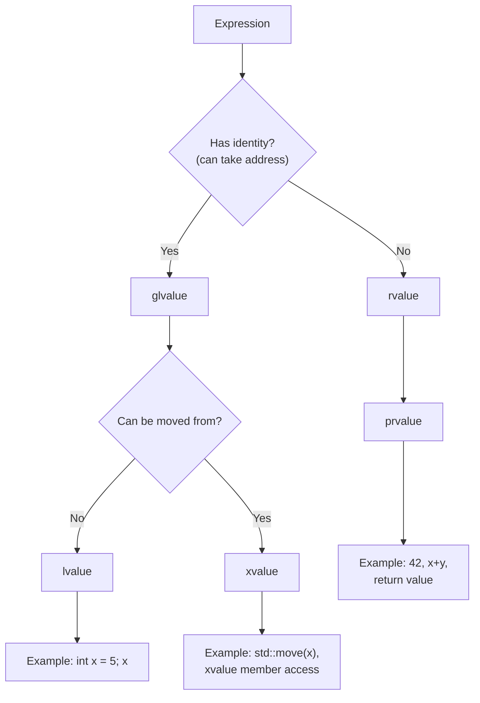
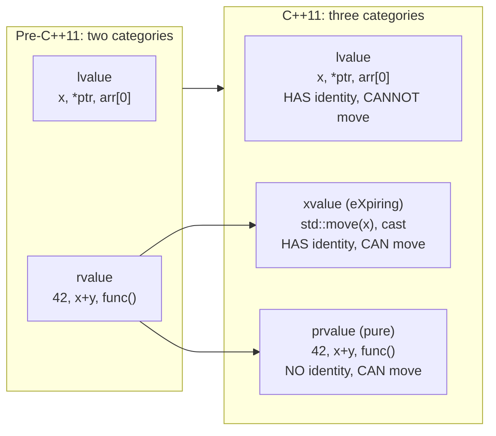
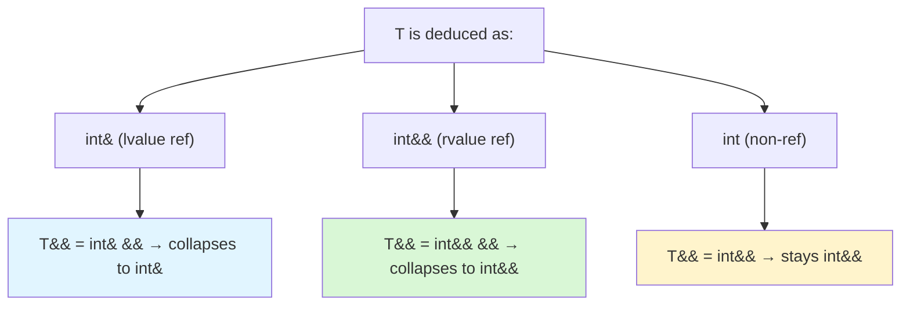

# Move Semantics, Perfect Forwarding, and Value Categories

> [!summary] Goal
> Master C++11 move semantics — rvalue references, move constructors/assignment, `std::move`, `std::forward`, perfect forwarding, copy elision (RVO/NRVO), and the value category taxonomy. Understand when copies happen vs moves and how to optimize.

## Table of Contents

1. [Value Categories](#value-categories)
2. [Move Semantics](#move-semantics)
3. [Rule of Five and Rule of Zero](#rule-of-five-and-rule-of-zero)
4. [`std::move`](#stdmove)
5. [Perfect Forwarding and `std::forward`](#perfect-forwarding-and-stdforward)
6. [Copy Elision (RVO/NRVO)](#copy-elision)
7. [Pitfalls](#pitfalls)

---

## Value Categories

> [!info] Value categories
> Every C++ expression has a value category, which determines whether it can be moved from. The taxonomy is: an expression is either a **glvalue** (has an identity — you can take its address) or a **prvalue** (initializes something — pure computation). An lvalue is a glvalue that is not an xvalue. An xvalue (eXpiring value) is a glvalue that can be reused. A prvalue is "pure rvalue" (temporary or literal).



| Category | Can take address? | Can move from? | Examples |
|:--------:|:-----------------:|:---------------:|----------|
| **lvalue** | ✅ Yes | ❌ No | Variable name, `*ptr`, `arr[0]`, `++it` |
| **xvalue** | ✅ Yes | ✅ Yes | `std::move(x)`, `static_cast<T&&>(x)`, `a.member` on rvalue |
| **prvalue** | ❌ No | ✅ Yes | `42`, `x + y`, `func()`, `&x`, `--it` |

### Why three categories? — Historical context

Before C++11, there were only **lvalues** (expression with identity: `x`, `*ptr`, `arr[0]`) and **rvalues** (temporaries and literals: `42`, `x+y`, `func()`). Rvalue references couldn't exist because you couldn't distinguish "a temporary that can be moved from" from "an rvalue that has no identity."

C++11 split rvalues into two categories to solve this:



**The xvalue is the key innovation.** `std::move(x)` produces an xvalue — `x` has an address (identity), but the expression `std::move(x)` is marked as "about to expire." This lets move constructors bind to it while still allowing `&x` to work.

```cpp
int x = 42;
// x is an lvalue (has identity, can't move from)
std::move(x);       // produces an xvalue (has identity, CAN move from)
42;                 // is a prvalue (no identity, CAN move from)
// &x is legal; &42 is not legal
// &std::move(x) is legal (it's an xvalue)
```

---

## Move Semantics

> [!info] Move semantics
> Move semantics transfers ownership of resources from one object to another without copying. Instead of deep-copying data (expensive), we "steal" the source's pointers and nullify the source. This is especially beneficial for types that manage dynamic memory (vectors, strings, unique_ptr).

```cpp
class Buffer {
    int* data;
    size_t size;
public:
    // Constructor
    explicit Buffer(size_t n) : data(new int[n]), size(n) {}
    
    // Copy constructor (expensive: deep copy)
    Buffer(const Buffer& other)
        : data(new int[other.size]), size(other.size) {
        std::copy(other.data, other.data + other.size, data);
        std::cout << "Deep copy (" << size << " ints)\n";
    }
    
    // Move constructor (cheap: steal pointers, nullify source)
    Buffer(Buffer&& other) noexcept
        : data(other.data), size(other.size) {
        other.data = nullptr;        // Source no longer owns the memory
        other.size = 0;
        std::cout << "Move constructor\n";
    }
    
    // Destructor
    ~Buffer() { delete[] data; }
    
    // Move assignment
    Buffer& operator=(Buffer&& other) noexcept {
        if (this != &other) {
            delete[] data;                // Release current resources
            data = other.data;             // Steal
            size = other.size;
            other.data = nullptr;         // Nullify source
            other.size = 0;
        }
        return *this;
    }
};

// Usage — move happens automatically for temporaries
Buffer createBuffer() {
    Buffer b(100);
    return b;                // Move (or RVO)
}

int main() {
    Buffer b1(100);
    Buffer b2 = std::move(b1);  // Explicit move — b1 is now empty
    Buffer b3 = createBuffer();  // Move from temporary (or RVO)
}
```

---

## Rule of Five and Rule of Zero

> [!info] Rule of Five
> If a class manages a resource (raw pointer, file handle, etc.), it should define five special member functions: destructor, copy constructor, copy assignment, move constructor, move assignment. This is the C++11 update of the Rule of Three (which only had destructor, copy ctor, copy assignment).

> [!info] Rule of Zero
> If a class doesn't manage resources directly (it uses RAII wrappers like `vector`, `string`, `unique_ptr`), it shouldn't define any of the five special members. The compiler-generated defaults work correctly.

```cpp
// ❌ Rule of Five violation — class manages raw pointer
class OldResource {
    int* data;
public:
    ~OldResource() { delete data; }              // user-defined destructor
    // ❌ No copy constructor! — shallow copy leads to double free
};

// ✅ Rule of Five — handle resource correctly
class GoodResource {
    int* data;
public:
    ~GoodResource() { delete data; }
    GoodResource(const GoodResource& other)      // Deep copy
        : data(new int(*other.data)) {}
    GoodResource& operator=(const GoodResource& other) {
        if (this != &other) {
            delete data;
            data = new int(*other.data);
        }
        return *this;
    }
    GoodResource(GoodResource&& other) noexcept : data(other.data) {
        other.data = nullptr;
    }
    GoodResource& operator=(GoodResource&& other) noexcept {
        if (this != &other) {
            delete data;
            data = other.data;
            other.data = nullptr;
        }
        return *this;
    }
};

// ✅ Rule of Zero — use RAII wrappers, nothing to define
class ModernResource {
    std::unique_ptr<int> data;      // RAII: handles copy/move/destroy automatically
public:
    explicit ModernResource(int v) : data(std::make_unique<int>(v)) {}
    // Compiler-generated copy/move/dtor work correctly!
};
```

---

## `std::move`

> [!info] std::move
> `std::move` doesn't move anything — it's a cast to an rvalue reference (`static_cast<T&&>`). It tells the compiler: "this object is eligible to be moved from." The actual move happens when the rvalue reference is passed to a move constructor or move assignment. After `std::move`, the source object is in a valid-but-unspecified state.

```cpp
std::vector<int> a = {1, 2, 3, 4};
std::vector<int> b = a;               // Copy: a is unchanged
std::vector<int> c = std::move(a);    // Move: a is now empty (but valid)

// a.size() == 0, a.empty() == true — valid but unspecified
// You can call a.clear() and reuse a

// What std::move does under the hood:
// template<typename T>
// std::remove_reference_t<T>&& move(T&& t) noexcept {
//     return static_cast<std::remove_reference_t<T>&&>(t);
// }
```

### After `std::move` — valid state guarantee

```cpp
template<typename T>
void swap(T& a, T& b) {
    T tmp = std::move(a);    // Move from a to tmp
    a = std::move(b);         // Move from b to a
    b = std::move(tmp);       // Move from tmp to b
}
// This works correctly even for move-only types like unique_ptr!
```

---

## Perfect Forwarding and `std::forward`

> [!info] Perfect forwarding
> Perfect forwarding preserves the caller's value category (lvalue vs rvalue) and const qualification when passing arguments to another function. The mechanism has three parts: **forwarding references** (`T&&` where `T` is deduced), **reference collapsing** (the table that determines what `T&&` becomes when `T` is a reference), and **`std::forward`** (the cast that restores the original value category).

### Reference collapsing — the engine behind forwarding references

Before C++11, `T& &` (reference to reference) was invalid. C++11 introduced rules to "collapse" such compound references:



| If `T` is deduced as... | Then `T&&` collapses to... | Result category |
|:-----------------------:|:--------------------------:|:---------------:|
| `int&` (lvalue reference) | `int& &&` → **`int&`** | Lvalue reference — caller passed an lvalue |
| `const int&` | `const int& &&` → **`const int&`** | Lvalue reference — caller passed a const lvalue |
| `int&&` (rvalue reference) | `int&& &&` → **`int&&`** | Rvalue reference — caller passed an rvalue |
| `int` (non-reference) | `int&&` → **`int&&`** | Rvalue reference — caller passed a prvalue |

This is why `T&&` in a template is called a **forwarding reference** (sometimes "universal reference") — it's not an rvalue reference at all. It becomes whatever matches the argument. If you pass an lvalue `int x`, `wrapper(x)` deduces `T = int&`, and `T&&` collapses to `int&`. If you pass `42` (an rvalue), `T = int`, and `T&&` = `int&&`.

### How `std::forward` works

```cpp
// The actual implementation (simplified):
template<typename T>
constexpr T&& forward(std::remove_reference_t<T>& t) noexcept {
    return static_cast<T&&>(t);   // T determines what T&& collapses to
}

// When caller passes an lvalue int x:
//   T = int& (deduced from int&)
//   remove_reference_t<int&> = int
//   forward<int&>(t) = static_cast<int&>(t)  → returns int& (lvalue ref)
//
// When caller passes an rvalue 42:
//   T = int (deduced from int&&)
//   remove_reference_t<int> = int
//   forward<int>(t) = static_cast<int&&>(t)  → returns int&& (rvalue ref)
```

The key insight: **`std::forward` uses the same reference collapsing table as forwarding references**. The `T` template parameter is deduced differently for `forward` than for a forwarding reference, but the collapsing rules are identical. `forward<T>` returns `T&&` collapsed by `T`. If `T = int&`, it returns `int&`. If `T = int`, it returns `int&&`.

### Why `std::move` is just a cast

```cpp
// The actual implementation of std::move:
template<typename T>
constexpr std::remove_reference_t<T>&& move(T&& t) noexcept {
    return static_cast<std::remove_reference_t<T>&&>(t);
}

// std::move(x)  for int x:
//   T = int& (forwarding reference)
//   remove_reference_t<int&> = int
//   returns static_cast<int&&>(x) — unconditional rvalue reference
```

`std::move` doesn't move anything — it unconditionally casts to an rvalue reference. The actual move happens when the rvalue reference is passed to a move constructor or move assignment. **`std::forward` is conditional; `std::move` is unconditional.**

### Why was this necessary? — Historical context

Before C++11, there was no way to distinguish lvalue from rvalue arguments in templates. `template<typename T> void f(T t)` always received a copy. There was no mechanism to say "if the caller passed a temporary, steal its contents." Rvalue references (added in C++11) solved two problems simultaneously:

1. **Move semantics**: differentiating temporaries from named objects so resources can be stolen
2. **Perfect forwarding**: preserving the caller's value category through multiple layers of templates

The xvalue category was introduced specifically for this — `std::move(x)` is an xvalue: it has an identity (you can take `&x` address), but it's marked as "eXpiring" (about to be moved from). Before C++11, there were only lvalues and rvalues. C++11 split rvalues into prvalues (pure temporaries, like `42`) and xvalues (have identity, can be moved from).

```cpp
int x = 42;
static_cast<int&&>(x);       // xvalue — has identity (&x), but casts to &&
std::move(x);                // xvalue — same, but packaged in a function
static_cast<int&&>(42);      // ERROR: can't take address of 42
```

---

## Copy Elision (RVO/NRVO)

> [!info] Copy elision
> The compiler can omit copying (or moving) in certain contexts, constructing the result directly in the target location. **RVO** (Return Value Optimization) elides the copy of a local variable returned from a function. **NRVO** (Named Return Value Optimization) does the same for named variables. Guaranteed copy elision (C++17) prvalues are no longer copied/moved — they're constructed in place.

```cpp
struct Big {
    int data[1000];
    Big() { std::cout << "Default ctor\n"; }
    Big(const Big&) { std::cout << "Copy ctor\n"; }
    Big(Big&&) { std::cout << "Move ctor\n"; }
};

// RVO — compiler constructs directly in caller's variable
Big makeBig() {
    return Big{};               // Prvalue — C++17: guaranteed no copy
}

// NRVO — compiler may elide (not guaranteed in all cases)
Big makeBigNamed() {
    Big local;
    // ... work with local ...
    return local;               // NRVO: compiler may construct in caller
}

int main() {
    Big b = makeBig();          // Only one "Default ctor" — no copy or move!
    Big c = std::move(b);       // Explicit move — move ctor called
}
```

### Guaranteed copy elision (C++17)

```cpp
// Before C++17, returning a local variable from a function
// COULD be moved (not copied), but the move was not guaranteed elided.
// C++17 guarantees that a prvalue is NEVER copied/moved:
// The prvalue is constructed directly in the target location.

struct OnlyMovable {
    OnlyMovable() = default;
    OnlyMovable(OnlyMovable&&) = default;
    OnlyMovable(const OnlyMovable&) = delete;  // Can't copy
};

OnlyMovable make() {
    return OnlyMovable{};        // OK in C++17: prvalue is not copied/moved
    // Without guaranteed elision, this would need a move ctor
}
```

---

## Pitfalls

### Moving from `const` objects

```cpp
const std::vector<int> v = {1, 2, 3};
auto v2 = std::move(v);          // ❌ std::move(v) → const std::vector<int>&&
// Move constructor receives const vector&& — can't modify source!
// Falls back to COPY — v is unchanged, v2 is a copy
// The compiler may not even warn!
```

### After move, the object is valid but unspecified

```cpp
std::string s = "hello";
std::vector<int> v = {1, 2, 3};

auto s2 = std::move(s);
auto v2 = std::move(v);

std::cout << s << '\n';    // Valid but unspecified (likely empty string)
std::cout << v.size();     // 0 (likely, but not guaranteed)

// What you CAN do after a move:
s.clear();                 // OK: assign new value
v = {4, 5, 6};             // OK: assign new value
// s.size() is unspecified — don't depend on it
```

### Not making move operations `noexcept`

`std::vector` uses `std::move_if_noexcept` — if the move constructor is `noexcept`, elements are moved during reallocation. If the move constructor might throw, elements are COPYED instead (safer but slower). Always mark move constructors and move assignment as `noexcept`.

### Forgetting the `noexcept` on move operations

```cpp
class Widget {
    std::vector<int> data;
public:
    Widget(Widget&&) = default;  // noexcept? Depends on whether vector's move is noexcept
};
// vector's move IS noexcept, so Widget's move is noexcept too.
// But for custom types, always be explicit:
    Widget(Widget&& other) noexcept : data(std::move(other.data)) {}
```

---

> [!question]- Interview Questions
>
> **Q: What is the difference between lvalue and rvalue?**
> A: An lvalue has an identity (you can take its address) and persists beyond a single expression. An rvalue (prvalue or xvalue) represents a temporary value or a value that can be moved from. `int x = 5;` — `x` is an lvalue, `5` is a prvalue, `std::move(x)` is an xvalue. Rvalue references `T&&` bind to rvalues, enabling move semantics.
>
> **Q: How does `std::move` work?**
> A: `std::move(x)` is just a cast — it returns `static_cast<T&&>(x)`. It doesn't move anything. The actual move happens when the rvalue reference is passed to a move constructor or move assignment. After `std::move`, the original object is in a valid-but-unspecified state (typically empty).
>
> **Q: What is perfect forwarding and when would you use it?**
> A: Perfect forwarding preserves the value category (lvalue/rvalue) and const qualification of arguments when passing them to another function. It uses forwarding references (`T&&` in templates) and `std::forward`. Used in: `make_unique`, `emplace_back`, wrapper functions, and any code that forwards arguments to constructors.
>
> **Q: What is the Rule of Five / Rule of Zero?**
> A: Rule of Five: if a class manages a resource directly, define destructor, copy ctor, copy assignment, move ctor, and move assignment. Rule of Zero: if a class uses RAII wrappers (unique_ptr, vector, string), let the compiler generate all five — they work correctly. Modern C++ prefers Rule of Zero.
>
> **Q: What is copy elision and RVO?**
> A: Copy elision is a compiler optimization that eliminates unnecessary copies/moves. RVO (Return Value Optimization) constructs the return value directly in the caller's variable. C++17 guarantees copy elision for prvalues: `return SomeType{};` never calls copy/move. NRVO (Named RVO) for `return local_var;` is not guaranteed but widely implemented.

---

## Cross-Links

- [[C++/01_Foundations/02_Classes_and_RAII]] for class fundamentals, RAII, and Rule of Five
- [[C++/01_Foundations/10_Good_Coding_Practices]] for coding conventions
- [[C++/01_Foundations/04_Operator_Overloading_and_Type_Casting]] for move assignment operator
- [[C++/02_Core/01_Smart_Pointers_and_Memory_Management]] for unique_ptr (move-only type)
- [[C++/02_Core/08_Undefined_Behavior_and_Low_Level_Cpp]] for moving from const
- [[C++/03_Advanced/08_Game_Engine_and_Driver_Dev]] for move semantics in game engines
