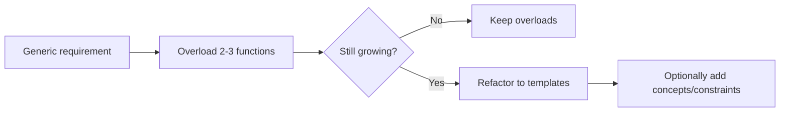

# Templates: From Basics to Variadic

> [!summary] Goal
> Master C++ templates — function/class templates, template parameter deduction, full and partial specialization, variadic templates with fold expressions (C++17), and the template compilation model.

## Table of Contents

1. [Why Templates?](#why-templates)
2. [Function Templates](#function-templates)
3. [Class Templates](#class-templates)
4. [Template Specialization](#template-specialization)
5. [Variadic Templates (C++11)](#variadic-templates)
6. [Fold Expressions (C++17)](#fold-expressions)
7. [Real-World Template Patterns](#real-world-template-patterns)
8. [Template Compilation Model](#template-compilation-model)
9. [Template Design Decisions](#template-design-decisions)
10. [Pitfalls](#pitfalls)

---

## Why Templates?

> [!info] Zero-cost generic code
> Templates let you write generic algorithms once and have the compiler generate highly optimized, type-safe code for many concrete types at compile time.

### The problem without templates

Without templates, you typically choose between:

1. Manually duplicating code for each type (`max_int`, `max_double`, ...)
2. Using inheritance/virtual functions for runtime polymorphism
3. Using type-erased wrappers like `std::function` or `void*`

Each has trade-offs in boilerplate, performance, and type safety.

```mermaid
flowchart TD
    A[Need generic behavior] --> B{Types known at compile time?}
    B -->|Yes| C[Use templates]
    B -->|No| D{Performance critical?}
    D -->|Yes| E[Use virtual interfaces]
    D -->|No| F[Use type erasure<br/>(std::function, std::any)]
```

### When to use templates vs alternatives

Use templates when all of these are true:

- The algorithm is the same for many types
- The types are known at compile time
- You care about performance and type safety

```text
You can often start with overloads for 2-3 types.
When the pattern keeps repeating, promote to a template.
```

| Approach          | When to use                                                   | Runtime cost        | Type safety     |
|-------------------|---------------------------------------------------------------|---------------------|-----------------|
| Overloaded funcs  | Few concrete types, simple API                               | Zero                | Compile-time    |
| **Templates**     | Many types, same algorithm, compile-time types               | Zero (inlined)      | Compile-time    |
| Virtual functions | Need runtime polymorphism / plugin-style extensibility       | Vtable indirection  | Compile-time    |
| Type erasure      | Types vary at runtime, simpler API outweighs perf concerns   | Indirection + alloc | Runtime-checked |



---

## Function Templates

> [!info] Function template
> A function template is a pattern that generates functions at compile time. The compiler instantiates a separate function for each unique set of template arguments. Templates enable generic code that works with any type that supports the operations used inside the template.

### The basic pattern and when to use it

```cpp
template<typename T>
T max_value(const T& a, const T& b) {
    return (a < b) ? b : a;
}

int main() {
    int i = max_value(3, 7);                    // T = int
    double d = max_value(3.14, 2.71);           // T = double
    std::string s = max_value("apple", "zebra");  // T = const char* → compares pointers (!)
}
```

```cpp
// Better string version: force std::string to avoid pointer comparison
std::string s2 = max_value(std::string{"apple"}, std::string{"zebra"});
```

Use a function template when:

- The implementation is identical for all participating types
- The required operations form a simple constraint (e.g., "supports `<` and copy")
- You want the compiler to inline and optimize each specialization

### What the compiler does — 4-step instantiation

When the compiler sees `max<int>(3, 7)` or deduces `T = int` from `max(3, 7)`, it performs these steps:

```text
Step 1 — Substitution: replace T with int throughout the template
  T max(T a, T b) → int max(int a, int b)

Step 2 — Name lookup (Phase 1): resolve NON-dependent names
  The name ">" on int is resolved to the built-in greater-than operator.
  Non-dependent names are checked at template definition time.

Step 3 — Name lookup (Phase 2): resolve DEPENDENT names
  Names that depend on T (like Container::value_type) are resolved NOW,
  at the point of instantiation. ADL is applied here.

Step 4 — Code generation: emit the function
  The compiler emits the int max(int, int) function with a mangled name
  (e.g., _Z3maxIiET_S0_S0_ on Itanium ABI). This is placed in a COMDAT
  section in the object file.
```

```bash
# Check the instantiated symbol and its mangled name:
echo 'template<typename T> T max(T a, T b) { return a > b ? a : b; }
int main() { return max(3, 7); }' > test.cpp
g++ -c test.cpp -o test.o
nm test.o | grep max
# Output: 0000000000000000 W _Z3maxIiET_S0_S0_
# This is a WEAK symbol (COMDAT) — the linker deduplicates it.
# Demangle with c++filt:
c++filt _Z3maxIiET_S0_S0_
# Output: int max<int>(int, int)
```

### COMDAT deduplication — why templates don't cause "multiple definition" errors

When a template is defined in a header and included in multiple `.cpp` files, each translation unit generates the same function. Without special handling, the linker would report "multiple definition." The solution:

```text
1. Each .o file emits the instantiated function as a WEAK symbol in a COMDAT group
2. The linker keeps ONE copy (arbitrarily chosen) and discards the rest
3. This is why templates work across translation units but ordinary functions in headers don't

You can verify this:
  nm test1.o | grep max → weak symbol
  nm test2.o | grep max → weak symbol (same function)
  linker keeps one copy ✓
```

### extern template — suppress implicit instantiation

```cpp
// vector.h — template definition
template<typename T>
class MyVector { /* ... */ };

// myvector.cpp — explicit instantiation for common types
template class MyVector<int>;     // Generates code HERE
template class MyVector<double>;  // Generates code HERE

// myvector.h — tell other files NOT to instantiate
extern template class MyVector<int>;    // "Don't generate, it's in myvector.cpp"
extern template class MyVector<double>;

// Any file that includes myvector.h with extern template:
//   - Uses MyVector<int> but doesn't generate the member functions
//   - The linker resolves to the copy in myvector.o
// This can significantly reduce compile times and binary sizes.
```

### Two-phase lookup — why dependent names need `typename`

```cpp
template<typename Container>
void process(Container& c) {
    // Phase 1 (at template definition):
    int x = 5;                      // Non-dependent — checked immediately
    c.clear();                      // Non-dependent (Container must have clear())
    
    // Phase 2 (at instantiation):
    typename Container::value_type  // Dependent — requires 'typename' keyword
        first = *c.begin();
    // Container::value_type depends on Container.
    // The compiler can't resolve it until Container is known.
    // Without 'typename', it would be parsed as a value, not a type — error!
    
    c.template get<int>();          // Dependent template member — 'template' keyword needed
}
```

**The rule**: if a name depends on a template parameter and is a type, prefix it with `typename`. If it's a template member function, prefix it with `.template` or `->template`. This tells the compiler to wait until instantiation to resolve it.

```cpp
// Safer, C++20-constrained template
template<typename T>
requires std::totally_ordered<T>
T max_value(const T& a, const T& b) {
    return (a < b) ? b : a;
}
```

### Template argument deduction

```cpp
template<typename T>
T sum(T a, T b) { return a + b; }

template<typename T, typename U>
auto sum2(T a, U b) { return a + b; }

sum(3, 7);              // T deduced as int from both args
// sum(3, 7.5);         // ❌ ERROR: T can be int or double? Ambiguous!
sum2(3, 7.5);            // T = int, U = double — OK

// Explicit template arguments
sum<double>(3, 7.5);     // T = double (explicit), 3 is promoted to double
```

---

## Class Templates

> [!info] Class template
> A class template is a blueprint for generating classes parameterized by one or more types or values. The entire family of `std::vector<T>` is a class template — `std::vector<int>`, `std::vector<double>`, `std::vector<std::string>` are all generated from the same template.

```cpp
template<typename T>
class Stack {
private:
    std::vector<T> data;
public:
    void push(const T& value) { data.push_back(value); }
    void pop() { data.pop_back(); }
    T& top() { return data.back(); }
    const T& top() const { return data.back(); }
    bool empty() const { return data.empty(); }
    size_t size() const { return data.size(); }
};

// Non-type template parameters: size known at compile time
template<typename T, std::size_t Capacity>
class StaticVector {
    T data[Capacity];
    std::size_t count = 0;
public:
    void push_back(const T& value) {
        if (count < Capacity) data[count++] = value;
    }
    std::size_t size() const { return count; }
};

StaticVector<int, 64> smallVec;    // Capacity = 64, no heap allocation
```

### Template template parameters

```cpp
// A template that takes another template as a parameter
template<typename T, template<typename> class Container = std::vector>
class MyContainer {
    Container<T> data;
public:
    void add(const T& val) { data.push_back(val); }
};

MyContainer<int> a;                         // vector<int>
MyContainer<int, std::deque> b;             // deque<int>
```

---

## Template Specialization

> [!info] Template specialization
> You can provide a specific implementation for a particular set of template arguments. **Full specialization** specifies ALL template parameters. **Partial specialization** specifies some parameters (only for class templates — function templates can't be partially specialized).

### Full specialization

```cpp
// Primary template
template<typename T>
struct TypeName {
    static constexpr const char* name = "Unknown";
};

// Full specialization for int
template<>
struct TypeName<int> {
    static constexpr const char* name = "int";
};

// Full specialization for double
template<>
struct TypeName<double> {
    static constexpr const char* name = "double";
};

std::cout << TypeName<int>::name;       // "int"
std::cout << TypeName<float>::name;     // "Unknown"
```

### Partial specialization

```cpp
// Primary template
template<typename T>
class MyVector {
    // Heap-allocated storage for all types
};

// Partial specialization: if T is a pointer, use different storage
template<typename T>
class MyVector<T*> {
    // Optimized storage for pointers
};

// Partial specialization: if T is bool, use bitset
template<>
class MyVector<bool> {
    // Bit-packed storage (like vector<bool>)
};

// Partial specialization for const types
template<typename T>
class MyVector<const T> {
    // Wraps the non-const version
};
```

### Why function templates can't be partially specialized

```cpp
// ❌ Can't partially specialize function templates — use overloading instead
template<typename T> void process(T* ptr) { }        // Overload (works)
// template<typename T> void process<T*>(T* p) { }   // ❌ Partial specialization of function

// ✅ Instead, delegate to a class template that CAN be partially specialized
template<typename T>
struct Processor {
    static void run(T value) { /* general case */ }
};

template<typename T>
struct Processor<T*> {
    static void run(T* ptr) { /* pointer specialization */ }
};
```

---

## Variadic Templates (C++11)

> [!info] Variadic template
> A variadic template accepts any number of template arguments. The `...` (ellipsis) is used to define and expand parameter packs. This is the foundation of: `std::tuple`, `std::function`, `std::make_unique`, and printf-style formatting in C++.

```cpp
// Basic variadic template
template<typename... Args>
void printAll(Args... args) {
    // sizeof...(Args) is the number of arguments
    std::cout << sizeof...(args) << " arguments\n";
}

printAll(1, 2.5, "hello");    // Args = {int, double, const char*}, 3 arguments

// Recursive variadic (pre-C++17 technique)
void print() {}  // Base case — no arguments

template<typename First, typename... Rest>
void print(const First& first, const Rest&... rest) {
    std::cout << first << ' ';
    print(rest...);          // Recursively call with remaining arguments
}

print(1, 2.5, "hello");     // "1 2.5 hello "

// Using fold expressions (C++17) — much simpler!
template<typename... Args>
void printFold(Args&&... args) {
    (std::cout << ... << args) << '\n';  // Left-fold: ((a << b) << c) ...
}

printFold(1, 2.5, "hello");  // "12.5hello" — no spaces!
```

---

## Fold Expressions (C++17)

> [!info] Fold expression
> Fold expressions reduce a parameter pack over a binary operator. Four forms: unary left fold `(... op args)`, unary right fold `(args op ...)`, binary left fold `(init op ... op args)`, binary right fold `(args op ... op init)`. The unary fold over `,` (comma) is particularly useful for calling a function on each argument.

```cpp
template<typename... Args>
auto sum(Args... args) {
    return (args + ...);     // Unary right fold: (a + (b + (c + ...)))
}

template<typename... Args>
auto sumLeft(Args... args) {
    return (... + args);     // Unary left fold: (((a + b) + c) + ...)
}

// For most associative operators (+, *, &&, ||, ,), left and right are equivalent.

// Comma fold — call a function on each argument
template<typename... Args>
void forEach(Args&&... args) {
    (process(std::forward<Args>(args)), ...);    // process(a), process(b), process(c)
}

// Logical fold
template<typename... Args>
bool allTrue(Args... args) {
    return (... && args);           // (a && b && c && ...)
}

template<typename... Args>
bool anyTrue(Args... args) {
    return (... || args);           // (a || b || c || ...)
}
```

---

## Real-World Template Patterns

> [!info] Patterns built on templates
> Many advanced C++ techniques are thin layers on top of templates: traits, tag dispatch, CRTP, and SFINAE/constraints.

### Type traits and type queries

Use traits (from `<type_traits>`) to ask questions about types at compile time:

```cpp
template<typename T>
void print_if_integral(const T& value) {
    if constexpr (std::is_integral_v<T>) {
        std::cout << "integral: " << value << '\n';
    } else {
        std::cout << "non-integral" << '\n';
    }
}
```

### Tag dispatch

```cpp
template<typename It>
void advance_impl(It& it, int n, std::random_access_iterator_tag) {
    it += n;   // O(1)
}

template<typename It>
void advance_impl(It& it, int n, std::input_iterator_tag) {
    while (n--) ++it;   // O(n)
}

template<typename It>
void my_advance(It& it, int n) {
    using Cat = typename std::iterator_traits<It>::iterator_category;
    advance_impl(it, n, Cat{});
}
```

### CRTP and static polymorphism

```cpp
template<typename Derived>
class Comparable {
public:
    friend bool operator==(const Derived& a, const Derived& b) {
        return a.value() == b.value();
    }
};

class Id : public Comparable<Id> {
    int id_{};
public:
    explicit Id(int id) : id_{id} {}
    int value() const { return id_; }
};
```

See [[C++/03_Advanced/01_Template_Metaprogramming_SFINAE_Type_Traits]] and [[C++/03_Advanced/04_CRTP_Mixins_and_Static_Polymorphism]] for deep dives.

---

## Template Compilation Model

> [!info] Why templates live in headers
> Templates are compiled in **two phases**: (1) when the compiler sees the template definition (parses syntax, non-dependent names are checked), (2) when the template is instantiated with specific types (dependent names are checked, the actual code is generated). Because instantiation happens at compile time, the full definition must be visible — you can't put template definitions in `.cpp` files unless you explicitly instantiate them.

### Explicit instantiation — separating implementation

```cpp
// mytemplate.h
template<typename T>
class MyClass {
public:
    void func();
};

// mytemplate.cpp
#include "mytemplate.h"

template<typename T>
void MyClass<T>::func() {
    // implementation
}

// Explicit instantiation — causes the compiler to generate code for these types
template class MyClass<int>;
template class MyClass<double>;

// Now mytemplate.cpp can be compiled separately
// Linker resolves template instantiations from here
```

### `export` template (removed in C++11)

```cpp
// C++98 had the `export` keyword that allowed templates in .cpp files.
// It was removed in C++11 because no compiler fully implemented it.
// Use explicit instantiation instead.
```

---

## Template Design Decisions

> [!info] Design levers
> Template design is mostly about choosing what is a template parameter, where to put definitions, and how much compile-time complexity you accept.

### Choosing parameter kinds

| Question                                | Prefer this                        |
|-----------------------------------------|------------------------------------|
| Varies by type only?                    | `template<typename T>`             |
| Varies by small integral or size?       | `template<std::size_t N>`         |
| Needs a strategy/policy class?          | `template<typename Policy>`        |
| Needs pluggable container/allocator?    | `template<template<class...> class C>` |

### Binary size vs flexibility

- Many distinct instantiations increase binary size
- Fewer instantiations plus type erasure or base classes reduce size but add indirection
- Use `extern template` and explicit instantiation for common hot types in libraries

### Compile-time vs runtime trade-offs

- Heavy metaprogramming can slow builds dramatically
- Prefer `if constexpr`, concepts, and traits over deeply recursive templates

---

## Pitfalls

### Dependent name lookup (typename / template keywords)

```cpp
template<typename Container>
void process(Container& c) {
    // Container::value_type is a Dependent Name — it depends on the template parameter
    typename Container::value_type first = *c.begin();
    //                   ^^^^^^^^ required! Tells compiler it's a type, not a variable
    
    // Similarly, if you access a member template:
    c.template func<int>();     // template keyword required for dependent template calls
}
```

### Template code bloat

Each template instantiation generates a separate function/class. `std::vector<int>` and `std::vector<long>` generate different code. Excessive template use increases binary size. Mitigations: (a) use explicit instantiation for common types (moves code to .cpp), (b) use type erasure (std::function, std::any) when the types aren't known at compile time, (c) factor type-independent code into non-template base classes.

### Integer vs pointer template arguments

```cpp
template<int* P>
struct Foo {};       // Pointer/reference/template template are value template params

int global;
Foo<&global> a;      // OK: address of global (constant expression)

// int x = 5;
// Foo<&x> b;       // ❌ ERROR: x doesn't have linkage
```

### Stack overflow from recursive template instantiation

Deep template recursion (like recursive variadic templates with many arguments) can hit compiler limits. C++ recommends at most 1024 levels of recursion (implementation-defined). Fold expressions avoid recursion and don't hit this limit.

---

> [!question]- Interview Questions
>
> **Q: What's the difference between a function template and a template function?**
> A: A **function template** is the blueprint (parameterized by types/values). A **template function** is a concrete instantiation (e.g., `std::vector<int>`). The template generates the function at compile time when the template arguments are provided.
>
> **Q: What are variadic templates and fold expressions?**
> A: Variadic templates (C++11) accept any number of arguments: `template<typename... Args>`. Fold expressions (C++17) reduce a parameter pack over a binary operator: `(args + ...)` expands to `a + b + c + ...`. Fold expressions replace recursive variadic template techniques with simpler, non-recursive code.
>
> **Q: Why can't function templates be partially specialized?**
> A: Function overloading already provides equivalent functionality — you can simply overload a function template for pointer types. For cases where partial specialization seems needed, delegate to a class template (which CAN be partially specialized) and call a static member function. This is the common "function template via class template" pattern.
>
> **Q: What is the two-phase lookup in templates?**
> A: Templates are compiled in two phases. Phase 1 (definition): non-dependent names (those that don't depend on template parameters) are resolved and checked. Phase 2 (instantiation): dependent names (those that depend on template parameters) are resolved when the template is instantiated with actual types. This is why you need `typename` before dependent type names.
>
> **Q: How do you reduce template code bloat?**
> A: (1) Extract type-independent logic into non-template base classes. (2) Use explicit instantiation to force code generation in a single .cpp file. (3) Use type erasure (std::function, std::any) when runtime performance is acceptable. (4) Use `extern template` to suppress implicit instantiation in translation units other than the one with the explicit instantiation.

---

## Cross-Links

- [[C++/03_Advanced/01_Template_Metaprogramming_SFINAE_Type_Traits]] for SFINAE and enable_if
- [[C++/03_Advanced/02_Concepts_and_Requirements]] for concepts (C++20 template constraints)
- [[C++/03_Advanced/04_CRTP_Mixins_and_Static_Polymorphism]] for CRTP (template inheritance)
- [[C++/01_Foundations/08_Lambdas_and_Functional_Programming]] for generic lambdas (templates)
- [[C++/02_Core/02_STL_Containers_Deep_Dive]] for template containers (vector, map, etc.)
