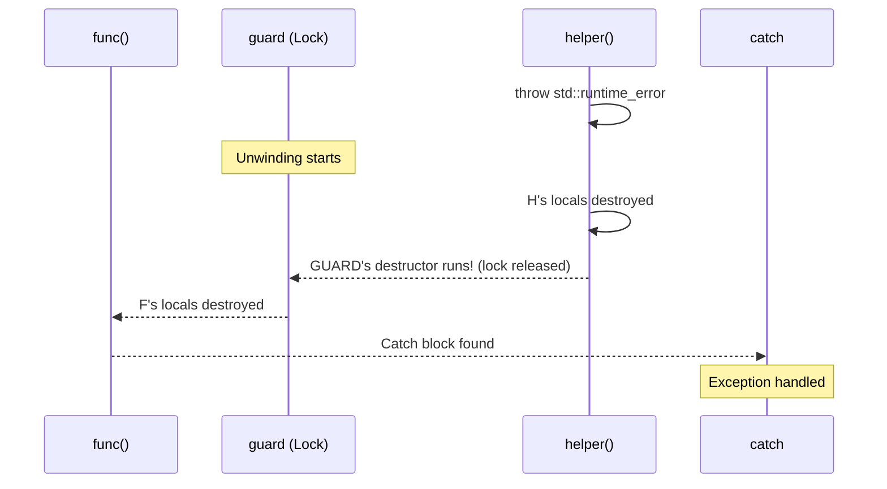

# Exception Handling and Exception Safety

> [!summary] Goal
> Master C++ exceptions: `try`/`catch`/`throw`, stack unwinding, exception safety guarantees (nothrow, strong, basic), RAII as the exception-safety mechanism, `noexcept`, and when to use exceptions vs error codes.

## Table of Contents

1. [Exception Basics](#exception-basics)
2. [Stack Unwinding](#stack-unwinding)
3. [Exception Safety Guarantees](#exception-safety-guarantees)
4. [RAII and Exception Safety](#raii-and-exception-safety)
5. [`noexcept`](#noexcept)
6. [`std::exception_ptr` and `std::nested_exception`](#stdexceptionptr-and-stdnestedexception)
7. [Exceptions vs Error Codes](#exceptions-vs-error-codes)
8. [Pitfalls](#pitfalls)

---

## Exception Basics

> [!info] Exception
> An exception is a way to transfer control from a point where an error occurs to a handler that can deal with it. Unlike error codes, exceptions can't be silently ignored (you must catch them or the program terminates). In C++, exceptions are thrown by value and caught by reference.

```cpp
#include <stdexcept>
#include <iostream>

double divide(double a, double b) {
    if (b == 0.0) {
        throw std::runtime_error("Division by zero");  // Throw by value
    }
    return a / b;
}

int main() {
    try {
        double result = divide(10.0, 0.0);
        std::cout << result << '\n';
    } catch (const std::runtime_error& e) {             // Catch by reference
        std::cerr << "Error: " << e.what() << '\n';
    } catch (const std::exception& e) {                  // Catch polymorphic base
        std::cerr << "Unknown exception: " << e.what() << '\n';
    } catch (...) {                                       // Catch-all (any exception)
        std::cerr << "Unknown exception type\n";
    }
}
```

### Standard exception hierarchy

```cpp
std::exception
├── std::logic_error
│   ├── std::invalid_argument
│   ├── std::domain_error
│   ├── std::length_error
│   └── std::out_of_range
├── std::runtime_error
│   ├── std::range_error
│   ├── std::overflow_error
│   └── std::underflow_error
├── std::bad_alloc         // new fails
├── std::bad_cast          // dynamic_cast fails on reference
└── std::bad_function_call // empty std::function called
```

---

## Stack Unwinding

> [!info] Stack unwinding
> When an exception is thrown, the runtime walks the call stack, destroying local variables in reverse order of construction (invoking destructors) until it finds a matching `catch` block. This is why RAII is essential — destructors run during unwinding, releasing resources automatically.



```cpp
void helper() {
    std::lock_guard<std::mutex> lock(m);   // RAII: mutex acquired
    std::vector<int> data(100);             // RAII: memory allocated
    // ... do work ...
    throw std::runtime_error("Failed!");    // Exception thrown!
    // lock_guard destructor runs → m.unlock() (automatic!)
    // vector destructor runs → memory freed (automatic!)
}

void func() {
    try {
        helper();
    } catch (const std::exception& e) {
        std::cerr << e.what() << '\n';      // Captured here
    }
    // Resource cleanup happened during unwinding — no leaks
}
```

---

## Exception Safety Guarantees

> [!info] Exception safety guarantees
> Every function provides one of three guarantees (or none). The **strong guarantee** (commit-or-rollback) is the most desirable — if an exception is thrown, the program state is unchanged. The **basic guarantee** ensures no leaks and valid state. The **nothrow guarantee** means the function will never throw.

| Guarantee | Meaning | Example |
|-----------|---------|---------|
| **No-throw** | Never throws, always succeeds | Destructors, `swap`, `std::vector::size()` |
| **Strong** | If it throws, state is rolled back | `std::vector::push_back` (if alloc fails, vector is unchanged) |
| **Basic** | If it throws, no leaks, valid but unspecified state | Most operations |
| **None** | If it throws, resources may leak, state may be corrupted | Raw `new`/`delete` code |

### Strong guarantee — copy and swap idiom

```cpp
class Widget {
    std::vector<int> data;
    std::string name;
public:
    // Strong guarantee via copy-and-swap
    void modify(const std::string& newName, const std::vector<int>& newData) {
        auto tempData = newData;     // Copy (may throw — if it does, *this is unchanged)
        auto tempName = newName;     // Copy (may throw)
        data.swap(tempData);         // noexcept swap
        name.swap(tempName);         // noexcept swap
    }                                // Old data in tempData/tempName destroyed
};
```

### Basic guarantee — no-leak pattern

```cpp
class WidgetManager {
    std::vector<std::unique_ptr<Widget>> widgets;
public:
    // Basic guarantee: no leaks, but widgets may be partially added
    void addWidgets(std::initializer_list<Widget> list) {
        for (const auto& w : list) {
            widgets.push_back(std::make_unique<Widget>(w));
        }
    }
};
```

---

## RAII and Exception Safety

> [!info] RAII is the exception safety foundation
> RAII ensures that resources are released when objects go out of scope — even during stack unwinding. Without RAII, every function that acquires multiple resources needs complex try/catch cleanup blocks. With RAII, destructors handle cleanup automatically.

```cpp
// ❌ Without RAII — error-prone
void oldWay() {
    int* data = new int[100];
    FILE* file = fopen("data.txt", "r");
    if (!file) {
        delete[] data;                 // Manual cleanup 1
        return;
    }
    if (someCondition) {
        fclose(file);
        delete[] data;                 // Manual cleanup 2
        return;                        // Easy to forget one!
    }
    // ... use ...
    fclose(file);
    delete[] data;
}

// ✅ With RAII — automatic, no leaks
void newWay() {
    std::vector<int> data(100);        // RAII: memory in destructor
    std::ifstream file("data.txt");    // RAII: file closes in destructor
    if (!file) return;                  // No manual cleanup needed!
    // ... use ...
}                                       // Both destructors run, regardless
```

---

## `noexcept`

> [!info] noexcept
> `noexcept` (C++11) declares that a function won't throw exceptions. The compiler can generate better code (no try/catch bookkeeping). If a `noexcept` function does throw, `std::terminate` is called. Move constructors, destructors, and `swap` should always be `noexcept`.

```cpp
// Declare noexcept
void saveConfig(const Config& c) noexcept;

// Conditional noexcept (noexcept if condition is true)
template<typename T>
void swap(T& a, T& b) noexcept(std::is_nothrow_move_constructible_v<T>);

// noexcept operator — compile-time check
template<typename T>
void call() {
    std::cout << std::boolalpha << noexcept(T::someFunc()) << '\n';
}

// noexcept affects move semantics
// std::vector will use move (not copy) if the element's move is noexcept
```

### When to use noexcept

| Function type | Should be noexcept? | Why |
|---------------|:-------------------:|-----|
| **Destructor** | ✅ Always (default) | Stack unwinding would terminate if dtor throws |
| **Move constructor** | ✅ Always | Vectors move if noexcept, copy if not |
| **Move assignment** | ✅ Always | Same as move ctor |
| `swap` | ✅ Always | Critical for exception safety |
| `size()`, `empty()` | ✅ Always | These can't logically fail |
| **I/O operations** | ❌ No | Can fail for many reasons |
| **Allocation functions** | ⚠️ `noexcept(false)` | new can throw bad_alloc |

---

## `std::exception_ptr` and `std::nested_exception`

```cpp
#include <exception>

// Store and rethrow exceptions across threads
std::exception_ptr pendingException;

void threadWorker() {
    try {
        // ... do work that may throw ...
    } catch (...) {
        pendingException = std::current_exception();  // Store the exception
    }
}

int main() {
    std::thread t(threadWorker);
    t.join();
    
    if (pendingException) {
        try {
            std::rethrow_exception(pendingException);  // Rethrow in this thread
        } catch (const std::exception& e) {
            std::cerr << "Thread exception: " << e.what() << '\n';
        }
    }
}

// Nested exception — wrap an exception with context
void lowLevel() {
    throw std::runtime_error("Disk full");
}

void highLevel() {
    try {
        lowLevel();
    } catch (...) {
        std::throw_with_nested(std::runtime_error("Failed to write file"));
        // Throw a new exception that contains the original
    }
}

// Output won't show the nested exception unless we rethrow recursively
void printNested(const std::exception& e) {
    std::cerr << e.what() << '\n';
    try {
        std::rethrow_if_nested(e);
    } catch (const std::exception& nested) {
        printNested(nested);     // Recursively print nested exceptions
    }
}
```

---

## Exceptions vs Error Codes

| Aspect | Exceptions | Error codes |
|--------|:----------:|:-----------:|
| **Ignorability** | Cannot be ignored (program terminates) | Can be silently ignored |
| **Error propagation** | Automatic (stack unwinding) | Manual (check and return) |
| **Performance (success path)** | Zero overhead (no check) | Zero overhead |
| **Performance (error path)** | Slow (stack unwinding) | Fast (just return code) |
| **Error context** | Rich (what(), nested) | Limited (just a number) |
| **Binary size** | Larger (unwind tables) | Smaller |
| **Embedded/games (-fno-exceptions)** | ❌ Not available | ✅ Works fine |
| **Real-time systems** | ❌ Unbounded timing | ✅ Predictable |

### When to use which

```cpp
// ✅ Use exceptions for:
// - Constructor failures (no return value possible)
// - Operator overload failures (can't return error code)
// - Deeply nested error propagation
// - Errors that the caller MUST handle

// ✅ Use error codes for:
// - Embedded systems (exceptions disabled)
// - Real-time systems (predictable timing)
// - High-frequency operations (performance critical)
// - Validation checks (expected failures, not exceptional)
```

---

## Pitfalls

### Throwing from destructors

Destructors are `noexcept` by default. If a destructor throws during stack unwinding (which is already processing another exception), `std::terminate` is called and the program aborts. **Never let exceptions escape from destructors.**

### Catching by value instead of reference

```cpp
try {
    throw std::runtime_error("error");
} catch (std::runtime_error e) {       // ❌ Catches by value — SLICING!
    // If a derived exception type was thrown, it's sliced
}

catch (const std::runtime_error& e) {  // ✅ Catch by reference
}
```

### Catching `...` without rethrowing

```cpp
try {
    // code
} catch (...) {
    // ❌ Swallows all exceptions — can't inspect or distinguish
    // Only use catch-all for logging, then RETHROW:
    std::cerr << "Unknown exception\n";
    throw;           // ✅ Rethrow after logging
}
```

### Exception specifications (`throw()`) are deprecated

C++98 had dynamic exception specifications like `void func() throw(std::runtime_error)`. These are **deprecated** in C++11 and **removed** in C++17. Use `noexcept` instead.

---

> [!question]- Interview Questions
>
> **Q: What is stack unwinding?**
> A: When an exception is thrown, the runtime walks up the call stack, destroying local variables in reverse order of construction (calling their destructors), until it finds a matching catch block. This ensures RAII resources are released automatically — files are closed, mutexes unlocked, memory freed.
>
> **Q: What are the three exception safety guarantees?**
> A: (1) No-throw — the function always succeeds (destructors, swap). (2) Strong — if the function throws, the program state is unchanged (copy-and-swap idiom). (3) Basic — if the function throws, no resources leak and objects are in valid-but-unspecified states. Every function should provide at least the basic guarantee.
>
> **Q: Why should you never throw from a destructor?**
> A: Destructors are noexcept by default. If a destructor throws during stack unwinding (while another exception is active), std::terminate is called. Even if the destructor is noexcept(false), two simultaneous exceptions can't be handled — the program terminates. Destructors must always succeed.
>
> **Q: What does noexcept affect beyond error handling?**
> A: noexcept affects move semantics. std::vector checks if the element's move constructor is noexcept. If it is, vector moves elements during reallocation (fast). If it's not, vector COPIES elements (slower but safer). Mark move constructors noexcept to enable efficient reallocation.
>
> **Q: When would you use error codes instead of exceptions?**
> A: (1) When exceptions are disabled (-fno-exceptions in embedded/games). (2) In real-time systems where malloc timing (used by exception runtime) is unacceptable. (3) In high-frequency code paths where the error path is common (not exceptional). (4) In C code being called from C++.

---

## Cross-Links

- [[C++/01_Foundations/02_Classes_and_RAII]] for RAII and destructors
- [[C++/01_Foundations/05_Move_Semantics_and_Value_Categories]] for noexcept and move
- [[C++/02_Core/01_Smart_Pointers_and_Memory_Management]] for RAII smart pointers
- [[C++/03_Advanced/08_Game_Engine_and_Driver_Dev]] for exception-free game code
- [[C++/02_Core/08_Undefined_Behavior_and_Low_Level_Cpp]] for UB related to exceptions
