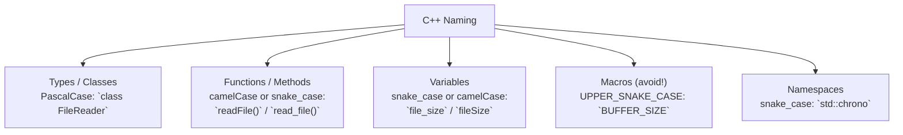
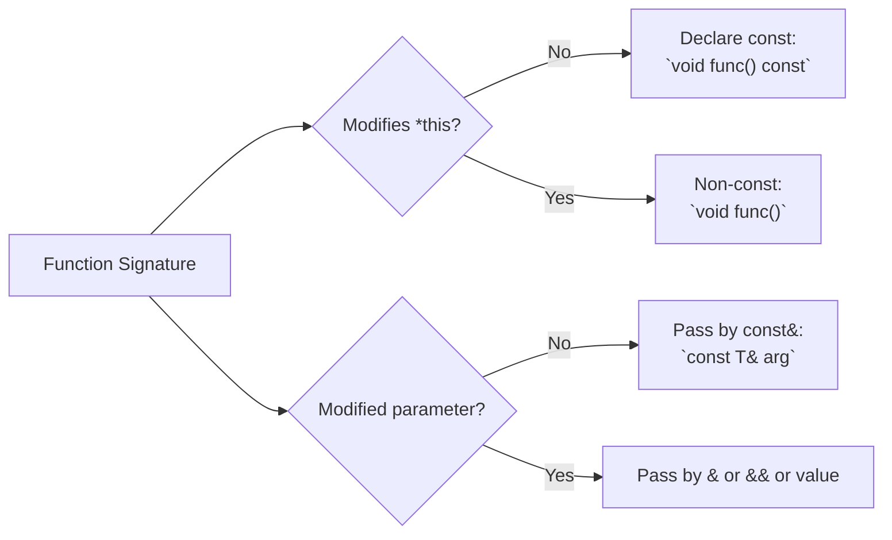
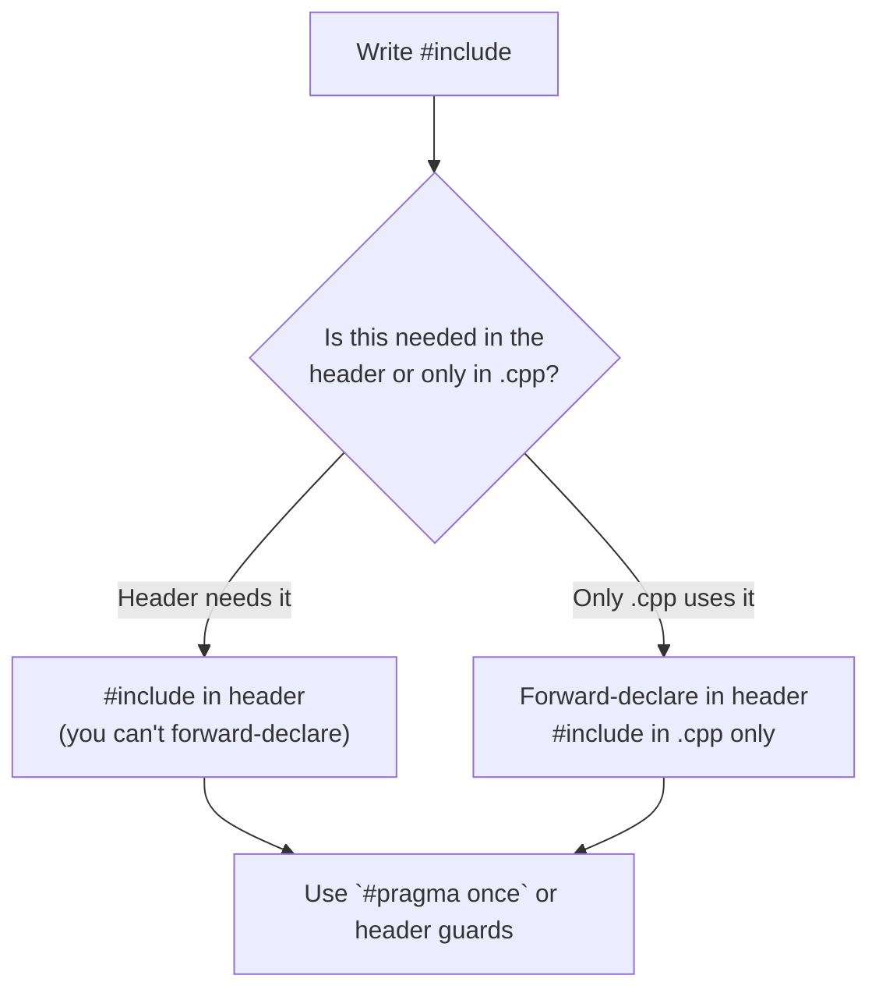
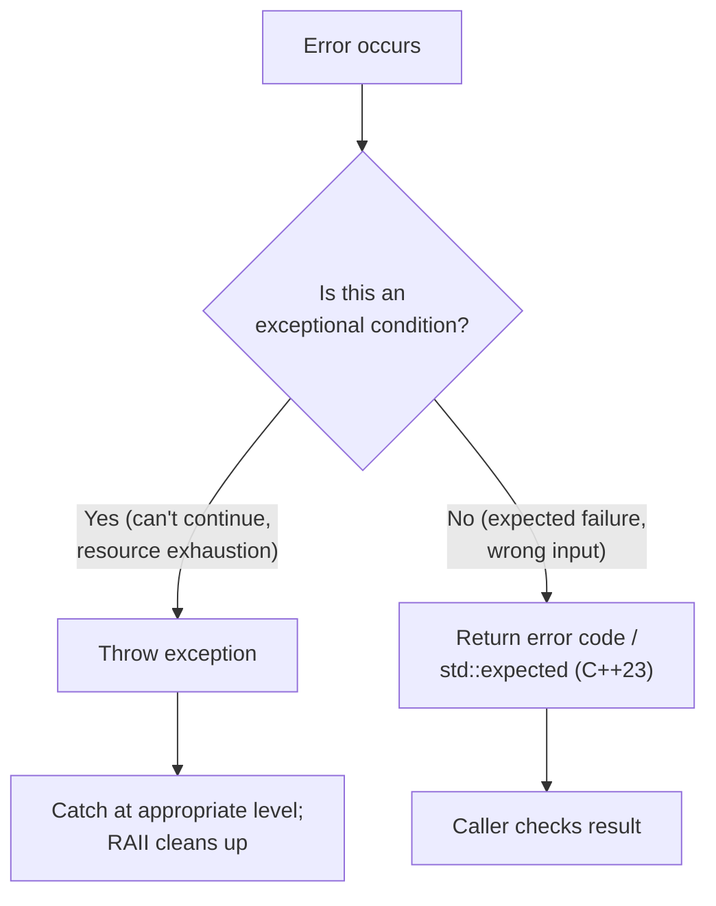

# Good C++ Coding Practices

> [!summary] Goal
> Distill the C++ Core Guidelines and community conventions into actionable, everyday practices — naming, `const` correctness, `explicit`/`[[nodiscard]]`, include discipline, error-handling strategy, and modern C++ idioms. These are the habits that separate production C++ from "it compiles" C++.

## Table of Contents

1. [Naming Conventions](#naming-conventions)
2. [Struct vs Class](#struct-vs-class)
3. [Const Correctness](#const-correctness)
4. [`explicit` and `[[nodiscard]]`](#explicit-and-nodiscard)
5. [`auto` and `decltype`](#auto-and-decltype)
6. [Include Discipline](#include-discipline)
7. [Prefer Stack to Heap](#prefer-stack-to-heap)
8. [Prefer Range-For and Pre-Increment](#prefer-range-for-and-pre-increment)
9. [Error Handling Strategy](#error-handling-strategy)
10. [Modern C++ Over C-Style](#modern-c-over-c-style)
11. [Pitfalls](#pitfalls)

---

## Naming Conventions



| Entity | Style | Example |
|--------|-------|---------|
| **Types / Classes / Structs** | PascalCase | `class FileReader`, `struct Point` |
| **Functions / Methods** | camelCase or snake_case | `getValue()`, `get_value()` |
| **Variables (local + member)** | snake_case or camelCase | `int file_size;`, `int fileSize;` |
| **Member variables** | `m_` prefix or trailing `_` | `m_fileSize`, `fileSize_` |
| **Macros** | UPPER_SNAKE_CASE (and minimize) | `#define MAX_BUFFER 1024` |
| **Namespaces** | snake_case | `namespace detail { }` |
| **Template parameters** | PascalCase (often single letter) | `template<typename T>` |

> [!info] Key guideline
> Whatever convention you pick, **be consistent** within a project. The C++ Core Guidelines recommend `snake_case` for variables/functions and `PascalCase` for types. STL uses `snake_case` for everything (types and functions alike).

---

## Struct vs Class

The only technical difference: `struct` defaults members to `public`; `class` defaults to `private`.

```cpp
struct Point {        // Public by default — fine for passive data
    int x, y;
};

class BankAccount {   // Private by default — enforces invariants
    double balance;
public:
    void deposit(double amount);
};
```

**Convention:**
- `struct` → simple data aggregates with no invariants (POD-like)
- `class` → types with invariants, private data, and member functions

---

## Const Correctness

> [!info] Const correctness
> Mark **every** member function and parameter that doesn't modify state as `const`. This catches bugs at compile time, enables safe concurrency, and documents intent.

```cpp
class Widget {
    int id;
    mutable int cacheHitCount;  // mutable: can change even in const methods
public:
    int getId() const { return id; }      // ✅ Const member — promises no mutation
    void update(int newId) { id = newId; } // Non-const
    
    int getCached() const {
        ++cacheHitCount;                  // ✅ mutable — logically const
        return compute();
    }
};

void print(const Widget& w) {
    std::cout << w.getId();               // ✅ Can call const methods on const ref
    // w.update(5);                       // ❌ ERROR: can't call non-const on const ref
}
```



**Rules of thumb:**
- Pass read-only parameters as `const T&` (not `T&` and not `T` for non-trivial types)
- Mark getters and inspectors `const`
- Use `mutable` sparingly — only for caching, mutexes, or reference counting

---

## `explicit` and `[[nodiscard]]`

### `explicit` — prevent implicit conversions

```cpp
class String {
public:
    explicit String(int size);   // ✅ No implicit int → String conversion
    String(const char* s);       // OK: implicit conversion from string literal
};

String s1 = "hello";   // ✅ OK: const char* → String
String s2 = 42;        // ❌ ERROR (with explicit): int → String blocked
String s3 = String(42); // ✅ OK: explicit call

// Without explicit, `= 42` would silently compile — often a bug.
```

### `[[nodiscard]]` — don't ignore return values

```cpp
class Error {
    int code;
public:
    [[nodiscard]] int getCode() const { return code; }
};

[[nodiscard]] bool tryConnect();  // Caller MUST use the result

int main() {
    tryConnect();                   // ❌ Compiler warning: nodiscard
    bool ok = tryConnect();         // ✅ OK: result used
    auto code = Error(42).getCode(); // ✅ OK: result used
}
```

> [!tip] When to use `[[nodiscard]]`
> - Factory functions (`make_unique`, `createWidget`)
> - Error-returning functions (should the caller check the error?)
> - Methods that return a new state (don't mutate `this`)
> - Getters where ignoring the value is almost certainly a mistake

---

## `auto` and `decltype`

```cpp
// ✅ Good: auto reduces repetition and prevents type mismatches
auto it = my_map.find(key);                 // Iterator type — verbose to spell out
auto [success, inserted] = map.insert(pair); // Structured binding (C++17)
auto ptr = std::make_unique<Widget>(42);    // No need to repeat unique_ptr<Widget>

// ⚠️ Caution: auto strips references and const
const Widget& getRef();
auto x = getRef();          // x is Widget (copy!), not const Widget&
const auto& y = getRef();   // ✅ y is const Widget& (preserves ref and const)

// ✅ auto in lambdas (C++14)
auto lambda = [](const auto& a, const auto& b) { return a < b; };

// ❌ Avoid: auto when the type is not obvious from context
auto result = someFunction();   // What does someFunction return? Unclear.
```

**Guidelines:**
- Use `auto` when the type is obvious from the right-hand side (`make_xxx`, iterators)
- Use `const auto&` for read-only traversal of containers
- Avoid `auto` when it obscures readability (use explicit type or a `using` alias)

---

## Include Discipline



### Forward declarations vs includes

```cpp
// widget.h — minimize includes in headers
#include <memory>        // Needed: unique_ptr member
class Gadget;            // Forward declaration — no include needed!
class Widget {
    std::unique_ptr<Gadget> ptr;  // ✅ Forward-declared, not included
public:
    void process();
};

// widget.cpp
#include "widget.h"
#include "gadget.h"      // ✅ Include only here
void Widget::process() { /* use Gadget */ }
```

### Header guards

```cpp
// Option A: #pragma once (simpler, widely supported)
#pragma once

// Option B: traditional include guards (guaranteed portable)
#ifndef WIDGET_H_
#define WIDGET_H_
// ... header content ...
#endif
```

> [!tip] `#pragma once` is supported by all major compilers (GCC, Clang, MSVC, ICC). Use it by default. Fall back to include guards only if you need to support obscure or proprietary compilers.

---

## Prefer Stack to Heap

```cpp
// ❌ Unnecessary heap allocation
auto obj = std::make_unique<Widget>(42);   // Heap — extra indirection

// ✅ Stack allocation (preferred when possible)
Widget obj(42);                              // Stack — faster, no alloc

// ✅ When you need heap (polymorphism, large objects, transfer ownership):
auto poly = std::make_unique<Base>();        // Heap — necessary

// ✅ STL containers manage their own memory — stack-allocate the container
std::vector<int> vec = {1, 2, 3};           // Container on stack, data on heap
```

**Decision order (prefer first):**
1. Stack value — when lifetime and size are known
2. `std::unique_ptr` — exclusive ownership, polymorphic objects
3. `std::shared_ptr` — shared ownership (rarely needed)
4. Raw `new`/`delete` — never (always wrap in a smart pointer)

---

## Prefer Range-For and Pre-Increment

```cpp
std::vector<int> data = {1, 2, 3, 4, 5};

// ✅ Range-based for (C++11) — clear, can't go out of bounds
for (const auto& x : data) {
    process(x);
}

// ❌ Index-based for — verbose, easy to off-by-one
for (size_t i = 0; i < data.size(); ++i) {
    process(data[i]);
}

// ✅ Pre-increment (++it) over post-increment (it++) — no temporary
for (auto it = data.begin(); it != data.end(); ++it) { /* ... */ }
// Post-increment it++ would create a copy of the old iterator
```

> [!tip] `++it` is always at least as efficient as `it++`. For iterators, `it++` returns the old value (copy) and increments. The copy is wasted if you don't use it. Many compilers optimize this away for built-in types, but with custom iterators the difference can be significant.

---

## Error Handling Strategy



```cpp
// ✅ Exceptions for exceptional errors
class FileReader {
    std::ifstream file;
public:
    explicit FileReader(const std::string& path) : file(path) {
        if (!file.is_open()) {
            throw std::runtime_error("Failed to open: " + path);
        }
    }
    // Destructor automatically closes — RAII
};

// ✅ Error codes (or optional) for expected failures
enum class ParseError { Ok, InvalidInput, Overflow };
ParseError parseNumber(const std::string& s, int& out) {
    if (s.empty()) return ParseError::InvalidInput;
    // ...
    return ParseError::Ok;
}

// ✅ std::optional for "maybe a value"
std::optional<int> tryFind(const std::vector<int>& v, int target) {
    auto it = std::find(v.begin(), v.end(), target);
    if (it != v.end()) return *it;
    return std::nullopt;
}
```

**Guidelines:**
- Use exceptions for **exceptional** conditions (resource exhaustion, invariant violation)
- Use `std::optional` or `std::expected` for **expected** failures (not-found, bad input)
- Never throw from destructors (they're called during stack unwinding → `std::terminate`)
- Always use RAII (no raw `new`/`delete`, no manual resource handling)

---

## Modern C++ Over C-Style

| C-style | Modern C++ | Why |
|---------|-----------|-----|
| `#define BUFFER_SIZE 1024` | `constexpr int buffer_size = 1024;` | Type safety, scoping, no macro pitfalls |
| `typedef unsigned long ulong;` | `using ulong = unsigned long;` | Clearer syntax, supports templates |
| `NULL` | `nullptr` | Type-safe pointer (not `0` or `(void*)0`) |
| Raw `new`/`delete` | `std::make_unique`, `std::make_shared` | RAII, exception safety, no leaks |
| C-style arrays | `std::array`, `std::vector` | Bounds checking, iterators, algorithms |
| `sprintf`, `strcpy` | `std::format` (C++20), `std::string` | Type safety, buffer overflow prevention |
| `(int)value` | `static_cast<int>(value)` | Visible in search, constrained cast |
| Function pointers for callbacks | `std::function`, lambdas | Type erasure, capture, inlining |
| Manual loops | `<algorithm>`, range-for | Less code, fewer off-by-one errors |

> [!warning] Pitfalls
> > - **Macro abuse**: `#define` has no scoping, no type checking, and can cause subtle bugs. Use `constexpr`, `inline`, or templates instead.
> > - **Using `NULL`**: In C++, `nullptr` is type-safe and won't accidentally match integer overloads. `NULL` is `0` or `(void*)0` — both create ambiguities.
> > - **C-style casts**: `(int)ptr` silently does a `reinterpret_cast` which can mask bugs. Use `static_cast`, `dynamic_cast`, `const_cast`, or `reinterpret_cast` explicitly.
> > - **Ignoring compiler warnings**: Compile with `-Wall -Wextra -Wpedantic -Wconversion` (GCC/Clang) or `/W4` (MSVC). Treat warnings as errors (`-Werror`).
> > - **Not compiling with C++ standard flags**: Use `-std=c++20` or `-std=c++17` explicitly. Don't rely on the compiler default (which may be C++98 or C++11).

---

> [!question]- Interview Questions
>
> **Q: Why should you mark single-argument constructors `explicit`?**
> A: Without `explicit`, the compiler can use the constructor for implicit conversions. `String s = 42;` would silently convert 42 to a String, which is rarely the intended behavior. `explicit` forces the caller to write `String(42)`, making the conversion visible and intentional.
>
> **Q: When should you use `const` member functions?**
> A: Any member function that doesn't modify the observable state of the object should be `const`. This enables: (1) calling the function on `const` objects and references, (2) safe concurrent access, (3) the compiler to catch accidental mutations. The only exception is `mutable` members (caches, mutexes) that are logically but not physically const.
>
> **Q: What's the advantage of range-based for loops over index-based?**
> A: Range-based for (1) can't go out of bounds, (2) works with any container (not just random-access), (3) is less verbose, (4) makes the intent clearer. Index-based loops are only needed when you actually need the index (e.g., printing element positions).
>
> **Q: What is the Rule of Zero?**
> A: If a class uses RAII wrappers for all its resources (`std::vector`, `std::string`, `std::unique_ptr`), it shouldn't define any of the five special member functions (destructor, copy/move ctor/assignment). The compiler-generated versions work correctly. Modern C++ strongly prefers Rule of Zero over Rule of Five.
>
> **Q: What are the most important compiler flags for production C++?**
> A: `-Wall -Wextra -Wpedantic -Wconversion -Werror` (GCC/Clang). For safety: `-fstack-protector-strong`, `-D_FORTIFY_SOURCE=2`. For debugging: `-fsanitize=address,undefined -g -O1`. Always specify a C++ standard: `-std=c++20`.

---

## Cross-Links

- [[C++/01_Foundations/02_Classes_and_RAII]] for RAII and resource management fundamentals
- [[C++/01_Foundations/05_Move_Semantics_and_Value_Categories]] for move semantics and Rule of Five
- [[C++/01_Foundations/07_Exception_Handling_and_Safety]] for exception safety guarantees
- [[C++/02_Core/01_Smart_Pointers_and_Memory_Management]] for smart pointer usage
- [[C++/02_Core/08_Undefined_Behavior_and_Low_Level_Cpp]] for UB avoidance
- [[C++/04_Playbooks/04_Production_Readiness_and_ABI]] for production hardening flags
- [C++ Core Guidelines](https://isocpp.github.io/CppCoreGuidelines/)
