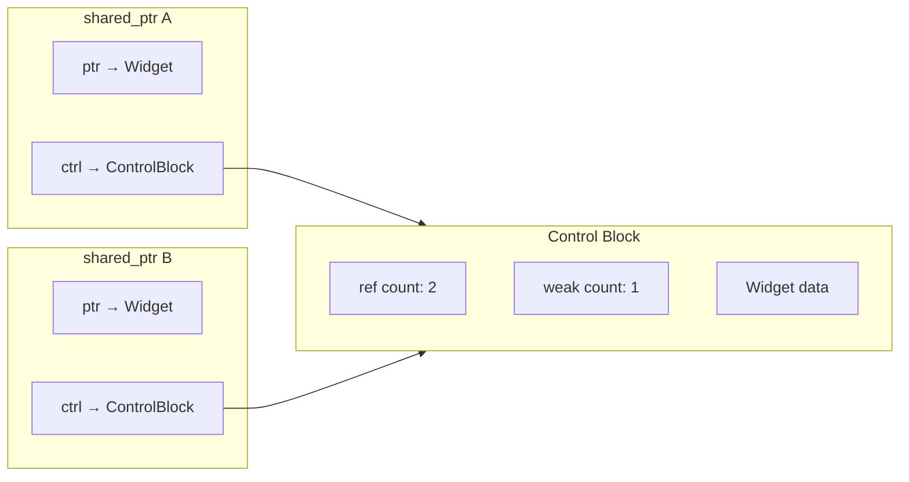

# Smart Pointers and Memory Management

> [!summary] Goal
> Master C++ smart pointers (`unique_ptr`, `shared_ptr`, `weak_ptr`), custom deleters and allocators, placement new, polymorphic allocators (PMR), and modern memory management patterns.

## Table of Contents

1. [std::unique_ptr](#stduniqueptr)
2. [std::shared_ptr](#stdsharedptr)
3. [std::weak_ptr](#stdweakptr)
4. [Custom Deleters](#custom-deleters)
5. [Placement New](#placement-new)
6. [Custom Allocators and PMR](#custom-allocators-and-pmr)
7. [Pitfalls](#pitfalls)

---

## std::unique_ptr

> [!info] unique_ptr
> `std::unique_ptr<T>` owns a pointer exclusively. It's **move-only** — can't be copied. When the `unique_ptr` is destroyed (goes out of scope), it deletes the owned pointer. This is the default choice for exclusive ownership. There's zero overhead over a raw pointer.

```cpp
#include <memory>

// Basic usage
std::unique_ptr<int> ptr = std::make_unique<int>(42);
// make_unique is the recommended way (strong exception safety)
*ptr = 10;

// Can't copy — compile error
// auto ptr2 = ptr;              // ❌ ERROR: unique_ptr is move-only

// Must move to transfer ownership
std::unique_ptr<int> ptr2 = std::move(ptr);   // ptr is now nullptr
if (!ptr) { /* true */ }

// Arrays
auto arr = std::make_unique<int[]>(100);       // unique_ptr<int[]>
arr[0] = 42;                                   // operator[] works

// Custom deleter
auto fileDeleter = [](FILE* f) { if (f) fclose(f); };
std::unique_ptr<FILE, decltype(fileDeleter)> file(fopen("data.txt", "r"), fileDeleter);
// When file goes out of scope, fclose is called automatically

// Factory function — return unique_ptr
std::unique_ptr<Widget> createWidget() {
    return std::make_unique<Widget>(42, "hello");
}

// In containers
std::vector<std::unique_ptr<Widget>> widgets;
widgets.push_back(std::make_unique<Widget>(1));
widgets.push_back(std::make_unique<Widget>(2));
// widgets can be copied — it's a compile error (unique_ptr is move-only)
for (auto& w : widgets) {
    w->process();
}
```

### Custom deleter with unique_ptr

```cpp
// Type-erased deleter (larger unique_ptr — 2 pointers instead of 1)
std::unique_ptr<FILE, void(*)(FILE*)> file(fopen("test.txt", "r"), [](FILE* f) {
    if (f) { fclose(f); std::cout << "File closed\n"; }
});

// Non-type-erased deleter (default size, but different type per lambda)
auto closeFile = [](FILE* f) { if (f) fclose(f); };
std::unique_ptr<FILE, decltype(closeFile)> file2(fopen("test.txt", "r"), closeFile);
```

---

## std::shared_ptr

> [!info] shared_ptr
> `std::shared_ptr<T>` uses **reference counting**. Multiple `shared_ptr` instances can own the same object. The object is destroyed when the last `shared_ptr` is destroyed. Reference counting adds overhead (atomic increments/decrements in the control block). Use `std::make_shared` which allocates the object and control block in a single allocation (more efficient).



```cpp
auto sp1 = std::make_shared<Widget>(42, "hello");
// One allocation: Widget + control block = efficient

{
    auto sp2 = sp1;        // Copy: ref count = 2
    // sp1 and sp2 both own the Widget
    sp2->process();
    // sp2 destroyed: ref count = 1
}

// sp1 destroyed here: ref count = 0 → Widget destroyed

// Shared ownership in containers
std::vector<std::shared_ptr<Widget>> allWidgets;
allWidgets.push_back(std::make_shared<Widget>(1));
allWidgets.push_back(std::make_shared<Widget>(2));

// They can be copied freely
auto backup = allWidgets;    // All shared_ptrs share ownership
```

### make_shared vs shared_ptr(ptr)

```cpp
// ✅ RECOMMENDED: make_shared
auto sp = std::make_shared<Widget>(42);
// Single allocation (Widget + control block)
// Better cache locality
// Exception-safe (no gap between allocation and shared_ptr ownership)

// ❌ NOT RECOMMENDED: separate new
std::shared_ptr<Widget> sp2(new Widget(42));
// Two allocations (Widget + control block separately)
// If the shared_ptr constructor throws, Widget leaks
// Worse cache locality
```

---

## std::weak_ptr

> [!info] weak_ptr
> `std::weak_ptr` is a non-owning observer of a `shared_ptr`. It doesn't affect the reference count — it won't keep the object alive. To access the object, you must call `lock()` which returns a `shared_ptr` (or null if the object was destroyed). Use `weak_ptr` to break circular references and for caching.

### Breaking circular references

```cpp
struct Node {
    std::shared_ptr<Node> next;     // Strong ownership
    std::weak_ptr<Node> prev;       // Weak — no cycle!
    int value;
    
    ~Node() { std::cout << "~Node(" << value << ")\n"; }
};

// ⚠️ Without weak_ptr, circular shared_ptrs never destroy
struct BadNode {
    std::shared_ptr<BadNode> next;
    std::shared_ptr<BadNode> prev;  // ❌ Creates a cycle!
    // Both nodes stay alive forever — memory leak
};
```

### Caching with weak_ptr

```cpp
class Cache {
    std::unordered_map<int, std::weak_ptr<ExpensiveResource>> cache;
public:
    std::shared_ptr<ExpensiveResource> get(int id) {
        if (auto it = cache.find(id); it != cache.end()) {
            if (auto sp = it->second.lock()) {    // Try to upgrade to shared_ptr
                return sp;                         // Cache hit!
            }
        }
        // Cache miss — create new
        auto sp = std::make_shared<ExpensiveResource>(id);
        cache[id] = sp;                             // Store weak reference
        return sp;
    }
};
```

### How `weak_ptr::lock()` works — the atomic upgrade

```cpp
std::weak_ptr<T> w = some_shared_ptr;

// What lock() does internally (conceptually):
// 1. Atomically read the control block's shared ref count
// 2. If ref count > 0, increment it (atomic) and return a shared_ptr pointing to the object
// 3. If ref count == 0, return an empty shared_ptr

// WHY this matters — the TOCTOU race:
// ❌ BAD: check then use — race between expired() and lock()
if (!w.expired()) {              // Check — object is still alive
    auto sp = w.lock();          // Use — BUT object may have been destroyed BETWEEN check and use!
}

// ✅ GOOD: lock() does both atomically
auto sp = w.lock();              // Atomic check+increment
if (sp) {                        // Object was still alive — now we own a shared reference
    // sp keeps the object alive — safe to use
}
```

The `lock()` method atomically checks if the managed object is still alive and, if so, increments the shared reference count. This prevents the object from being destroyed between the check and the use. This is the fundamental advantage over `expired()` + `lock()` in two separate calls.

### shared_ptr memory layout: `make_shared` vs `new`

```cpp
// std::make_shared — single allocation:
// [ control_block_ptr_ref_count | weak_ref_count | Widget_object ]
auto sp1 = std::make_shared<Widget>(42);
// Memory: one contiguous block: [ ref:1 | wref:1 | Widget(42) ]
// Advantage: one allocation, better cache locality
// Disadvantage: Widget memory is NOT freed until ALL weak_ptrs are gone
// (because the control block and object share the same allocation)

// shared_ptr(new Widget) — two allocations:
auto sp2 = std::shared_ptr<Widget>(new Widget(42));
// Memory: two separate blocks:
//   Block 1: Widget(42) on the heap
//   Block 2: [ ref:1 | wref:1 ] as control block
// Advantage: Widget memory freed when ref count hits 0 (even if weak_ptrs exist)
// Disadvantage: two allocations, worse cache locality, not exception-safe
```

### Aliasing constructor

```cpp
// The aliasing constructor lets you share ownership of one object while pointing to another:
struct Data { int value; int metadata; };
auto sp = std::make_shared<Data>(42, 100);
std::shared_ptr<int> alias(sp, &sp->metadata);  // alias points to metadata
// sp and alias share the same control block — the Data object stays alive
// until BOTH sp AND alias are destroyed, even though alias only accesses metadata
```

---

## Custom Deleters

> [!info] Custom deleter
> Both `unique_ptr` and `shared_ptr` accept custom deleters — callables that are invoked instead of `delete`. This is essential for: C FILE handles, Win32 handles (`CloseHandle`), `mmap`/`munmap`, SQLite connections, and any resource that isn't freed by `delete`.

```cpp
// Custom deleter as a lambda
auto socketDeleter = [](int* fd) {
    if (fd) {
        close(*fd);
        std::cout << "Socket closed\n";
    }
    delete fd;
};

using SocketPtr = std::unique_ptr<int, decltype(socketDeleter)>;
SocketPtr makeSocket() {
    int* fd = new int(socket(AF_INET, SOCK_STREAM, 0));
    return SocketPtr(fd, socketDeleter);
}
```

---

## Placement New

> [!info] Placement new
> Constructs an object in an already-allocated memory buffer. No memory is allocated — the constructor runs on the provided address. You must call the destructor explicitly. Used for: custom allocators, embedded systems, game engine memory pools, and `std::vector`'s uninitialized memory.

```cpp
#include <new>   // For placement new

// Raw memory buffer
alignas(Widget) char buffer[sizeof(Widget)];

// Construct a Widget in the buffer (no allocation)
Widget* widget = new (buffer) Widget(42, "placed");

// Use the object
widget->process();

// Explicitly destroy (no delete — no allocation was made)
widget->~Widget();

// Practical: memory pool
class Pool {
    char* memory;
    size_t used;
    size_t capacity;
public:
    Pool(size_t cap) : memory(new char[cap]), used(0), capacity(cap) {}
    
    template<typename T, typename... Args>
    T* allocate(Args&&... args) {
        size_t size = sizeof(T);
        if (used + size > capacity) return nullptr;
        T* result = new (memory + used) T(std::forward<Args>(args)...);
        used += size;
        return result;
    }
    
    void destroy() {
        // In a real pool, you'd track which objects need destruction
        delete[] memory;
    }
};
```

---

## Custom Allocators and PMR

> [!info] Custom allocator
> An allocator manages memory for STL containers. The default `std::allocator<T>` uses `new`/`delete`. Custom allocators can use memory pools, thread-local caches, or pre-allocated arenas. C++17 introduces **polymorphic allocators** (`std::pmr`) — allocators that share a common base, so containers with different allocator types are compatible.

### Minimal custom allocator

```cpp
template<typename T>
struct PoolAllocator {
    using value_type = T;
    
    PoolAllocator() = default;
    
    T* allocate(size_t n) {
        std::cout << "Allocating " << n << " objects\n";
        return static_cast<T*>(std::malloc(n * sizeof(T)));
    }
    
    void deallocate(T* ptr, size_t) noexcept {
        std::free(ptr);
    }
    
    // Equality comparison (required for containers)
    template<typename U>
    bool operator==(const PoolAllocator<U>&) const { return true; }
    template<typename U>
    bool operator!=(const PoolAllocator<U>&) const { return false; }
};

using PoolVector = std::vector<int, PoolAllocator<int>>;
PoolVector vec = {1, 2, 3};    // Uses PoolAllocator
```

### PMR (C++17)

```cpp
#include <memory_resource>

// Monotonic buffer resource — fast allocations, no deallocations
char buffer[1024];
std::pmr::monotonic_buffer_resource pool(buffer, sizeof(buffer));
std::pmr::vector<int> vec(&pool);   // Uses the monotonic buffer

vec.push_back(1);    // Allocated from 'buffer', not heap
vec.push_back(2);

// Unsynchronized pool resource — O(1) alloc/dealloc
std::pmr::unsynchronized_pool_resource pool2;
std::pmr::map<int, std::string> m(&pool2);
m[1] = "one";

// Synchronized pool resource (thread-safe)
std::pmr::synchronized_pool_resource pool3;
std::pmr::list<double> lst(&pool3);
```

---

## Pitfalls

### Circular shared_ptr references

If object A holds a `shared_ptr<B>` and B holds a `shared_ptr<A>`, neither is ever destroyed. The reference counts never reach zero. Use `weak_ptr` for back-references, or restructure ownership so that one side is a raw pointer or parent-owned reference.

### Accessing a raw pointer after the unique_ptr is moved

```cpp
auto ptr = std::make_unique<int>(42);
int* raw = ptr.get();       // Get raw pointer
auto ptr2 = std::move(ptr); // ptr is now null
*raw = 10;                  // ❌ ptr released ownership — UB!
```

### shared_ptr with arrays (pre-C++17)

Before C++17, `shared_ptr` doesn't call `delete[]` (only `delete`). For arrays with `shared_ptr`, you need a custom deleter or use `shared_ptr<int[]>` (C++17).

```cpp
// C++11/14 workaround:
std::shared_ptr<int> arr(new int[100], std::default_delete<int[]>());

// C++17:
std::shared_ptr<int[]> arr = std::make_shared<int[]>(100);
```

### This shared_ptr from this

If a class creates a new `shared_ptr` from `this`, the reference counts are independent — you get double deletion. Use `std::enable_shared_from_this<T>`:

```cpp
class Widget : public std::enable_shared_from_this<Widget> {
public:
    std::shared_ptr<Widget> getShared() {
        return shared_from_this();    // ✅ Correct: shares the existing control block
    }
};

auto w = std::make_shared<Widget>();
auto w2 = w->getShared();             // w and w2 share ownership
```

---

> [!question]- Interview Questions
>
> **Q: What's the difference between unique_ptr and shared_ptr?**
> A: `unique_ptr` is move-only (exclusive ownership) with zero overhead. `shared_ptr` uses reference counting (several shared_ptrs can own one object). `unique_ptr` is for single-owner scenarios. `shared_ptr` is for shared ownership where the owner isn't known at compile time. Use `unique_ptr` by default — it's simpler and faster.
>
> **Q: Why is make_shared preferred over shared_ptr(new T)?**
> A: `make_shared` performs a single allocation (object + control block together), while `shared_ptr(new T)` does two allocations. `make_shared` is exception-safe — there's no gap between allocation and ownership transfer. If the `shared_ptr` constructor throws after `new T`, `make_shared` guarantees cleanup. `make_shared` also has better cache locality.
>
> **Q: When would you use weak_ptr?**
> A: (1) Breaking circular shared_ptr references (parent←→child with back-refs). (2) Caching — cache stores weak_ptr, clients call lock() to get a shared_ptr. If the object was evicted, lock() returns null and the client creates a new one. (3) Observable pattern — observer stores weak_ptr to subject.
>
> **Q: What is placement new and when is it used?**
> A: Placement new constructs an object in pre-allocated memory without allocating new memory. Used in: custom memory pools, game engines (frame allocators), std::vector's internal memory management, embedded systems. The destructor must be called explicitly: `ptr->~T();`.
>
> **Q: What are polymorphic allocators (PMR)?**
> A: PMR (C++17) provides a common base class for allocators (`std::pmr::memory_resource`). This means containers with different allocator types become the same type (e.g., `pmr::vector<int>` uses a memory_resource* instead of a template parameter). This simplifies code that works with multiple allocator strategies.

---

## Cross-Links

- [[C++/01_Foundations/02_Classes_and_RAII]] for RAII and ownership concepts
- [[C++/01_Foundations/05_Move_Semantics_and_Value_Categories]] for move semantics (unique_ptr is move-only)
- [[C++/02_Core/02_STL_Containers_Deep_Dive]] for containers using allocators
- [[C++/03_Advanced/08_Game_Engine_and_Driver_Dev]] for custom allocators in games
- [[C++/03_Advanced/07_Performance_Cache_and_Optimization]] for cache-friendly allocation
