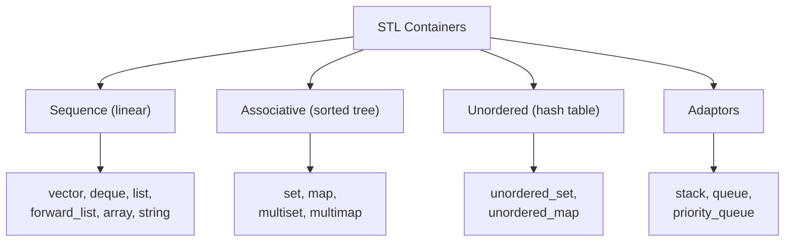
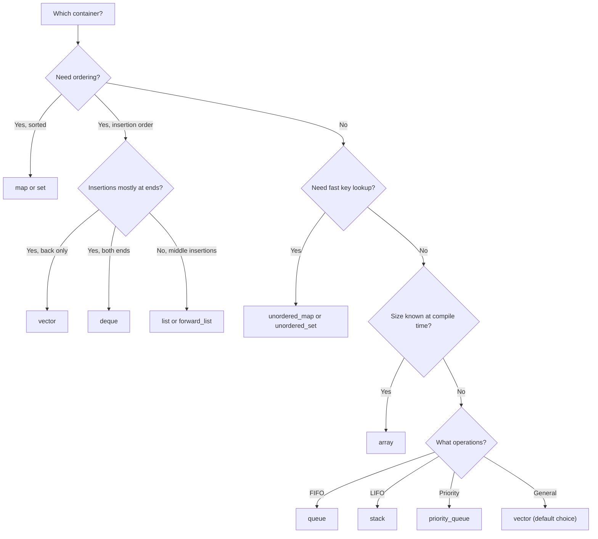

# STL Containers Deep Dive

> [!summary] Goal
> Master C++ STL containers — when to use each, their internal data structures, iterator invalidation rules, complexity guarantees, and the memory/performance tradeoffs.

## Table of Contents

1. [Container Overview](#container-overview)
2. [Sequence Containers](#sequence-containers)
3. [Associative Containers](#associative-containers)
4. [Unordered (Hash) Containers](#unordered-containers)
5. [Container Adaptors](#container-adaptors)
6. [Iterator Invalidation Table](#iterator-invalidation-table)
7. [Container Selection Guide](#container-selection-guide)
8. [Pitfalls](#pitfalls)

---

## Container Overview

> [!info] STL containers
> The STL provides several families of containers. **Sequence containers** store elements in linear order (vector, deque, list). **Associative containers** store sorted key-value pairs (set, map, multiset, multimap — typically Red-Black trees). **Unordered containers** store hash-based key-value pairs (unordered_set, unordered_map — hash tables). **Container adaptors** (stack, queue, priority_queue) wrap other containers with specific interfaces.



---

## Sequence Containers

### vector — dynamic array

> [!info] vector
> A contiguous dynamic array. Elements are stored sequentially in memory — cache-friendly. Amortized O(1) push_back. O(n) insertion/deletion in the middle. Growing triggers reallocation (all iterators/pointers/references are invalidated). Use vector as the default container.

```cpp
#include <vector>
std::vector<int> v = {1, 2, 3};
v.push_back(4);              // Amortized O(1)
v.pop_back();                // O(1)
v.insert(v.begin() + 1, 5); // O(n) — shifts elements
v.erase(v.begin() + 2);     // O(n) — shifts elements
v.shrink_to_fit();          // Release unused capacity

// Capacity vs size
v.size();                    // Number of elements
v.capacity();                // Allocated space (≥ size)
v.reserve(1000);             // Pre-allocate memory (avoids reallocations)
v.resize(20);                // Grow (value-initialize) or shrink

// Vector<bool> — NOT a regular vector (packed bits)
// Prefer deque<bool> or vector<char> for performance
```

### deque — double-ended queue

> [!info] deque
> A sequence container that supports O(1) push/pop at both ends. Internally, it's a sequence of fixed-size blocks (not a single contiguous array). Slightly slower than vector for indexed access, but O(1) operations at front AND back.

```cpp
#include <deque>
std::deque<int> d = {1, 2, 3};
d.push_back(4);          // O(1)
d.push_front(0);         // O(1) — impossible with vector
d.pop_back();
d.pop_front();
d[2];                    // O(1) — but pointer arithmetic not as fast as vector
```

### list / forward_list — linked lists

> [!info] list
> A doubly-linked list. O(1) insertion/deletion anywhere (if you have the iterator). No random access — O(n) index lookup. Each element is heap-allocated separately — poor cache behavior. Useful for: frequent middle insertions/deletions, stable iterators (pointers remain valid after insert/erase of other elements). Use `forward_list` (singly-linked) for even less overhead.

```cpp
#include <list>
std::list<int> lst = {1, 2, 3};
auto it = lst.begin();
++it;                     // Iterator to 2
lst.insert(it, 10);       // O(1): {1, 10, 2, 3} — no shifting!
lst.erase(lst.begin());   // O(1): {10, 2, 3}
std::list<int> lst2 = {4, 5};
lst.splice(lst.end(), lst2);  // Transfer all of lst2 to lst — O(1)
```

### array — fixed-size

```cpp
#include <array>
std::array<int, 5> arr = {1, 2, 3, 4, 5};  // Fixed size at compile time
// No dynamic allocation — stored on stack (or inline in object)
// Provides STL interface (begin/end/size) vs raw C arrays
arr.back();          // 5
arr.front();         // 1
arr.data();          // Raw pointer to underlying array
```

### string as a container

```cpp
#include <string>
std::string s = "hello";
s.push_back('!');           // Like vector<char> with string semantics
s += " world";
s.substr(0, 5);             // "hello"
s.find("world");            // 6
s.replace(6, 5, "there");   // "hello there"
```

---

## Associative Containers

> [!info] set / map
> `set` and `map` store **sorted** elements, typically implemented as **Red-Black trees** (a self-balancing binary search tree). Lookup, insertion, and deletion are O(log n). Elements are sorted by key. `set` stores keys (no values). `map` stores key-value pairs. `multiset` / `multimap` allow duplicate keys.

```cpp
#include <set>
#include <map>

// set — sorted unique keys
std::set<int> s = {3, 1, 4, 1, 5, 9};   // {1, 3, 4, 5, 9}
s.insert(2);                  // O(log n)
auto it = s.find(3);          // O(log n)
s.erase(1);                   // O(log n)

// map — sorted key-value pairs
std::map<std::string, int> ages;
ages["Alice"] = 30;           // O(log n) — operator[] inserts if missing
ages["Bob"] = 25;
ages["Alice"] = 31;           // Updates existing

// Iteration over sorted keys
for (const auto& [name, age] : ages) {
    std::cout << name << ": " << age << '\n';
}

// Lower bound / upper bound — range queries
auto [lo, hi] = ages.equal_range("A");  // All keys starting with 'A' or later

// hint insertion (when you know where the key belongs)
auto hint = ages.lower_bound("Charlie");
ages.emplace_hint(hint, "Charlie", 35);  // Amortized O(1)
```

---

## Unordered (Hash) Containers

> [!info] unordered_set / unordered_map
> Hash tables with **average O(1)** lookup, insertion, and deletion. Elements are not ordered. The hash function maps keys to buckets. Collisions are resolved via chaining (linked lists per bucket). Performance depends on hash quality and load factor. When the load factor exceeds `max_load_factor()`, rehashing occurs (all iterators invalidated).

```cpp
#include <unordered_set>
#include <unordered_map>

std::unordered_set<int> us = {3, 1, 4, 1, 5};   // Order unspecified
us.insert(9);                     // Average O(1)
us.erase(1);                      // Average O(1)

us.load_factor();                 // current elements / buckets
us.bucket_count();                // Number of buckets
us.max_load_factor(0.75);         // Resize when load factor > 0.75
us.reserve(1000);                 // Pre-allocate buckets for 1000 elements

// Custom hash for user-defined types
struct Point { int x, y; };
struct PointHash {
    std::size_t operator()(const Point& p) const {
        return std::hash<int>{}(p.x) ^ (std::hash<int>{}(p.y) << 1);
    }
};
struct PointEqual {
    bool operator()(const Point& a, const Point& b) const {
        return a.x == b.x && a.y == b.y;
    }
};
std::unordered_set<Point, PointHash, PointEqual> points;
```

### map vs unordered_map comparison

| Aspect | map (tree) | unordered_map (hash) |
|--------|:----------:|:--------------------:|
| **Ordering** | Sorted (by key) | Unordered |
| **Lookup** | O(log n) | Average O(1), worst O(n) |
| **Insert** | O(log n) | Average O(1), worst O(n) |
| **Memory** | Less (just nodes) | More (buckets + nodes) |
| **Iterator invalidation** | Only erased iterator | On rehash, ALL iterators |
| **Use when** | Order matters, range queries | Fast lookup, order irrelevant |

---

## Container Adaptors

```cpp
#include <stack>
#include <queue>

// stack — LIFO (default: deque)
std::stack<int> st;
st.push(1); st.push(2);
int top = st.top();   // 2
st.pop();             // Removes 2

// queue — FIFO (default: deque)
std::queue<int> q;
q.push(1); q.push(2);
int front = q.front();  // 1
q.pop();                // Removes 1

// priority_queue — max-heap (default: vector)
std::priority_queue<int> pq;
pq.push(3); pq.push(1); pq.push(4);
int highest = pq.top();   // 4 — highest priority first
pq.pop();                 // Removes 4

// Min-heap using priority_queue
std::priority_queue<int, std::vector<int>, std::greater<int>> min_heap;
```

---

## Iterator Invalidation Table

| Operation | vector | deque | list | map/set | unordered_map |
|-----------|:------:|:-----:|:----:|:-------:|:-------------:|
| **read** (no modification) | None | None | None | None | None |
| **insert single** | If reallocation: all. Else: after insertion point | All | None | None | If rehash: all. Else: none |
| **push_back / push_front** | push_back: if reallocation — all. Else: end() only | push_back: none. push_front: none | None | N/A | If rehash: all |
| **erase(element)** | After erasure point | All | Only the erased element | Only the erased element | Only the erased element |
| **reserve / rehash** | All | All | N/A | N/A | All |
| **clear** | All | All | All | All | All |

---

## Container Selection Guide



---

## Pitfalls

### Iterator invalidation (vector)

The most common STL bug. Inserting into a `vector` may invalidate ALL iterators, pointers, and references to its elements (if reallocation occurs). Even if no reallocation occurs, iterators after the insertion point are invalidated. Always recalculate iterators after modifications:

```cpp
std::vector<int> v = {1, 2, 3, 4, 5};
auto it = v.begin() + 2;
v.insert(v.begin(), 0);      // Might reallocate! 'it' is now invalid!
// *it = 42;                 // ❌ UB — it is invalid
```

### std::vector<bool>

`std::vector<bool>` is NOT a regular vector — it's a bit-packed specialization that stores 8 bools per byte. It doesn't meet the standard container requirements (`operator&` doesn't return a pointer to `bool`). Prefer `std::deque<bool>` or `std::vector<char>` for performance.

### map operator[] inserts if key is missing

```cpp
std::map<std::string, int> ages;
if (ages["Alice"] == 30) { /* ... */ }  // ❌ Creates entry "Alice" with value 0!
// Use find() instead:
auto it = ages.find("Alice");
if (it != ages.end() && it->second == 30) { /* ... */ }
```

### list memory fragmentation

Each `list` node is a separate heap allocation. A list of 100,000 elements does 100,000 allocations. This is bad for cache locality and can fragment memory. For large contiguous data, `vector` or `deque` is better. Use `list` only when you need stable iterators or splice operations.

---

> [!question]- Interview Questions
>
> **Q: When would you use vector vs deque vs list?**
> A: vector — default choice, contiguous memory, fast indexing, push_back only. deque — when you need push_front/pop_front (queue-like behavior). list — when you need O(1) middle insertion/deletion with stable iterators (pointers to elements remain valid). vector has the best cache locality; list has the worst.
>
> **Q: When should you use map vs unordered_map?**
> A: map (tree, O(log n)) — when you need sorted iteration, range queries (lower_bound, equal_range), or predictable worst-case performance. unordered_map (hash, O(1) average) — when fast key lookup is the priority and order doesn't matter. unordered_map has higher memory overhead but faster average lookup.
>
> **Q: What is iterator invalidation?**
> A: Modifying a container can invalidate iterators pointing to its elements. Using an invalidated iterator is undefined behavior. vector: insert/erase invalidates iterators after the insertion/erasure point; push_back may invalidate ALL iterators if reallocation occurs. deque: insert/erase at front/back doesn't invalidate; middle operations invalidate all. list/set/map: only the iterator to the erased element is invalidated.
>
> **Q: How does vector manage capacity?**
> A: vector grows exponentially (typically 1.5-2×). When `size() == capacity()`, push_back allocates a new larger buffer, moves (or copies) all elements, and deallocates the old buffer. This is amortized O(1) per push_back. Use `reserve()` to pre-allocate if you know the final size.
>
> **Q: What's the problem with vector<bool>?**
> A: It's a bit-packed specialization (8 bools per byte). It doesn't return bool references from operator[] — instead it returns a proxy object. This means `auto x = vec[0];` gives a proxy, not a bool. It breaks template code that expects a real container. Prefer deque<bool> or vector<char> for actual contiguous bool storage.

---

## Cross-Links

- [[C++/02_Core/03_STL_Algorithms_and_Ranges]] for algorithms that work with containers
- [[C++/02_Core/04_Iterators_and_Iterator_Categories]] for iterator fundamentals
- [[C++/02_Core/01_Smart_Pointers_and_Memory_Management]] for PMR allocators with containers
- [[C++/01_Foundations/06_Templates_Basics_to_Variadic]] for template containers
- [[C++/03_Advanced/05_Type_Erasure_and_Design_Patterns]] for std::variant and std::any
