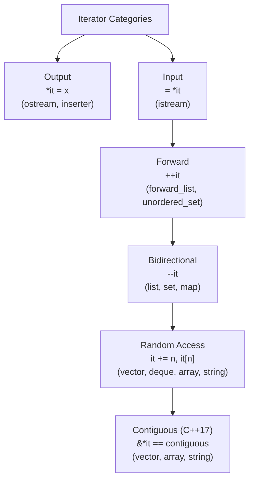

# Iterators and Iterator Categories

> [!summary] Goal
> Master C++ iterators — the glue between containers and algorithms. Understand the five iterator categories, iterator traits, iterator adaptors (back_inserter, stream iterators), and sentinels (C++17).

## Table of Contents

1. [Iterator Categories](#iterator-categories)
2. [Iterator Traits](#iterator-traits)
3. [Iterator Adaptors](#iterator-adaptors)
4. [Custom Iterators](#custom-iterators)
5. [Sentinels (C++17)](#sentinels)
6. [Pitfalls](#pitfalls)

---

## Iterator Categories

> [!info] Iterator category
> An iterator is an object that points to an element in a range. Iterators are categorized by their capabilities — input/output streams iterate once, forward lists need forward-only, linked lists need bidirectional, arrays support random access. Each algorithm requires a minimum category.



| Category | Can read | Can write | Can ++ | Can -- | Can += n | `it[n]` |
|:--------:|:--------:|:---------:|:------:|:------:|:--------:|:-------:|
| **Input** | ✅ Once | ❌ | ✅ | ❌ | ❌ | ❌ |
| **Output** | ❌ | ✅ Once | ✅ | ❌ | ❌ | ❌ |
| **Forward** | ✅ Multiple | ✅ | ✅ | ❌ | ❌ | ❌ |
| **Bidirectional** | ✅ | ✅ | ✅ | ✅ | ❌ | ❌ |
| **Random Access** | ✅ | ✅ | ✅ | ✅ | ✅ | ✅ |
| **Contiguous** (C++17) | ✅ | ✅ | ✅ | ✅ | ✅ | ✅ |

### Iterator tag hierarchy

```cpp
struct input_iterator_tag {};
struct output_iterator_tag {};
struct forward_iterator_tag : public input_iterator_tag {};
struct bidirectional_iterator_tag : public forward_iterator_tag {};
struct random_access_iterator_tag : public bidirectional_iterator_tag {};
struct contiguous_iterator_tag : public random_access_iterator_tag {};  // C++17
```

---

## Iterator Traits

> [!info] Iterator traits
> `std::iterator_traits<T>` provides information about an iterator: its value type (`value_type`), difference type (`difference_type`), pointer type, reference type, and iterator category. This is essential for writing generic code that works with any iterator.

```cpp
#include <iterator>
#include <type_traits>

template<typename Iter>
typename std::iterator_traits<Iter>::value_type
accumulate(Iter first, Iter last) {
    using value_t = typename std::iterator_traits<Iter>::value_type;
    value_t sum = {};
    for (; first != last; ++first) {
        sum += *first;
    }
    return sum;
}

// Category-based dispatch — optimize for random access
template<typename Iter>
typename std::iterator_traits<Iter>::difference_type
distance(Iter first, Iter last) {
    return distance_impl(first, last,
        typename std::iterator_traits<Iter>::iterator_category{});
}

// O(1) for random access iterators
template<typename Iter>
auto distance_impl(Iter first, Iter last, std::random_access_iterator_tag) {
    return last - first;
}

// O(n) for forward/bidirectional iterators
template<typename Iter>
auto distance_impl(Iter first, Iter last, std::input_iterator_tag) {
    typename std::iterator_traits<Iter>::difference_type n = 0;
    for (; first != last; ++first) ++n;
    return n;
}
```

---

## Iterator Adaptors

> [!info] Iterator adaptor
> An iterator adaptor wraps an existing iterator to provide new behavior. The most useful are **insert iterators** (back_inserter, front_inserter, inserter) which convert assignment into insertion, and **stream iterators** which treat streams as iterator ranges.

### Insert iterators

```cpp
#include <iterator>

std::vector<int> source = {1, 2, 3, 4, 5};
std::vector<int> dest1, dest2;
std::set<int> dest3;

// back_inserter — calls push_back
std::copy(source.begin(), source.end(), std::back_inserter(dest1));

// front_inserter — calls push_front (deque, list, forward_list)
std::copy(source.begin(), source.end(), std::front_inserter(dest2));
// dest2 = {5, 4, 3, 2, 1} (reversed — front_inserter inserts at front each time)

// inserter — inserts at a specific position (calls insert)
std::copy(source.begin(), source.end(), std::inserter(dest3, dest3.begin()));
// For set: insert is O(log n), maintain sorted order
```

### Stream iterators

```cpp
#include <iterator>

// Read integers from cin until EOF
std::istream_iterator<int> cin_it(std::cin);
std::istream_iterator<int> eof;                     // Default is end-of-stream

std::vector<int> input(cin_it, eof);                // Reads all ints from stdin!

// Write to cout with delimiter
std::vector<int> data = {1, 2, 3, 4, 5};
std::ostream_iterator<int> cout_it(std::cout, ", ");
std::copy(data.begin(), data.end(), cout_it);       // "1, 2, 3, 4, 5, "
```

### Reverse iterators

```cpp
std::vector<int> v = {1, 2, 3, 4, 5};

// Reverse iteration
for (auto it = v.rbegin(); it != v.rend(); ++it) {
    std::cout << *it << ' ';    // "5 4 3 2 1"
}

// base() returns the underlying forward iterator (one past the element)
auto rit = v.rbegin();           // Points to 5
auto forward = rit.base();       // Points to v.end() — one past 5
```

### Move iterators (C++11)

```cpp
std::vector<std::string> src = {"hello", "world"};
std::vector<std::string> dst;

// Move elements from src to dst instead of copying
std::move(src.begin(), src.end(), std::back_inserter(dst));
// src elements are now in a valid-but-unspecified state (moved-from)
```

---

## Custom Iterators

```cpp
// A simple iterator that generates consecutive integers (like iota)
class IntIterator {
    int value;
public:
    using iterator_category = std::forward_iterator_tag;
    using value_type = int;
    using difference_type = std::ptrdiff_t;
    using pointer = const int*;
    using reference = const int&;

    explicit IntIterator(int start = 0) : value(start) {}
    
    // Dereference
    reference operator*() const { return value; }
    
    // Pre-increment
    IntIterator& operator++() { ++value; return *this; }
    Post-increment
    IntIterator operator++(int) { auto tmp = *this; ++*this; return tmp; }
    
    // Equality
    bool operator==(const IntIterator& other) const = default;
};

// Usage
IntIterator begin(0), end(10);
std::vector<int> v(begin, end);    // {0, 1, 2, 3, 4, 5, 6, 7, 8, 9}

// Or with algorithms
int sum = std::accumulate(IntIterator(1), IntIterator(101), 0);  // Sum 1..100 = 5050
```

---

## Sentinels (C++17)

> [!info] Sentinel
> A sentinel is an end-of-range marker that may have a different type than the iterator. Unlike iterators (which represent positions), a sentinel represents "the end." This enables algorithms like `std::ranges::find` to work with null-terminated strings (sentinel = `'\0'`) without explicitly passing the length.

```cpp
struct NullTerminatedSentinel {};

bool operator==(const char* it, NullTerminatedSentinel) {
    return *it == '\0';
}

// Works with C++20 ranges
std::ranges::for_each("hello\0", NullTerminatedSentinel{}, [](char c) {
    std::cout << c;
});
// Prints "hello"

// With Ranges:
auto range = std::ranges::subrange(static_cast<const char*>("hello"),
                                    NullTerminatedSentinel{});
for (char c : range) { std::cout << c; }
```

---

## Pitfalls

### Iterator invalidation after container modification

See the Container notes for the full invalidation table. The critical point: never use an iterator after the container has been modified in a way that invalidates it.

### Past-the-end iterator arithmetic

```cpp
std::vector<int> v = {1, 2, 3};
auto it = v.end();
// *it = 42;    ❌ UB: end() is past-the-end, can't dereference
// it + 1;      ❌ UB: past-the-end + N is in unspecified territory
```

### Mixing iterator categories in algorithms

```cpp
std::list<int> lst = {3, 1, 4, 1, 5};
// std::sort  requires random access iterators
// std::sort(lst.begin(), lst.end());  ❌ ERROR: list iterators are bidirectional, not random access
// Use lst.sort() instead
```

### Forgetting `typename` for dependent iterator types

```cpp
template<typename Container>
void process(Container& c) {
    // typename is REQUIRED for Container::iterator (dependent type)
    typename Container::iterator it = c.begin();
    // Using C++14/17: `auto` avoids the problem
    auto it2 = c.begin();
}
```

---

> [!question]- Interview Questions
>
> **Q: What are the five iterator categories?**
> A: Input (read once, istream), Output (write once, ostream/inserter), Forward (read/write multiple times, forward_list), Bidirectional (++ and --, list/set/map), Random Access (++, --, +=, -=, it[n], vector/deque). C++17 adds Contiguous (elements are contiguous in memory, vector/string/array).
>
> **Q: What's an iterator adaptor? Give examples.**
> A: An iterator that wraps another iterator to provide different behavior. Examples: `back_inserter` (calls push_back), `front_inserter` (calls push_front), `inserter` (calls insert), `reverse_iterator` (iterates backward), `move_iterator` (casts to rvalue on dereference), `istream_iterator` (reads from stream), `ostream_iterator` (writes to stream).
>
> **Q: What's the difference between `begin()`/`end()` and `cbegin()`/`cend()`?**
> A: `begin()`/`end()` return `iterator` (read-write for non-const containers). `cbegin()`/`cend()` return `const_iterator` (read-only regardless of the container's constness). Use `cbegin`/`cend` when you only need to read, to ensure you don't accidentally modify elements.
>
> **Q: How do you write a custom iterator?**
> A: Define a class with: `using iterator_category = ...`, `using value_type = T`, `difference_type`, `pointer`, `reference`, `operator*`, `operator++` (pre and post), and `operator==`/`!=` (C++20 can use `= default`). The iterator category determines which operations your iterator needs to support.
>
> **Q: What's the difference between `std::distance` on a vector vs a list?**
> A: `std::distance` for vector (random access iterator) is O(1) — uses `last - first`. For list (bidirectional iterator), it's O(n) — increments first until it equals last. The category tag dispatch ensures the optimal implementation is used automatically.

---

## Cross-Links

- [[C++/02_Core/02_STL_Containers_Deep_Dive]] for container iterator invalidation
- [[C++/02_Core/03_STL_Algorithms_and_Ranges]] for algorithms that use iterators
- [[C++/01_Foundations/06_Templates_Basics_to_Variadic]] for dependent typename with iterators
- [[C++/02_Core/01_Smart_Pointers_and_Memory_Management]] for custom allocator iterators
- [[C++/03_Advanced/07_Performance_Cache_and_Optimization]] for cache-efficient iteration
