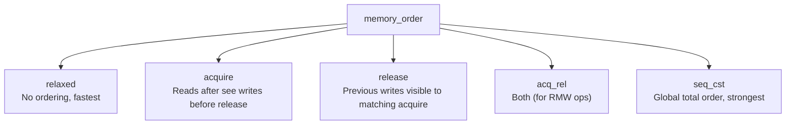

# Atomics, Lock-Free, and Memory Model

> [!summary] Goal
> Master C++ atomics — `std::atomic` operations, memory ordering (relaxed, acquire, release, seq_cst), lock-free data structures, memory barriers, and hazard pointers. Essential for high-performance concurrent programming.

## Table of Contents

1. [Atomic Types and Operations](#atomic-types-and-operations)
2. [Memory Ordering](#memory-ordering)
3. [Lock-Free Data Structures](#lock-free-data-structures)
4. [Memory Barriers (Fences)](#memory-barriers)
5. [Pitfalls](#pitfalls)

---

## Atomic Types and Operations

> [!info] Atomic
> An atomic variable's operations are indivisible — no thread can see a partial update. Operations on atomic variables are also ordered with respect to other memory accesses according to the specified memory ordering. Use atomics for counters, flags, and simple shared state without mutexes.

```cpp
#include <atomic>

std::atomic<int> counter{0};
std::atomic<bool> flag{false};
std::atomic_flag lock = ATOMIC_FLAG_INIT;   // Guaranteed lock-free

// Store and load
counter.store(42);           // Atomic write
int val = counter.load();    // Atomic read

// Fetch-and-* (read-modify-write)
int prev = counter.fetch_add(1);     // counter++ (returns old value)
prev = counter.fetch_sub(1);         // counter--
prev = counter.fetch_or(0x10);
prev = counter.fetch_and(~0x10);
prev = counter.fetch_xor(0x10);

// Compare-and-swap (CAS) — heart of lock-free programming
int expected = 42;
int desired = 100;
bool success = counter.compare_exchange_strong(expected, desired);
// If counter == expected, set counter = desired, return true
// Otherwise, set expected = counter (current value), return false

// Weak CAS — may fail spuriously (faster, use in loop)
while (!counter.compare_exchange_weak(expected, desired)) {
    // expected is updated to current value, retry
}

// Exchange (read and write atomically)
int old = counter.exchange(200);

// Basic types
std::atomic<bool>     // bool
std::atomic<int>      // int (and all integer types)
std::atomic<double>   // double (may not be lock-free!)
std::atomic<T*>       // Pointer atomic
std::atomic<std::shared_ptr<T>>  // C++20 — shared_ptr atomic operations
```

---

## Memory Ordering

> [!info] Memory ordering
> Memory ordering controls how atomic operations synchronize with other threads. The default (`seq_cst`) is the strongest — all threads see the same order of operations. Weaker orderings (`relaxed`, `acquire`, `release`, `acq_rel`) are faster but require careful reasoning. A **release** operation synchronizes-with an **acquire** operation that reads the released value.

### HOW memory ordering works at the CPU level — the missing explanation

Memory ordering is not a C++ invention — it maps directly to hardware memory models. The C++ standard gives you portable names for operations that have specific CPU-level implementations:

```mermaid
flowchart LR
    subgraph CPU["CPU Core executing thread"]
        SB["Store Buffer<br/>(writes sitting here)"]
        REG["Registers / LI cache"]
    end
    subgraph MEM["Shared memory"]
        CL["Cache line in L1/L2/L3<br/>(MESI protocol)"]
    end
    SB -->|"write flushed"| CL
    REG -->|"load"| CL
    note for SB "Without a barrier, a store can sit in the<br/>store buffer for hundreds of cycles"
    note for CL "MESI states: Modified, Exclusive,<br/>Shared, Invalid"
```

**Why this matters for your code:**

When you write `x.store(42, relaxed)`, several things happen at the hardware level:

1. **Compiler barrier?** `relaxed` means the compiler CAN reorder this with surrounding loads/stores
2. **CPU barrier?** `relaxed` means no `dmb`/`mfence` instruction is emitted — the store enters the store buffer
3. **Visibility?** The store becomes visible to other cores only when the store buffer drains naturally (cache line eviction, full buffer)

### The three levels of ordering control

```text
Level 1 — Compiler reordering:
  The compiler can reorder operations unless told not to.
  `asm volatile("" ::: "memory")` is a compiler barrier (no CPU instr).
  
Level 2 — CPU reordering (store buffer / invalidation queue):
  On ARM/PowerPC, the CPU can reorder loads and stores aggressively.
  A `dmb` (data memory barrier) instruction drains the store buffer.
  On x86, most loads are acquire and most stores are release (TSO model).

Level 3 — Cache coherency (MESI protocol):
  When a store reaches the cache line, the MESI protocol invalidates
  other cores' copies. This is invisible to the programmer — MESI
  always maintains coherence at the cache line level. The issue is
  WHEN the store reaches the cache line (that's what ordering controls).
```

### x86 vs ARM — why `seq_cst` is "free" on x86 but expensive on ARM

```text
x86 (Total Store Order — TSO):
  - Every store is a release store (no reordering with later stores)
  - Every load is an acquire load (no reordering with earlier loads)
  - seq_cst adds: nothing for regular loads/stores; a `mfence` or `lock` for RMW
  - This is why relaxed vs seq_cst often makes no difference on x86

ARM/PowerPC (Weakly Ordered):
  - Loads can be reordered with loads; stores with stores; stores with loads
  - seq_cst requires: `dmb sy` (full memory barrier) after every store
  - A `dmb` drains the store buffer (~50-200 cycles on modern ARM)
  - This is why relaxed is MUCH faster than seq_cst on ARM

Summary: on x86, relaxed is effectively free (no fencing).
         On ARM, relaxed avoids ~50-200 cycles of store buffer drain.
```

### Release-Acquire: the synchronizes-with relationship

```mermaid
sequenceDiagram
    participant T1 as Thread 1 (producer)
    participant M as Atomics + Memory
    participant T2 as Thread 2 (consumer)

    Note over T1: Write data (non-atomic)
    T1->>T1: data = 42;
    Note over T1: Release barrier - prevents any prior write<br/>from being reordered after the store
    T1->>M: ready.store(true, release)
    Note over M: "synchronizes-with" happens here
    T2->>M: ready.load(acquire) → true
    Note over T2: Acquire barrier - prevents any later read<br/>from being reordered before the load
    T2->>T2: int x = data;  // guaranteed to read 42
```

When thread 1 does a `release` store and thread 2 does an `acquire` load on the **same atomic variable**, a **synchronizes-with** relationship is established: everything thread 1 wrote before the release store is guaranteed to be visible to thread 2 after the acquire load. This is the fundamental mechanism for lock-free communication — it's not "magic," it's the memory barrier preventing the CPU from reordering the non-atomic writes past the atomic operation.



| Order | Cost | Guarantee |
|:-----:|:----:|-----------|
| `relaxed` | Free | Only atomicity — no ordering |
| `acquire` | Low | No reads after can move before this op |
| `release` | Low | No writes before can move after this op |
| `acq_rel` | Medium | Both acquire and release |
| `seq_cst` | Highest | Single total order across all threads |

### Release-Acquire pattern

```cpp
std::atomic<bool> ready{false};
std::string data;

// Thread 1 (producer)
data = "important data";
ready.store(true, std::memory_order_release);
// Everything before release is visible to matching acquire

// Thread 2 (consumer)
while (!ready.load(std::memory_order_acquire)) {
    // spin
}
std::cout << data << '\n';   // Correctly sees "important data"
```

### Relaxed ordering (counters)

```cpp
std::atomic<long> total_requests{0};

void handle_request() {
    total_requests.fetch_add(1, std::memory_order_relaxed);
    // No ordering needed — just a counter
}

void print_stats() {
    long count = total_requests.load(std::memory_order_relaxed);
    std::cout << "Total: " << count << '\n';
}
```

### seq_cst — sequentially consistent

```cpp
// The default — all threads see a single total order
// On x86, mostly free. On ARM/PowerPC, expensive memory barriers.
std::atomic<int> x{0}, y{0};
int r1, r2;

// Thread 1
x.store(1, std::memory_order_seq_cst);
r1 = y.load(std::memory_order_seq_cst);

// Thread 2
y.store(1, std::memory_order_seq_cst);
r2 = x.load(std::memory_order_seq_cst);

// With seq_cst, (r1, r2) can never be (0, 0)
// With relaxed, (0, 0) is possible!
```

---

## Lock-Free Data Structures

### Lock-free stack (Treiber stack)

```cpp
template<typename T>
class LockFreeStack {
    struct Node { T value; Node* next; };
    std::atomic<Node*> head{nullptr};
public:
    void push(T value) {
        Node* node = new Node{std::move(value), nullptr};
        node->next = head.load(std::memory_order_relaxed);
        while (!head.compare_exchange_weak(
            node->next, node,
            std::memory_order_release,
            std::memory_order_relaxed)) {
            // CAS failed (head changed) — retry with updated node->next
        }
    }

    bool pop(T& value) {
        Node* old_head = head.load(std::memory_order_relaxed);
        while (old_head && !head.compare_exchange_weak(
            old_head, old_head->next,
            std::memory_order_acquire,
            std::memory_order_relaxed)) {
            // CAS failed — retry
        }
        if (!old_head) return false;
        value = std::move(old_head->value);
        // ⚠️ Memory reclamation problem! Can't delete old_head yet
        // Other threads may still be reading it.
        // Solution: hazard pointers, epoch-based reclamation, or RCU
        delete old_head;  // UNSAFE — ABA problem!
        return true;
    }
};
```

### Lock-free ring buffer (SPSC — single producer, single consumer)

```cpp
template<typename T, size_t Capacity>
class SpscRingBuffer {
    std::array<T, Capacity> buffer;
    std::atomic<size_t> head{0};      // Write position
    std::atomic<size_t> tail{0};      // Read position
public:
    bool push(const T& value) {
        size_t h = head.load(std::memory_order_relaxed);
        size_t t = tail.load(std::memory_order_acquire);
        size_t next = (h + 1) % Capacity;
        if (next == t) return false;  // Full
        buffer[h] = value;
        head.store(next, std::memory_order_release);
        return true;
    }

    bool pop(T& value) {
        size_t t = tail.load(std::memory_order_relaxed);
        size_t h = head.load(std::memory_order_acquire);
        if (t == h) return false;     // Empty
        value = buffer[t];
        tail.store((t + 1) % Capacity, std::memory_order_release);
        return true;
    }
};
// SPSC only — no contention on the atomic operations
```

---

## Memory Barriers (Fences)

```cpp
#include <atomic>

// Compiler barrier — prevents compiler reordering, not CPU
asm volatile("" ::: "memory");

// Full memory barrier
std::atomic_thread_fence(std::memory_order_seq_cst);

// Acquire fence
std::atomic_thread_fence(std::memory_order_acquire);

// Release fence
std::atomic_thread_fence(std::memory_order_release);

// Example: fence without atomic RMW
int shared_data;
std::atomic<bool> flag{false};

// Thread 1
shared_data = 42;
std::atomic_thread_fence(std::memory_order_release);
flag.store(true, std::memory_order_relaxed);  // Fence provides ordering

// Thread 2
while (!flag.load(std::memory_order_relaxed));
std::atomic_thread_fence(std::memory_order_acquire);
// shared_data is now 42
```

---

## Pitfalls

### ABA problem in CAS-based structures

```
Thread 1 reads: head = Node A
Thread 1 is preempted
Thread 2 pops A, frees A, allocates a new node (reuses A's address), pushes it
Thread 1 resumes: CAS succeeds (head == A's address)
But the list structure changed — A's next now points to something different!
```

Fix: tagged pointers (include a counter in the atomic word, incremented on each modification).

### Not all types are lock-free

```cpp
std::atomic<int> a;            // Likely lock-free on all platforms
std::atomic<double> b;         // May NOT be lock-free on some platforms!
std::atomic<BigStruct> c;      // Probably NOT lock-free (uses mutex internally)

if (a.is_lock_free()) {        // Check at runtime
    // Use faster path
}
```

### Relaxed ordering on a flag prevents synchronization

```cpp
std::atomic<bool> ready{false};
int data = 0;

// Thread 1
data = 42;
ready.store(true, std::memory_order_relaxed);    // ❌ data may not be visible!

// Thread 2
while (!ready.load(std::memory_order_relaxed));   // ❌ May see ready but not data!
std::cout << data;                                // May print 0, not 42!
```

### Memory reclamation in lock-free structures

When you pop a node from a lock-free list, you can't delete it immediately — another thread may be reading it. Solutions: (a) hazard pointers — each thread marks which nodes it's accessing, (b) epoch-based reclamation (EBR) — free after a grace period, (c) RCU (Read-Copy-Update) — defer destruction to a quiescent state. This is the hardest part of lock-free programming.

---

> [!question]- Interview Questions
>
> **Q: What's the difference between `memory_order_relaxed` and `memory_order_seq_cst`?**
> A: `relaxed` guarantees only atomicity — no ordering with surrounding memory accesses. `seq_cst` (the default) provides a single total order across all threads — every thread sees the same sequence of atomic operations. `seq_cst` is safest but may require memory barriers on weakly-ordered architectures (ARM, PowerPC).
>
> **Q: What is compare-and-swap (CAS) and how does it work?**
> A: CAS atomically compares a variable to an expected value. If equal, it replaces it with a desired value. Returns true on success. CAS is the fundamental building block of lock-free data structures. `compare_exchange_strong` always succeeds if expected matches. `compare_exchange_weak` may fail spuriously (faster on some platforms).
>
> **Q: What is the ABA problem?**
> A: A location changes from A to B and back to A between a thread's read and its CAS. The CAS succeeds because the pointer still points to A, but the data structure has changed. Fix: use tagged pointers (include a version counter in the same atomic word) or use hazard pointers.
>
> **Q: What is a memory fence (barrier)?**
> A: A memory fence prevents the compiler and CPU from reordering memory accesses across the fence. `atomic_thread_fence` creates ordering between non-atomic operations combined with atomic operations. On x86, only seq_cst fences are expensive. On ARM, all fences have significant cost.
>
> **Q: How do you handle memory reclamation in lock-free data structures?**
> A: After removing a node from a lock-free list, you can't delete it — another thread may be reading it. Solutions: (a) hazard pointers — each thread marks which node it's reading, (b) epoch-based reclamation — define epochs, free nodes whose epoch is two behind the current one, (c) RCU — readers mark when they're in a critical section, defer destruction to when no readers are active.

---

## Cross-Links

- [[C++/02_Core/05_Concurrency_and_Parallelism]] for mutex-based concurrency fundamentals
- [[C++/02_Core/08_Undefined_Behavior_and_Low_Level_Cpp]] for UB related to atomics
- [[C++/01_Foundations/05_Move_Semantics_and_Value_Categories]] for atomic<shared_ptr>
- [[C++/03_Advanced/07_Performance_Cache_and_Optimization]] for cache effects on atomics
- [[C++/04_Playbooks/02_Debug_Concurrency_Issues]] for TSan and Helgrind
