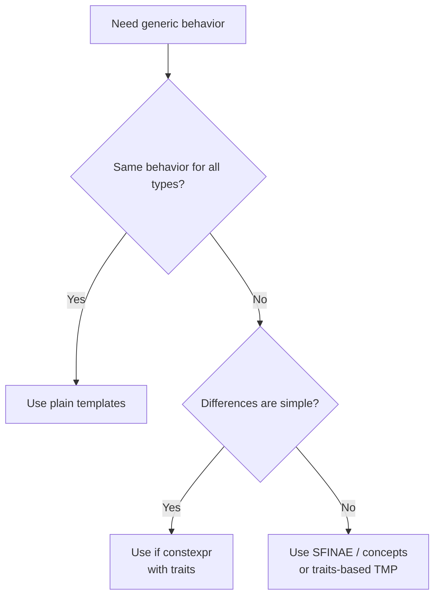

# Template Metaprogramming: SFINAE, Type Traits, and More

> [!summary] Goal
> Master C++ template metaprogramming — SFINAE, `std::enable_if`, type traits, `void_t` idiom, `constexpr if` (C++17), and compile-time type introspection.

## Table of Contents

1. [Why Template Metaprogramming?](#why-template-metaprogramming)
2. [SFINAE (Substitution Failure Is Not An Error)](#sfinae)
3. [std::enable_if](#stdenableif)
4. [Type Traits](#type-traits)
5. [constexpr if (C++17)](#constexpr-if)
6. [Advanced TMP: void_t, Type Lists, and Helpers](#advanced-tmp-void_t-type-lists-and-helpers)
7. [Pitfalls](#pitfalls)

---

## Why Template Metaprogramming?

> [!info] Compile-time logic
> Template metaprogramming lets you move certain decisions from runtime to compile time: choosing overloads, selecting implementations, or rejecting types with clear diagnostics.

### When do you actually need TMP?

You generally reach for template metaprogramming when at least one of these is true:

- You want an API that works for many types but behaves differently depending on type properties
- You need to reject some types at compile time with a good error message
- You want to avoid virtual dispatch / type erasure for performance but still need polymorphic behavior

If all you need is a simple `if (std::is_integral_v<T>)` in a single function, `if constexpr` is often enough without deeper SFINAE.



### Trade-offs vs runtime polymorphism

| Approach                 | When to use                                | Pros                                   | Cons                                  |
|--------------------------|--------------------------------------------|----------------------------------------|---------------------------------------|
| Virtual functions        | Runtime-selected behavior, plugin systems  | Simple mental model, stable ABI       | Indirection, no inlining across DSO   |
| Type erasure (`std::function`) | Generic callbacks, non-templated API | Easy to use, hides template complexity | Allocation/indirection, runtime cost  |
| **TMP (SFINAE/traits)** | Compile-time selection / rejection         | Zero-cost, highly optimized           | Complex, longer compile times         |

---

## SFINAE (Substitution Failure Is Not An Error)

> [!info] SFINAE
> When the compiler is resolving a function call, it tries all viable template specializations. If substituting template arguments into a function template's signature produces invalid code, that template is **removed from the overload set** (no error). This allows the compiler to pick another overload. SFINAE is the foundation of `enable_if`, type traits, and most compile-time introspection.

### When to use SFINAE directly

Prefer SFINAE when:

- You’re targeting pre-C++17 code and can’t use `if constexpr`
- You need to **remove an overload entirely** from consideration
- You’re building low-level utilities (traits, detection idioms) that other templates depend on

Prefer `if constexpr` / concepts when:

- You’re in C++17+ and can keep logic inside the function body
- You care more about readability than tiny compile-time edge cases

```cpp
// Example: count elements for random-access vs non-random-access containers

// For random-access iterators: last - first is valid
template<typename Iter>
auto distance(Iter first, Iter last) -> decltype(last - first) {
    return last - first;   // O(1)
}

// For non-random-access iterators: last - first is INVALID
// SFINAE removes the first overload; this one is picked
template<typename Iter>
typename std::iterator_traits<Iter>::difference_type
distance(Iter first, Iter last) {
    typename std::iterator_traits<Iter>::difference_type n = 0;
    while (first != last) { ++first; ++n; }   // O(n)
    return n;
}
```

---

## std::enable_if

> [!info] enable_if
> `std::enable_if<Condition, T>::type` is `T` if Condition is true. If Condition is false, substitution fails — the overload is removed by SFINAE. This lets you enable/disable function templates based on compile-time conditions.

### Where to apply enable_if

You can use `enable_if` in three main places:

1. Return type (C++11): `enable_if_t<Cond, Return>`
2. Extra template parameter with default: `typename = enable_if_t<Cond>`
3. Extra function parameter with default value

Pattern 2 is usually the most readable and keeps signatures cleaner, especially with multiple constraints.

```cpp
// Enable only for integral types
template<typename T>
std::enable_if_t<std::is_integral_v<T>, T>
twice(T value) {
    return value * 2;
}

// SFINAE on parameters (C++11 style)
template<typename T>
auto half(T value) -> decltype(value / 2) {
    return value / 2;
}

// SFINAE via default template parameter (C++11)
template<typename T, typename = std::enable_if_t<std::is_integral_v<T>>>
void process_integral(T value) {
    // Only called for integral types
}
```

---

## Type Traits

> [!info] Type traits
> Type traits provide compile-time introspection about types. They answer questions like "is this an integer?", "is this a pointer?", "can you copy this type?" They're implemented using template specialization and are the building blocks of generic code.

### How to think about traits

At a high level, traits answer **yes/no** questions or perform **type transformations** at compile time:

- `std::is_integral_v<T>` → should we treat this like an integer?
- `std::remove_reference_t<T>` → what is the underlying value type?

Most of the time you won’t write your own traits; you’ll:

1. Combine existing standard traits with `if constexpr`
2. Wrap them into higher-level concepts (see [[C++/03_Advanced/02_Concepts_and_Requirements]]).

### Primary type categories

```cpp
#include <type_traits>

std::is_void_v<T>       // Is it void?
std::is_integral_v<T>   // Is it an integer type? (int, long, char, bool, etc.)
std::is_floating_point_v<T>  // Is it a floating-point type? (float, double)
std::is_pointer_v<T>    // Is it a pointer?
std::is_array_v<T>      // Is it an array? (T[])
std::is_class_v<T>      // Is it a class/struct?
std::is_enum_v<T>       // Is it an enum?
std::is_union_v<T>      // Is it a union?
std::is_function_v<T>   // Is it a function?
```

### Type relationships

```cpp
std::is_same_v<T, U>    // Are T and U the same type?
std::is_base_of_v<Base, Derived>   // Is Base a base class of Derived?
std::is_convertible_v<From, To>    // Can From be converted to To?
std::is_invocable_v<Fn, Args...>   // Can Fn be called with Args?
```

### Type transformations

```cpp
std::remove_reference_t<T>      // T → T: int& → int, int&& → int
std::add_reference_t<T>         // T → T& or T&&
std::remove_const_t<T>          // const int → int
std::remove_pointer_t<T>        // int* → int
std::decay_t<T>                 // Apply lvalue→rvalue, array→ptr, function→ptr

// Example: perfect forwarding wrapper
template<typename T>
auto forward_to(T&& arg) {
    return func(std::forward<T>(arg));
}
```

### Type trait helpers (C++17 _v, C++14 _t)

```cpp
// C++11: ::type and ::value
std::enable_if<std::is_integral<int>::value, void>::type

// C++14: _t alias for types
std::enable_if_t<std::is_integral_v<int>, void>

// C++17: _v alias for values
std::is_integral_v<int>  // true
```

---

## constexpr if (C++17)

> [!info] constexpr if
> `if constexpr (condition)` evaluates the condition at compile time. The unused branch is **discarded** — it's not instantiated. This replaces many SFINAE use cases with simpler, readable code. The discarded branch can contain invalid code for the type being tested — it doesn't cause a compile error.

### When to prefer constexpr-if over SFINAE

Use `if constexpr` instead of SFINAE when:

- You are branching on a simple trait (`is_integral_v`, `is_pointer_v`, etc.)
- You don’t need to remove the overload itself, only change its implementation
- Readability matters more than extremely fine-grained overload control

Keep SFINAE/traits when implementing low-level utilities that other templates depend on.

```cpp
template<typename T>
auto process(T value) {
    if constexpr (std::is_integral_v<T>) {
        // Only instantiated for integral types
        return value * 2;
    } else if constexpr (std::is_floating_point_v<T>) {
        // Only instantiated for floating-point types
        return value * 2.0;
    } else {
        // Only instantiated for other types
        return value;
    }
}

// Without if constexpr (C++14), both branches must compile for ALL types!
// This is why SFINAE was needed — if constexpr makes it unnecessary here.

// Compile-time dispatch with constexpr if
template<typename T>
void serialize(const T& value, std::ostream& os) {
    if constexpr (std::is_integral_v<T>) {
        os << value;
    } else if constexpr (std::is_same_v<T, std::string>) {
        os << value;
    } else {
        // Compile error for unsupported types — intentional
        static_assert(sizeof(T) == 0, "Unsupported type for serialization");
    }
}
```

---

## Advanced TMP: `void_t`, Type Lists, and `_t`/`_v` Helpers

### The `void_t` detection idiom

```cpp
// void_t (C++17): a simple alias template that maps any type to void.
// When combined with SFINAE, it enables compile-time "does this type have a member?" checks.

template<typename...>
using void_t = void;

// Detection pattern:
template<typename T, typename = void>
struct has_value_type : std::false_type {};

template<typename T>
struct has_value_type<T, void_t<typename T::value_type>> : std::true_type {};

// Usage:
static_assert(has_value_type<std::vector<int>>::value);    // true
static_assert(!has_value_type<int>::value);                // false

// This is the foundation for std::experimental::is_detected and many TMP utilities.
// It works because:
//   - Substitution: T::value_type is substituted
//   - If T has value_type: substitution succeeds → partial specialization matches
//   - If T doesn't: substitution fails → SFINAE removes the partial spec → falls back to primary
```

### `std::declval` — creating values in unevaluated context

```cpp
// std::declval<T>() adds an rvalue reference to T WITHOUT requiring construction.
// It's only usable in unevaluated contexts (decltype, sizeof, noexcept, typeid).

// Problem: you want to check if T::foo() exists, but T may not be default-constructible.
// Solution: use declval to get a reference WITHOUT constructing T.

template<typename T, typename = void>
struct has_foo : std::false_type {};

template<typename T>
struct has_foo<T, void_t<decltype(std::declval<T>().foo())>> : std::true_type {};

// std::declval<T>() returns T&& (or T& for T with reference qualifiers).
// It never actually calls any constructor — it only exists in the type system.

// Key rules:
//   - Only use in decltype, sizeof, noexcept, typeid, or other unevaluated contexts
//   - Using declval in evaluated context (e.g., function body) is a compile error
```

### Type list manipulation

```cpp
// Metaprogramming with type lists:

template<typename...>
struct TypeList {};

// Length:
template<typename TL>
struct length;
template<typename... Ts>
struct length<TypeList<Ts...>> : std::integral_constant<size_t, sizeof...(Ts)> {};

// Get element at index N:
template<size_t N, typename TL>
struct get;
template<size_t N, typename T, typename... Ts>
struct get<N, TypeList<T, Ts...>> : get<N-1, TypeList<Ts...>> {};
template<typename T, typename... Ts>
struct get<0, TypeList<T, Ts...>> { using type = T; };

// Using integer_sequence:
template<size_t... Is>
void print_indices(std::index_sequence<Is...>) {
    ((std::println("Index: {}", Is)), ...);  // Fold over all indices
}
print_indices(std::make_index_sequence<5>{});  // Prints 0, 1, 2, 3, 4

// std::integer_sequence and std::index_sequence are the basis for
// compile-time loops and tuple iteration.
```

### `_t` and `_v` helper aliases (C++14/17)

```cpp
// C++14 added `_t` aliases for type traits:

// Instead of:
typename std::remove_reference<int&>::type x = 42;
// Use:
std::remove_reference_t<int&> x = 42;  // Clearer, less typing

// Full table of _t helpers:
std::remove_cv_t<T>           // std::remove_cv<T>::type
std::remove_reference_t<T>    // std::remove_reference<T>::type
std::add_const_t<T>
std::conditional_t<B, T, F>   // std::conditional<B, T, F>::type
std::common_type_t<T, U>      // std::common_type<T, U>::type
std::invoke_result_t<F, Args...>  // std::invoke_result<F, Args...>::type

// C++17 added _v aliases for value traits:
// Instead of:
std::is_integral<int>::value
// Use:
std::is_integral_v<int>          // same as true

// Common _v helpers:
std::is_same_v<T, U>
std::is_convertible_v<From, To>
std::is_base_of_v<Base, Derived>
std::is_constructible_v<T, Args...>
std::is_nothrow_move_assignable_v<T>
```

### `if constexpr` advanced patterns

```cpp
// if constexpr (C++17) enables compile-time branching:

// Pattern 1: Early termination in templates
template<typename T>
void process(T val) {
    if constexpr (std::is_arithmetic_v<T>) {
        // Only instantiated for arithmetic types
        std::println("Arithmetic: {}", val);
    } else if constexpr (std::is_same_v<T, std::string>) {
        // Only instantiated for std::string
        std::println("String: {}", val);
    } else {
        // Everything else
        std::println("Other: {}", val);
    }
}

// Pattern 2: Loop unrolling with parameter packs
template<typename... Args>
void print_all(Args... args) {
    // Without if constexpr, the recursion wouldn't terminate at compile time
    if constexpr (sizeof...(args) == 0) {
        return;  // Base case — only instantiated when pack is empty
    } else {
        std::println("{}", (args, ...));  // Fold expression
    }
}

// Pattern 3: Type-trait short-circuiting
template<typename T>
constexpr size_t buffer_size_v =
    std::is_arithmetic_v<T> ? sizeof(T) :
    std::is_pointer_v<T>    ? sizeof(void*) :
    sizeof(typename T::value_type) * 10;
```

---

## Pitfalls

### SFINAE on return type vs extra parameter

```cpp
// Return type SFINAE — hard to read
template<typename T>
std::enable_if_t<std::is_integral_v<T>, T> func(T t) { return t; }

// Default template parameter SFINAE — cleaner
template<typename T, std::enable_if_t<std::is_integral_v<T>, int> = 0>
T func(T t) { return t; }

// if constexpr (C++17) — cleanest
template<typename T>
auto func(T t) {
    if constexpr (std::is_integral_v<T>) return t;
}
```

### Over-broad type trait checks

```cpp
template<typename T>
void process(T arg) {
    if constexpr (std::is_integral_v<T>) {
        std::cout << "integer\n";
    }
}
// What about bool? bool is_integral_v<bool> → true!
// What about char? char is_integral_v<char> → true!
// Be specific when needed:
if constexpr (std::is_same_v<T, int>) { /* exactly int */ }
```

### Not all compilers handle complex SFINAE the same

SFINAE on member function presence detection (detection idiom) is notoriously compiler-dependent. `void_t` (C++17) standardizes this. If cross-compiler compatibility matters, prefer `constexpr if` where possible.

---

> [!question]- Interview Questions
>
> **Q: What is SFINAE and why is it useful?**
> A: Substitution Failure Is Not An Error — when substituting template arguments, if a function template produces invalid code, it's removed from the overload set, not causing a compile error. This lets you write templates that are enabled only for certain types. It's the foundation of type traits, enable_if, and compile-time type introspection.
>
> **Q: How does `std::enable_if` work?**
> A: `std::enable_if<Condition, T>::type` is `T` if Condition is true. If false, `::type` doesn't exist — substituting fails, removing the template by SFINAE. `std::enable_if_t` is the C++14 alias. Prefer C++17's `if constexpr` over SFINAE where possible — it's simpler and more readable.
>
> **Q: What's the difference between `if constexpr` and regular `if` in templates?**
> A: `if constexpr` evaluates the condition at compile time. The discarded branch isn't instantiated — it can contain invalid code for the tested type without causing a compile error. Regular `if` instantiate both branches (both must compile). `if constexpr` replaces many SFINAE patterns with simpler, readable code.
>
> **Q: What type traits would you use to check if a type is a pointer?**
> A: `std::is_pointer_v<T>` for the basic check. Remove pointer qualification: `std::remove_pointer_t<T>`. For smart pointers, use `std::is_same_v<T, std::shared_ptr<U>>` or trait detection. For member function pointers: `std::is_member_function_pointer_v<T>`.

---

## Cross-Links

- [[C++/01_Foundations/06_Templates_Basics_to_Variadic]] for template fundamentals
- [[C++/03_Advanced/02_Concepts_and_Requirements]] for concepts (C++20) — modern SFINAE alternative
- [[C++/03_Advanced/04_CRTP_Mixins_and_Static_Polymorphism]] for CRTP with type traits
- [[C++/02_Core/07_Atomics_Lock_Free_and_Memory_Model]] for compile-time type checks
- [[C++/01_Foundations/08_Lambdas_and_Functional_Programming]] for generic lambdas with traits
