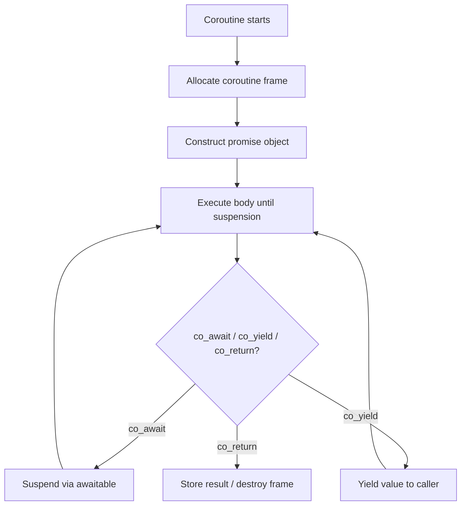

# Coroutines (C++20) Deep Dive

> [!summary] Goal
> Master C++20 coroutines: the promise-awaitable model, `co_await`/`co_yield`/`co_return`, `std::generator` (C++23), symmetric transfer, cancellation, and how to build custom awaitables and promise types.

## Table of Contents

1. [Coroutine Concepts](#coroutine-concepts)
2. [Promise Type Lifecycle](#promise-type-lifecycle)
3. [std::generator (C++23)](#stdgenerator)
4. [Symmetric Transfer and Await Transform](#symmetric-transfer-and-await-transform)
5. [Cancellation Models](#cancellation-models)
6. [Coroutine + Networking](#coroutine-networking)

---

## Coroutine Concepts

> [!info] Coroutine
> A coroutine is a function that can suspend execution to be resumed later. Stackless: the function's state (locals, suspension point) is stored in a heap-allocated frame. The compiler transforms the function into a state machine. Coroutines are the foundation for lazy generators (`co_yield`), async tasks (`co_await`), and resumable computations.



### The three steps the compiler generates

Every time the compiler sees `co_await`, `co_yield`, or `co_return`, it transforms the function into a state machine. The key types involved:

```cpp
// 1. promise_type — defines the coroutine's behavior (return value, exception handling)
// 2. awaitable — defines how co_await suspends and resumes
// 3. coroutine_handle — the handle to the suspended coroutine (used to resume/destroy)

struct ExamplePromise {
    // Required if the coroutine returns something
    std::suspend_never initial_suspend() { return {}; }  // Start immediately
    std::suspend_never final_suspend() noexcept { return {}; }  // Don't suspend on return
    void return_void() {}                          // co_return without value
    void unhandled_exception() { std::terminate(); }  // Exception handling
};
```

### `co_await` — the awaitable model

```cpp
// Any type can be made awaitable by providing three methods:

struct MyAwaitable {
    // 1. await_ready — should we skip suspension?
    bool await_ready() const noexcept { return false; }  // false = always suspend

    // 2. await_suspend — what to do with the coroutine handle?
    // Returns: void, bool, or coroutine_handle
    void await_suspend(std::coroutine_handle<>) const {
        // Called after coroutine is suspended
        // This is where you schedule the coroutine on an executor
    }

    // 3. await_resume — value returned by co_await when resumed
    int await_resume() const noexcept { return 42; }
};
```

---

## Promise Type Lifecycle

> [!info] Promise lifecycle
> The `promise_type` is the central coordinator. It's created when the coroutine starts, lives for the coroutine's duration, and is destroyed when the coroutine completes. It decides: whether to suspend at start/end, how to handle yielded/returned values, and how to propagate exceptions.

### Complete promise type anatomy

```cpp
struct TaskPromise {
    // 1. What type should the coroutine return?
    // (In this case: the Task<T> type that wraps this promise)

    // 2. Initial/final suspend points:
    auto initial_suspend() { return std::suspend_always{}; }  // Start suspended
    auto final_suspend() noexcept { return std::suspend_always{}; }  // Suspend before destroy

    // 3. co_return handling:
    void return_value(int val) { result_ = val; }        // For co_return expr;
    // void return_void() {}                              // For co_return (no value)

    // 4. co_yield handling:
    // auto yield_value(int val) { /* store val */ return std::suspend_always{}; }

    // 5. Exception handling:
    void unhandled_exception() { exception_ = std::current_exception(); }

    // 6. Storage for the result:
    int result_ = 0;
    std::exception_ptr exception_;
};

// Coroutine frame layout (conceptual):
// struct CoroutineFrame {
//     TaskPromise promise;           // The promise object
//     int __suspend_point_index;     // Current suspension point (state machine)
//     std::coroutine_handle<> awaiter;  // Who to resume when done
//     // ... captured parameters ...
//     // ... local variables that live across suspension points ...
// };
```

---

## `std::generator<T>` (C++23)

> [!info] generator
> `std::generator<T>` (C++23) is the standard coroutine-based lazy sequence generator. Unlike raw coroutines, it provides a simple `begin()`/`end()` interface that works with range-based for loops.

```cpp
#include <generator>

std::generator<int> range(int n) {
    for (int i = 0; i < n; ++i) {
        co_yield i;  // Pause, produce value, resume on ++it
    }
}

// Usage:
for (int x : range(5)) {
    std::println("{}", x);  // 0, 1, 2, 3, 4
}

// Fibonacci:
std::generator<int> fibonacci() {
    int a = 0, b = 1;
    while (true) {
        co_yield a;
        auto next = a + b;
        a = b;
        b = next;
    }
}

// Generator with move-only types (C++23):
// std::generator<std::unique_ptr<int>>
// But note: the value is yielded by reference (co_yield returns the object's address)
```

---

## Symmetric Transfer and Await Transform

### Symmetric transfer

```cpp
// Symmetric transfer: resuming one coroutine directly from another
// WITHOUT consuming stack (recursive resume). This prevents stack overflow
// in deeply chained coroutines.

// In await_suspend, instead of:
//   void await_suspend(std::coroutine_handle<> h) { h.resume(); }
//   // This uses the CALLER's stack to resume h

// Use symmetric transfer (stack-friendly):
//   std::coroutine_handle<> await_suspend(std::coroutine_handle<> h) {
//       return h;  // Transfer execution directly to h, unwinding current
//   }

// The coroutine_handle returned from await_suspend is resumed via
// std::coroutine_handle<>::resume() at the call site — but the
// compiler transforms this into a tail call.
```

### `await_transform`

```cpp
// await_transform allows customizing how co_await works with specific types.
// Defined on the promise_type — when present, ALL co_await expressions
// in the coroutine first go through await_transform.

struct MyPromise {
    // co_await on std::this_thread::sleep_for(t) is automatically
    // transformed into await_transform(std::this_thread::sleep_for(t)):

    template<typename Rep, typename Period>
    auto await_transform(std::chrono::duration<Rep, Period> d) {
        struct Awaiter {
            std::chrono::duration<Rep, Period> dur;
            bool await_ready() { return dur.count() <= 0; }
            void await_suspend(std::coroutine_handle<> h) {
                std::thread([h, this] {
                    std::this_thread::sleep_for(dur);
                    h.resume();
                }).detach();
            }
            void await_resume() {}
        };
        return Awaiter{d};
    }
};

// Usage:
// co_await 100ms;  // Automatically uses await_transform
```

---

## Cancellation Models

### Polling with stop_token

```cpp
#include <stop_token>
#include <coroutine>

// Simplest cancellation: check stop_requested between awaits
struct Task {
    struct promise_type {
        auto initial_suspend() { return std::suspend_always{}; }
        auto final_suspend() noexcept { return std::suspend_always{}; }
        Task get_return_object() { return Task{std::coroutine_handle<promise_type>::from_promise(*this)}; }
        void return_void() {}
        void unhandled_exception() {}
    };
    std::coroutine_handle<promise_type> handle_;
};

Task cancellable_work(std::stop_token st) {
    while (!st.stop_requested()) {
        co_await do_chunk();
    }
}

// When stop is requested: the coroutine exits cleanly at the next suspension.
```

### Cancellable awaitable

```cpp
// Awaitable that checks a stop_token and throws if cancelled:

struct CancellableSleep {
    std::chrono::milliseconds duration;
    std::stop_token token;

    bool await_ready() { return false; }

    void await_suspend(std::coroutine_handle<> h) {
        if (token.stop_requested()) {
            h.resume();  // Resume immediately — cancellation path
            return;
        }
        std::thread([h, this] {
            std::this_thread::sleep_for(duration);
            if (!token.stop_requested()) h.resume();
        }).detach();
    }

    void await_resume() {
        if (token.stop_requested())
            throw std::runtime_error("cancelled");
    }
};
```

---

## Coroutine + Networking

```cpp
// Coroutines + networking is a natural fit: I/O operations suspend,
// and the coroutine resumes when the I/O completes.

// Conceptual async read:
struct AsyncRead {
    int fd;
    char* buf;
    size_t size;

    bool await_ready() { return false; }

    void await_suspend(std::coroutine_handle<> h) {
        // Register the coroutine handle with the event loop
        event_loop.add_read(fd, buf, size, [h](ssize_t) {
            h.resume();  // Resume when data arrives
        });
    }

    ssize_t await_resume() {
        return last_result;  // Bytes read
    }
};

// Usage in a coroutine:
Task read_data(int fd) {
    char buf[1024];
    ssize_t n = co_await AsyncRead{fd, buf, sizeof(buf)};
    std::println("Read {} bytes", n);
}
```

---

## Cross-Links

- [[C++/03_Advanced/06_Modules_and_Cpp20_23_Features]] for std::generator (C++23)
- [[C++/02_Core/05_Concurrency_and_Parallelism]] for std::jthread with coroutine cancellation
- [[C++/01_Foundations/08_Lambdas_and_Functional_Programming]] for lambda + coroutine patterns
- [[C++/03_Advanced/01_Template_Metaprogramming_SFINAE_Type_Traits]] for type traits in awaitable detection
