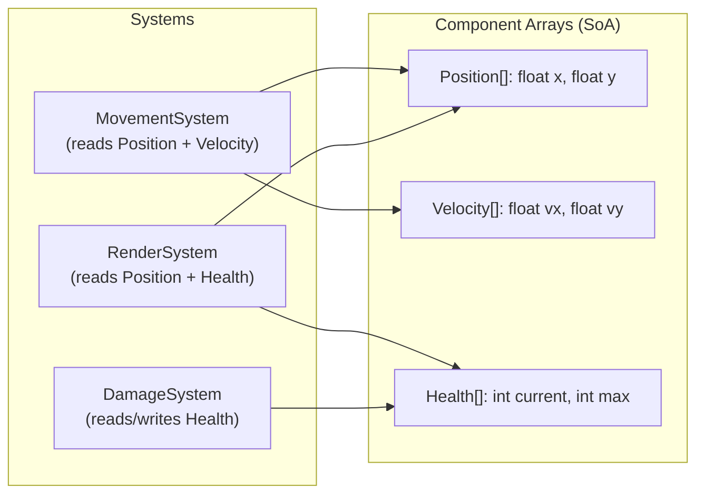

# Game Engine and Driver Development Concepts

> [!summary] Goal
> Apply C++ to game engine development (ECS architecture, component pools, game loop) and driver/low-level development (MMIO, volatile, interrupt handlers, kernel-mode C++). Understand real-time constraints and how they affect C++ design decisions.

## Table of Contents

1. [ECS Architecture](#ecs-architecture)
2. [Game Loop](#game-loop)
3. [Memory Management for Games](#memory-management-for-games)
4. [Driver Development Concepts](#driver-development-concepts)
5. [Pitfalls](#pitfalls)

---

## ECS Architecture

> [!info] ECS (Entity-Component-System)
> ECS is the standard architecture for game engines. **Entities** are IDs (not objects). **Components** are plain data (position, velocity, health). **Systems** operate on entities with matching component sets. ECS is cache-friendly (SoA storage), data-driven, and decouples logic from data.



```cpp
// ECS Core — minimal implementation
using Entity = uint32_t;
constexpr Entity MAX_ENTITIES = 10000;

template<typename T>
class ComponentPool {
    std::vector<T> components;
    std::vector<bool> active;      // Whether entity has this component
public:
    T& get(Entity e) { return components[e]; }
    bool has(Entity e) const { return active[e]; }
    void add(Entity e, T comp) { 
        if (e >= components.size()) {
            components.resize(e + 1);
            active.resize(e + 1, false);
        }
        components[e] = comp;
        active[e] = true;
    }
    void remove(Entity e) { active[e] = false; }
};

// Components — plain data, no logic
struct Position { float x, y; };
struct Velocity { float vx, vy; };
struct Health { int current, max; };

// System — operates on entities with specific components
class MovementSystem {
public:
    void update(ComponentPool<Position>& pos, ComponentPool<Velocity>& vel, float dt) {
        for (Entity e = 0; e < pos.max_entities(); ++e) {
            if (pos.has(e) && vel.has(e)) {
                pos.get(e).x += vel.get(e).vx * dt;
                pos.get(e).y += vel.get(e).vy * dt;
            }
        }
    }
};
```

---

## Game Loop

> [!info] Game loop
> The game loop runs every frame. A **fixed timestep** game loop updates physics at a constant rate (e.g., 60 Hz) while rendering at the display's rate. This prevents physics from behaving differently on different frame rates.

```cpp
class GameLoop {
    double previous_time = get_time();
    double accumulator = 0.0;
    const double dt = 1.0 / 60.0;  // 60 updates per second
    double alpha = 0.0;
    
public:
    void run() {
        while (running) {
            double current_time = get_time();
            double frame_time = current_time - previous_time;
            previous_time = current_time;
            
            // Clamp frame time to prevent spiral of death
            if (frame_time > 0.25) frame_time = 0.25;
            
            accumulator += frame_time;
            
            while (accumulator >= dt) {
                update(dt);           // Fixed timestep update
                accumulator -= dt;
            }
            
            alpha = accumulator / dt;
            render(alpha);            // Interpolation for rendering
        }
    }
    
    virtual void update(double dt) = 0;
    virtual void render(double alpha) = 0;
};
```

---

## Memory Management for Games

> [!info] Frame allocator
> Game engines allocate and free memory rapidly (every frame). General-purpose malloc is too slow and causes fragmentation. Frame allocators reset every frame — O(1) "free" (just reset the pointer). Double buffering ensures the allocator for the current frame is separate from the previous frame (the renderer may still use data from the previous frame).

```cpp
class FrameAllocator {
    char* memory;
    size_t capacity;
    size_t offset;
public:
    FrameAllocator(size_t size) : memory(new char[size]), capacity(size), offset(0) {}
    ~FrameAllocator() { delete[] memory; }
    
    void* allocate(size_t size, size_t alignment = 16) {
        // Align the offset
        size_t aligned = (offset + alignment - 1) & ~(alignment - 1);
        if (aligned + size > capacity) return nullptr;
        offset = aligned + size;
        return memory + aligned;
    }
    
    void reset() { offset = 0; }  // O(1) — all memory reusable for next frame
    
    template<typename T, typename... Args>
    T* make(Args&&... args) {
        return new (allocate(sizeof(T), alignof(T))) T(std::forward<Args>(args)...);
    }
};
```

---

## Driver Development Concepts

> [!info] Kernel-mode C++
> Driver development uses a restricted subset of C++: no exceptions (or limited), no RTTI, no `new`/`delete` (use custom allocators), and no most of the STL. The code runs in kernel space — a bug crashes the entire machine, not just the process.

### Memory-mapped I/O (MMIO)

```cpp
// Reading/writing device registers via MMIO
// The volatile keyword is ESSENTIAL — without it, the compiler
// may optimize away or reorder reads/writes to device memory.

struct DeviceRegisters {
    volatile uint32_t control;      // 0x00
    volatile uint32_t status;       // 0x04
    volatile uint32_t data;         // 0x08
    volatile uint32_t interrupt;    // 0x0C
};

DeviceRegisters* regs = reinterpret_cast<DeviceRegisters*>(0xFFFF0000);

// Wait for device ready
while (regs->status & 1) { /* spin */ }

// Send command
regs->control = 0x01;
regs->data = 42;

// Check result
uint32_t result = regs->data;
```

### Interrupt handlers in C++

```cpp
// Interrupt Service Routine — minimal C++ is possible
// Must be extern "C" and use IRQ-safe calling convention

extern "C" void interrupt_handler() {
    // Limited C++ is safe here:
    // - No exceptions (unwinding in interrupt context is fatal)
    // - No heap allocation (may deadlock)
    // - No virtual calls (vtable may not be in accessible memory)
    // - volatile for shared state
    
    // Read the interrupt status register
    uint32_t status = *reinterpret_cast<volatile uint32_t*>(INTERRUPT_STATUS);
    if (status & DMA_COMPLETE) {
        dma_complete_flag = true;
    }
    // Acknowledge the interrupt
    *reinterpret_cast<volatile uint32_t*>(INTERRUPT_ACK) = status;
}
```

### Kernel-mode C++ constraints

| Feature | Allowed in kernel? | Alternative |
|---------|:------------------:|-------------|
| Exceptions | ❌ (limited support) | Error codes |
| RTTI / `dynamic_cast` | ❌ (large runtime) | Manual type tags |
| `new`/`delete` | ❌ (heap not available) | Custom allocators (kmalloc) |
| `std::vector` | ❌ (allocates, exceptions) | Static arrays + manual size tracking |
| Virtual functions | ⚠️ (vtable must be accessible) | Function pointer tables |
| Templates | ✅ | OK (compile-time only) |
| `constexpr` | ✅ | OK (compile-time only) |
| `volatile` | ✅ Required for MMIO | Essential |
| `extern "C"` | ✅ Required for interrupt handlers | |

---

## Pitfalls

### ECS — invalidating component references

If a component pool reallocates (grows), all pointers/references to components are invalidated. Reserve capacity upfront or use indices instead of pointers/ references:

```cpp
// ❌ Bad: storing pointer to component
Position* pos = &pool.get(entity);
pool.add(entity2, Position{});           // May reallocate! pos is dangling!

// ✅ Good: storing entity ID, get component through pool each time
Entity e = entity;
pool.get(e).x += 10;                     // Always valid
```

### Fixed timestep without clamping

Without frame time clamping, a severe frame drop (e.g., loading screen taking 10 seconds) causes the accumulator to run 600+ physics updates, freezing the game until they catch up. Always cap frame_time (e.g., to 250ms max).

### Driver: UB from volatile access order

The compiler can reorder volatile accesses unless you use a memory barrier:

```cpp
volatile uint32_t* reg = ...;
reg[0] = 1;   // Set control
reg[1] = 2;   // Set data
// Compiler may reorder these! Use a barrier:
std::atomic_signal_fence(std::memory_order_seq_cst);
```

---

> [!question]- Interview Questions
>
> **Q: What is ECS and why is it used in game engines?**
> A: ECS (Entity-Component-System) separates data (components) from behavior (systems). Entities are IDs. Components are plain data stored in SoA format (cache-friendly). Systems process entities with matching components. ECS is cache-friendly, data-driven, and decouples game logic. It replaces deep inheritance hierarchies with flat component composition.
>
> **Q: What is a fixed timestep game loop?**
> A: The game loop separates update (physics, AI) from rendering. Physics runs at a fixed timestep (e.g., 60 Hz) regardless of frame rate. The renderer interpolates between physics states for smooth visuals. Frame time is clamped to prevent "spiral of death" (hundreds of physics updates catching up after a lag spike).
>
> **Q: What C++ features are restricted in kernel-mode drivers?**
> A: Exceptions (unwinding in kernel context is dangerous), RTTI (too large), standard heap allocation (kernel has its own allocators), most of the STL (std::vector allocates and can throw). Volatile is required for MMIO. Templates and constexpr are safe. Virtual functions work with care (vtable must be accessible).

---

## Cross-Links

- [[C++/03_Advanced/07_Performance_Cache_and_Optimization]] for game engine performance
- [[C++/02_Core/01_Smart_Pointers_and_Memory_Management]] for custom allocators
- [[C++/02_Core/05_Concurrency_and_Parallelism]] for multithreaded game systems
- [[C++/01_Foundations/02_Classes_and_RAII]] for RAII in game resource management
- [[C++/02_Core/08_Undefined_Behavior_and_Low_Level_Cpp]] for volatile and MMIO
